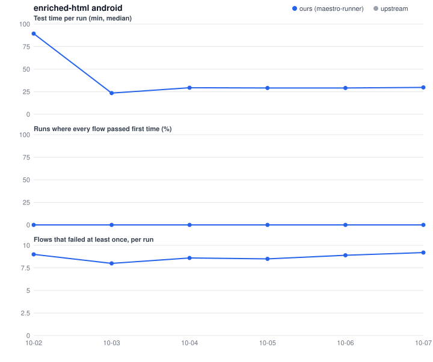
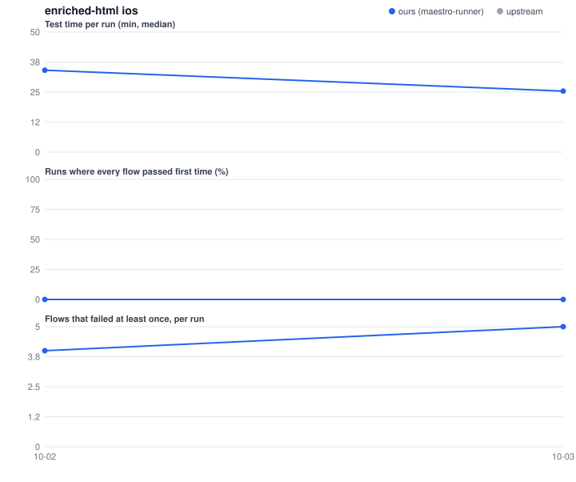
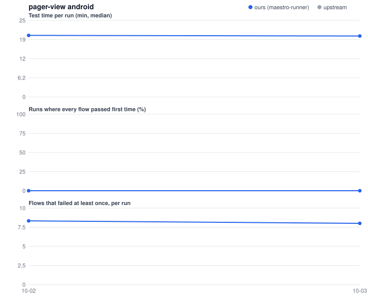
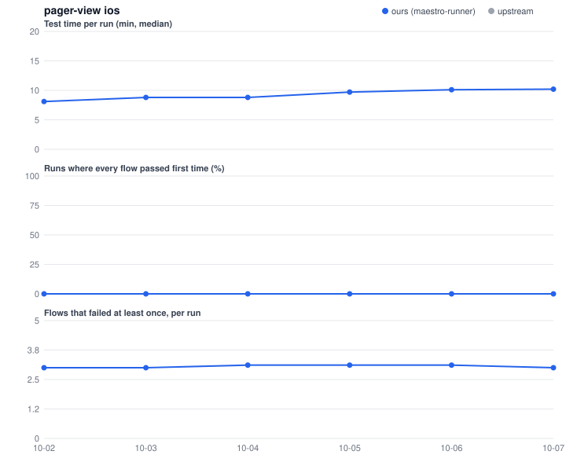
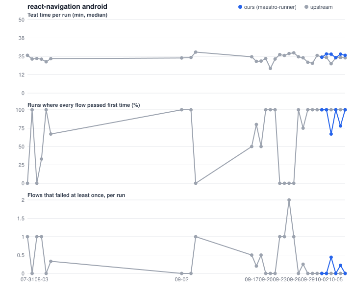
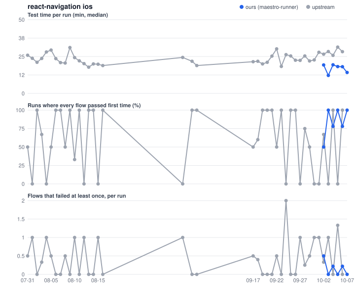

# Bench results: maestro-runner against upstream

Generated 2026-10-03 15:56 UTC.

*Test time* is a run's test steps added up, retry jobs included (no builds, no queue). The other columns are read per flow from the job logs; see [RETRIES.md](RETRIES.md). Upstream React Navigation runs agent-device; React Native and Expo run Maestro. Upstream React Native uses larger runners (macos-*-large, 8-core-ubuntu) than the bench fork. enriched-html and pager-view run no e2e upstream, so they show ours only.

## [enriched-html](enriched-html.md)

Each cell: **ours vs upstream**; the better one in bold. Ours is the newest maestro-runner build.

| Job | Build | Runs | Test time / run (min) | Every flow passed first time | Flows that failed at least once / run | Runs needing a retry job | Extra flow runs / run | Runs ending with a failed flow | Most often failing (ours / upstream) |
|---|---|---|---|---|---|---|---|---|---|
| android | 6904d0f | 4 | 59.4 | 0% | 8.50 | 0% | 0.0 | 100% | checkbox_toggle ×4, line_overlapping ×4, mention_popup_closing_on_cursor_travel ×4 / - |
| ios | 6904d0f | 4 | 34.1 | 0% | 4.50 | 0% | 0.0 | 100% | image_position_stability ×4, inline_code_paste_into_codeblock ×4, links_visual ×4 / - |

Ours on earlier maestro-runner builds:

| Job | Build | Runs | Test time / run (min) | Every flow passed first time | Flows that failed at least once / run | Runs needing a retry job | Extra flow runs / run | Runs ending with a failed flow | Most often failing |
|---|---|---|---|---|---|---|---|---|---|
| android | 49360bb | 1 | 26.4 | 0% | 43.00 | 0% | 0.0 | 100% | checkbox_toggle ×1, extending_paragraph_style_on_paste_after_copy ×1, extending_paragraph_style_on_paste_after_cut ×1 |
| android | older | 3 | 27.1 | 0% | 29.67 | 0% | 0.0 | 100% | checkbox_toggle ×3, extending_paragraph_style_on_paste_after_cut ×3, line_overlapping ×3 |
| ios | 49360bb | 1 | 31.0 | 0% | 5.00 | 0% | 0.0 | 100% | checkbox_toggle ×1, image_position_stability ×1, inline_code_paste_into_codeblock ×1 |
| ios | older | 3 | 33.5 | 0% | 19.00 | 0% | 0.0 | 100% | image_position_stability ×3, inline_code_paste_into_codeblock ×3, links_visual ×3 |

## [expo](expo.md)

Each cell: **ours vs upstream**; the better one in bold. Ours is the newest maestro-runner build.

| Job | Build | Runs | Test time / run (min) | Every flow passed first time | Flows that failed at least once / run | Runs needing a retry job | Extra flow runs / run | Runs ending with a failed flow | Most often failing (ours / upstream) |
|---|---|---|---|---|---|---|---|---|---|
| android | 6904d0f | 3 vs 44 | **13.8** vs 14.9 | 0% vs **32%** | **1.33** vs 1.61 | 0% vs 0% | **4.0** vs 6.8 | **0%** vs 14% | fullscreen-test ×2, picture-in-picture-test.android ×1, player-output-test ×1 / fullscreen-test ×21, maestro-generated ×17, picture-in-picture-test.android ×17 |
| ios | 6904d0f | 2 vs 40 | **9.9** vs 15.5 | 0% vs **50%** | 1.00 vs **0.85** | 0% vs 0% | **1.0** vs 1.4 | **0%** vs 22% | test ×1, playback-test ×1 / fullscreen-test ×17, test ×9, playback-test ×8 |

Ours on earlier maestro-runner builds:

| Job | Build | Runs | Test time / run (min) | Every flow passed first time | Flows that failed at least once / run | Runs needing a retry job | Extra flow runs / run | Runs ending with a failed flow | Most often failing |
|---|---|---|---|---|---|---|---|---|---|
| android | older | 4 | 27.9 | 0% | 4.75 | 0% | 34.2 | 75% | fullscreen-test ×4, test ×3, picture-in-picture-test.android ×3 |
| ios | older | 4 | 11.4 | 25% | 1.75 | 0% | 3.2 | 75% | test ×4, playback-test ×3, player-output-test ×3 |

## [pager-view](pager-view.md)

Each cell: **ours vs upstream**; the better one in bold. Ours is the newest maestro-runner build.

| Job | Build | Runs | Test time / run (min) | Every flow passed first time | Flows that failed at least once / run | Runs needing a retry job | Extra flow runs / run | Runs ending with a failed flow | Most often failing (ours / upstream) |
|---|---|---|---|---|---|---|---|---|---|
| android | 6904d0f | 3 | 20.0 | 0% | 8.33 | 0% | 16.3 | 100% | nested_pagerView_example ×3, ensure-ltr ×3, ensure-rtl ×3 / - |
| ios | 6904d0f | 4 | 8.2 | 0% | 3.00 | 0% | 6.0 | 100% | ensure-ltr ×4, ensure-rtl ×4, verify-horizontal-rtl-swipe ×4 / - |

Ours on earlier maestro-runner builds:

| Job | Build | Runs | Test time / run (min) | Every flow passed first time | Flows that failed at least once / run | Runs needing a retry job | Extra flow runs / run | Runs ending with a failed flow | Most often failing |
|---|---|---|---|---|---|---|---|---|---|
| android | 49360bb | 1 | 20.1 | 0% | 8.00 | 0% | 16.0 | 100% | nested_pagerView_example ×1, ensure-ltr ×1, ensure-rtl ×1 |

## [react-native](react-native.md)

Each cell: **ours vs upstream**; the better one in bold. Ours is the newest maestro-runner build.

| Job | Build | Runs | Test time / run (min) | Every flow passed first time | Flows that failed at least once / run | Runs needing a retry job | Extra flow runs / run | Runs ending with a failed flow | Most often failing (ours / upstream) |
|---|---|---|---|---|---|---|---|---|---|
| android debug rntester | 6904d0f | 2 vs 59 | **12.0** vs 18.9 | **100%** vs 93% | **0.00** vs 1.69 | **0%** vs 8% | **0.0** vs 2.5 | **0%** vs 3% | - / alert ×4, animated-fade-in-view ×4, appearance ×4 |
| android debug templateapp | 6904d0f | 2 vs 59 | **2.8** vs 3.3 | **100%** vs 90% | **0.00** vs 0.10 | **0%** vs 10% | **0.0** vs 0.1 | **0%** vs 3% | - / start ×6 |
| android release rntester | 6904d0f | 2 vs 59 | **15.5** vs 28.1 | **100%** vs 93% | **0.00** vs 3.32 | **0%** vs 7% | **0.0** vs 5.0 | **0%** vs 3% | - / alert ×4, animated-fade-in-view ×4, appearance ×4 |
| android release templateapp | 6904d0f | 2 vs 59 | **2.2** vs 2.5 | **100%** vs 92% | **0.00** vs 0.08 | **0%** vs 10% | **0.0** vs 0.1 | **0%** vs 3% | - / start ×5 |
| ios debug rntester | 6904d0f | 2 vs 59 | **21.0** vs 85.0 | **100%** vs 15% | **0.00** vs 1.47 | **0%** vs 34% | **0.0** vs 23.3 | **0%** vs 3% | - / sectionlist-viewability ×29, scrollview-minindex-maintainvisible ×6, flatlist-viewability ×4 |
| ios debug templateapp | 6904d0f | 2 vs 56 | 14.7 vs **10.4** | **100%** vs 88% | **0.00** vs 0.12 | 0% vs 0% | **0.0** vs 0.1 | 0% vs 0% | - / start ×7 |
| ios release rntester | 6904d0f | 2 vs 59 | **21.9** vs 84.6 | **100%** vs 47% | **0.00** vs 0.63 | **0%** vs 36% | **0.0** vs 24.0 | 0% vs 0% | - / sectionlist-viewability ×30, scrollview-minindex-maintainvisible ×2, modal ×1 |
| ios release templateapp | 6904d0f | 2 vs 56 | 10.8 vs **9.4** | 100% vs 100% | 0.00 vs 0.00 | 0% vs 0% | 0.0 vs 0.0 | 0% vs 0% | - / - |

Ours on earlier maestro-runner builds:

| Job | Build | Runs | Test time / run (min) | Every flow passed first time | Flows that failed at least once / run | Runs needing a retry job | Extra flow runs / run | Runs ending with a failed flow | Most often failing |
|---|---|---|---|---|---|---|---|---|---|
| android debug rntester | older | 1 | 9.7 | 100% | 0.00 | 0% | 0.0 | 0% | - |
| android debug rntester | 86ed2d7 | 1 | 11.7 | 100% | 0.00 | 0% | 0.0 | 0% | - |
| android debug rntester | d51beed | 1 | 20.9 | 0% | 1.00 | 100% | 2.0 | 100% | flatlist-viewability ×1 |
| android debug templateapp | older | 1 | 2.8 | 100% | 0.00 | 0% | 0.0 | 0% | - |
| android debug templateapp | 86ed2d7 | 1 | 2.5 | 100% | 0.00 | 0% | 0.0 | 0% | - |
| android debug templateapp | d51beed | 1 | 3.1 | 100% | 0.00 | 0% | 0.0 | 0% | - |
| android release rntester | older | 1 | 16.1 | 100% | 0.00 | 0% | 0.0 | 0% | - |
| android release rntester | 86ed2d7 | 1 | 15.9 | 100% | 0.00 | 0% | 0.0 | 0% | - |
| android release rntester | d51beed | 1 | 29.5 | 0% | 22.00 | 100% | 42.0 | 100% | flatlist-complex-mutations-maintainvisible ×1, flatlist-delete-middle-maintainvisible ×1, flatlist-empty-list-maintainvisible ×1 |
| android release templateapp | older | 1 | 9.6 | 0% | 1.00 | 100% | 5.0 | 0% | start ×1 |
| android release templateapp | 86ed2d7 | 1 | 2.2 | 100% | 0.00 | 0% | 0.0 | 0% | - |
| android release templateapp | d51beed | 1 | 2.3 | 100% | 0.00 | 0% | 0.0 | 0% | - |
| ios debug rntester | older | 1 | 83.6 | 0% | 1.00 | 0% | 1.0 | 0% | button ×1 |
| ios debug rntester | 86ed2d7 | 1 | 314.4 | 0% | 33.00 | 0% | 51.0 | 100% | appearance ×1, button ×1, fabric-interop-add-children ×1 |
| ios debug rntester | d51beed | 1 | 26.4 | 0% | 1.00 | 0% | 0.0 | 100% | animated-fade-in-view ×1 |
| ios debug templateapp | 86ed2d7 | 1 | 13.2 | 100% | 0.00 | 0% | 0.0 | 0% | - |
| ios debug templateapp | d51beed | 1 | 16.0 | 100% | 0.00 | 100% | 0.0 | 0% | - |
| ios release rntester | older | 1 | 69.5 | 0% | 1.00 | 0% | 1.0 | 0% | animated-fade-in-view ×1 |
| ios release rntester | 86ed2d7 | 1 | 318.0 | 0% | 32.00 | 0% | 21.0 | 100% | animated-fade-in-view ×1, appearance ×1, button ×1 |
| ios release rntester | d51beed | 1 | 25.7 | 0% | 1.00 | 0% | 0.0 | 100% | animated-fade-in-view ×1 |
| ios release templateapp | 86ed2d7 | 1 | 8.4 | 100% | 0.00 | 0% | 0.0 | 0% | - |
| ios release templateapp | d51beed | 1 | 20.5 | 100% | 0.00 | 100% | 1.0 | 0% | - |

## [react-navigation](react-navigation.md)

Each cell: **ours vs upstream**; the better one in bold. Ours is the newest maestro-runner build.

| Job | Build | Runs | Test time / run (min) | Every flow passed first time | Flows that failed at least once / run | Runs needing a retry job | Extra flow runs / run | Runs ending with a failed flow | Most often failing (ours / upstream) |
|---|---|---|---|---|---|---|---|---|---|
| android | 6904d0f | 3 vs 47 | 25.8 vs **23.9** | **100%** vs 66% | **0.00** vs 0.38 | 0% vs 0% | **0.0** vs 0.4 | 0% vs 0% | - / Tab View - Scrollable Tab Bar ×7, Bottom Tabs - Preload Flow ×5, Screen Layout ×2 |
| ios | 6904d0f | 3 vs 31 | **19.1** vs 24.8 | **67%** vs 61% | **0.33** vs 0.42 | 0% vs 0% | **0.3** vs 0.5 | 0% vs 0% | Material Top Tabs - Basic ×1 / Screen Layout ×3, Tab View - Scrollable Tab Bar ×3, Stack - Prevent Remove ×2 |

Ours on earlier maestro-runner builds:

| Job | Build | Runs | Test time / run (min) | Every flow passed first time | Flows that failed at least once / run | Runs needing a retry job | Extra flow runs / run | Runs ending with a failed flow | Most often failing |
|---|---|---|---|---|---|---|---|---|---|
| android | older | 2 | 26.6 | 100% | 0.00 | 0% | 0.0 | 0% | - |
| android | d51beed | 2 | 10.4 | 100% | 0.00 | 0% | 0.0 | 0% | - |
| ios | older | 3 | 21.2 | 67% | 0.33 | 0% | 0.3 | 0% | Screen Layout ×1 |

