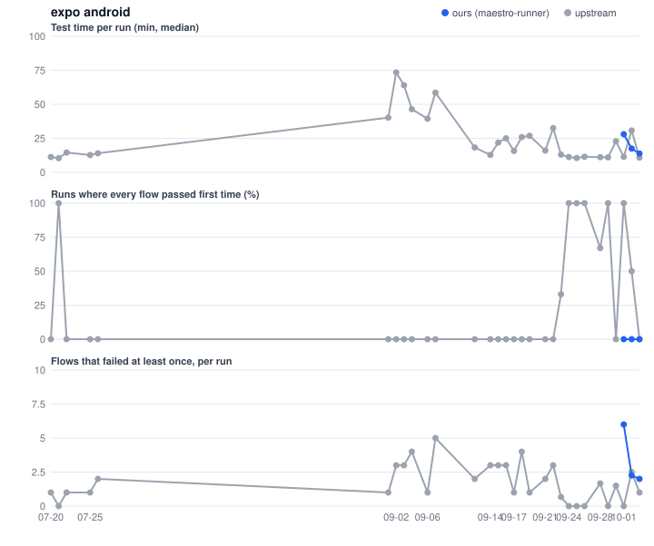
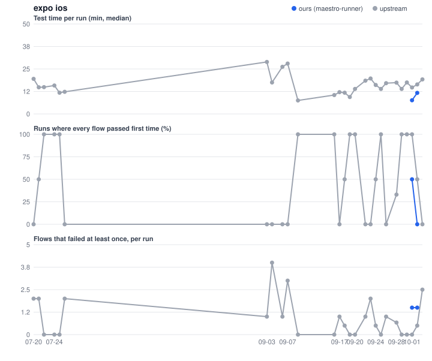

# expo

Both sides use Expo's own harness; upstream with Maestro.

Times in minutes. *Run* is the whole workflow run (builds included); *job* is one job; *tests* is its test step only; *queue* is the wait for a runner.

## Summary

| Project | Platform | Flavour | Side | Build | Runs | Median e2e (min) | Green runs | Runs with no first-attempt failure | First-attempt failures / run | Final failures / run | Runs needing a retry job | Runner |
|---|---|---|---|---|---|---|---|---|---|---|---|---|
| expo | android | - | ours | e8a87b5 | 6 | 17.9 | 3/6 | 3/6 | 3.00 | 3.00 | 0/6 | ubuntu-24.04 |
| expo | android | - | ours | 6904d0f | 6 | 12.4 | 6/6 | 0/6 | 1.50 | 0.33 | 0/6 | ubuntu-24.04 |
| expo | android | - | upstream | - | 58 | 14.2 | 52/58 | 27/58 | 1.16 | 0.12 | 0/58 | ubuntu-24.04 |
| expo | ios | - | ours | e8a87b5 | 7 | 11.2 | 7/7 | 6/7 | 0.14 | 0.00 | 0/7 | macos-26 |
| expo | ios | - | ours | 6904d0f | 5 | 9.6 | 5/5 | 1/5 | 0.80 | 0.00 | 0/5 | macos-26 |
| expo | ios | - | upstream | - | 54 | 16.4 | 43/54 | 33/54 | 0.65 | 0.04 | 0/54 | macos-26 |

## Runs: maestro-runner (bench fork)

| Started (UTC) | Run | Build | Run time | Job | Job time | Tests | Queue | Result |
|---|---|---|---|---|---|---|---|---|
| 2026-10-06 00:44 | [37395604133](https://github.com/maestro-runner-bench/expo/actions/runs/37395604133) | e8a87b5 | 70.7 | android | 32.9 | 28.1 | 0.0 | 6 failed |
|  | | |  | ios | 18.3 | 10.4 | 0.1 | all passed |
| 2026-10-05 22:19 | [37381760032](https://github.com/maestro-runner-bench/expo/actions/runs/37381760032) | e8a87b5 | 71.4 | android | 34.8 | 28.6 | 0.0 | 6 failed |
|  | | |  | ios | 19.0 | 10.9 | 0.2 | all passed |
| 2026-10-05 18:56 | [37359756908](https://github.com/maestro-runner-bench/expo/actions/runs/37359756908) | - | 78.2 | android | 15.0 | - | 0.0 | cancelled before tests |
|  | | |  | ios | 20.2 | 12.1 | 10.2 | all passed |
| 2026-10-05 15:49 | [37335965567](https://github.com/maestro-runner-bench/expo/actions/runs/37335965567) | e8a87b5 | 83.8 | android | 34.3 | 28.2 | 0.0 | 6 failed |
|  | | |  | ios | 20.8 | 11.7 | 0.1 | all passed |
| 2026-10-05 12:58 | [37313330863](https://github.com/maestro-runner-bench/expo/actions/runs/37313330863) | e8a87b5 | 70.9 | android | 11.7 | 7.0 | 0.0 | all passed |
|  | | |  | ios | 13.3 | 7.6 | 0.1 | all passed |
| 2026-10-05 10:03 | [37294094919](https://github.com/maestro-runner-bench/expo/actions/runs/37294094919) | e8a87b5 | 71.9 | android | 13.6 | 7.7 | 0.1 | all passed |
|  | | |  | ios | 20.9 | 11.2 | 0.2 | all passed |
| 2026-10-05 06:02 | [37270431265](https://github.com/maestro-runner-bench/expo/actions/runs/37270431265) | e8a87b5 | 75.5 | android | 12.2 | 7.5 | 0.0 | all passed |
|  | | |  | ios | 21.0 | 12.9 | 0.1 | all passed, 1 passed on retry |
| 2026-10-04 05:30 | [37180068968](https://github.com/maestro-runner-bench/expo/actions/runs/37180068968) | 6904d0f | 72.1 | android | 16.6 | 11.0 | 0.0 | all passed, 1 passed on retry |
|  | | |  | ios | 15.9 | 9.6 | 0.4 | all passed |
| 2026-10-03 18:40 | [37145054805](https://github.com/maestro-runner-bench/expo/actions/runs/37145054805) | 6904d0f | 66.5 | android | 15.6 | 9.6 | 0.0 | all passed, 1 passed on retry |
|  | | |  | ios | 17.2 | 11.1 | 0.1 | all passed, 1 passed on retry |
| 2026-10-03 14:53 | [37131272720](https://github.com/maestro-runner-bench/expo/actions/runs/37131272720) | 6904d0f | 73.2 | android | 35.1 | 29.4 | 0.0 | 1 failed, 2 passed on retry |
|  | | |  | ios | 14.2 | 7.6 | 0.1 | all passed, 1 passed on retry |
| 2026-10-03 10:23 | [37116236972](https://github.com/maestro-runner-bench/expo/actions/runs/37116236972) | 6904d0f | 52.1 | android | 19.3 | 13.8 | 0.1 | all passed, 2 passed on retry |
| 2026-10-02 23:32 | [37078038816](https://github.com/maestro-runner-bench/expo/actions/runs/37078038816) | 6904d0f | 75.3 | android | 9.8 | 5.9 | 0.0 | all passed, 1 passed on retry |
|  | | |  | ios | 14.3 | 8.1 | 0.1 | all passed, 1 passed on retry |
| 2026-10-02 20:05 | [37058364547](https://github.com/maestro-runner-bench/expo/actions/runs/37058364547) | 6904d0f | 76.5 | android | 26.4 | 20.2 | 0.1 | 1 failed |
|  | | |  | ios | 20.6 | 11.7 | 0.2 | all passed, 1 passed on retry |

## Runs: upstream

| Started (UTC) | Run | Build | Run time | Job | Job time | Tests | Queue | Result |
|---|---|---|---|---|---|---|---|---|
| 2026-10-03 10:51 | [37117783979](https://github.com/expo/expo/actions/runs/37117783979) | maestro | 44.1 | android | 12.2 | 10.8 | 0.0 | all passed, 1 passed on retry |
|  | | |  | ios | 23.5 | 20.0 | 0.1 | all passed, 1 passed on retry |
| 2026-10-03 07:17 | [37105879902](https://github.com/expo/expo/actions/runs/37105879902) | maestro | 43.5 | ios | 21.1 | 18.3 | 0.1 | all passed, 4 passed on retry |
| 2026-10-02 07:55 | [36981165236](https://github.com/expo/expo/actions/runs/36981165236) | maestro | 52.4 | android | 10.7 | 9.8 | 0.0 | all passed |
|  | | |  | ios | 23.3 | 19.2 | 0.1 | all passed, 1 passed on retry |
| 2026-10-02 06:16 | [36972752616](https://github.com/expo/expo/actions/runs/36972752616) | maestro | 67.1 | android | 52.5 | 51.7 | 0.1 | 2 failed, 3 passed on retry |
|  | | |  | ios | 17.1 | 13.6 | 0.1 | all passed |
| 2026-10-01 23:26 | [36940772292](https://github.com/expo/expo/actions/runs/36940772292) | maestro | 167.3 | android | 11.1 | 9.8 | 0.1 | all passed |
|  | | |  | ios | 18.1 | 14.7 | 13.5 | all passed |
| 2026-10-01 08:50 | [36838822135](https://github.com/expo/expo/actions/runs/36838822135) | maestro | 63.3 | android | 18.4 | 12.9 | 0.0 | all passed |
|  | | |  | ios | 27.4 | 12.8 | 8.3 | all passed |
| 2026-09-30 17:00 | [36748343830](https://github.com/expo/expo/actions/runs/36748343830) | maestro | 50.7 | android | 30.9 | 30.2 | 0.0 | 2 failed |
|  | | |  | ios | 20.5 | 16.8 | 0.1 | all passed |
| 2026-09-30 06:49 | [36680250418](https://github.com/expo/expo/actions/runs/36680250418) | maestro | 46.2 | android | 16.2 | 15.4 | 0.1 | all passed, 1 passed on retry |
|  | | |  | ios | 22.5 | 18.1 | 0.2 | all passed |
| 2026-09-29 16:57 | [36601456158](https://github.com/expo/expo/actions/runs/36601456158) | maestro | 41.2 | android | 11.8 | 11.0 | 0.0 | all passed |
|  | | |  | ios | 17.2 | 13.9 | 0.1 | all passed |
| 2026-09-28 21:24 | [36485865641](https://github.com/expo/expo/actions/runs/36485865641) | maestro | 40.3 | android | 26.6 | 25.6 | 0.1 | all passed, 5 passed on retry |
|  | | |  | ios | 21.0 | 17.4 | 0.2 | all passed |
| 2026-09-28 19:29 | [36472552427](https://github.com/expo/expo/actions/runs/36472552427) | maestro | 54.9 | android | 12.3 | 11.0 | 0.1 | all passed |
|  | | |  | ios | 20.2 | 17.4 | 0.1 | all passed, 1 passed on retry |
| 2026-09-28 15:28 | [36443811649](https://github.com/expo/expo/actions/runs/36443811649) | maestro | 117.3 | android | 12.2 | 11.1 | 0.0 | all passed |
|  | | |  | ios | 14.4 | 11.8 | 30.7 | all passed, 1 passed on retry |
| 2026-09-26 08:38 | [36230387559](https://github.com/expo/expo/actions/runs/36230387559) | maestro | 109.8 | android | 12.2 | 11.5 | 0.0 | all passed |
|  | | |  | ios | 20.8 | 17.1 | 67.4 | all passed, 1 passed on retry |
| 2026-09-25 21:06 | [36189650510](https://github.com/expo/expo/actions/runs/36189650510) | maestro | 29.9 | android | 12.2 | 11.5 | 0.0 | all passed |
| 2026-09-25 08:11 | [36111578650](https://github.com/expo/expo/actions/runs/36111578650) | maestro | 35.0 | android | 11.3 | 10.5 | 0.1 | all passed |
|  | | |  | ios | 16.5 | 13.2 | 0.2 | all passed |
| 2026-09-25 06:17 | [36102233221](https://github.com/expo/expo/actions/runs/36102233221) | maestro | 38.6 | android | 10.6 | 9.6 | 0.0 | all passed |
|  | | |  | ios | 17.9 | 14.6 | 0.1 | all passed |
| 2026-09-24 18:26 | [36041283560](https://github.com/expo/expo/actions/runs/36041283560) | maestro | 85.7 | android | 12.2 | 10.9 | 0.1 | all passed |
|  | | |  | ios | 21.8 | 18.7 | 0.1 | all passed |
| 2026-09-24 10:55 | [35990000001](https://github.com/expo/expo/actions/runs/35990000001) | maestro | 27.0 | android | 12.7 | 11.7 | 0.1 | all passed |
| 2026-09-24 07:32 | [35970193787](https://github.com/expo/expo/actions/runs/35970193787) | maestro | 38.5 | ios | 16.2 | 13.6 | 0.1 | all passed, 1 passed on retry |
| 2026-09-23 23:25 | [35933494632](https://github.com/expo/expo/actions/runs/35933494632) | maestro | 26.3 | android | 11.9 | 10.9 | 0.0 | all passed |
| 2026-09-23 09:44 | [35844672608](https://github.com/expo/expo/actions/runs/35844672608) | maestro | 32.1 | android | 15.6 | 14.5 | 0.1 | all passed, 1 passed on retry |
| 2026-09-23 05:35 | [35823024536](https://github.com/expo/expo/actions/runs/35823024536) | maestro | 46.2 | android | 13.8 | 13.0 | 0.0 | all passed, 1 passed on retry |
|  | | |  | ios | 23.6 | 19.7 | 0.1 | all passed, 2 passed on retry |
| 2026-09-22 22:55 | [35794881681](https://github.com/expo/expo/actions/runs/35794881681) | maestro | 49.2 | android | 33.7 | 32.5 | 0.0 | all passed |
|  | | |  | ios | 24.4 | 20.9 | 0.2 | all passed, 1 passed on retry |
| 2026-09-22 18:56 | [35770467843](https://github.com/expo/expo/actions/runs/35770467843) | maestro | 90.5 | android | 17.4 | 16.6 | 0.0 | all passed, 2 passed on retry |
|  | | |  | ios | 19.6 | 16.1 | 10.2 | all passed, 1 passed on retry |
| 2026-09-22 13:43 | [35735429573](https://github.com/expo/expo/actions/runs/35735429573) | maestro | 53.0 | android | 37.0 | 35.9 | 0.1 | all passed, 3 passed on retry |
| 2026-09-21 03:47 | [35558731534](https://github.com/expo/expo/actions/runs/35558731534) | maestro | 30.7 | android | 16.7 | 16.0 | 0.1 | all passed, 2 passed on retry |
| 2026-09-20 17:13 | [35525178883](https://github.com/expo/expo/actions/runs/35525178883) | maestro | 36.5 | ios | 16.9 | 13.9 | 0.1 | all passed |
| 2026-09-19 07:14 | [35428783594](https://github.com/expo/expo/actions/runs/35428783594) | maestro | 50.6 | android | 27.8 | 26.9 | 0.1 | all passed, 1 passed on retry |
|  | | |  | ios | 12.0 | 9.4 | 0.1 | all passed |
| 2026-09-18 14:54 | [35359187811](https://github.com/expo/expo/actions/runs/35359187811) | maestro | 348.9 | android | 32.6 | 31.6 | 0.1 | all passed, 5 passed on retry |
|  | | |  | ios | 20.4 | 15.2 | 23.5 | all passed, 1 passed on retry |
| 2026-09-18 07:33 | [35320030457](https://github.com/expo/expo/actions/runs/35320030457) | maestro | 40.4 | android | 20.9 | 20.1 | 0.0 | all passed, 3 passed on retry |
|  | | |  | ios | 12.4 | 8.4 | 0.1 | all passed |
| 2026-09-17 14:53 | [35236615633](https://github.com/expo/expo/actions/runs/35236615633) | maestro | 452.3 | android | 16.9 | 15.8 | 0.0 | all passed, 1 passed on retry |
|  | | |  | ios | 14.3 | 12.1 | 180.0 | all passed, 1 passed on retry |
| 2026-09-17 13:08 | [35225253150](https://github.com/expo/expo/actions/runs/35225253150) | maestro | 43.2 | android | 16.8 | 15.5 | 0.8 | all passed, 1 passed on retry |
| 2026-09-16 23:19 | [35161809170](https://github.com/expo/expo/actions/runs/35161809170) | maestro | 41.9 | android | 26.0 | 25.0 | 0.7 | all passed, 3 passed on retry |
|  | | |  | ios | 13.3 | 10.5 | 0.1 | all passed |
| 2026-09-15 16:39 | [34996417807](https://github.com/expo/expo/actions/runs/34996417807) | maestro | 46.7 | android | 22.8 | 21.9 | 0.0 | all passed, 3 passed on retry |
| 2026-09-14 05:57 | [34811485657](https://github.com/expo/expo/actions/runs/34811485657) | maestro | 59.1 | android | 13.9 | 12.8 | 0.1 | all passed, 3 passed on retry |
| 2026-09-12 12:13 | [34693068715](https://github.com/expo/expo/actions/runs/34693068715) | maestro | 58.8 | android | 19.3 | 18.3 | 0.0 | all passed, 2 passed on retry |
| 2026-09-09 07:55 | [34326322336](https://github.com/expo/expo/actions/runs/34326322336) | maestro | 30.8 | ios | 11.5 | 7.5 | 0.1 | all passed |
| 2026-09-08 00:47 | [34161740919](https://github.com/expo/expo/actions/runs/34161740919) | maestro | 32.0 | android | 59.8 | 58.5 | -211.3 | all passed |
|  | | |  | ios | 31.4 | 28.0 | 0.1 | all passed, 3 passed on retry |
| 2026-09-06 14:27 | [34039227813](https://github.com/expo/expo/actions/runs/34039227813) | maestro | 66.5 | android | 40.5 | 39.4 | 0.0 | all passed, 1 passed on retry |
|  | | |  | ios | 27.2 | 24.6 | 0.0 | all passed, 1 passed on retry |
| 2026-09-06 01:59 | [34005296771](https://github.com/expo/expo/actions/runs/34005296771) | maestro | 66.9 | ios | 30.6 | 27.7 | 0.1 | all passed, 1 passed on retry |
| 2026-09-04 16:47 | [33897125188](https://github.com/expo/expo/actions/runs/33897125188) | maestro | 135.2 | android | 47.5 | 46.4 | 0.0 | all passed, 1 passed on retry |
|  | | |  | ios | 21.4 | 17.5 | 57.4 | 1 failed, 3 passed on retry |
| 2026-09-03 12:16 | [33754321726](https://github.com/expo/expo/actions/runs/33754321726) | maestro | 82.6 | android | 65.1 | 64.0 | 0.0 | all passed, 3 passed on retry |
|  | | |  | ios | 33.3 | 28.9 | 0.1 | all passed, 1 passed on retry |
| 2026-09-02 21:20 | [33684586741](https://github.com/expo/expo/actions/runs/33684586741) | maestro | 89.7 | android | 74.8 | 73.4 | 0.6 | 1 failed, 2 passed on retry |
| 2026-09-01 13:45 | [33515314997](https://github.com/expo/expo/actions/runs/33515314997) | maestro | 53.8 | android | 41.3 | 40.2 | 0.0 | all passed, 1 passed on retry |
| 2026-07-26 10:23 | [30198169726](https://github.com/expo/expo/actions/runs/30198169726) | maestro | 36.0 | android | 15.1 | 14.0 | 0.0 | all passed, 2 passed on retry |
|  | | |  | ios | 15.8 | 12.3 | 0.1 | all passed, 2 passed on retry |
| 2026-07-25 09:51 | [30153467216](https://github.com/expo/expo/actions/runs/30153467216) | maestro | 33.9 | android | 13.7 | 12.7 | 0.0 | all passed, 1 passed on retry |
|  | | |  | ios | 15.3 | 11.8 | 0.0 | all passed |
| 2026-07-24 16:00 | [30107643955](https://github.com/expo/expo/actions/runs/30107643955) | maestro | 39.0 | ios | 19.6 | 15.8 | 0.1 | all passed |
| 2026-07-22 17:28 | [29942479725](https://github.com/expo/expo/actions/runs/29942479725) | maestro | 42.9 | android | 15.6 | 14.5 | 0.0 | all passed, 1 passed on retry |
|  | | |  | ios | 22.8 | 17.6 | 0.1 | all passed |
| 2026-07-22 15:09 | [29932037524](https://github.com/expo/expo/actions/runs/29932037524) | maestro | 36.8 | ios | 19.0 | 14.9 | 0.1 | all passed |
| 2026-07-22 13:21 | [29923560609](https://github.com/expo/expo/actions/runs/29923560609) | maestro | 46.1 | ios | 18.7 | 14.4 | 11.0 | all passed |
| 2026-07-21 17:14 | [29852108170](https://github.com/expo/expo/actions/runs/29852108170) | maestro | 36.9 | ios | 19.4 | 15.0 | 0.1 | all passed |
| 2026-07-21 09:24 | [29818162552](https://github.com/expo/expo/actions/runs/29818162552) | maestro | 37.4 | android | 11.7 | 10.4 | 0.1 | all passed |
|  | | |  | ios | 18.1 | 14.5 | 0.1 | 1 failed, 3 passed on retry |
| 2026-07-20 15:35 | [29749709573](https://github.com/expo/expo/actions/runs/29749709573) | maestro | 23.6 | android | 12.2 | 11.3 | -65.6 | all passed |
|  | | |  | ios | 23.3 | 19.5 | 0.1 | all passed, 2 passed on retry |
| 2026-07-20 04:00 | [29715892892](https://github.com/expo/expo/actions/runs/29715892892) | maestro | 37.6 | ios | 15.3 | 12.4 | 0.1 | all passed, 1 passed on retry |
| 2026-07-17 17:39 | [29600871395](https://github.com/expo/expo/actions/runs/29600871395) | maestro | 44.0 | android | 29.6 | 28.3 | 0.1 | 1 failed, 1 passed on retry |
| 2026-07-16 19:11 | [29527006505](https://github.com/expo/expo/actions/runs/29527006505) | maestro | 39.7 | android | 15.6 | 14.3 | 0.0 | all passed, 1 passed on retry |
| 2026-07-16 15:47 | [29512759039](https://github.com/expo/expo/actions/runs/29512759039) | maestro | 51.1 | android | 30.1 | 27.2 | 0.0 | 1 failed, 2 passed on retry |
|  | | |  | ios | 16.6 | 13.0 | 0.1 | all passed |
| 2026-07-15 21:06 | [29450718773](https://github.com/expo/expo/actions/runs/29450718773) | maestro | 40.0 | android | 15.0 | 13.7 | 0.0 | all passed, 3 passed on retry |
|  | | |  | ios | 16.3 | 13.1 | 0.0 | all passed |
| 2026-07-07 16:55 | [28883779692](https://github.com/expo/expo/actions/runs/28883779692) | maestro | 46.6 | android | 12.3 | 11.5 | 0.1 | all passed |
|  | | |  | ios | 25.3 | 21.1 | 0.0 | all passed |
| 2026-07-07 15:25 | [28878019653](https://github.com/expo/expo/actions/runs/28878019653) | maestro | 62.8 | android | 13.5 | 12.3 | 0.1 | all passed |
|  | | |  | ios | 41.9 | 38.6 | 1.0 | all passed |
| 2026-07-06 10:19 | [28784543880](https://github.com/expo/expo/actions/runs/28784543880) | maestro | 21.5 | android | 13.7 | 12.5 | 0.1 | all passed |
| 2026-06-26 14:50 | [28245745995](https://github.com/expo/expo/actions/runs/28245745995) | maestro | 125.7 | ios | 31.3 | 27.3 | 66.3 | all passed |
| 2026-06-26 12:28 | [28238008058](https://github.com/expo/expo/actions/runs/28238008058) | maestro | 60.0 | ios | 25.5 | 21.7 | 7.9 | all passed |
| 2026-06-26 07:05 | [28222852051](https://github.com/expo/expo/actions/runs/28222852051) | maestro | 35.5 | android | 13.6 | 12.2 | 0.0 | all passed |
|  | | |  | ios | 19.1 | 16.0 | 0.1 | all passed |
| 2026-06-25 17:04 | [28187141682](https://github.com/expo/expo/actions/runs/28187141682) | maestro | 105.0 | android | 17.6 | 16.6 | 0.0 | all passed |
|  | | |  | ios | 24.9 | 22.1 | 0.5 | all passed |
| 2026-06-25 12:19 | [28169579155](https://github.com/expo/expo/actions/runs/28169579155) | maestro | 24.9 | android | 13.9 | 12.8 | 0.0 | all passed |
| 2026-06-17 18:50 | [27712124519](https://github.com/expo/expo/actions/runs/27712124519) | maestro | 120.2 | android | 15.8 | 13.2 | 1.6 | all passed |
|  | | |  | ios | 33.0 | 29.3 | 40.0 | all passed |
| 2026-06-12 11:35 | [27413142725](https://github.com/expo/expo/actions/runs/27413142725) | maestro | 45.6 | android | 20.1 | 17.7 | 0.0 | all passed |
|  | | |  | ios | 29.6 | 25.1 | 0.1 | all passed |
| 2026-06-12 09:46 | [27408063693](https://github.com/expo/expo/actions/runs/27408063693) | maestro | 49.5 | android | 15.2 | 12.2 | 0.0 | all passed |
|  | | |  | ios | 35.6 | 31.9 | 0.1 | all passed |
| 2026-06-12 07:38 | [27401850070](https://github.com/expo/expo/actions/runs/27401850070) | maestro | 59.0 | android | 16.8 | 13.8 | 0.1 | all passed |
|  | | |  | ios | 45.4 | 39.3 | 0.1 | all passed |

## Trend

## Retried test cases

Per run, from each job's log: a flow *failed at least once* if any of its attempts failed, inside its job (maestro-runner `--retries`, React Native's iOS per-flow attempts, agent-device, Expo's rounds) or in a retry job (React Native's retry_1/retry_2); it *passed on retry* if it then passed. *Extra flow runs* counts every run of a flow beyond its first, including whole-suite reruns of flows that had passed. Runs whose logs had expired are left out.

Each cell: **ours vs upstream**; the better one in bold. Ours is the newest maestro-runner build.

| Job | Build | Runs | Test time / run (min) | Every flow passed first time | Flows that failed at least once / run | Runs needing a retry job | Extra flow runs / run | Runs ending with a failed flow | Most often failing (ours / upstream) |
|---|---|---|---|---|---|---|---|---|---|
| android | e8a87b5 | 6 vs 48 | 17.9 vs **14.9** | **50%** vs 29% | 3.00 vs **1.67** | 0% vs 0% | 24.0 vs **6.7** | 50% vs **12%** | test ×3, fullscreen-test ×3, picture-in-picture-test.android ×3 / fullscreen-test ×24, maestro-generated ×19, picture-in-picture-test.android ×18 |
| ios | e8a87b5 | 7 vs 43 | **11.2** vs 15.0 | **86%** vs 51% | **0.14** vs 0.81 | 0% vs 0% | **0.1** vs 1.3 | **0%** vs 21% | test ×1 / fullscreen-test ×18, test ×9, playback-test ×8 |

Ours on earlier maestro-runner builds:

| Job | Build | Runs | Test time / run (min) | Every flow passed first time | Flows that failed at least once / run | Runs needing a retry job | Extra flow runs / run | Runs ending with a failed flow | Most often failing |
|---|---|---|---|---|---|---|---|---|---|
| android | 6904d0f | 6 | 12.4 | 0% | 1.50 | 0% | 4.3 | 0% | fullscreen-test ×5, picture-in-picture-test.android ×2, maestro-generated ×1 |
| ios | 6904d0f | 5 | 9.6 | 20% | 0.80 | 0% | 0.8 | 0% | fullscreen-test ×2, test ×1, playback-test ×1 |

### Per run

| Started (UTC) | Run | Platform | Side | Build | Flows | Failed at least once | Passed on retry (failed attempts) | Failed at the end | Extra flow runs | Retry jobs |
|---|---|---|---|---|---|---|---|---|---|---|
| 2026-10-06 00:44 | [37395604133](https://github.com/maestro-runner-bench/expo/actions/runs/37395604133) | android | ours | e8a87b5 | 6 | 6 | - | test, fullscreen-test, picture-in-picture-test.android, playback-test, player-output-test, surface-type-test.android | 48 | 0 |
| 2026-10-06 00:44 | [37395604133](https://github.com/maestro-runner-bench/expo/actions/runs/37395604133) | ios | ours | e8a87b5 | 5 | 0 | - | - | 0 | 0 |
| 2026-10-05 22:19 | [37381760032](https://github.com/maestro-runner-bench/expo/actions/runs/37381760032) | android | ours | e8a87b5 | 6 | 6 | - | test, fullscreen-test, picture-in-picture-test.android, playback-test, player-output-test, surface-type-test.android | 48 | 0 |
| 2026-10-05 22:19 | [37381760032](https://github.com/maestro-runner-bench/expo/actions/runs/37381760032) | ios | ours | e8a87b5 | 5 | 0 | - | - | 0 | 0 |
| 2026-10-05 18:56 | [37359756908](https://github.com/maestro-runner-bench/expo/actions/runs/37359756908) | ios | ours | e8a87b5 | 5 | 0 | - | - | 0 | 0 |
| 2026-10-05 15:49 | [37335965567](https://github.com/maestro-runner-bench/expo/actions/runs/37335965567) | android | ours | e8a87b5 | 6 | 6 | - | test, fullscreen-test, picture-in-picture-test.android, playback-test, player-output-test, surface-type-test.android | 48 | 0 |
| 2026-10-05 15:49 | [37335965567](https://github.com/maestro-runner-bench/expo/actions/runs/37335965567) | ios | ours | e8a87b5 | 5 | 0 | - | - | 0 | 0 |
| 2026-10-05 12:58 | [37313330863](https://github.com/maestro-runner-bench/expo/actions/runs/37313330863) | android | ours | e8a87b5 | 7 | 0 | - | - | 0 | 0 |
| 2026-10-05 12:58 | [37313330863](https://github.com/maestro-runner-bench/expo/actions/runs/37313330863) | ios | ours | e8a87b5 | 5 | 0 | - | - | 0 | 0 |
| 2026-10-05 10:03 | [37294094919](https://github.com/maestro-runner-bench/expo/actions/runs/37294094919) | android | ours | e8a87b5 | 7 | 0 | - | - | 0 | 0 |
| 2026-10-05 10:03 | [37294094919](https://github.com/maestro-runner-bench/expo/actions/runs/37294094919) | ios | ours | e8a87b5 | 5 | 0 | - | - | 0 | 0 |
| 2026-10-05 06:02 | [37270431265](https://github.com/maestro-runner-bench/expo/actions/runs/37270431265) | android | ours | e8a87b5 | 7 | 0 | - | - | 0 | 0 |
| 2026-10-05 06:02 | [37270431265](https://github.com/maestro-runner-bench/expo/actions/runs/37270431265) | ios | ours | e8a87b5 | 5 | 1 | test (1) | - | 1 | 0 |
| 2026-10-04 05:30 | [37180068968](https://github.com/maestro-runner-bench/expo/actions/runs/37180068968) | android | ours | 6904d0f | 7 | 1 | fullscreen-test (2) | - | 2 | 0 |
| 2026-10-04 05:30 | [37180068968](https://github.com/maestro-runner-bench/expo/actions/runs/37180068968) | ios | ours | 6904d0f | 5 | 0 | - | - | 0 | 0 |
| 2026-10-03 18:40 | [37145054805](https://github.com/maestro-runner-bench/expo/actions/runs/37145054805) | android | ours | 6904d0f | 7 | 1 | fullscreen-test (1) | - | 1 | 0 |
| 2026-10-03 18:40 | [37145054805](https://github.com/maestro-runner-bench/expo/actions/runs/37145054805) | ios | ours | 6904d0f | 5 | 1 | fullscreen-test (1) | - | 1 | 0 |
| 2026-10-03 14:53 | [37131272720](https://github.com/maestro-runner-bench/expo/actions/runs/37131272720) | android | ours | 6904d0f | 7 | 3 | fullscreen-test (4), picture-in-picture-test.android (1), maestro-generated (1) | - | 11 | 0 |
| 2026-10-03 14:53 | [37131272720](https://github.com/maestro-runner-bench/expo/actions/runs/37131272720) | ios | ours | 6904d0f | 5 | 1 | fullscreen-test (1) | - | 1 | 0 |
| 2026-10-03 10:51 | [37117783979](https://github.com/expo/expo/actions/runs/37117783979) | android | upstream | - | 7 | 1 | maestro-generated (2) | - | 2 | 0 |
| 2026-10-03 10:51 | [37117783979](https://github.com/expo/expo/actions/runs/37117783979) | ios | upstream | - | 5 | 1 | fullscreen-test (2) | - | 2 | 0 |
| 2026-10-03 10:23 | [37116236972](https://github.com/maestro-runner-bench/expo/actions/runs/37116236972) | android | ours | 6904d0f | 7 | 2 | fullscreen-test (1), picture-in-picture-test.android (1) | - | 2 | 0 |
| 2026-10-03 07:17 | [37105879902](https://github.com/expo/expo/actions/runs/37105879902) | ios | upstream | - | 5 | 4 | test (1), fullscreen-test (1), playback-test (1), player-output-test (1) | - | 4 | 0 |
| 2026-10-02 23:32 | [37078038816](https://github.com/maestro-runner-bench/expo/actions/runs/37078038816) | android | ours | 6904d0f | 7 | 1 | player-output-test (1) | - | 1 | 0 |
| 2026-10-02 23:32 | [37078038816](https://github.com/maestro-runner-bench/expo/actions/runs/37078038816) | ios | ours | 6904d0f | 5 | 1 | test (1) | - | 1 | 0 |
| 2026-10-02 20:05 | [37058364547](https://github.com/maestro-runner-bench/expo/actions/runs/37058364547) | android | ours | 6904d0f | 7 | 1 | fullscreen-test (4) | - | 9 | 0 |
| 2026-10-02 20:05 | [37058364547](https://github.com/maestro-runner-bench/expo/actions/runs/37058364547) | ios | ours | 6904d0f | 5 | 1 | playback-test (1) | - | 1 | 0 |
| 2026-10-02 07:55 | [36981165236](https://github.com/expo/expo/actions/runs/36981165236) | android | upstream | - | 7 | 0 | - | - | 0 | 0 |
| 2026-10-02 07:55 | [36981165236](https://github.com/expo/expo/actions/runs/36981165236) | ios | upstream | - | 5 | 1 | fullscreen-test (1) | - | 1 | 0 |
| 2026-10-02 06:16 | [36972752616](https://github.com/expo/expo/actions/runs/36972752616) | android | upstream | - | 7 | 5 | fullscreen-test (6), picture-in-picture-test.android (6), playback-test (1), player-output-test (1), surface-type-test.android (1) | - | 23 | 0 |
| 2026-10-02 06:16 | [36972752616](https://github.com/expo/expo/actions/runs/36972752616) | ios | upstream | - | 5 | 0 | - | - | 0 | 0 |
| 2026-10-01 23:26 | [36940772292](https://github.com/expo/expo/actions/runs/36940772292) | android | upstream | - | 7 | 0 | - | - | 0 | 0 |
| 2026-10-01 23:26 | [36940772292](https://github.com/expo/expo/actions/runs/36940772292) | ios | upstream | - | 5 | 0 | - | - | 0 | 0 |
| 2026-10-01 08:50 | [36838822135](https://github.com/expo/expo/actions/runs/36838822135) | android | upstream | - | 7 | 0 | - | - | 0 | 0 |
| 2026-09-30 17:00 | [36748343830](https://github.com/expo/expo/actions/runs/36748343830) | android | upstream | - | 7 | 2 | fullscreen-test (3), picture-in-picture-test.android (3) | - | 10 | 0 |
| 2026-09-30 17:00 | [36748343830](https://github.com/expo/expo/actions/runs/36748343830) | ios | upstream | - | 5 | 0 | - | - | 0 | 0 |
| 2026-09-30 06:49 | [36680250418](https://github.com/expo/expo/actions/runs/36680250418) | android | upstream | - | 7 | 1 | fullscreen-test (2) | - | 2 | 0 |
| 2026-09-30 06:49 | [36680250418](https://github.com/expo/expo/actions/runs/36680250418) | ios | upstream | - | 5 | 0 | - | - | 0 | 0 |
| 2026-09-29 16:57 | [36601456158](https://github.com/expo/expo/actions/runs/36601456158) | android | upstream | - | 7 | 0 | - | - | 0 | 0 |
| 2026-09-29 16:57 | [36601456158](https://github.com/expo/expo/actions/runs/36601456158) | ios | upstream | - | 5 | 0 | - | - | 0 | 0 |
| 2026-09-28 21:24 | [36485865641](https://github.com/expo/expo/actions/runs/36485865641) | android | upstream | - | 7 | 5 | fullscreen-test (2), picture-in-picture-test.android (1), playback-test (1), player-output-test (1), surface-type-test.android (1) | - | 6 | 0 |
| 2026-09-28 21:24 | [36485865641](https://github.com/expo/expo/actions/runs/36485865641) | ios | upstream | - | 5 | 0 | - | - | 0 | 0 |
| 2026-09-28 19:29 | [36472552427](https://github.com/expo/expo/actions/runs/36472552427) | android | upstream | - | 7 | 0 | - | - | 0 | 0 |
| 2026-09-28 19:29 | [36472552427](https://github.com/expo/expo/actions/runs/36472552427) | ios | upstream | - | 5 | 1 | fullscreen-test (1) | - | 1 | 0 |
| 2026-09-28 15:28 | [36443811649](https://github.com/expo/expo/actions/runs/36443811649) | android | upstream | - | 7 | 0 | - | - | 0 | 0 |
| 2026-09-28 15:28 | [36443811649](https://github.com/expo/expo/actions/runs/36443811649) | ios | upstream | - | 5 | 1 | fullscreen-test (1) | - | 1 | 0 |
| 2026-09-26 08:38 | [36230387559](https://github.com/expo/expo/actions/runs/36230387559) | android | upstream | - | 7 | 0 | - | - | 0 | 0 |
| 2026-09-26 08:38 | [36230387559](https://github.com/expo/expo/actions/runs/36230387559) | ios | upstream | - | 5 | 1 | fullscreen-test (1) | - | 1 | 0 |
| 2026-09-25 21:06 | [36189650510](https://github.com/expo/expo/actions/runs/36189650510) | android | upstream | - | 7 | 0 | - | - | 0 | 0 |
| 2026-09-25 08:11 | [36111578650](https://github.com/expo/expo/actions/runs/36111578650) | ios | upstream | - | 5 | 0 | - | - | 0 | 0 |
| 2026-09-25 08:11 | [36111578650](https://github.com/expo/expo/actions/runs/36111578650) | android | upstream | - | 7 | 0 | - | - | 0 | 0 |
| 2026-09-25 06:17 | [36102233221](https://github.com/expo/expo/actions/runs/36102233221) | android | upstream | - | 7 | 0 | - | - | 0 | 0 |
| 2026-09-25 06:17 | [36102233221](https://github.com/expo/expo/actions/runs/36102233221) | ios | upstream | - | 5 | 0 | - | - | 0 | 0 |
| 2026-09-24 18:26 | [36041283560](https://github.com/expo/expo/actions/runs/36041283560) | android | upstream | - | 7 | 0 | - | - | 0 | 0 |
| 2026-09-24 18:26 | [36041283560](https://github.com/expo/expo/actions/runs/36041283560) | ios | upstream | - | 5 | 0 | - | - | 0 | 0 |
| 2026-09-24 10:55 | [35990000001](https://github.com/expo/expo/actions/runs/35990000001) | android | upstream | - | 7 | 0 | - | - | 0 | 0 |
| 2026-09-24 07:32 | [35970193787](https://github.com/expo/expo/actions/runs/35970193787) | ios | upstream | - | 5 | 1 | fullscreen-test (2) | - | 2 | 0 |
| 2026-09-23 23:25 | [35933494632](https://github.com/expo/expo/actions/runs/35933494632) | android | upstream | - | 7 | 0 | - | - | 0 | 0 |
| 2026-09-23 09:44 | [35844672608](https://github.com/expo/expo/actions/runs/35844672608) | android | upstream | - | 7 | 1 | fullscreen-test (2) | - | 2 | 0 |
| 2026-09-23 05:35 | [35823024536](https://github.com/expo/expo/actions/runs/35823024536) | android | upstream | - | 7 | 1 | maestro-generated (1) | - | 1 | 0 |
| 2026-09-23 05:35 | [35823024536](https://github.com/expo/expo/actions/runs/35823024536) | ios | upstream | - | 5 | 2 | fullscreen-test (1), playback-test (1) | - | 2 | 0 |
| 2026-09-22 22:55 | [35794881681](https://github.com/expo/expo/actions/runs/35794881681) | android | upstream | - | 7 | 4 | fullscreen-test (1), picture-in-picture-test.android (1), playback-test (1), player-output-test (1) | - | 6 | 0 |
| 2026-09-22 22:55 | [35794881681](https://github.com/expo/expo/actions/runs/35794881681) | ios | upstream | - | 5 | 1 | maestro-generated (1) | - | 1 | 0 |
| 2026-09-22 18:56 | [35770467843](https://github.com/expo/expo/actions/runs/35770467843) | android | upstream | - | 7 | 2 | fullscreen-test (1), picture-in-picture-test.android (1) | - | 2 | 0 |
| 2026-09-22 18:56 | [35770467843](https://github.com/expo/expo/actions/runs/35770467843) | ios | upstream | - | 5 | 1 | maestro-generated (1) | - | 1 | 0 |
| 2026-09-22 13:43 | [35735429573](https://github.com/expo/expo/actions/runs/35735429573) | android | upstream | - | 7 | 3 | fullscreen-test (1), picture-in-picture-test.android (1), maestro-generated (7) | - | 15 | 0 |
| 2026-09-21 03:47 | [35558731534](https://github.com/expo/expo/actions/runs/35558731534) | android | upstream | - | 7 | 2 | fullscreen-test (2), picture-in-picture-test.android (2) | - | 4 | 0 |
| 2026-09-20 17:13 | [35525178883](https://github.com/expo/expo/actions/runs/35525178883) | ios | upstream | - | 5 | 0 | - | - | 0 | 0 |
| 2026-09-19 07:14 | [35428783594](https://github.com/expo/expo/actions/runs/35428783594) | android | upstream | - | 7 | 1 | maestro-generated (7) | - | 13 | 0 |
| 2026-09-19 07:14 | [35428783594](https://github.com/expo/expo/actions/runs/35428783594) | ios | upstream | - | 5 | 0 | - | - | 0 | 0 |
| 2026-09-18 14:54 | [35359187811](https://github.com/expo/expo/actions/runs/35359187811) | android | upstream | - | 7 | 5 | fullscreen-test (2), picture-in-picture-test.android (2), playback-test (1), player-output-test (1), surface-type-test.android (1) | - | 7 | 0 |
| 2026-09-18 14:54 | [35359187811](https://github.com/expo/expo/actions/runs/35359187811) | ios | upstream | - | 5 | 1 | test (1) | - | 1 | 0 |
| 2026-09-18 07:33 | [35320030457](https://github.com/expo/expo/actions/runs/35320030457) | android | upstream | - | 7 | 3 | fullscreen-test (2), picture-in-picture-test.android (2), maestro-generated (2) | - | 6 | 0 |
| 2026-09-18 07:33 | [35320030457](https://github.com/expo/expo/actions/runs/35320030457) | ios | upstream | - | 4 | 0 | - | test, fullscreen-test, playback-test, player-output-test | 0 | 0 |
| 2026-09-17 14:53 | [35236615633](https://github.com/expo/expo/actions/runs/35236615633) | android | upstream | - | 7 | 1 | maestro-generated (5) | - | 5 | 0 |
| 2026-09-17 14:53 | [35236615633](https://github.com/expo/expo/actions/runs/35236615633) | ios | upstream | - | 5 | 1 | fullscreen-test (1) | - | 1 | 0 |
| 2026-09-17 13:08 | [35225253150](https://github.com/expo/expo/actions/runs/35225253150) | android | upstream | - | 7 | 1 | maestro-generated (5) | - | 5 | 0 |
| 2026-09-16 23:19 | [35161809170](https://github.com/expo/expo/actions/runs/35161809170) | android | upstream | - | 7 | 3 | fullscreen-test (2), picture-in-picture-test.android (2), maestro-generated (4) | - | 8 | 0 |
| 2026-09-16 23:19 | [35161809170](https://github.com/expo/expo/actions/runs/35161809170) | ios | upstream | - | 5 | 0 | - | - | 0 | 0 |
| 2026-09-15 16:39 | [34996417807](https://github.com/expo/expo/actions/runs/34996417807) | android | upstream | - | 7 | 3 | fullscreen-test (1), picture-in-picture-test.android (1), maestro-generated (4) | - | 6 | 0 |
| 2026-09-14 05:57 | [34811485657](https://github.com/expo/expo/actions/runs/34811485657) | android | upstream | - | 7 | 3 | fullscreen-test (1), picture-in-picture-test.android (1), maestro-generated (1) | - | 3 | 0 |
| 2026-09-12 12:13 | [34693068715](https://github.com/expo/expo/actions/runs/34693068715) | android | upstream | - | 7 | 2 | fullscreen-test (1), picture-in-picture-test.android (1) | - | 2 | 0 |
| 2026-09-09 07:55 | [34326322336](https://github.com/expo/expo/actions/runs/34326322336) | ios | upstream | - | 4 | 0 | - | test, fullscreen-test, playback-test, player-output-test | 0 | 0 |
| 2026-09-07 21:04 | [34161740919](https://github.com/expo/expo/actions/runs/34161740919) | ios | upstream | - | 5 | 3 | test (1), fullscreen-test (1) | maestro-generated | 7 | 0 |
| 2026-09-07 21:04 | [34161740919](https://github.com/expo/expo/actions/runs/34161740919) | android | upstream | - | 7 | 5 | - | fullscreen-test, picture-in-picture-test.android, playback-test, player-output-test, maestro-generated | 17 | 0 |
| 2026-09-06 14:27 | [34039227813](https://github.com/expo/expo/actions/runs/34039227813) | android | upstream | - | 7 | 1 | - | maestro-generated | 29 | 0 |
| 2026-09-06 14:27 | [34039227813](https://github.com/expo/expo/actions/runs/34039227813) | ios | upstream | - | 5 | 1 | - | maestro-generated | 5 | 0 |
| 2026-09-06 01:59 | [34005296771](https://github.com/expo/expo/actions/runs/34005296771) | ios | upstream | - | 5 | 1 | - | maestro-generated | 5 | 0 |
| 2026-09-04 16:47 | [33897125188](https://github.com/expo/expo/actions/runs/33897125188) | android | upstream | - | 7 | 4 | - | fullscreen-test, picture-in-picture-test.android, playback-test, maestro-generated | 23 | 0 |
| 2026-09-04 16:47 | [33897125188](https://github.com/expo/expo/actions/runs/33897125188) | ios | upstream | - | 4 | 4 | test (1), playback-test (1), player-output-test (1) | fullscreen-test | 5 | 0 |
| 2026-09-03 12:16 | [33754321726](https://github.com/expo/expo/actions/runs/33754321726) | android | upstream | - | 7 | 3 | fullscreen-test (3), picture-in-picture-test.android (1) | maestro-generated | 33 | 0 |
| 2026-09-03 12:16 | [33754321726](https://github.com/expo/expo/actions/runs/33754321726) | ios | upstream | - | 5 | 1 | - | maestro-generated | 5 | 0 |
| 2026-09-02 21:20 | [33684586741](https://github.com/expo/expo/actions/runs/33684586741) | android | upstream | - | 7 | 3 | fullscreen-test (6), picture-in-picture-test.android (3) | maestro-generated | 31 | 0 |
| 2026-09-01 13:45 | [33515314997](https://github.com/expo/expo/actions/runs/33515314997) | android | upstream | - | 7 | 1 | - | maestro-generated | 29 | 0 |
| 2026-07-26 10:23 | [30198169726](https://github.com/expo/expo/actions/runs/30198169726) | ios | upstream | - | 5 | 2 | fullscreen-test (1), playback-test (1) | - | 2 | 0 |
| 2026-07-26 10:23 | [30198169726](https://github.com/expo/expo/actions/runs/30198169726) | android | upstream | - | 7 | 2 | fullscreen-test (1), maestro-generated (1) | - | 2 | 0 |
| 2026-07-25 09:51 | [30153467216](https://github.com/expo/expo/actions/runs/30153467216) | android | upstream | - | 7 | 1 | playback-test (2) | - | 2 | 0 |
| 2026-07-25 09:51 | [30153467216](https://github.com/expo/expo/actions/runs/30153467216) | ios | upstream | - | 5 | 0 | - | - | 0 | 0 |
| 2026-07-24 16:00 | [30107643955](https://github.com/expo/expo/actions/runs/30107643955) | ios | upstream | - | 5 | 0 | - | - | 0 | 0 |
| 2026-07-22 17:28 | [29942479725](https://github.com/expo/expo/actions/runs/29942479725) | android | upstream | - | 7 | 1 | fullscreen-test (2) | - | 2 | 0 |
| 2026-07-22 17:28 | [29942479725](https://github.com/expo/expo/actions/runs/29942479725) | ios | upstream | - | 4 | 0 | - | test, fullscreen-test, playback-test, player-output-test | 0 | 0 |
| 2026-07-22 15:09 | [29932037524](https://github.com/expo/expo/actions/runs/29932037524) | ios | upstream | - | 5 | 0 | - | - | 0 | 0 |
| 2026-07-22 13:21 | [29923560609](https://github.com/expo/expo/actions/runs/29923560609) | ios | upstream | - | 5 | 0 | - | - | 0 | 0 |
| 2026-07-21 17:14 | [29852108170](https://github.com/expo/expo/actions/runs/29852108170) | ios | upstream | - | 5 | 0 | - | - | 0 | 0 |
| 2026-07-21 09:24 | [29818162552](https://github.com/expo/expo/actions/runs/29818162552) | ios | upstream | - | 4 | 4 | test (1), playback-test (1), player-output-test (1) | fullscreen-test | 5 | 0 |
| 2026-07-21 09:24 | [29818162552](https://github.com/expo/expo/actions/runs/29818162552) | android | upstream | - | 7 | 0 | - | - | 0 | 0 |
| 2026-07-20 14:13 | [29749709573](https://github.com/expo/expo/actions/runs/29749709573) | ios | upstream | - | 5 | 2 | test (1), fullscreen-test (1) | - | 2 | 0 |
| 2026-07-20 14:13 | [29749709573](https://github.com/expo/expo/actions/runs/29749709573) | android | upstream | - | 7 | 1 | playback-test (1) | - | 1 | 0 |
| 2026-07-20 04:00 | [29715892892](https://github.com/expo/expo/actions/runs/29715892892) | ios | upstream | - | 5 | 1 | fullscreen-test (1) | - | 1 | 0 |
| 2026-07-17 17:39 | [29600871395](https://github.com/expo/expo/actions/runs/29600871395) | android | upstream | - | 7 | 2 | fullscreen-test (2), playback-test (3) | - | 10 | 0 |
| 2026-07-16 19:11 | [29527006505](https://github.com/expo/expo/actions/runs/29527006505) | android | upstream | - | 7 | 1 | maestro-generated (1) | - | 1 | 0 |
| 2026-07-16 15:47 | [29512759039](https://github.com/expo/expo/actions/runs/29512759039) | android | upstream | - | 7 | 3 | fullscreen-test (1), picture-in-picture-test.android (1), playback-test (4) | - | 11 | 0 |
| 2026-07-16 15:47 | [29512759039](https://github.com/expo/expo/actions/runs/29512759039) | ios | upstream | - | 5 | 0 | - | - | 0 | 0 |
| 2026-07-15 21:06 | [29450718773](https://github.com/expo/expo/actions/runs/29450718773) | android | upstream | - | 7 | 3 | fullscreen-test (1), playback-test (1), maestro-generated (1) | - | 3 | 0 |
| 2026-07-15 21:06 | [29450718773](https://github.com/expo/expo/actions/runs/29450718773) | ios | upstream | - | 5 | 0 | - | - | 0 | 0 |
