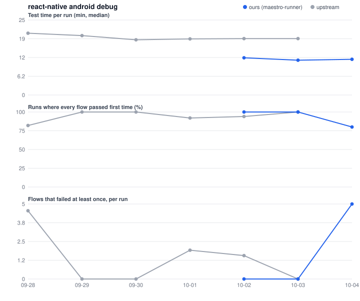
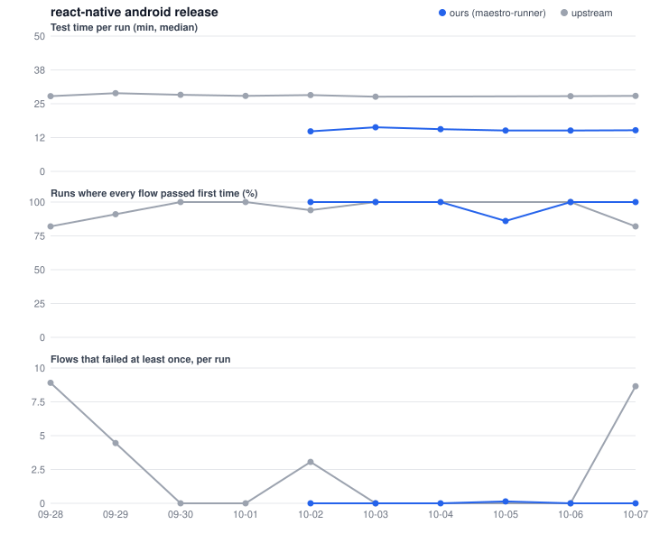
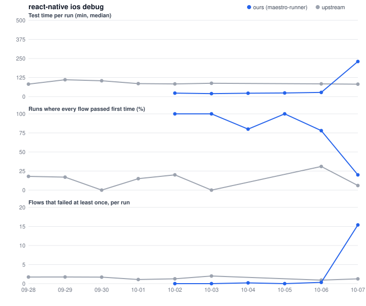
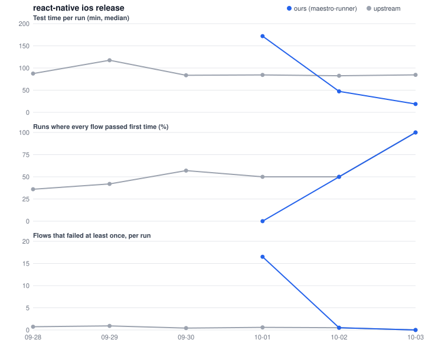

# react-native

Upstream runs Maestro on larger runners (macos-*-large, 8-core-ubuntu); the bench fork uses the standard ones.

Times in minutes. *Run* is the whole workflow run (builds included); *job* is one job; *tests* is its test step only; *queue* is the wait for a runner.

## Summary

| Project | Platform | Flavour | Side | Build | Runs | Median e2e (min) | Green runs | Runs with no first-attempt failure | First-attempt failures / run | Final failures / run | Runs needing a retry job | Runner |
|---|---|---|---|---|---|---|---|---|---|---|---|---|
| react-native | android | debug | ours | e8a87b5 | 18 | 11.5 | 18/18 | 17/18 | 1.39 | 1.39 | 0/18 | ubuntu-latest |
| react-native | android | debug | ours | 6904d0f | 14 | 11.9 | 12/14 | 12/14 | 3.57 | 3.57 | 2/14 | ubuntu-latest |
| react-native | android | debug | upstream | - | 116 | 18.5 | 105/116 | 84/88 | 1.14 | 1.14 | 11/116 | 4-core-ubuntu |
| react-native | android | debug (template app) | ours | e8a87b5 | 18 | 2.7 | 17/18 | 17/18 | 0.06 | 0.06 | 1/18 | ubuntu-latest |
| react-native | android | debug (template app) | ours | 6904d0f | 14 | 2.7 | 14/14 | 14/14 | 0.00 | 0.00 | 0/14 | ubuntu-latest |
| react-native | android | debug (template app) | upstream | - | 114 | 3.2 | 106/114 | 81/88 | 0.08 | 0.08 | 8/114 | 4-core-ubuntu |
| react-native | android | release | ours | e8a87b5 | 18 | 15.1 | 18/18 | 18/18 | 0.00 | 0.00 | 0/18 | ubuntu-latest |
| react-native | android | release | ours | 6904d0f | 14 | 15.6 | 14/14 | 13/14 | 0.07 | 0.00 | 0/14 | ubuntu-latest |
| react-native | android | release | upstream | - | 116 | 27.7 | 103/116 | 82/89 | 3.85 | 3.85 | 13/116 | 4-core-ubuntu |
| react-native | android | release (template app) | ours | e8a87b5 | 18 | 2.2 | 17/18 | 17/17 | 0.00 | 0.00 | 1/18 | ubuntu-latest |
| react-native | android | release (template app) | ours | 6904d0f | 14 | 2.1 | 13/14 | 13/14 | 0.07 | 0.07 | 1/14 | ubuntu-latest |
| react-native | android | release (template app) | upstream | - | 114 | 2.5 | 106/114 | 81/87 | 0.07 | 0.07 | 8/114 | 4-core-ubuntu |
| react-native | ios | debug | ours | e8a87b5 | 21 | 26.8 | 17/21 | 15/21 | 3.76 | 3.62 | 4/21 | macos-26 |
| react-native | ios | debug | ours | 6904d0f | 14 | 22.4 | 14/14 | 12/14 | 0.14 | 0.00 | 0/14 | macos-26 |
| react-native | ios | debug | upstream | - | 117 | 75.7 | 82/116 | 15/88 | 1.09 | 0.25 | 35/117 | macos-15-large, macos-26-large |
| react-native | ios | debug (template app) | ours | e8a87b5 | 18 | 8.3 | 18/18 | 15/18 | 0.17 | 0.00 | 0/18 | macos-26 |
| react-native | ios | debug (template app) | ours | 6904d0f | 14 | 8.1 | 14/14 | 13/14 | 0.07 | 0.00 | 0/14 | macos-26, macos-26-intel |
| react-native | ios | debug (template app) | upstream | - | 110 | 10.2 | 109/110 | 75/85 | 0.12 | 0.00 | 1/110 | macos-15-large, macos-26-large |
| react-native | ios | release | ours | e8a87b5 | 21 | 23.8 | 17/21 | 16/21 | 3.67 | 3.62 | 4/21 | macos-26 |
| react-native | ios | release | ours | 6904d0f | 14 | 21.5 | 14/14 | 11/14 | 0.29 | 0.00 | 0/14 | macos-26 |
| react-native | ios | release | upstream | - | 117 | 71.9 | 82/117 | 43/88 | 0.57 | 0.30 | 35/117 | macos-15-large, macos-26-large |
| react-native | ios | release (template app) | ours | e8a87b5 | 18 | 6.3 | 18/18 | 18/18 | 0.00 | 0.00 | 0/18 | macos-26 |
| react-native | ios | release (template app) | ours | 6904d0f | 14 | 5.8 | 14/14 | 14/14 | 0.00 | 0.00 | 0/14 | macos-26, macos-26-intel |
| react-native | ios | release (template app) | upstream | - | 109 | 9.5 | 108/109 | 85/85 | 0.00 | 0.00 | 1/109 | macos-15-large, macos-26-large |

## Runs: maestro-runner (bench fork)

| Started (UTC) | Run | Build | Run time | Job | Job time | Tests | Queue | Result |
|---|---|---|---|---|---|---|---|---|
| 2026-10-07 20:40 | [37683758717](https://github.com/maestro-runner-bench/react-native/actions/runs/37683758717) | e8a87b5 | 320.4 | android_rntester (debug) | 12.6 | 11.6 | 0.0 | 27/27 |
|  | | |  | android_rntester (release) | 16.0 | 15.2 | 0.0 | 51/51 |
|  | | |  | android_templateapp (debug) | 4.3 | 2.4 | 0.0 | 1/1 |
|  | | |  | android_templateapp (release) | 3.1 | 2.4 | 0.0 | 1/1 |
|  | | |  | ios_rntester (Debug) | 83.8 | 82.6 | 0.1 | 29/48 |
|  | | |  | ios_rntester (Release) | 70.5 | 69.4 | 0.1 | 29/48 |
|  | | |  | ios_rntester_retry_1 (Debug) | 79.4 | 78.4 | 0.1 | 29/48 |
|  | | |  | ios_rntester_retry_1 (Release) | 62.2 | 61.3 | 0.1 | 29/48 |
|  | | |  | ios_rntester_retry_2 (Debug) | 82.0 | 80.8 | 0.1 | 29/48, 1 passed on retry |
|  | | |  | ios_rntester_retry_2 (Release) | 72.0 | 70.9 | 0.1 | 29/48 |
|  | | |  | ios_templateapp (Debug) | 10.9 | 7.4 | 3.5 | 1/1 |
|  | | |  | ios_templateapp (Release) | 6.0 | 4.5 | 3.4 | 1/1 |
| 2026-10-07 15:19 | [37642884198](https://github.com/maestro-runner-bench/react-native/actions/runs/37642884198) | e8a87b5 | 318.6 | android_rntester (debug) | 13.1 | 12.2 | 0.1 | 27/27 |
|  | | |  | android_rntester (release) | 13.9 | 13.1 | 0.0 | 51/51 |
|  | | |  | android_templateapp (debug) | 5.4 | 3.1 | 0.1 | 1/1 |
|  | | |  | android_templateapp (release) | 3.1 | 2.4 | 0.0 | 1/1 |
|  | | |  | ios_rntester (Debug) | 80.0 | 79.0 | 0.6 | 29/48 |
|  | | |  | ios_rntester (Release) | 73.0 | 71.8 | 0.1 | 29/48 |
|  | | |  | ios_rntester_retry_1 (Debug) | 82.8 | 81.5 | 0.1 | 29/48 |
|  | | |  | ios_rntester_retry_1 (Release) | 71.2 | 70.3 | 0.1 | 29/48 |
|  | | |  | ios_rntester_retry_2 (Debug) | 78.7 | 77.5 | 0.1 | 29/48 |
|  | | |  | ios_rntester_retry_2 (Release) | 76.5 | 75.3 | 0.1 | 29/48 |
|  | | |  | ios_templateapp (Debug) | 13.2 | 9.0 | 3.4 | 1/1 |
|  | | |  | ios_templateapp (Release) | 7.4 | 5.7 | 1.0 | 1/1 |
| 2026-10-07 09:52 | [37603623279](https://github.com/maestro-runner-bench/react-native/actions/runs/37603623279) | e8a87b5 | 324.7 | android_rntester (debug) | 12.5 | 11.6 | 0.0 | 27/27 |
|  | | |  | android_rntester (release) | 16.5 | 15.6 | 0.0 | 51/51 |
|  | | |  | android_templateapp (debug) | 4.8 | 2.7 | 0.0 | 1/1 |
|  | | |  | android_templateapp (release) | 2.9 | 2.1 | 0.0 | 1/1 |
|  | | |  | ios_rntester (Debug) | 72.1 | 71.1 | 10.1 | 29/48 |
|  | | |  | ios_rntester (Release) | 73.5 | 72.4 | 6.7 | 29/48 |
|  | | |  | ios_rntester_retry_1 (Debug) | 71.0 | 70.0 | 0.1 | 29/48 |
|  | | |  | ios_rntester_retry_1 (Release) | 75.1 | 73.9 | 0.1 | 29/48 |
|  | | |  | ios_rntester_retry_2 (Debug) | 90.2 | 88.9 | 0.2 | 29/48 |
|  | | |  | ios_rntester_retry_2 (Release) | 72.9 | 71.8 | 0.2 | 29/48 |
|  | | |  | ios_templateapp (Debug) | 12.2 | 8.0 | 5.1 | 1/1 |
|  | | |  | ios_templateapp (Release) | 9.3 | 7.3 | 6.6 | 1/1 |
| 2026-10-07 04:47 | [37573109455](https://github.com/maestro-runner-bench/react-native/actions/runs/37573109455) | e8a87b5 | 300.3 | android_rntester (debug) | 10.8 | 10.1 | 0.0 | 27/27 |
|  | | |  | android_rntester (release) | 16.1 | 15.2 | 0.1 | 51/51 |
|  | | |  | android_templateapp (debug) | 4.7 | 2.7 | 0.0 | 1/1 |
|  | | |  | android_templateapp (release) | 3.0 | 2.2 | 0.0 | 1/1 |
|  | | |  | ios_rntester (Debug) | 74.7 | 73.6 | 1.2 | 29/48 |
|  | | |  | ios_rntester (Release) | 75.3 | 74.1 | 0.8 | 29/48 |
|  | | |  | ios_rntester_retry_1 (Debug) | 81.2 | 80.0 | 0.1 | 29/48 |
|  | | |  | ios_rntester_retry_1 (Release) | 67.8 | 66.9 | 0.1 | 29/48 |
|  | | |  | ios_rntester_retry_2 (Debug) | 72.7 | 71.7 | 0.1 | 29/48 |
|  | | |  | ios_rntester_retry_2 (Release) | 68.8 | 67.8 | 0.1 | 29/48 |
|  | | |  | ios_templateapp (Debug) | 9.6 | 5.9 | 1.4 | 1/1 |
|  | | |  | ios_templateapp (Release) | 8.2 | 6.3 | 3.5 | 1/1 |
| 2026-10-07 02:12 | [37560824589](https://github.com/maestro-runner-bench/react-native/actions/runs/37560824589) | e8a87b5 | 92.0 | android_rntester (debug) | 9.8 | 9.0 | 0.1 | 27/27 |
|  | | |  | android_rntester (release) | 15.4 | 14.7 | 0.0 | 51/51 |
|  | | |  | android_templateapp (debug) | 4.3 | 2.5 | 0.0 | 1/1 |
|  | | |  | android_templateapp (release) | 2.9 | 2.2 | 0.0 | 1/1 |
|  | | |  | ios_rntester (Debug) | 24.4 | 23.4 | 2.3 | 48/48 |
|  | | |  | ios_rntester (Release) | 24.6 | 23.4 | 0.9 | 48/48 |
|  | | |  | ios_templateapp (Debug) | 12.9 | 10.2 | 0.1 | 1/1 |
|  | | |  | ios_templateapp (Release) | 7.3 | 5.5 | 0.1 | 1/1 |
| 2026-10-06 23:37 | [37547551192](https://github.com/maestro-runner-bench/react-native/actions/runs/37547551192) | e8a87b5 | 103.1 | android_rntester (debug) | 12.3 | 11.4 | 0.0 | 27/27 |
|  | | |  | android_rntester (release) | 15.9 | 15.2 | 0.0 | 51/51 |
|  | | |  | android_templateapp (debug) | 4.6 | 2.8 | 0.0 | 1/1 |
|  | | |  | android_templateapp (release) | 2.8 | 2.1 | 0.6 | 1/1 |
|  | | |  | ios_rntester (Debug) | 29.8 | 28.4 | 2.2 | 48/48 |
|  | | |  | ios_rntester (Release) | 22.4 | 21.3 | 1.0 | 48/48 |
|  | | |  | ios_templateapp (Debug) | 7.8 | 5.1 | 2.7 | 1/1 |
|  | | |  | ios_templateapp (Release) | 9.1 | 7.4 | 0.3 | 1/1 |
| 2026-10-06 21:12 | [37532224094](https://github.com/maestro-runner-bench/react-native/actions/runs/37532224094) | e8a87b5 | 106.7 | android_rntester (debug) | 13.2 | 12.5 | 0.6 | 27/27 |
|  | | |  | android_rntester (release) | 15.6 | 14.7 | 0.0 | 51/51 |
|  | | |  | android_templateapp (debug) | 5.4 | 2.9 | 0.1 | 1/1 |
|  | | |  | android_templateapp (release) | 2.7 | 1.9 | 0.0 | 1/1 |
|  | | |  | ios_rntester (Debug) | 32.3 | 31.1 | 0.1 | 48/48, 2 passed on retry |
|  | | |  | ios_rntester (Release) | 24.0 | 22.8 | 0.4 | 48/48 |
|  | | |  | ios_templateapp (Debug) | 10.8 | 7.5 | 5.3 | 1/1 |
|  | | |  | ios_templateapp (Release) | 8.9 | 7.0 | 4.0 | 1/1 |
| 2026-10-06 18:21 | [37510646111](https://github.com/maestro-runner-bench/react-native/actions/runs/37510646111) | e8a87b5 | 106.9 | android_rntester (debug) | 12.3 | 11.4 | 0.1 | 27/27 |
|  | | |  | android_rntester (release) | 16.0 | 15.1 | 0.0 | 51/51 |
|  | | |  | android_templateapp (debug) | 4.9 | 2.7 | 0.0 | 1/1 |
|  | | |  | android_templateapp (release) | 3.2 | 2.3 | 0.0 | 1/1 |
|  | | |  | ios_rntester (Debug) | 31.1 | 29.8 | 0.2 | 48/48 |
|  | | |  | ios_rntester (Release) | 22.7 | 21.8 | 0.1 | 48/48 |
|  | | |  | ios_templateapp (Debug) | 12.4 | 8.3 | 0.1 | 1/1 |
|  | | |  | ios_templateapp (Release) | 11.9 | 9.8 | 0.2 | 1/1 |
| 2026-10-06 15:24 | [37487247697](https://github.com/maestro-runner-bench/react-native/actions/runs/37487247697) | e8a87b5 | 98.4 | android_rntester (debug) | 11.5 | 10.7 | 0.1 | 27/27 |
|  | | |  | android_rntester (release) | 16.4 | 15.5 | 0.1 | 51/51 |
|  | | |  | android_templateapp (debug) | 10.1 | 7.6 | 0.1 | 0/1 |
|  | | |  | android_templateapp (release) | 3.2 | 2.3 | 0.1 | 1/1 |
|  | | |  | android_templateapp_retry_1 (debug) | 5.2 | 2.8 | 0.1 | 1/1 |
|  | | |  | android_templateapp_retry_1 (release) | 0.8 | - | 0.0 | failed before tests |
|  | | |  | ios_rntester (Debug) | 20.7 | 19.8 | 4.2 | 48/48 |
|  | | |  | ios_rntester (Release) | 25.1 | 23.8 | 1.6 | 48/48 |
|  | | |  | ios_templateapp (Debug) | 11.8 | 8.4 | 0.1 | 1/1 |
|  | | |  | ios_templateapp (Release) | 8.6 | 7.0 | 2.2 | 1/1 |
| 2026-10-06 12:17 | [37462204429](https://github.com/maestro-runner-bench/react-native/actions/runs/37462204429) | e8a87b5 | 111.2 | android_rntester (debug) | 12.1 | 11.3 | 0.0 | 27/27 |
|  | | |  | android_rntester (release) | 14.8 | 13.9 | 0.1 | 51/51 |
|  | | |  | android_templateapp (debug) | 5.2 | 2.9 | 0.0 | 1/1 |
|  | | |  | android_templateapp (release) | 3.5 | 2.5 | 0.2 | 1/1 |
|  | | |  | ios_rntester (Debug) | 28.6 | 27.2 | 4.0 | 48/48 |
|  | | |  | ios_rntester (Release) | 26.2 | 25.0 | 3.6 | 48/48 |
|  | | |  | ios_templateapp (Debug) | 13.6 | 9.7 | 0.2 | 1/1 |
|  | | |  | ios_templateapp (Release) | 8.0 | 6.3 | 1.7 | 1/1 |
| 2026-10-06 09:42 | [37444807275](https://github.com/maestro-runner-bench/react-native/actions/runs/37444807275) | e8a87b5 | 97.6 | android_rntester (debug) | 12.1 | 11.4 | 0.0 | 27/27 |
|  | | |  | android_rntester (release) | 15.9 | 15.0 | 0.0 | 51/51 |
|  | | |  | android_templateapp (debug) | 4.0 | 2.3 | 0.0 | 1/1 |
|  | | |  | android_templateapp (release) | 3.0 | 2.2 | 0.1 | 1/1 |
|  | | |  | ios_rntester (Debug) | 26.9 | 25.7 | 0.2 | 48/48 |
|  | | |  | ios_rntester (Release) | 24.7 | 23.5 | 2.2 | 48/48 |
|  | | |  | ios_templateapp (Debug) | 12.4 | 8.8 | 6.2 | 1/1, 1 passed on retry |
|  | | |  | ios_templateapp (Release) | 10.5 | 8.1 | 3.0 | 1/1 |
| 2026-10-06 06:56 | [37426658489](https://github.com/maestro-runner-bench/react-native/actions/runs/37426658489) | e8a87b5 | 106.8 | android_rntester (debug) | 12.5 | 11.8 | 0.0 | 27/27 |
|  | | |  | android_rntester (release) | 17.2 | 16.4 | 0.1 | 51/51 |
|  | | |  | android_templateapp (debug) | 5.1 | 2.9 | 0.0 | 1/1 |
|  | | |  | android_templateapp (release) | 2.6 | 1.9 | 0.0 | 1/1 |
|  | | |  | ios_rntester (Debug) | 30.9 | 29.7 | 0.1 | 48/48 |
|  | | |  | ios_rntester (Release) | 26.0 | 24.7 | 0.1 | 48/48 |
|  | | |  | ios_templateapp (Debug) | 11.6 | 7.7 | 6.9 | 1/1 |
|  | | |  | ios_templateapp (Release) | 11.2 | 9.0 | 5.3 | 1/1 |
| 2026-10-06 04:27 | [37413767599](https://github.com/maestro-runner-bench/react-native/actions/runs/37413767599) | e8a87b5 | 98.9 | android_rntester (debug) | 12.9 | 11.6 | 0.0 | 27/27 |
|  | | |  | android_rntester (release) | 16.3 | 15.1 | 0.0 | 51/51 |
|  | | |  | android_templateapp (debug) | 5.9 | 3.1 | 0.0 | 1/1 |
|  | | |  | android_templateapp (release) | 3.1 | 2.2 | 0.0 | 1/1 |
|  | | |  | ios_rntester (Debug) | 17.5 | 16.7 | 0.1 | 48/48 |
|  | | |  | ios_rntester (Release) | 25.1 | 24.1 | 0.1 | 48/48, 1 passed on retry |
|  | | |  | ios_templateapp (Debug) | 12.1 | 8.3 | 0.1 | 1/1 |
|  | | |  | ios_templateapp (Release) | 7.8 | 5.5 | 0.1 | 1/1 |
| 2026-10-06 01:57 | [37401754398](https://github.com/maestro-runner-bench/react-native/actions/runs/37401754398) | e8a87b5 | 101.5 | ios_rntester (Debug) | 27.6 | 26.5 | 0.2 | 48/48, 1 passed on retry |
|  | | |  | ios_rntester (Release) | 22.9 | 21.7 | 0.1 | 48/48 |
| 2026-10-05 23:32 | [37389052016](https://github.com/maestro-runner-bench/react-native/actions/runs/37389052016) | e8a87b5 | 97.2 | ios_rntester (Debug) | 26.3 | 25.0 | 0.1 | 48/48 |
|  | | |  | ios_rntester (Release) | 26.8 | 25.3 | 0.2 | 48/48 |
| 2026-10-05 20:51 | [37372323027](https://github.com/maestro-runner-bench/react-native/actions/runs/37372323027) | e8a87b5 | 111.8 | ios_rntester (Debug) | 27.9 | 26.8 | 0.1 | 48/48 |
|  | | |  | ios_rntester (Release) | 25.5 | 24.2 | 0.1 | 48/48 |
| 2026-10-05 17:17 | [37347377632](https://github.com/maestro-runner-bench/react-native/actions/runs/37347377632) | e8a87b5 | 151.2 | android_rntester (debug) | 91.0 | 90.0 | 0.0 | 2/27 |
|  | | |  | android_rntester (release) | 19.1 | 15.1 | 0.0 | 51/51 |
|  | | |  | android_templateapp (debug) | 4.6 | 2.8 | 0.0 | 1/1 |
|  | | |  | android_templateapp (release) | 3.7 | 2.8 | 0.0 | 1/1 |
|  | | |  | ios_rntester (Debug) | 25.1 | 23.8 | 0.1 | 48/48 |
|  | | |  | ios_rntester (Release) | 25.0 | 23.6 | 0.1 | 48/48 |
|  | | |  | ios_templateapp (Debug) | 10.6 | 7.2 | 0.1 | 1/1 |
|  | | |  | ios_templateapp (Release) | 8.0 | 6.0 | 0.1 | 1/1 |
| 2026-10-05 14:11 | [37322661538](https://github.com/maestro-runner-bench/react-native/actions/runs/37322661538) | e8a87b5 | 115.8 | android_rntester (debug) | 10.0 | 9.3 | 0.1 | 27/27 |
|  | | |  | android_rntester (release) | 15.9 | 15.0 | 0.1 | 51/51 |
|  | | |  | android_templateapp (debug) | 5.0 | 2.7 | 0.1 | 1/1 |
|  | | |  | android_templateapp (release) | 2.2 | 1.5 | 0.0 | success |
|  | | |  | android_templateapp_retry_1 (debug) | 2.4 | - | 0.1 | failed before tests |
|  | | |  | android_templateapp_retry_1 (release) | 2.9 | 2.2 | 0.1 | 1/1 |
|  | | |  | ios_rntester (Debug) | 22.4 | 21.2 | 4.5 | 48/48 |
|  | | |  | ios_rntester (Release) | 25.5 | 24.1 | 5.3 | 48/48 |
|  | | |  | ios_templateapp (Debug) | 13.8 | 9.3 | 0.6 | 1/1, 1 passed on retry |
|  | | |  | ios_templateapp (Release) | 11.4 | 9.1 | 2.2 | 1/1 |
| 2026-10-05 11:20 | [37302354644](https://github.com/maestro-runner-bench/react-native/actions/runs/37302354644) | e8a87b5 | 107.8 | android_rntester (debug) | 12.2 | 11.3 | 0.0 | 27/27 |
|  | | |  | android_rntester (release) | 14.8 | 13.9 | 0.0 | 51/51 |
|  | | |  | android_templateapp (debug) | 4.8 | 2.7 | 0.0 | 1/1 |
|  | | |  | android_templateapp (release) | 3.3 | 2.3 | 0.0 | 1/1 |
|  | | |  | ios_rntester (Debug) | 28.0 | 26.8 | 3.0 | 48/48 |
|  | | |  | ios_rntester (Release) | 23.9 | 22.9 | 5.5 | 48/48 |
|  | | |  | ios_templateapp (Debug) | 12.3 | 8.6 | 5.7 | 1/1, 1 passed on retry |
|  | | |  | ios_templateapp (Release) | 6.3 | 4.5 | 6.5 | 1/1 |
| 2026-10-05 08:04 | [37281411434](https://github.com/maestro-runner-bench/react-native/actions/runs/37281411434) | e8a87b5 | 140.9 | android_rntester (debug) | 12.4 | 11.7 | 0.0 | 27/27 |
|  | | |  | android_rntester (release) | 16.1 | 15.2 | 0.0 | 51/51 |
|  | | |  | android_templateapp (debug) | 4.7 | 2.7 | 0.0 | 1/1 |
|  | | |  | android_templateapp (release) | 2.9 | 2.1 | 0.0 | 1/1 |
|  | | |  | ios_rntester (Debug) | 25.1 | 23.6 | 6.7 | 48/48 |
|  | | |  | ios_rntester (Release) | 22.9 | 21.9 | 6.0 | 48/48 |
|  | | |  | ios_templateapp (Debug) | 12.6 | 8.5 | 5.3 | 1/1 |
|  | | |  | ios_templateapp (Release) | 6.8 | 5.4 | 3.6 | 1/1 |
| 2026-10-05 07:18 | [37277034989](https://github.com/maestro-runner-bench/react-native/actions/runs/37277034989) | e8a87b5 | 133.6 | android_rntester (debug) | 12.3 | 11.5 | 0.0 | 27/27 |
|  | | |  | android_rntester (release) | 17.6 | 16.8 | 0.1 | 51/51 |
|  | | |  | android_templateapp (debug) | 4.9 | 2.7 | 0.0 | 1/1 |
|  | | |  | android_templateapp (release) | 3.6 | 2.2 | 0.0 | 1/1 |
|  | | |  | ios_rntester (Debug) | 23.6 | 22.3 | 8.8 | 48/48 |
|  | | |  | ios_rntester (Release) | 22.1 | 20.7 | 10.7 | 48/48 |
|  | | |  | ios_templateapp (Debug) | 15.6 | 11.7 | 0.9 | 1/1 |
|  | | |  | ios_templateapp (Release) | 7.5 | 5.6 | 0.2 | 1/1 |
| 2026-10-05 03:53 | [37261248881](https://github.com/maestro-runner-bench/react-native/actions/runs/37261248881) | 6904d0f | 92.8 | android_rntester (debug) | 13.2 | 12.4 | 0.0 | 27/27 |
|  | | |  | android_rntester (release) | 16.7 | 15.9 | 0.0 | 51/51 |
|  | | |  | android_templateapp (debug) | 5.8 | 3.3 | 0.0 | 1/1 |
|  | | |  | android_templateapp (release) | 2.9 | 2.1 | 0.0 | 1/1 |
|  | | |  | ios_rntester (Debug) | 23.4 | 22.4 | 0.2 | 48/48 |
|  | | |  | ios_rntester (Release) | 20.6 | 19.6 | 0.1 | 48/48 |
|  | | |  | ios_templateapp (Debug) | 11.3 | 7.6 | 0.2 | 1/1 |
|  | | |  | ios_templateapp (Release) | 6.9 | 5.7 | 0.1 | 1/1 |
| 2026-10-05 01:55 | [37253353681](https://github.com/maestro-runner-bench/react-native/actions/runs/37253353681) | 6904d0f | 95.8 | android_rntester (debug) | 12.2 | 11.3 | 0.1 | 27/27 |
|  | | |  | android_rntester (release) | 15.3 | 14.7 | 0.1 | 51/51, 1 passed on retry |
|  | | |  | android_templateapp (debug) | 4.2 | 2.5 | 0.0 | 1/1 |
|  | | |  | android_templateapp (release) | 3.1 | 2.4 | 0.0 | 1/1 |
|  | | |  | ios_rntester (Debug) | 24.5 | 23.2 | 0.1 | 48/48 |
|  | | |  | ios_rntester (Release) | 22.6 | 21.5 | 2.5 | 48/48, 2 passed on retry |
|  | | |  | ios_templateapp (Debug) | 13.3 | 9.0 | 1.5 | 1/1 |
|  | | |  | ios_templateapp (Release) | 7.0 | 5.2 | 3.0 | 1/1 |
| 2026-10-04 23:47 | [37245037660](https://github.com/maestro-runner-bench/react-native/actions/runs/37245037660) | 6904d0f | 99.2 | android_rntester (debug) | 11.4 | 10.7 | 0.0 | 27/27 |
|  | | |  | android_rntester (release) | 16.6 | 15.8 | 0.1 | 51/51 |
|  | | |  | android_templateapp (debug) | 4.9 | 2.8 | 0.0 | 1/1 |
|  | | |  | android_templateapp (release) | 2.7 | 2.0 | 0.0 | 1/1 |
|  | | |  | ios_rntester (Debug) | 25.6 | 24.4 | 11.5 | 48/48, 1 passed on retry |
|  | | |  | ios_rntester (Release) | 21.4 | 20.5 | 13.2 | 48/48 |
|  | | |  | ios_templateapp (Debug) | 8.2 | 5.6 | 2.7 | 1/1 |
|  | | |  | ios_templateapp (Release) | 10.5 | 8.2 | 0.2 | 1/1 |
| 2026-10-04 21:44 | [37237292079](https://github.com/maestro-runner-bench/react-native/actions/runs/37237292079) | 6904d0f | 104.1 | android_rntester (debug) | 12.6 | 11.8 | 0.0 | 27/27 |
|  | | |  | android_rntester (release) | 16.4 | 15.5 | 0.0 | 51/51 |
|  | | |  | android_templateapp (debug) | 4.3 | 2.5 | 0.1 | 1/1 |
|  | | |  | android_templateapp (release) | 3.0 | 2.1 | 0.0 | 1/1 |
|  | | |  | ios_rntester (Debug) | 19.6 | 18.6 | 0.1 | 48/48 |
|  | | |  | ios_rntester (Release) | 28.4 | 27.0 | 0.1 | 48/48, 1 passed on retry |
|  | | |  | ios_templateapp (Debug) | 11.8 | 7.9 | 0.1 | 1/1 |
|  | | |  | ios_templateapp (Release) | 5.1 | 3.8 | 0.1 | 1/1 |
| 2026-10-04 19:45 | [37229507413](https://github.com/maestro-runner-bench/react-native/actions/runs/37229507413) | 6904d0f | 97.2 | android_rntester (debug) | 10.0 | 9.2 | 0.0 | 27/27 |
|  | | |  | android_rntester (release) | 16.7 | 15.8 | 0.1 | 51/51 |
|  | | |  | android_templateapp (debug) | 4.8 | 2.7 | 0.0 | 1/1 |
|  | | |  | android_templateapp (release) | 3.0 | 2.2 | 0.0 | 1/1 |
|  | | |  | ios_rntester (Debug) | 23.2 | 22.4 | 6.6 | 48/48, 1 passed on retry |
|  | | |  | ios_rntester (Release) | 23.4 | 22.1 | 10.3 | 48/48 |
|  | | |  | ios_templateapp (Debug) | 8.6 | 6.1 | 2.0 | 1/1 |
|  | | |  | ios_templateapp (Release) | 8.8 | 7.0 | 0.6 | 1/1 |
| 2026-10-04 17:52 | [37222172383](https://github.com/maestro-runner-bench/react-native/actions/runs/37222172383) | 6904d0f | 99.7 | android_rntester (debug) | 12.8 | 12.1 | 0.0 | 27/27 |
|  | | |  | android_rntester (release) | 16.9 | 16.0 | 0.1 | 51/51 |
|  | | |  | android_templateapp (debug) | 5.1 | 2.9 | 0.0 | 1/1 |
|  | | |  | android_templateapp (release) | 2.8 | 2.0 | 0.0 | 1/1 |
|  | | |  | ios_rntester (Debug) | 22.9 | 21.7 | 0.1 | 48/48 |
|  | | |  | ios_rntester (Release) | 27.2 | 25.9 | 0.1 | 48/48 |
|  | | |  | ios_templateapp (Debug) | 11.3 | 7.1 | 0.1 | 1/1 |
|  | | |  | ios_templateapp (Release) | 7.0 | 5.8 | 0.1 | 1/1 |
| 2026-10-04 15:44 | [37214108346](https://github.com/maestro-runner-bench/react-native/actions/runs/37214108346) | 6904d0f | 92.3 | android_rntester (debug) | 12.4 | 11.6 | 0.0 | 27/27 |
|  | | |  | android_rntester (release) | 17.0 | 16.1 | 0.1 | 51/51 |
|  | | |  | android_templateapp (debug) | 4.9 | 2.8 | 0.6 | 1/1 |
|  | | |  | android_templateapp (release) | 2.9 | 2.1 | 0.0 | 1/1 |
|  | | |  | ios_rntester (Debug) | 18.6 | 17.8 | 6.9 | 48/48 |
|  | | |  | ios_rntester (Release) | 21.2 | 20.4 | 7.3 | 48/48 |
|  | | |  | ios_templateapp (Debug) | 11.4 | 8.2 | 1.1 | 1/1 |
|  | | |  | ios_templateapp (Release) | 7.4 | 5.9 | 0.1 | 1/1 |
| 2026-10-04 13:46 | [37206803188](https://github.com/maestro-runner-bench/react-native/actions/runs/37206803188) | 6904d0f | 92.9 | android_rntester (debug) | 13.3 | 12.4 | 0.1 | 27/27 |
|  | | |  | android_rntester (release) | 16.2 | 15.5 | 0.6 | 51/51 |
|  | | |  | android_templateapp (debug) | 4.8 | 2.7 | 0.0 | 1/1 |
|  | | |  | android_templateapp (release) | 2.8 | 2.1 | 0.0 | 1/1 |
|  | | |  | ios_rntester (Debug) | 23.6 | 22.5 | 0.1 | 48/48 |
|  | | |  | ios_rntester (Release) | 22.7 | 21.6 | 0.1 | 48/48 |
|  | | |  | ios_templateapp (Debug) | 11.9 | 8.0 | 0.1 | 1/1 |
|  | | |  | ios_templateapp (Release) | 6.1 | 4.7 | 0.1 | 1/1 |
| 2026-10-04 11:23 | [37198558783](https://github.com/maestro-runner-bench/react-native/actions/runs/37198558783) | 6904d0f | 101.2 | android_rntester (debug) | 13.0 | 12.2 | 0.0 | 27/27 |
|  | | |  | android_rntester (release) | 15.1 | 14.3 | 0.0 | 51/51 |
|  | | |  | android_templateapp (debug) | 4.6 | 2.6 | 0.0 | 1/1 |
|  | | |  | android_templateapp (release) | 8.0 | 7.2 | 0.0 | 0/1 |
|  | | |  | android_templateapp_retry_1 (debug) | 2.0 | - | 0.0 | failed before tests |
|  | | |  | android_templateapp_retry_1 (release) | 2.9 | 2.1 | 0.0 | 1/1 |
|  | | |  | ios_rntester (Debug) | 25.4 | 24.2 | 0.1 | 48/48 |
|  | | |  | ios_rntester (Release) | 16.7 | 15.9 | 0.1 | 48/48 |
|  | | |  | ios_templateapp (Debug) | 12.1 | 7.5 | 0.2 | 1/1 |
|  | | |  | ios_templateapp (Release) | 7.3 | 5.7 | 5.1 | 1/1 |
| 2026-10-04 08:54 | [37190428250](https://github.com/maestro-runner-bench/react-native/actions/runs/37190428250) | 6904d0f | 148.1 | android_rntester (debug) | 90.8 | 90.0 | 0.0 | 2/27 |
|  | | |  | android_rntester (release) | 16.1 | 15.3 | 0.0 | 51/51 |
|  | | |  | android_rntester_retry_1 (debug) | 12.7 | 11.9 | 0.0 | 25/25 |
|  | | |  | android_rntester_retry_1 (release) | 0.8 | - | 0.0 | failed before tests |
|  | | |  | android_templateapp (debug) | 4.3 | 2.5 | 0.0 | 1/1 |
|  | | |  | android_templateapp (release) | 3.0 | 2.2 | 0.0 | 1/1 |
|  | | |  | ios_rntester (Debug) | 22.3 | 21.4 | 5.8 | 48/48 |
|  | | |  | ios_rntester (Release) | 20.7 | 20.0 | 6.0 | 48/48, 1 passed on retry |
|  | | |  | ios_templateapp (Debug) | 12.7 | 8.8 | 4.3 | 1/1 |
|  | | |  | ios_templateapp (Release) | 7.0 | 4.8 | 5.7 | 1/1 |
| 2026-10-04 06:16 | [37182301666](https://github.com/maestro-runner-bench/react-native/actions/runs/37182301666) | 6904d0f | 154.7 | android_rntester (debug) | 90.8 | 90.0 | 0.0 | 2/27 |
|  | | |  | android_rntester (release) | 16.9 | 16.3 | 0.0 | 51/51 |
|  | | |  | android_rntester_retry_1 (debug) | 12.4 | 11.7 | 0.0 | 25/25 |
|  | | |  | android_rntester_retry_1 (release) | 0.7 | - | 0.0 | failed before tests |
|  | | |  | android_templateapp (debug) | 5.3 | 3.0 | 0.0 | 1/1 |
|  | | |  | android_templateapp (release) | 3.0 | 2.1 | 0.0 | 1/1 |
|  | | |  | ios_rntester (Debug) | 27.0 | 26.0 | 0.1 | 48/48 |
|  | | |  | ios_rntester (Release) | 25.4 | 24.1 | 0.1 | 48/48 |
|  | | |  | ios_templateapp (Debug) | 14.4 | 8.3 | 12.8 | 1/1 |
|  | | |  | ios_templateapp (Release) | 27.5 | 20.4 | 2.6 | 1/1 |
| 2026-10-04 00:14 | [37164340779](https://github.com/maestro-runner-bench/react-native/actions/runs/37164340779) | 6904d0f | 125.9 | android_rntester (debug) | 12.6 | 11.8 | 0.0 | 27/27 |
|  | | |  | android_rntester (release) | 16.4 | 15.4 | 0.1 | 51/51 |
|  | | |  | android_templateapp (debug) | 5.6 | 3.1 | 0.0 | 1/1 |
|  | | |  | android_templateapp (release) | 2.8 | 2.1 | 0.0 | 1/1 |
|  | | |  | ios_rntester (Debug) | 20.8 | 19.8 | 7.5 | 48/48 |
|  | | |  | ios_rntester (Release) | 22.7 | 21.5 | 6.7 | 48/48 |
|  | | |  | ios_templateapp (Debug) | 32.3 | 23.5 | 6.7 | 1/1, 1 passed on retry |
|  | | |  | ios_templateapp (Release) | 17.7 | 12.9 | 6.2 | 1/1 |
| 2026-10-03 03:23 | [37093048002](https://github.com/maestro-runner-bench/react-native/actions/runs/37093048002) | 6904d0f | 130.9 | android_rntester (debug) | 12.3 | 11.6 | 0.0 | 27/27 |
|  | | |  | android_rntester (release) | 17.1 | 16.3 | 0.1 | 51/51 |
|  | | |  | android_templateapp (debug) | 5.0 | 3.0 | 0.0 | 1/1 |
|  | | |  | android_templateapp (release) | 3.0 | 2.2 | 0.0 | 1/1 |
|  | | |  | ios_rntester (Debug) | 20.6 | 19.4 | 0.1 | 48/48 |
|  | | |  | ios_rntester (Release) | 19.6 | 18.8 | 0.1 | 48/48 |
|  | | |  | ios_templateapp (Debug) | 27.6 | 19.3 | 0.1 | 1/1 |
|  | | |  | ios_templateapp (Release) | 10.0 | 6.1 | 0.1 | 1/1 |
| 2026-10-02 21:58 | [37069938487](https://github.com/maestro-runner-bench/react-native/actions/runs/37069938487) | 6904d0f | 144.4 | android_rntester (debug) | 13.1 | 12.4 | 0.0 | 27/27 |
|  | | |  | android_rntester (release) | 15.6 | 14.8 | 0.0 | 51/51 |
|  | | |  | android_templateapp (debug) | 4.8 | 2.7 | 0.0 | 1/1 |
|  | | |  | android_templateapp (release) | 3.0 | 2.2 | 0.0 | 1/1 |
|  | | |  | ios_rntester (Debug) | 23.8 | 22.5 | 17.2 | 48/48 |
|  | | |  | ios_rntester (Release) | 26.6 | 25.1 | 1.2 | 48/48 |
|  | | |  | ios_templateapp (Debug) | 17.5 | 10.0 | 12.6 | 1/1 |
|  | | |  | ios_templateapp (Release) | 23.5 | 15.5 | 7.6 | 1/1 |

## Runs: upstream

| Started (UTC) | Run | Build | Run time | Job | Job time | Tests | Queue | Result |
|---|---|---|---|---|---|---|---|---|
| 2026-10-07 23:57 | [37705136048](https://github.com/react/react-native/actions/runs/37705136048) | maestro | 123.5 | android_rntester (debug) | 19.2 | 18.2 | 0.1 | 27/27 |
|  | | |  | android_rntester (release) | 27.3 | 26.4 | 0.1 | 51/51 |
|  | | |  | android_templateapp (debug) | 5.7 | 3.3 | 0.2 | 1/1 |
|  | | |  | android_templateapp (release) | 3.4 | 2.4 | 0.2 | 1/1 |
|  | | |  | ios_rntester (Debug) | 77.4 | 76.2 | 0.2 | 48/48, 1 passed on retry |
|  | | |  | ios_rntester (Release) | 79.1 | 77.8 | 0.2 | 48/48, 1 passed on retry |
|  | | |  | ios_templateapp (Debug) | 15.6 | 10.0 | 0.2 | 1/1 |
|  | | |  | ios_templateapp (Release) | 13.6 | 9.6 | 0.2 | 1/1 |
| 2026-10-07 22:21 | [37695603885](https://github.com/react/react-native/actions/runs/37695603885) | maestro | 126.1 | android_rntester (debug) | 19.8 | 18.7 | 0.8 | 27/27 |
|  | | |  | android_rntester (release) | 28.2 | 27.2 | 0.9 | 51/51 |
|  | | |  | android_templateapp (debug) | 5.6 | 3.1 | 0.1 | 1/1 |
|  | | |  | android_templateapp (release) | 3.5 | 2.5 | 0.1 | 1/1 |
|  | | |  | ios_rntester (Debug) | 72.7 | 71.6 | 0.2 | 48/48, 1 passed on retry |
|  | | |  | ios_rntester (Release) | 75.5 | 74.3 | 0.1 | 48/48 |
|  | | |  | ios_templateapp (Debug) | 19.4 | 13.4 | 0.2 | 1/1 |
|  | | |  | ios_templateapp (Release) | 13.8 | 11.3 | 0.2 | 1/1 |
| 2026-10-07 21:21 | [37688778726](https://github.com/react/react-native/actions/runs/37688778726) | maestro | 217.9 | android_rntester (debug) | 19.4 | 18.5 | 0.5 | 27/27 |
|  | | |  | android_rntester (release) | 28.5 | 27.6 | 0.4 | 51/51 |
|  | | |  | android_templateapp (debug) | 5.6 | 3.2 | 0.2 | 1/1 |
|  | | |  | android_templateapp (release) | 3.4 | 2.5 | 0.2 | 1/1 |
|  | | |  | ios_rntester (Debug) | 98.8 | 96.3 | 0.2 | 43/44 |
|  | | |  | ios_rntester (Release) | 98.5 | 96.2 | 0.2 | 43/44 |
|  | | |  | ios_rntester_retry_1 (Debug) | 74.2 | 73.0 | 0.2 | 48/48 |
|  | | |  | ios_rntester_retry_1 (Release) | 72.1 | 71.0 | 0.1 | 48/48 |
|  | | |  | ios_templateapp (Debug) | 18.6 | 12.2 | 0.4 | 1/1, 1 passed on retry |
|  | | |  | ios_templateapp (Release) | 13.7 | 9.1 | 0.4 | 1/1 |
| 2026-10-07 21:11 | [37687641152](https://github.com/react/react-native/actions/runs/37687641152) | maestro | 120.7 | android_rntester (debug) | 19.4 | 18.4 | 0.2 | 27/27 |
|  | | |  | android_rntester (release) | 30.3 | 29.3 | 0.2 | 51/51 |
|  | | |  | android_templateapp (debug) | 5.5 | 3.2 | 0.1 | 1/1 |
|  | | |  | android_templateapp (release) | 3.4 | 2.5 | 0.1 | 1/1 |
|  | | |  | ios_rntester (Debug) | 79.8 | 78.8 | 0.1 | 48/48 |
|  | | |  | ios_rntester (Release) | 73.7 | 72.4 | 0.1 | 48/48 |
|  | | |  | ios_templateapp (Debug) | 17.1 | 11.8 | 0.5 | 1/1 |
|  | | |  | ios_templateapp (Release) | 11.9 | 9.7 | 0.4 | 1/1 |
| 2026-10-07 19:35 | [37675604577](https://github.com/react/react-native/actions/runs/37675604577) | maestro | 143.9 | android_rntester (debug) | 19.0 | 18.1 | 0.3 | 27/27 |
|  | | |  | android_rntester (release) | 54.0 | 53.1 | 0.3 | 2/51 |
|  | | |  | android_rntester_retry_1 (release) | 30.8 | 29.5 | 0.2 | 51/51 |
|  | | |  | android_templateapp (debug) | 5.5 | 3.3 | 0.1 | 1/1 |
|  | | |  | android_templateapp (release) | 3.5 | 2.5 | 0.1 | 1/1 |
|  | | |  | ios_rntester (Debug) | 31.1 | 29.8 | 0.1 | 6/7 |
|  | | |  | ios_rntester (Release) | 28.8 | 27.5 | 0.1 | 6/7 |
|  | | |  | ios_rntester_retry_1 (Debug) | 36.5 | 34.9 | 0.2 | 6/7 |
|  | | |  | ios_rntester_retry_1 (Release) | 35.5 | 33.8 | 0.2 | 6/7 |
|  | | |  | ios_rntester_retry_2 (Debug) | 28.4 | 26.9 | 0.2 | 6/7 |
|  | | |  | ios_rntester_retry_2 (Release) | 28.7 | 27.6 | 0.2 | 6/7 |
|  | | |  | ios_templateapp (Debug) | 16.5 | 12.3 | 0.3 | 1/1, 1 passed on retry |
|  | | |  | ios_templateapp (Release) | 13.9 | 11.3 | 0.3 | 1/1 |
| 2026-10-07 19:25 | [37674358859](https://github.com/react/react-native/actions/runs/37674358859) | maestro | 139.6 | android_rntester (debug) | 19.5 | 18.4 | 0.3 | 27/27 |
|  | | |  | android_rntester (release) | 28.0 | 27.0 | 0.3 | 51/51 |
|  | | |  | android_templateapp (debug) | 5.5 | 3.0 | 0.6 | 1/1 |
|  | | |  | android_templateapp (release) | 3.6 | 2.5 | 0.6 | 1/1 |
|  | | |  | ios_rntester (Debug) | 28.6 | 26.7 | 0.2 | 6/7 |
|  | | |  | ios_rntester (Release) | 29.7 | 27.9 | 0.2 | 6/7 |
|  | | |  | ios_rntester_retry_1 (Debug) | 29.8 | 28.3 | 0.2 | 6/7 |
|  | | |  | ios_rntester_retry_1 (Release) | 25.6 | 24.4 | 0.2 | 6/7 |
|  | | |  | ios_rntester_retry_2 (Debug) | 28.3 | 26.9 | 0.2 | 6/7 |
|  | | |  | ios_rntester_retry_2 (Release) | 33.0 | 31.6 | 0.2 | 6/7, 1 passed on retry |
|  | | |  | ios_templateapp (Debug) | 17.6 | 12.6 | 0.3 | 1/1 |
|  | | |  | ios_templateapp (Release) | 11.2 | 9.5 | 0.3 | 1/1 |
| 2026-10-07 18:57 | [37670792864](https://github.com/react/react-native/actions/runs/37670792864) | maestro | 132.1 | android_rntester (debug) | 20.7 | 19.4 | 4.9 | 27/27 |
|  | | |  | android_rntester (release) | 53.5 | 52.5 | 4.8 | 2/51 |
|  | | |  | android_rntester_retry_1 (release) | 27.8 | 26.9 | 0.1 | 51/51 |
|  | | |  | android_templateapp (debug) | 5.5 | 3.2 | 0.3 | 1/1 |
|  | | |  | android_templateapp (release) | 3.5 | 2.5 | 0.4 | 1/1 |
|  | | |  | ios_rntester (Debug) | 28.2 | 26.9 | 0.4 | 6/7 |
|  | | |  | ios_rntester (Release) | 24.7 | 23.4 | 0.4 | 6/7 |
|  | | |  | ios_rntester_retry_1 (Debug) | 29.7 | 27.4 | 0.2 | 6/7, 1 passed on retry |
|  | | |  | ios_rntester_retry_1 (Release) | 25.8 | 23.8 | 0.2 | 6/7 |
|  | | |  | ios_rntester_retry_2 (Debug) | 27.6 | 26.3 | 0.3 | 6/7 |
|  | | |  | ios_rntester_retry_2 (Release) | 31.1 | 29.5 | 0.3 | 6/7 |
|  | | |  | ios_templateapp (Debug) | 15.2 | 10.3 | 0.2 | 1/1 |
|  | | |  | ios_templateapp (Release) | 12.0 | 9.8 | 0.2 | 1/1 |
| 2026-10-07 18:42 | [37668922717](https://github.com/react/react-native/actions/runs/37668922717) | maestro | 138.9 | android_rntester (debug) | 19.2 | 18.2 | 0.2 | 27/27 |
|  | | |  | android_rntester (release) | 27.4 | 26.4 | 0.2 | 51/51 |
|  | | |  | android_templateapp (debug) | 5.8 | 3.3 | 1.3 | 1/1 |
|  | | |  | android_templateapp (release) | 3.6 | 2.6 | 1.3 | 1/1 |
|  | | |  | ios_rntester (Debug) | 33.4 | 32.0 | 0.3 | 6/7 |
|  | | |  | ios_rntester (Release) | 29.1 | 27.7 | 0.3 | 6/7 |
|  | | |  | ios_rntester_retry_1 (Debug) | 29.0 | 27.6 | 0.5 | 6/7 |
|  | | |  | ios_rntester_retry_1 (Release) | 24.7 | 23.5 | 0.5 | 6/7 |
|  | | |  | ios_rntester_retry_2 (Debug) | 29.0 | 27.6 | 0.4 | 6/7 |
|  | | |  | ios_rntester_retry_2 (Release) | 27.5 | 26.2 | 0.4 | 6/7 |
|  | | |  | ios_templateapp (Debug) | 19.4 | 13.6 | 0.4 | 1/1 |
|  | | |  | ios_templateapp (Release) | 12.8 | 10.3 | 0.4 | 1/1 |
| 2026-10-07 18:38 | [37668408819](https://github.com/react/react-native/actions/runs/37668408819) | maestro | 50.9 | android_rntester (debug) | 18.5 | 17.6 | 1.1 | 27/27 |
|  | | |  | android_rntester (release) | 29.0 | 27.9 | 1.1 | 51/51 |
| 2026-10-07 18:28 | [37667108167](https://github.com/react/react-native/actions/runs/37667108167) | maestro | 137.6 | android_rntester (debug) | 19.9 | 18.4 | 0.3 | 27/27 |
|  | | |  | android_rntester (release) | 30.2 | 29.2 | 0.3 | 51/51 |
|  | | |  | android_templateapp (debug) | 5.7 | 3.3 | 1.8 | 1/1 |
|  | | |  | android_templateapp (release) | 3.5 | 2.4 | 1.8 | 1/1 |
|  | | |  | ios_rntester (Debug) | 31.3 | 30.0 | 0.3 | 6/7, 1 passed on retry |
|  | | |  | ios_rntester (Release) | 27.6 | 26.1 | 0.3 | 6/7 |
|  | | |  | ios_rntester_retry_1 (Debug) | 29.3 | 28.0 | 0.4 | 6/7 |
|  | | |  | ios_rntester_retry_1 (Release) | 27.4 | 26.1 | 0.4 | 6/7 |
|  | | |  | ios_rntester_retry_2 (Debug) | 27.1 | 25.7 | 0.4 | 6/7 |
|  | | |  | ios_rntester_retry_2 (Release) | 28.2 | 27.0 | 0.4 | 6/7 |
|  | | |  | ios_templateapp (Debug) | 16.4 | 10.4 | 0.3 | 1/1 |
|  | | |  | ios_templateapp (Release) | 13.8 | 10.0 | 0.3 | 1/1 |
| 2026-10-07 17:12 | [37657323606](https://github.com/react/react-native/actions/runs/37657323606) | maestro | 164.6 | android_rntester (debug) | 20.4 | 19.4 | 0.4 | 27/27 |
|  | | |  | android_rntester (release) | 28.4 | 27.3 | 0.4 | 51/51 |
|  | | |  | android_templateapp (debug) | 5.5 | 3.2 | 0.3 | 1/1 |
|  | | |  | android_templateapp (release) | 3.7 | 2.7 | 0.3 | 1/1 |
|  | | |  | ios_rntester (Debug) | 27.2 | 26.0 | 0.4 | 6/7 |
|  | | |  | ios_rntester (Release) | 26.8 | 25.4 | 0.4 | 6/7 |
|  | | |  | ios_rntester_retry_1 (Debug) | 29.9 | 28.3 | 0.4 | 6/7, 1 passed on retry |
|  | | |  | ios_rntester_retry_1 (Release) | 33.9 | 31.6 | 0.4 | 6/7 |
|  | | |  | ios_rntester_retry_2 (Debug) | 28.0 | 26.6 | 0.8 | 6/7 |
|  | | |  | ios_templateapp (Debug) | 14.8 | 10.2 | 0.3 | 1/1 |
|  | | |  | ios_templateapp (Release) | 14.6 | 12.1 | 0.3 | 1/1 |
| 2026-10-07 15:58 | [37648262956](https://github.com/react/react-native/actions/runs/37648262956) | maestro | 133.7 | android_rntester (debug) | 18.9 | 17.9 | 0.2 | 27/27 |
|  | | |  | android_rntester (release) | 28.4 | 26.6 | 0.2 | 51/51 |
|  | | |  | android_templateapp (debug) | 5.8 | 3.5 | 0.2 | 1/1 |
|  | | |  | android_templateapp (release) | 4.3 | 2.5 | 0.2 | 1/1 |
|  | | |  | ios_rntester (Debug) | 28.9 | 27.5 | 0.3 | 6/7 |
|  | | |  | ios_rntester (Release) | 27.2 | 25.9 | 0.3 | 6/7 |
|  | | |  | ios_rntester_retry_1 (Debug) | 25.4 | 24.2 | 0.3 | 6/7 |
|  | | |  | ios_rntester_retry_1 (Release) | 28.8 | 27.3 | 0.3 | 6/7 |
|  | | |  | ios_rntester_retry_2 (Debug) | 26.4 | 25.2 | 0.2 | 6/7 |
|  | | |  | ios_rntester_retry_2 (Release) | 27.4 | 26.0 | 0.2 | 6/7 |
|  | | |  | ios_templateapp (Debug) | 17.4 | 11.1 | 0.2 | 1/1 |
|  | | |  | ios_templateapp (Release) | 14.7 | 10.1 | 0.2 | 1/1 |
| 2026-10-07 13:43 | [37630774707](https://github.com/react/react-native/actions/runs/37630774707) | maestro | 138.5 | android_rntester (debug) | 20.4 | 19.4 | 0.2 | 27/27 |
|  | | |  | android_rntester (release) | 28.9 | 27.9 | 0.2 | 51/51 |
|  | | |  | android_templateapp (debug) | 5.6 | 3.2 | 0.2 | 1/1 |
|  | | |  | android_templateapp (release) | 3.6 | 2.6 | 0.2 | 1/1 |
|  | | |  | ios_rntester (Debug) | 27.3 | 26.1 | 0.2 | 6/7 |
|  | | |  | ios_rntester (Release) | 28.1 | 26.9 | 0.2 | 6/7 |
|  | | |  | ios_rntester_retry_1 (Debug) | 31.4 | 29.9 | 0.2 | 6/7, 1 passed on retry |
|  | | |  | ios_rntester_retry_1 (Release) | 27.8 | 26.6 | 0.2 | 6/7 |
|  | | |  | ios_rntester_retry_2 (Debug) | 33.0 | 31.6 | 0.2 | 6/7 |
|  | | |  | ios_rntester_retry_2 (Release) | 32.0 | 30.4 | 0.2 | 6/7 |
|  | | |  | ios_templateapp (Debug) | 16.1 | 9.9 | 0.1 | 1/1 |
|  | | |  | ios_templateapp (Release) | 14.0 | 9.5 | 0.1 | 1/1 |
| 2026-10-07 11:55 | [37617327465](https://github.com/react/react-native/actions/runs/37617327465) | maestro | 136.2 | android_rntester (debug) | 19.0 | 18.0 | 0.1 | 27/27 |
|  | | |  | android_rntester (release) | 30.5 | 29.5 | 0.1 | 51/51 |
|  | | |  | android_templateapp (debug) | 5.5 | 3.1 | 0.1 | 1/1 |
|  | | |  | android_templateapp (release) | 3.2 | 2.3 | 0.1 | 1/1 |
|  | | |  | ios_rntester (Debug) | 29.1 | 27.7 | 0.1 | 6/7 |
|  | | |  | ios_rntester (Release) | 25.2 | 23.9 | 0.1 | 6/7 |
|  | | |  | ios_rntester_retry_1 (Debug) | 27.9 | 26.6 | 0.1 | 6/7 |
|  | | |  | ios_rntester_retry_1 (Release) | 25.8 | 24.5 | 0.1 | 6/7 |
|  | | |  | ios_rntester_retry_2 (Debug) | 27.9 | 26.7 | 0.2 | 6/7 |
|  | | |  | ios_rntester_retry_2 (Release) | 25.2 | 23.9 | 0.2 | 6/7 |
|  | | |  | ios_templateapp (Debug) | 15.3 | 9.7 | 0.1 | 1/1 |
|  | | |  | ios_templateapp (Release) | 12.7 | 8.8 | 0.1 | 1/1 |
| 2026-10-07 08:22 | [37593372260](https://github.com/react/react-native/actions/runs/37593372260) | maestro | 171.6 | android_rntester (debug) | 19.6 | 18.6 | 0.1 | 27/27 |
|  | | |  | android_rntester (release) | 53.8 | 52.8 | 0.1 | 2/51 |
|  | | |  | android_rntester_retry_1 (release) | 30.0 | 29.0 | 0.1 | 51/51 |
|  | | |  | android_templateapp (debug) | 5.7 | 3.3 | 0.1 | 1/1 |
|  | | |  | android_templateapp (release) | 3.5 | 2.6 | 0.1 | 1/1 |
|  | | |  | ios_rntester (Debug) | 28.4 | 27.1 | 0.1 | 6/7 |
|  | | |  | ios_rntester (Release) | 26.4 | 25.1 | 0.1 | 6/7 |
|  | | |  | ios_rntester_retry_1 (Release) | 28.5 | 27.2 | 0.1 | 6/7 |
|  | | |  | ios_rntester_retry_2 (Debug) | 33.6 | 31.7 | 0.1 | 6/7 |
|  | | |  | ios_rntester_retry_2 (Release) | 32.3 | 30.2 | 0.1 | 6/7 |
|  | | |  | ios_templateapp (Debug) | 15.6 | 9.9 | 0.2 | 1/1 |
|  | | |  | ios_templateapp (Release) | 13.9 | 9.5 | 0.2 | 1/1 |
| 2026-10-07 02:51 | [37564021203](https://github.com/react/react-native/actions/runs/37564021203) | maestro | 151.0 | android_rntester (debug) | 20.5 | 19.4 | 0.1 | 27/27 |
|  | | |  | android_rntester (release) | 29.4 | 28.3 | 0.1 | 51/51 |
|  | | |  | android_templateapp (debug) | 5.7 | 3.4 | 0.3 | 1/1 |
|  | | |  | android_templateapp (release) | 3.7 | 2.7 | 0.1 | 1/1 |
|  | | |  | ios_rntester (Debug) | 45.9 | 43.6 | 0.1 | 6/7 |
|  | | |  | ios_rntester (Release) | 37.4 | 35.8 | 0.1 | 6/7 |
|  | | |  | ios_rntester_retry_1 (Debug) | 33.7 | 31.6 | 0.1 | 6/7 |
|  | | |  | ios_rntester_retry_1 (Release) | 27.3 | 25.3 | 0.1 | 6/7 |
|  | | |  | ios_rntester_retry_2 (Debug) | 26.9 | 25.6 | 0.1 | 6/7 |
|  | | |  | ios_rntester_retry_2 (Release) | 27.0 | 25.7 | 0.1 | 6/7 |
|  | | |  | ios_templateapp (Debug) | 16.5 | 11.3 | 0.1 | 1/1 |
|  | | |  | ios_templateapp (Release) | 14.2 | 11.5 | 0.1 | 1/1 |
| 2026-10-07 00:48 | [37553922113](https://github.com/react/react-native/actions/runs/37553922113) | maestro | 133.6 | android_rntester (debug) | 20.9 | 19.9 | 0.1 | 27/27 |
|  | | |  | android_rntester (release) | 30.7 | 29.7 | 0.1 | 51/51 |
|  | | |  | android_templateapp (debug) | 5.8 | 3.3 | 0.1 | 1/1 |
|  | | |  | android_templateapp (release) | 3.5 | 2.5 | 0.1 | 1/1 |
|  | | |  | ios_rntester (Debug) | 91.7 | 90.4 | 0.1 | 48/48, 2 passed on retry |
|  | | |  | ios_rntester (Release) | 68.5 | 67.3 | 0.1 | 48/48 |
|  | | |  | ios_templateapp (Debug) | 14.3 | 8.6 | 0.1 | 1/1 |
|  | | |  | ios_templateapp (Release) | 14.1 | 9.7 | 0.1 | 1/1 |
| 2026-10-06 20:29 | [37526837222](https://github.com/react/react-native/actions/runs/37526837222) | maestro | 132.8 | android_rntester (debug) | 18.9 | 18.0 | 1.1 | 27/27 |
|  | | |  | android_rntester (release) | 28.7 | 27.7 | 1.1 | 51/51 |
|  | | |  | android_templateapp (debug) | 5.7 | 3.1 | 2.0 | 1/1 |
|  | | |  | android_templateapp (release) | 3.6 | 2.5 | 1.9 | 1/1 |
|  | | |  | ios_rntester (Debug) | 86.8 | 85.5 | 0.2 | 48/48, 1 passed on retry |
|  | | |  | ios_rntester (Release) | 80.1 | 78.8 | 0.2 | 48/48, 1 passed on retry |
|  | | |  | ios_templateapp (Debug) | 15.6 | 9.5 | 0.2 | 1/1 |
|  | | |  | ios_templateapp (Release) | 12.8 | 9.4 | 0.2 | 1/1 |
| 2026-10-06 16:55 | [37499462145](https://github.com/react/react-native/actions/runs/37499462145) | maestro | 145.3 | android_rntester (debug) | 19.7 | 18.6 | 0.8 | 27/27 |
|  | | |  | android_rntester (release) | 28.8 | 27.7 | 0.8 | 51/51 |
|  | | |  | android_templateapp (debug) | 6.3 | 3.4 | 0.1 | 1/1 |
|  | | |  | android_templateapp (release) | 3.7 | 2.5 | 0.1 | 1/1 |
|  | | |  | ios_rntester (Debug) | 96.3 | 94.8 | 0.2 | 48/48, 2 passed on retry |
|  | | |  | ios_rntester (Release) | 86.9 | 85.6 | 0.1 | 48/48, 1 passed on retry |
|  | | |  | ios_templateapp (Debug) | 18.0 | 12.8 | 0.2 | 1/1 |
|  | | |  | ios_templateapp (Release) | 12.6 | 10.0 | 0.2 | 1/1 |
| 2026-10-06 16:32 | [37496573554](https://github.com/react/react-native/actions/runs/37496573554) | maestro | 126.3 | android_rntester (debug) | 19.2 | 18.0 | 0.6 | 27/27 |
|  | | |  | android_rntester (release) | 31.5 | 30.4 | 0.6 | 51/51 |
|  | | |  | android_templateapp (debug) | 6.0 | 3.3 | 0.4 | 1/1 |
|  | | |  | android_templateapp (release) | 3.8 | 2.4 | 0.3 | 1/1 |
|  | | |  | ios_rntester (Debug) | 76.0 | 74.6 | 0.4 | 48/48, 1 passed on retry |
|  | | |  | ios_rntester (Release) | 68.2 | 67.1 | 0.4 | 48/48 |
|  | | |  | ios_templateapp (Debug) | 14.3 | 10.1 | 0.2 | 1/1 |
|  | | |  | ios_templateapp (Release) | 12.8 | 10.6 | 0.2 | 1/1 |
| 2026-10-06 15:54 | [37491466882](https://github.com/react/react-native/actions/runs/37491466882) | maestro | 133.5 | android_rntester (debug) | 19.5 | 18.4 | 0.1 | 27/27 |
|  | | |  | android_rntester (release) | 30.1 | 28.7 | 0.1 | 51/51 |
|  | | |  | android_templateapp (debug) | 5.9 | 3.3 | 0.5 | 1/1 |
|  | | |  | android_templateapp (release) | 3.3 | 2.4 | 0.4 | 1/1 |
|  | | |  | ios_rntester (Debug) | 81.8 | 80.5 | 0.2 | 48/48 |
|  | | |  | ios_rntester (Release) | 78.6 | 77.3 | 0.2 | 48/48 |
|  | | |  | ios_templateapp (Debug) | 13.9 | 8.4 | 0.2 | 1/1 |
|  | | |  | ios_templateapp (Release) | 12.1 | 8.5 | 0.2 | 1/1 |
| 2026-10-06 14:22 | [37478350249](https://github.com/react/react-native/actions/runs/37478350249) | maestro | 211.2 | android_rntester (debug) | 19.0 | 18.0 | 0.2 | 27/27 |
|  | | |  | android_rntester (release) | 29.6 | 28.6 | 0.2 | 51/51 |
|  | | |  | android_templateapp (debug) | 5.7 | 3.2 | 0.1 | 1/1 |
|  | | |  | android_templateapp (release) | 3.8 | 2.6 | 0.1 | 1/1 |
|  | | |  | ios_rntester (Debug) | 90.1 | 88.7 | 0.2 | 43/44 |
|  | | |  | ios_rntester (Release) | 67.0 | 65.8 | 0.2 | 48/48 |
|  | | |  | ios_rntester_retry_1 (Debug) | 79.5 | 77.7 | 0.4 | 48/48 |
|  | | |  | ios_rntester_retry_1 (Release) | 67.6 | 66.1 | 0.4 | 48/48 |
|  | | |  | ios_templateapp (Debug) | 17.3 | 12.3 | 0.1 | 1/1 |
|  | | |  | ios_templateapp (Release) | 12.9 | 10.4 | 0.1 | 1/1 |
| 2026-10-06 11:48 | [37458901120](https://github.com/react/react-native/actions/runs/37458901120) | maestro | 131.2 | android_rntester (debug) | 20.7 | 19.7 | 0.1 | 27/27 |
|  | | |  | android_rntester (release) | 27.5 | 26.6 | 0.1 | 51/51 |
|  | | |  | android_templateapp (debug) | 5.4 | 3.1 | 0.1 | 1/1 |
|  | | |  | android_templateapp (release) | 3.5 | 2.5 | 0.2 | 1/1 |
|  | | |  | ios_rntester (Debug) | 84.6 | 83.2 | 0.2 | 48/48, 1 passed on retry |
|  | | |  | ios_rntester (Release) | 73.2 | 71.9 | 0.2 | 48/48 |
|  | | |  | ios_templateapp (Debug) | 15.6 | 9.8 | 0.1 | 1/1 |
|  | | |  | ios_templateapp (Release) | 13.1 | 9.5 | 0.1 | 1/1 |
| 2026-10-06 10:05 | [37447408602](https://github.com/react/react-native/actions/runs/37447408602) | maestro | 131.9 | android_rntester (debug) | 19.7 | 18.6 | 0.1 | 27/27 |
|  | | |  | android_rntester (release) | 27.2 | 26.3 | 0.1 | 51/51 |
|  | | |  | android_templateapp (debug) | 5.4 | 3.1 | 0.1 | 1/1 |
|  | | |  | android_templateapp (release) | 3.6 | 2.6 | 0.1 | 1/1 |
|  | | |  | ios_rntester (Debug) | 87.5 | 86.0 | 0.1 | 48/48, 1 passed on retry |
|  | | |  | ios_rntester (Release) | 70.0 | 68.7 | 0.1 | 48/48 |
|  | | |  | ios_templateapp (Debug) | 16.3 | 11.1 | 0.1 | 1/1 |
|  | | |  | ios_templateapp (Release) | 11.6 | 9.5 | 0.1 | 1/1 |
| 2026-10-06 09:40 | [37444586620](https://github.com/react/react-native/actions/runs/37444586620) | maestro | 132.2 | android_rntester (debug) | 19.9 | 18.9 | 0.1 | 27/27 |
|  | | |  | android_rntester (release) | 28.0 | 27.1 | 0.1 | 51/51 |
|  | | |  | android_templateapp (debug) | 6.0 | 3.5 | 0.1 | 1/1 |
|  | | |  | android_templateapp (release) | 3.5 | 2.6 | 0.1 | 1/1 |
|  | | |  | ios_rntester (Debug) | 80.2 | 78.9 | 0.1 | 48/48 |
|  | | |  | ios_rntester (Release) | 87.5 | 86.3 | 0.1 | 48/48, 1 passed on retry |
|  | | |  | ios_templateapp (Debug) | 15.3 | 10.4 | 0.1 | 1/1 |
|  | | |  | ios_templateapp (Release) | 11.9 | 9.8 | 0.1 | 1/1 |
| 2026-10-06 09:27 | [37443111193](https://github.com/react/react-native/actions/runs/37443111193) | maestro | 145.8 | android_rntester (debug) | 20.5 | 19.5 | 0.1 | 27/27 |
|  | | |  | android_rntester (release) | 28.5 | 27.5 | 0.1 | 51/51 |
|  | | |  | android_templateapp (debug) | 5.6 | 3.2 | 0.1 | 1/1 |
|  | | |  | android_templateapp (release) | 3.5 | 2.5 | 0.1 | 1/1 |
|  | | |  | ios_rntester (Debug) | 98.7 | 96.8 | 0.1 | 48/48, 1 passed on retry |
|  | | |  | ios_rntester (Release) | 96.6 | 94.8 | 0.1 | 48/48, 2 passed on retry |
|  | | |  | ios_templateapp (Debug) | 16.5 | 10.2 | 0.1 | 1/1 |
|  | | |  | ios_templateapp (Release) | 11.8 | 8.3 | 0.1 | 1/1 |
| 2026-10-06 09:17 | [37441983092](https://github.com/react/react-native/actions/runs/37441983092) | maestro | 116.8 | android_rntester (debug) | 19.6 | 18.7 | 0.1 | 27/27 |
|  | | |  | android_rntester (release) | 29.7 | 28.7 | 0.1 | 51/51 |
|  | | |  | android_templateapp (debug) | 5.4 | 3.1 | 0.1 | 1/1 |
|  | | |  | android_templateapp (release) | 3.6 | 2.6 | 0.1 | 1/1 |
|  | | |  | ios_rntester (Debug) | 79.0 | 77.8 | 0.1 | 48/48 |
|  | | |  | ios_rntester (Release) | 72.9 | 71.7 | 0.1 | 48/48 |
|  | | |  | ios_templateapp (Debug) | 15.8 | 10.8 | 0.1 | 1/1 |
|  | | |  | ios_templateapp (Release) | 11.8 | 9.7 | 0.1 | 1/1 |
| 2026-10-06 09:13 | [37441531830](https://github.com/react/react-native/actions/runs/37441531830) | maestro | 118.8 | android_rntester (debug) | 19.6 | 18.6 | 0.1 | 27/27 |
|  | | |  | android_rntester (release) | 28.9 | 27.9 | 0.1 | 51/51 |
|  | | |  | android_templateapp (debug) | 6.6 | 4.1 | 0.1 | 0/1 |
|  | | |  | android_templateapp (release) | 4.7 | 3.6 | 0.1 | 0/1 |
|  | | |  | android_templateapp_retry_1 (debug) | 5.7 | 3.4 | 0.1 | 1/1 |
|  | | |  | android_templateapp_retry_1 (release) | 3.5 | 2.5 | 0.1 | 1/1 |
|  | | |  | ios_rntester (Debug) | 77.0 | 75.8 | 0.1 | 48/48 |
|  | | |  | ios_rntester (Release) | 76.0 | 74.8 | 0.1 | 48/48 |
|  | | |  | ios_templateapp (Debug) | 15.6 | 11.0 | 0.1 | 1/1 |
|  | | |  | ios_templateapp (Release) | 12.2 | 9.9 | 0.1 | 1/1 |
| 2026-10-06 09:04 | [37440442745](https://github.com/react/react-native/actions/runs/37440442745) | maestro | 230.0 | android_rntester (debug) | 20.1 | 19.0 | 0.1 | 27/27 |
|  | | |  | android_rntester (release) | 28.8 | 27.8 | 0.1 | 51/51 |
|  | | |  | android_templateapp (debug) | 5.5 | 3.2 | 0.1 | 1/1 |
|  | | |  | android_templateapp (release) | 3.5 | 2.5 | 0.1 | 1/1 |
|  | | |  | ios_rntester (Debug) | 109.6 | 107.9 | 0.1 | 43/44, 1 passed on retry |
|  | | |  | ios_rntester (Release) | 97.6 | 96.2 | 0.1 | 48/48, 1 passed on retry |
|  | | |  | ios_rntester_retry_1 (Debug) | 81.2 | 80.1 | 0.1 | 48/48, 1 passed on retry |
|  | | |  | ios_rntester_retry_1 (Release) | 71.8 | 70.6 | 0.1 | 48/48 |
|  | | |  | ios_templateapp (Debug) | 13.7 | 8.4 | 0.1 | 1/1 |
|  | | |  | ios_templateapp (Release) | 15.3 | 11.2 | 0.1 | 1/1 |
| 2026-10-06 09:01 | [37440045105](https://github.com/react/react-native/actions/runs/37440045105) | maestro | 119.4 | android_rntester (debug) | 22.0 | 20.9 | 0.1 | 27/27 |
|  | | |  | android_rntester (release) | 29.9 | 28.8 | 0.1 | 51/51 |
|  | | |  | android_templateapp (debug) | 5.8 | 3.3 | 0.1 | 1/1 |
|  | | |  | android_templateapp (release) | 3.8 | 2.8 | 0.1 | 1/1 |
|  | | |  | ios_rntester (Debug) | 78.2 | 76.8 | 0.1 | 48/48, 1 passed on retry |
|  | | |  | ios_rntester (Release) | 70.8 | 69.6 | 0.1 | 48/48 |
|  | | |  | ios_templateapp (Debug) | 16.3 | 10.7 | 0.1 | 1/1, 1 passed on retry |
|  | | |  | ios_templateapp (Release) | 13.0 | 9.5 | 0.1 | 1/1 |
| 2026-10-03 00:39 | [37082951955](https://github.com/react/react-native/actions/runs/37082951955) | maestro | 128.3 | android_rntester (debug) | 19.8 | 18.8 | 0.1 | 27/27 |
|  | | |  | android_rntester (release) | 28.7 | 27.6 | 0.1 | 51/51 |
|  | | |  | android_templateapp (debug) | 5.6 | 3.1 | 0.1 | 1/1 |
|  | | |  | android_templateapp (release) | 3.5 | 2.4 | 0.1 | 1/1 |
|  | | |  | ios_rntester (Debug) | 88.8 | 87.4 | 0.1 | 48/48, 2 passed on retry |
|  | | |  | ios_rntester (Release) | 85.9 | 84.6 | 0.1 | 48/48 |
|  | | |  | ios_templateapp (Debug) | 19.5 | 14.0 | 0.1 | 1/1 |
|  | | |  | ios_templateapp (Release) | 15.4 | 12.7 | 0.1 | 1/1 |
| 2026-10-02 19:41 | [37055799075](https://github.com/react/react-native/actions/runs/37055799075) | maestro | 135.5 | android_rntester (debug) | 20.8 | 19.2 | 0.3 | 27/27 |
|  | | |  | android_rntester (release) | 28.4 | 27.5 | 0.3 | 51/51 |
|  | | |  | android_templateapp (debug) | 6.7 | 4.2 | 0.1 | 0/1 |
|  | | |  | android_templateapp (release) | 3.7 | 2.5 | 0.1 | 1/1 |
|  | | |  | android_templateapp_retry_1 (debug) | 5.5 | 3.2 | 0.2 | 1/1 |
|  | | |  | ios_rntester (Debug) | 78.5 | 77.5 | 0.2 | 48/48, 1 passed on retry |
|  | | |  | ios_rntester (Release) | 88.0 | 86.6 | 0.2 | 48/48 |
|  | | |  | ios_templateapp (Debug) | 15.4 | 9.8 | 0.4 | 1/1 |
|  | | |  | ios_templateapp (Release) | 13.4 | 9.6 | 0.4 | 1/1 |
| 2026-10-02 18:13 | [37045943779](https://github.com/react/react-native/actions/runs/37045943779) | maestro | 137.4 | android_rntester (debug) | 43.4 | 42.4 | 0.3 | 2/27 |
|  | | |  | android_rntester (release) | 29.2 | 28.3 | 0.3 | 51/51 |
|  | | |  | android_rntester_retry_1 (debug) | 19.1 | 18.1 | 0.3 | 27/27 |
|  | | |  | android_templateapp (debug) | 6.0 | 3.5 | 0.3 | 1/1 |
|  | | |  | android_templateapp (release) | 3.7 | 2.8 | 0.3 | 1/1 |
|  | | |  | ios_rntester (Debug) | 84.5 | 83.1 | 0.2 | 48/48, 1 passed on retry |
|  | | |  | ios_rntester (Release) | 73.5 | 72.3 | 0.2 | 48/48 |
|  | | |  | ios_templateapp (Debug) | 15.2 | 10.6 | 0.6 | 1/1 |
|  | | |  | ios_templateapp (Release) | 12.2 | 10.0 | 0.6 | 1/1 |
| 2026-10-02 16:57 | [37037432937](https://github.com/react/react-native/actions/runs/37037432937) | maestro | 125.1 | android_rntester (debug) | 20.2 | 19.1 | 0.6 | 27/27 |
|  | | |  | android_rntester (release) | 27.7 | 26.7 | 0.9 | 51/51 |
|  | | |  | android_templateapp (debug) | 5.6 | 3.2 | 0.2 | 1/1 |
|  | | |  | android_templateapp (release) | 3.5 | 2.5 | 0.2 | 1/1 |
|  | | |  | ios_rntester (Debug) | 74.7 | 73.4 | 0.3 | 48/48, 1 passed on retry |
|  | | |  | ios_rntester (Release) | 80.7 | 79.0 | 0.3 | 48/48 |
|  | | |  | ios_templateapp (Debug) | 15.3 | 9.2 | 0.2 | 1/1 |
|  | | |  | ios_templateapp (Release) | 11.6 | 8.4 | 0.2 | 1/1 |
| 2026-10-02 16:50 | [37036694926](https://github.com/react/react-native/actions/runs/37036694926) | maestro | 130.3 | android_rntester (debug) | 19.9 | 18.8 | 0.1 | 27/27 |
|  | | |  | android_rntester (release) | 28.2 | 27.2 | 0.1 | 51/51 |
|  | | |  | android_templateapp (debug) | 5.8 | 3.3 | 0.2 | 1/1 |
|  | | |  | android_templateapp (release) | 3.5 | 2.5 | 0.2 | 1/1 |
|  | | |  | ios_rntester (Debug) | 80.6 | 79.2 | 0.2 | 48/48 |
|  | | |  | ios_rntester (Release) | 87.0 | 85.7 | 0.2 | 48/48, 1 passed on retry |
|  | | |  | ios_templateapp (Debug) | 14.3 | 8.7 | 0.3 | 1/1 |
|  | | |  | ios_templateapp (Release) | 11.2 | 8.4 | 0.3 | 1/1 |
| 2026-10-02 16:46 | [37036180664](https://github.com/react/react-native/actions/runs/37036180664) | maestro | 144.0 | android_rntester (debug) | 19.3 | 18.3 | 0.2 | 27/27 |
|  | | |  | android_rntester (release) | 28.2 | 27.2 | 0.2 | 51/51 |
|  | | |  | android_templateapp (debug) | 5.5 | 3.0 | 0.3 | 1/1 |
|  | | |  | android_templateapp (release) | 3.4 | 2.5 | 0.3 | 1/1 |
|  | | |  | ios_rntester (Debug) | 96.8 | 95.4 | 0.3 | 48/48, 2 passed on retry |
|  | | |  | ios_rntester (Release) | 76.0 | 74.7 | 0.3 | 48/48 |
|  | | |  | ios_templateapp (Debug) | 16.6 | 10.6 | 0.3 | 1/1 |
|  | | |  | ios_templateapp (Release) | 12.3 | 9.2 | 0.3 | 1/1 |
| 2026-10-02 15:44 | [37029138076](https://github.com/react/react-native/actions/runs/37029138076) | maestro | 126.2 | android_rntester (debug) | 19.1 | 18.1 | 0.2 | 27/27 |
|  | | |  | android_rntester (release) | 27.7 | 26.6 | 0.2 | 51/51 |
|  | | |  | android_templateapp (debug) | 5.9 | 3.4 | 0.1 | 1/1 |
|  | | |  | android_templateapp (release) | 3.2 | 2.2 | 0.1 | 1/1 |
|  | | |  | ios_rntester (Debug) | 79.5 | 78.3 | 0.2 | 48/48, 1 passed on retry |
|  | | |  | ios_rntester (Release) | 73.7 | 72.3 | 0.2 | 48/48 |
|  | | |  | ios_templateapp (Debug) | 15.7 | 11.2 | 0.2 | 1/1 |
| 2026-10-02 15:41 | [37028747659](https://github.com/react/react-native/actions/runs/37028747659) | maestro | 126.2 | android_rntester (debug) | 18.5 | 17.5 | 0.2 | 27/27 |
|  | | |  | android_rntester (release) | 29.6 | 28.6 | 0.2 | 51/51 |
|  | | |  | android_templateapp (debug) | 5.8 | 3.4 | 0.2 | 1/1 |
|  | | |  | android_templateapp (release) | 3.5 | 2.5 | 0.2 | 1/1 |
|  | | |  | ios_rntester (Debug) | 79.5 | 78.2 | 0.2 | 48/48, 1 passed on retry |
|  | | |  | ios_rntester (Release) | 80.8 | 79.6 | 0.2 | 48/48 |
|  | | |  | ios_templateapp (Debug) | 16.3 | 11.6 | 0.3 | 1/1 |
|  | | |  | ios_templateapp (Release) | 14.5 | 11.7 | 0.3 | 1/1 |
| 2026-10-02 15:33 | [37027808769](https://github.com/react/react-native/actions/runs/37027808769) | maestro | 236.9 | android_rntester (debug) | 23.3 | 22.2 | 0.2 | 27/27 |
|  | | |  | android_rntester (release) | 29.4 | 28.4 | 0.2 | 51/51 |
|  | | |  | android_templateapp (debug) | 5.5 | 3.2 | 0.2 | 1/1 |
|  | | |  | android_templateapp (release) | 3.6 | 2.5 | 0.2 | 1/1 |
|  | | |  | ios_rntester (Debug) | 102.6 | 101.2 | 0.2 | 43/44 |
|  | | |  | ios_rntester (Release) | 68.7 | 67.5 | 0.2 | 48/48 |
|  | | |  | ios_rntester_retry_1 (Debug) | 83.9 | 82.4 | 0.4 | 48/48, 2 passed on retry |
|  | | |  | ios_rntester_retry_1 (Release) | 76.5 | 75.2 | 0.3 | 48/48, 1 passed on retry |
|  | | |  | ios_templateapp (Debug) | 20.2 | 14.2 | 0.2 | 1/1 |
|  | | |  | ios_templateapp (Release) | 12.0 | 9.8 | 0.2 | 1/1 |
| 2026-10-02 14:31 | [37020483607](https://github.com/react/react-native/actions/runs/37020483607) | maestro | 354.3 | android_rntester (debug) | 20.5 | 19.6 | 0.1 | 27/27 |
|  | | |  | android_rntester (release) | 54.1 | 53.0 | 0.1 | 2/51 |
|  | | |  | android_rntester_retry_1 (release) | 28.6 | 27.6 | 0.2 | 51/51 |
|  | | |  | android_templateapp (debug) | 5.6 | 3.2 | 0.1 | 1/1 |
|  | | |  | android_templateapp (release) | 3.4 | 2.4 | 0.1 | 1/1 |
|  | | |  | ios_rntester (Release) | 77.8 | 76.6 | 0.2 | 48/48 |
|  | | |  | ios_rntester_retry_1 (Debug) | 111.6 | 110.2 | 0.1 | 24/25 |
|  | | |  | ios_rntester_retry_1 (Release) | 96.2 | 94.9 | 0.1 | 43/44 |
|  | | |  | ios_rntester_retry_2 (Debug) | 80.8 | 79.6 | 0.3 | 48/48, 1 passed on retry |
|  | | |  | ios_rntester_retry_2 (Release) | 84.1 | 82.8 | 0.3 | 48/48 |
|  | | |  | ios_templateapp (Debug) | 18.1 | 11.3 | 0.1 | 1/1 |
|  | | |  | ios_templateapp (Release) | 11.2 | 8.0 | 0.1 | 1/1 |
| 2026-10-02 11:55 | [37003745333](https://github.com/react/react-native/actions/runs/37003745333) | maestro | 306.4 | android_rntester (debug) | 21.6 | 20.6 | 0.1 | 27/27 |
|  | | |  | android_rntester (release) | 29.4 | 28.4 | 0.1 | 51/51 |
|  | | |  | android_templateapp (debug) | 5.8 | 3.3 | 0.1 | 1/1 |
|  | | |  | android_templateapp (release) | 3.6 | 2.6 | 0.1 | 1/1 |
|  | | |  | ios_rntester (Debug) | 69.3 | 68.2 | 0.2 | 48/48, 1 passed on retry |
|  | | |  | ios_rntester (Release) | 84.0 | 82.7 | 0.2 | 43/44 |
|  | | |  | ios_rntester_retry_1 (Debug) | 98.1 | 96.5 | 0.2 | 43/44 |
|  | | |  | ios_rntester_retry_1 (Release) | 93.1 | 91.5 | 0.2 | 48/48, 1 passed on retry |
|  | | |  | ios_rntester_retry_2 (Debug) | 77.5 | 76.2 | 0.2 | 48/48 |
|  | | |  | ios_rntester_retry_2 (Release) | 73.8 | 72.5 | 0.2 | 48/48, 1 passed on retry |
|  | | |  | ios_templateapp (Debug) | 18.4 | 13.7 | 0.1 | 1/1, 1 passed on retry |
|  | | |  | ios_templateapp (Release) | 11.5 | 9.5 | 0.1 | 1/1 |
| 2026-10-02 11:09 | [36999455988](https://github.com/react/react-native/actions/runs/36999455988) | maestro | 141.2 | android_rntester (debug) | 22.0 | 20.9 | 0.1 | 27/27 |
|  | | |  | android_rntester (release) | 30.5 | 29.5 | 0.1 | 51/51 |
|  | | |  | android_templateapp (debug) | 6.1 | 3.6 | 0.1 | 1/1 |
|  | | |  | android_templateapp (release) | 3.7 | 2.7 | 0.1 | 1/1 |
|  | | |  | ios_rntester (Debug) | 94.9 | 93.5 | 0.1 | 48/48, 2 passed on retry |
|  | | |  | ios_rntester (Release) | 71.0 | 69.8 | 0.1 | 48/48 |
|  | | |  | ios_templateapp (Debug) | 14.5 | 10.0 | 0.1 | 1/1 |
|  | | |  | ios_templateapp (Release) | 13.5 | 10.8 | 0.1 | 1/1 |
| 2026-10-02 10:46 | [36997293926](https://github.com/react/react-native/actions/runs/36997293926) | maestro | 129.4 | android_rntester (debug) | 19.3 | 18.3 | 0.1 | 27/27 |
|  | | |  | android_rntester (release) | 30.4 | 29.4 | 0.1 | 51/51 |
|  | | |  | android_templateapp (debug) | 5.6 | 3.3 | 0.1 | 1/1 |
|  | | |  | android_templateapp (release) | 3.6 | 2.6 | 0.1 | 1/1 |
|  | | |  | ios_rntester (Debug) | 75.5 | 74.2 | 0.1 | 48/48, 1 passed on retry |
|  | | |  | ios_rntester (Release) | 69.6 | 68.5 | 0.1 | 48/48 |
|  | | |  | ios_templateapp (Debug) | 16.8 | 11.9 | 0.1 | 1/1, 1 passed on retry |
|  | | |  | ios_templateapp (Release) | 11.8 | 9.6 | 0.1 | 1/1 |
| 2026-10-02 10:33 | [36996153294](https://github.com/react/react-native/actions/runs/36996153294) | maestro | 390.5 | android_rntester (debug) | 19.9 | 18.8 | 0.1 | 27/27 |
|  | | |  | android_rntester (release) | 28.4 | 27.4 | 0.1 | 51/51 |
|  | | |  | android_templateapp (debug) | 5.7 | 3.3 | 0.1 | 1/1 |
|  | | |  | android_templateapp (release) | 3.8 | 2.7 | 0.1 | 1/1 |
|  | | |  | ios_rntester (Debug) | 74.2 | 73.0 | 0.1 | 48/48, 1 passed on retry |
|  | | |  | ios_rntester (Release) | 94.3 | 93.0 | 0.1 | 43/44 |
|  | | |  | ios_rntester_retry_1 (Debug) | 73.0 | 71.8 | 0.2 | 48/48 |
|  | | |  | ios_rntester_retry_1 (Release) | 140.9 | 138.8 | 0.2 | 43/44, 1 passed on retry |
|  | | |  | ios_rntester_retry_2 (Debug) | 107.0 | 105.6 | 0.1 | 43/44 |
|  | | |  | ios_rntester_retry_2 (Release) | 67.1 | 65.9 | 0.1 | 48/48 |
|  | | |  | ios_templateapp (Debug) | 14.1 | 10.0 | 0.1 | 1/1 |
|  | | |  | ios_templateapp (Release) | 11.2 | 9.1 | 0.1 | 1/1 |
| 2026-10-02 10:09 | [36993916028](https://github.com/react/react-native/actions/runs/36993916028) | maestro | 141.8 | android_rntester (debug) | 19.4 | 18.4 | 0.1 | 27/27 |
|  | | |  | android_rntester (release) | 27.2 | 26.3 | 0.1 | 51/51 |
|  | | |  | android_templateapp (debug) | 5.6 | 3.2 | 0.1 | 1/1 |
|  | | |  | android_templateapp (release) | 3.7 | 2.6 | 0.1 | 1/1 |
|  | | |  | ios_rntester (Debug) | 76.3 | 75.1 | 0.1 | 48/48 |
|  | | |  | ios_rntester (Release) | 93.4 | 92.2 | 0.1 | 48/48, 1 passed on retry |
|  | | |  | ios_templateapp (Debug) | 17.6 | 12.6 | 0.1 | 1/1 |
|  | | |  | ios_templateapp (Release) | 12.3 | 9.8 | 0.1 | 1/1 |
| 2026-10-02 09:36 | [36990729679](https://github.com/react/react-native/actions/runs/36990729679) | maestro | 136.1 | android_rntester (debug) | 19.4 | 18.4 | 0.1 | 27/27 |
|  | | |  | android_rntester (release) | 30.4 | 29.3 | 0.1 | 51/51 |
|  | | |  | android_templateapp (debug) | 5.8 | 3.4 | 0.1 | 1/1 |
|  | | |  | android_templateapp (release) | 3.4 | 2.4 | 0.1 | 1/1 |
|  | | |  | ios_rntester (Debug) | 89.2 | 87.8 | 0.1 | 48/48 |
|  | | |  | ios_rntester (Release) | 79.9 | 78.7 | 0.1 | 48/48, 1 passed on retry |
|  | | |  | ios_templateapp (Debug) | 13.2 | 9.1 | 0.1 | 1/1 |
|  | | |  | ios_templateapp (Release) | 11.4 | 9.3 | 0.1 | 1/1 |
| 2026-10-02 09:19 | [36989076382](https://github.com/react/react-native/actions/runs/36989076382) | maestro | 220.0 | android_rntester (debug) | 19.3 | 18.3 | 0.1 | 27/27 |
|  | | |  | android_rntester (release) | 29.1 | 28.1 | 0.1 | 51/51 |
|  | | |  | android_templateapp (debug) | 5.7 | 3.3 | 0.1 | 1/1 |
|  | | |  | android_templateapp (release) | 4.3 | 3.4 | 0.1 | 0/1 |
|  | | |  | android_templateapp_retry_1 (release) | 4.5 | 3.5 | 0.1 | 0/1 |
|  | | |  | android_templateapp_retry_2 (release) | 3.5 | 2.5 | 0.1 | 1/1 |
|  | | |  | ios_rntester (Debug) | 97.3 | 95.9 | 0.1 | 48/48, 2 passed on retry |
|  | | |  | ios_rntester (Release) | 90.7 | 89.3 | 0.1 | 43/44 |
|  | | |  | ios_rntester_retry_1 (Debug) | 76.0 | 74.8 | 0.1 | 48/48, 1 passed on retry |
|  | | |  | ios_rntester_retry_1 (Release) | 75.5 | 74.3 | 0.1 | 48/48 |
|  | | |  | ios_templateapp (Debug) | 14.6 | 9.2 | 0.1 | 1/1 |
|  | | |  | ios_templateapp (Release) | 12.5 | 9.0 | 0.1 | 1/1 |
| 2026-10-01 20:02 | [36918732275](https://github.com/react/react-native/actions/runs/36918732275) | maestro | 157.4 | android_rntester (debug) | 19.3 | 18.5 | 0.5 | 27/27 |
|  | | |  | android_rntester (release) | 26.9 | 26.2 | 0.2 | 51/51 |
|  | | |  | android_templateapp (debug) | 5.5 | 3.3 | 0.1 | 1/1 |
|  | | |  | android_templateapp (release) | 3.4 | 2.6 | 0.1 | 1/1 |
|  | | |  | ios_rntester (Debug) | 81.6 | 79.8 | 0.1 | 48/48, 1 passed on retry |
|  | | |  | ios_templateapp (Debug) | 15.3 | 10.4 | 0.2 | 1/1 |
|  | | |  | ios_templateapp (Release) | 14.8 | 11.9 | 0.2 | 1/1 |
| 2026-10-01 19:22 | [36913783613](https://github.com/react/react-native/actions/runs/36913783613) | maestro | 145.1 | android_rntester (debug) | 18.9 | 18.1 | 0.1 | 27/27 |
|  | | |  | android_rntester (release) | 28.1 | 27.3 | 0.1 | 51/51 |
|  | | |  | android_templateapp (debug) | 5.8 | 3.2 | 0.1 | 1/1 |
|  | | |  | android_templateapp (release) | 3.7 | 2.4 | 0.1 | 1/1 |
|  | | |  | ios_rntester (Debug) | 80.1 | 78.1 | 0.2 | 48/48, 1 passed on retry |
|  | | |  | ios_rntester (Release) | 90.3 | 88.2 | 0.2 | 48/48 |
|  | | |  | ios_templateapp (Debug) | 14.0 | 7.8 | 0.2 | 1/1 |
|  | | |  | ios_templateapp (Release) | 13.2 | 9.2 | 0.2 | 1/1 |
| 2026-10-01 18:26 | [36906859420](https://github.com/react/react-native/actions/runs/36906859420) | maestro | 140.4 | android_rntester (debug) | 41.5 | 40.4 | 0.2 | 2/27 |
|  | | |  | android_rntester (release) | 28.7 | 27.9 | 0.2 | 51/51 |
|  | | |  | android_rntester_retry_1 (debug) | 18.8 | 18.1 | 0.3 | 27/27 |
|  | | |  | android_templateapp (debug) | 5.7 | 3.6 | 0.2 | 1/1 |
|  | | |  | android_templateapp (release) | 3.4 | 2.7 | 0.2 | 1/1 |
|  | | |  | ios_rntester (Debug) | 88.3 | 87.0 | 0.2 | 48/48, 1 passed on retry |
|  | | |  | ios_rntester (Release) | 79.9 | 78.6 | 0.2 | 48/48, 1 passed on retry |
|  | | |  | ios_templateapp (Debug) | 17.1 | 10.1 | 0.3 | 1/1 |
|  | | |  | ios_templateapp (Release) | 12.2 | 8.7 | 0.3 | 1/1 |
| 2026-10-01 17:45 | [36901698066](https://github.com/react/react-native/actions/runs/36901698066) | maestro | 224.4 | android_rntester (debug) | 18.9 | 17.8 | 0.2 | 27/27 |
|  | | |  | android_rntester (release) | 31.4 | 30.2 | 0.2 | 51/51 |
|  | | |  | android_templateapp (debug) | 5.7 | 3.4 | 0.3 | 1/1 |
|  | | |  | android_templateapp (release) | 3.2 | 2.4 | 0.3 | 1/1 |
|  | | |  | ios_rntester (Debug) | 78.9 | 77.4 | 0.2 | 48/48, 1 passed on retry |
|  | | |  | ios_rntester (Release) | 96.3 | 94.8 | 0.3 | 43/44 |
|  | | |  | ios_rntester_retry_1 (Debug) | 78.9 | 77.7 | 0.1 | 48/48, 1 passed on retry |
|  | | |  | ios_rntester_retry_1 (Release) | 65.7 | 64.7 | 0.1 | 48/48 |
|  | | |  | ios_templateapp (Debug) | 18.3 | 12.5 | 0.2 | 1/1 |
|  | | |  | ios_templateapp (Release) | 13.4 | 11.2 | 0.2 | 1/1 |
| 2026-10-01 17:32 | [36900091671](https://github.com/react/react-native/actions/runs/36900091671) | maestro | 213.7 | android_rntester (debug) | 20.6 | 19.7 | 0.2 | 27/27 |
|  | | |  | android_rntester (release) | 28.6 | 27.9 | 0.2 | 51/51 |
|  | | |  | android_templateapp (debug) | 5.9 | 3.4 | 0.3 | 1/1 |
|  | | |  | android_templateapp (release) | 3.6 | 2.5 | 0.3 | 1/1 |
|  | | |  | ios_rntester (Debug) | 79.9 | 78.1 | 0.2 | 48/48, 1 passed on retry |
|  | | |  | ios_rntester (Release) | 84.8 | 83.4 | 0.2 | 43/44 |
|  | | |  | ios_rntester_retry_1 (Debug) | 81.0 | 79.7 | 0.2 | 48/48, 1 passed on retry |
|  | | |  | ios_rntester_retry_1 (Release) | 66.2 | 64.9 | 0.2 | 48/48 |
|  | | |  | ios_templateapp (Debug) | 16.0 | 9.9 | 0.2 | 1/1 |
|  | | |  | ios_templateapp (Release) | 11.3 | 8.1 | 0.2 | 1/1 |
| 2026-10-01 17:47 | [36882464491](https://github.com/react/react-native/actions/runs/36882464491) | maestro | 8.3 | android_rntester (debug) | 19.1 | 18.3 | -136.7 | 27/27 |
|  | | |  | android_rntester (release) | 27.8 | 27.0 | -136.7 | 51/51 |
|  | | |  | android_templateapp (debug) | 9.0 | 3.5 | -95.2 | 0/1 |
|  | | |  | android_templateapp (release) | 4.9 | 3.5 | -95.2 | 0/1 |
|  | | |  | android_templateapp_retry_1 (debug) | 6.3 | 3.4 | -85.8 | 1/1 |
|  | | |  | android_templateapp_retry_1 (release) | 3.2 | 2.4 | -85.8 | 1/1 |
|  | | |  | ios_rntester (Debug) | 77.3 | 75.6 | -94.5 | 48/48, 1 passed on retry |
|  | | |  | ios_rntester (Release) | 82.4 | 80.6 | -94.5 | 48/48 |
|  | | |  | ios_templateapp (Debug) | 15.4 | 9.5 | -91.9 | 1/1 |
|  | | |  | ios_templateapp (Release) | 12.8 | 8.5 | -91.9 | 1/1 |
| 2026-10-01 14:27 | [36876534417](https://github.com/react/react-native/actions/runs/36876534417) | maestro | 135.5 | android_rntester (debug) | 19.2 | 18.4 | 0.2 | 27/27 |
|  | | |  | android_rntester (release) | 27.0 | 26.3 | 0.2 | 51/51 |
|  | | |  | android_templateapp (debug) | 5.8 | 3.6 | 0.2 | 1/1 |
|  | | |  | android_templateapp (release) | 3.2 | 2.5 | 0.2 | 1/1 |
|  | | |  | ios_rntester (Debug) | 72.5 | 71.3 | 0.2 | 48/48 |
|  | | |  | ios_rntester (Release) | 91.1 | 89.8 | 0.2 | 48/48, 1 passed on retry |
|  | | |  | ios_templateapp (Debug) | 15.7 | 11.2 | 0.2 | 1/1 |
|  | | |  | ios_templateapp (Release) | 11.9 | 9.8 | 0.2 | 1/1 |
| 2026-10-01 14:17 | [36875235571](https://github.com/react/react-native/actions/runs/36875235571) | maestro | 316.5 | android_rntester (debug) | 19.9 | 19.1 | 0.1 | 27/27 |
|  | | |  | android_rntester (release) | 28.6 | 27.9 | 0.1 | 51/51 |
|  | | |  | android_templateapp (debug) | 5.5 | 3.4 | 0.2 | 1/1 |
|  | | |  | android_templateapp (release) | 3.4 | 2.6 | 0.2 | 1/1 |
|  | | |  | ios_rntester (Debug) | 76.3 | 75.1 | 0.4 | 48/48, 1 passed on retry |
|  | | |  | ios_rntester (Release) | 93.6 | 92.2 | 0.4 | 43/44, 1 passed on retry |
|  | | |  | ios_rntester_retry_1 (Debug) | 79.7 | 77.7 | 0.2 | 48/48, 1 passed on retry |
|  | | |  | ios_rntester_retry_1 (Release) | 84.6 | 82.9 | 0.2 | 43/44, 1 passed on retry |
|  | | |  | ios_rntester_retry_2 (Debug) | 72.6 | 71.3 | 0.2 | 48/48 |
|  | | |  | ios_rntester_retry_2 (Release) | 86.3 | 85.1 | 0.2 | 48/48, 1 passed on retry |
|  | | |  | ios_templateapp (Debug) | 20.1 | 14.0 | 0.2 | 1/1 |
|  | | |  | ios_templateapp (Release) | 11.7 | 9.5 | 0.2 | 1/1 |
| 2026-10-01 13:14 | [36867264862](https://github.com/react/react-native/actions/runs/36867264862) | maestro | 124.3 | android_rntester (debug) | 21.2 | 20.4 | 0.1 | 27/27 |
|  | | |  | android_rntester (release) | 28.9 | 28.1 | 0.1 | 51/51 |
|  | | |  | android_templateapp (debug) | 9.5 | 3.1 | 0.1 | 1/1 |
|  | | |  | android_templateapp (release) | 3.1 | 2.4 | 0.1 | 1/1 |
|  | | |  | ios_rntester (Debug) | 78.0 | 76.5 | 0.2 | 48/48, 1 passed on retry |
|  | | |  | ios_rntester (Release) | 76.9 | 75.5 | 0.2 | 48/48 |
|  | | |  | ios_templateapp (Debug) | 17.0 | 10.6 | 0.1 | 1/1 |
|  | | |  | ios_templateapp (Release) | 11.8 | 9.4 | 0.1 | 1/1 |
| 2026-10-01 13:06 | [36866271124](https://github.com/react/react-native/actions/runs/36866271124) | maestro | 247.7 | android_rntester (debug) | 21.0 | 19.7 | 0.1 | 27/27 |
|  | | |  | android_rntester (release) | 32.6 | 31.8 | 0.1 | 51/51 |
|  | | |  | android_templateapp (debug) | 5.4 | 3.2 | 0.1 | 1/1 |
|  | | |  | android_templateapp (release) | 3.2 | 2.4 | 0.1 | 1/1 |
|  | | |  | ios_rntester (Debug) | 81.9 | 80.7 | 0.1 | 48/48, 2 passed on retry |
|  | | |  | ios_rntester (Release) | 119.4 | 118.2 | 0.1 | 38/39 |
|  | | |  | ios_rntester_retry_1 (Debug) | 77.2 | 75.9 | 0.2 | 48/48 |
|  | | |  | ios_rntester_retry_1 (Release) | 65.6 | 64.5 | 0.2 | 48/48 |
|  | | |  | ios_templateapp (Debug) | 14.3 | 10.2 | 0.2 | 1/1 |
|  | | |  | ios_templateapp (Release) | 11.8 | 9.7 | 0.2 | 1/1 |
| 2026-10-01 12:47 | [36864159166](https://github.com/react/react-native/actions/runs/36864159166) | maestro | 120.7 | android_rntester (debug) | 20.9 | 20.1 | 0.1 | 27/27 |
|  | | |  | android_rntester (release) | 30.4 | 29.7 | 0.1 | 51/51 |
|  | | |  | android_templateapp (debug) | 5.5 | 3.2 | 0.1 | 1/1 |
|  | | |  | android_templateapp (release) | 3.3 | 2.5 | 0.1 | 1/1 |
|  | | |  | ios_rntester (Debug) | 74.6 | 73.3 | 0.2 | 48/48 |
|  | | |  | ios_rntester (Release) | 74.2 | 73.0 | 0.1 | 48/48 |
|  | | |  | ios_templateapp (Debug) | 15.9 | 10.1 | 0.1 | 1/1 |
|  | | |  | ios_templateapp (Release) | 11.9 | 8.4 | 0.1 | 1/1 |
| 2026-10-01 12:42 | [36863586697](https://github.com/react/react-native/actions/runs/36863586697) | maestro | 136.1 | android_rntester (debug) | 18.9 | 18.1 | 0.1 | 27/27 |
|  | | |  | android_rntester (release) | 31.1 | 30.4 | 0.1 | 51/51 |
|  | | |  | android_templateapp (debug) | 5.3 | 3.2 | 0.1 | 1/1 |
|  | | |  | android_templateapp (release) | 3.6 | 2.8 | 0.1 | 1/1 |
|  | | |  | ios_rntester (Debug) | 86.5 | 85.0 | 0.1 | 48/48, 1 passed on retry |
|  | | |  | ios_rntester (Release) | 76.0 | 74.7 | 0.1 | 48/48 |
|  | | |  | ios_templateapp (Debug) | 13.9 | 8.6 | 0.1 | 1/1 |
|  | | |  | ios_templateapp (Release) | 12.9 | 9.6 | 0.1 | 1/1 |
| 2026-10-01 09:56 | [36845916549](https://github.com/react/react-native/actions/runs/36845916549) | maestro | 139.3 | android_rntester (debug) | 19.7 | 18.7 | 0.6 | 27/27 |
|  | | |  | android_rntester (release) | 28.3 | 27.2 | 0.5 | 51/51 |
|  | | |  | android_templateapp (debug) | 5.6 | 3.3 | 0.1 | 1/1 |
|  | | |  | android_templateapp (release) | 3.8 | 2.8 | 0.1 | 1/1 |
|  | | |  | ios_rntester (Debug) | 86.8 | 85.5 | 0.1 | 48/48, 1 passed on retry |
|  | | |  | ios_rntester (Release) | 80.4 | 79.2 | 0.1 | 48/48 |
|  | | |  | ios_templateapp (Debug) | 14.8 | 10.0 | 0.1 | 1/1 |
|  | | |  | ios_templateapp (Release) | 11.4 | 9.5 | 0.1 | 1/1 |
| 2026-09-30 23:35 | [36791912465](https://github.com/react/react-native/actions/runs/36791912465) | maestro | 117.9 | android_rntester (debug) | 19.4 | 18.4 | 0.1 | 27/27 |
|  | | |  | android_rntester (release) | 29.2 | 28.3 | 0.1 | 51/51 |
|  | | |  | android_templateapp (debug) | 5.5 | 3.1 | 0.1 | 1/1 |
|  | | |  | android_templateapp (release) | 3.4 | 2.5 | 0.1 | 1/1 |
|  | | |  | ios_rntester (Debug) | 75.0 | 73.7 | 0.1 | 48/48, 1 passed on retry |
|  | | |  | ios_rntester (Release) | 74.2 | 72.8 | 0.1 | 48/48 |
| 2026-09-30 21:24 | [36779183435](https://github.com/react/react-native/actions/runs/36779183435) | maestro | 117.4 | android_rntester (debug) | 19.2 | 18.2 | 0.1 | 27/27 |
|  | | |  | android_rntester (release) | 29.4 | 28.3 | 0.1 | 51/51 |
|  | | |  | android_templateapp (debug) | 5.6 | 3.3 | 0.1 | 1/1 |
|  | | |  | android_templateapp (release) | 1.5 | 0.5 | 0.1 | success |
|  | | |  | android_templateapp_retry_1 (release) | 3.4 | 2.4 | 0.2 | 1/1 |
|  | | |  | ios_rntester (Debug) | 71.7 | 69.9 | 0.1 | 48/48, 1 passed on retry |
|  | | |  | ios_rntester (Release) | 72.8 | 71.3 | 0.1 | 48/48 |
|  | | |  | ios_templateapp (Debug) | 18.3 | 11.9 | 0.1 | 1/1 |
|  | | |  | ios_templateapp (Release) | 12.9 | 9.2 | 0.1 | 1/1 |
| 2026-09-30 20:56 | [36776081983](https://github.com/react/react-native/actions/runs/36776081983) | maestro | 210.4 | android_rntester (debug) | 19.5 | 18.6 | 0.1 | 27/27 |
|  | | |  | android_rntester (release) | 29.9 | 28.8 | 0.1 | 51/51 |
|  | | |  | android_templateapp (debug) | 5.8 | 3.3 | 0.1 | 1/1 |
|  | | |  | android_templateapp (release) | 3.8 | 2.7 | 0.1 | 1/1 |
|  | | |  | ios_rntester (Debug) | 70.8 | 69.6 | 0.1 | 48/48, 1 passed on retry |
|  | | |  | ios_rntester (Release) | 56.9 | 55.5 | 0.1 | 0/1 |
|  | | |  | ios_rntester_retry_1 (Debug) | 92.8 | 91.3 | 0.1 | 48/48 |
|  | | |  | ios_rntester_retry_1 (Release) | 83.3 | 82.2 | 0.1 | 48/48 |
|  | | |  | ios_templateapp (Debug) | 15.1 | 10.3 | 0.1 | 1/1 |
|  | | |  | ios_templateapp (Release) | 12.9 | 10.5 | 0.1 | 1/1 |
| 2026-09-30 19:41 | [36767364423](https://github.com/react/react-native/actions/runs/36767364423) | maestro | 116.8 | android_rntester (debug) | 19.3 | 18.4 | 0.2 | 27/27 |
|  | | |  | android_rntester (release) | 27.7 | 26.7 | 0.2 | 51/51 |
|  | | |  | android_templateapp (debug) | 5.7 | 3.3 | 0.1 | 1/1 |
|  | | |  | android_templateapp (release) | 3.3 | 2.3 | 0.1 | 1/1 |
|  | | |  | ios_rntester (Debug) | 72.6 | 71.4 | 0.1 | 48/48, 2 passed on retry |
|  | | |  | ios_rntester (Release) | 70.6 | 69.0 | 0.1 | 48/48 |
|  | | |  | ios_templateapp (Debug) | 15.2 | 9.6 | 0.1 | 1/1 |
|  | | |  | ios_templateapp (Release) | 13.1 | 9.2 | 0.1 | 1/1 |
| 2026-09-30 17:12 | [36749789163](https://github.com/react/react-native/actions/runs/36749789163) | maestro | 153.9 | android_rntester (debug) | 19.7 | 18.7 | 0.1 | 27/27 |
|  | | |  | android_rntester (release) | 29.6 | 28.4 | 0.1 | 51/51 |
|  | | |  | android_templateapp (debug) | 8.3 | 6.0 | 0.1 | 0/1 |
|  | | |  | android_templateapp (release) | 3.6 | 2.5 | 0.1 | 1/1 |
|  | | |  | android_templateapp_retry_1 (debug) | 5.7 | 3.2 | 0.1 | 1/1 |
|  | | |  | ios_rntester (Debug) | 104.8 | 103.5 | 0.1 | 48/48, 2 passed on retry |
|  | | |  | ios_rntester (Release) | 85.0 | 83.6 | 0.1 | 48/48, 1 passed on retry |
|  | | |  | ios_templateapp (Debug) | 15.6 | 9.7 | 0.1 | 1/1 |
|  | | |  | ios_templateapp (Release) | 13.4 | 10.8 | 0.1 | 1/1 |
| 2026-09-30 14:59 | [36733364499](https://github.com/react/react-native/actions/runs/36733364499) | maestro | 327.7 | android_rntester (debug) | 19.6 | 18.7 | 0.1 | 27/27 |
|  | | |  | android_rntester (release) | 28.5 | 27.5 | 0.1 | 51/51 |
|  | | |  | android_templateapp (debug) | 5.7 | 3.3 | 0.1 | 1/1 |
|  | | |  | android_templateapp (release) | 3.7 | 2.6 | 0.1 | 1/1 |
|  | | |  | ios_rntester (Debug) | 105.4 | 103.8 | 0.1 | 43/44, 1 passed on retry |
|  | | |  | ios_rntester (Release) | 67.1 | 66.1 | 0.1 | 48/48 |
|  | | |  | ios_rntester_retry_1 (Debug) | 78.0 | 76.7 | 0.1 | 48/48, 1 passed on retry |
|  | | |  | ios_rntester_retry_1 (Release) | 98.8 | 97.4 | 0.1 | 43/44 |
|  | | |  | ios_rntester_retry_2 (Debug) | 76.7 | 75.0 | 0.2 | 48/48 |
|  | | |  | ios_rntester_retry_2 (Release) | 72.7 | 71.1 | 0.2 | 48/48 |
|  | | |  | ios_templateapp (Debug) | 19.9 | 12.1 | 0.0 | 1/1 |
|  | | |  | ios_templateapp (Release) | 11.1 | 8.3 | 0.1 | 1/1 |
| 2026-09-30 02:09 | [36658520210](https://github.com/react/react-native/actions/runs/36658520210) | maestro | 233.5 | android_rntester (debug) | 19.5 | 18.4 | 0.1 | 27/27 |
|  | | |  | android_rntester (release) | 30.3 | 29.3 | 0.1 | 51/51 |
|  | | |  | android_templateapp (debug) | 5.6 | 3.3 | 0.1 | 1/1 |
|  | | |  | android_templateapp (release) | 3.8 | 2.7 | 0.1 | 1/1 |
|  | | |  | ios_rntester (Debug) | 98.5 | 97.1 | 0.0 | 48/48, 1 passed on retry |
|  | | |  | ios_rntester (Release) | 101.3 | 99.7 | 0.0 | 43/44 |
|  | | |  | ios_rntester_retry_1 (Debug) | 89.1 | 87.7 | 0.1 | 48/48, 2 passed on retry |
|  | | |  | ios_rntester_retry_1 (Release) | 66.1 | 64.9 | 0.1 | 48/48 |
|  | | |  | ios_templateapp (Debug) | 18.7 | 12.8 | 0.1 | 1/1, 1 passed on retry |
|  | | |  | ios_templateapp (Release) | 12.7 | 8.7 | 0.1 | 1/1 |
| 2026-09-29 18:54 | [36615400018](https://github.com/react/react-native/actions/runs/36615400018) | maestro | 130.4 | android_rntester (debug) | 21.7 | 20.6 | 0.2 | 27/27 |
|  | | |  | android_rntester (release) | 30.0 | 28.9 | 0.1 | 51/51 |
|  | | |  | android_templateapp (debug) | 5.6 | 3.2 | 0.2 | 1/1 |
|  | | |  | android_templateapp (release) | 3.6 | 2.6 | 0.2 | 1/1 |
|  | | |  | ios_rntester (Debug) | 69.7 | 68.5 | 0.2 | 48/48 |
|  | | |  | ios_rntester (Release) | 80.1 | 78.7 | 0.2 | 48/48 |
|  | | |  | ios_templateapp (Debug) | 16.6 | 11.2 | 0.1 | 1/1, 1 passed on retry |
|  | | |  | ios_templateapp (Release) | 12.5 | 9.4 | 0.1 | 1/1 |
| 2026-09-29 17:07 | [36602659426](https://github.com/react/react-native/actions/runs/36602659426) | maestro | 336.6 | android_rntester (debug) | 20.0 | 18.9 | 0.2 | 27/27 |
|  | | |  | android_rntester (release) | 31.6 | 30.6 | 0.2 | 51/51 |
|  | | |  | android_templateapp (debug) | 5.6 | 3.2 | 0.6 | 1/1 |
|  | | |  | android_templateapp (release) | 3.5 | 2.5 | 0.5 | 1/1 |
|  | | |  | ios_rntester (Debug) | 107.3 | 106.0 | 0.1 | 43/44, 1 passed on retry |
|  | | |  | ios_rntester (Release) | 81.3 | 79.9 | 0.1 | 48/48, 1 passed on retry |
|  | | |  | ios_rntester_retry_1 (Debug) | 101.8 | 100.4 | 0.1 | 43/44, 3 passed on retry |
|  | | |  | ios_rntester_retry_1 (Release) | 74.7 | 73.5 | 0.1 | 48/48 |
|  | | |  | ios_rntester_retry_2 (Debug) | 83.7 | 82.3 | 0.1 | 48/48 |
|  | | |  | ios_rntester_retry_2 (Release) | 73.1 | 71.8 | 0.2 | 48/48 |
|  | | |  | ios_templateapp (Debug) | 15.5 | 11.3 | 0.1 | 1/1, 1 passed on retry |
|  | | |  | ios_templateapp (Release) | 12.3 | 9.8 | 0.1 | 1/1 |
| 2026-09-29 16:53 | [36601037859](https://github.com/react/react-native/actions/runs/36601037859) | maestro | 130.8 | android_rntester (debug) | 26.7 | 25.6 | 0.1 | 27/27 |
|  | | |  | android_rntester (release) | 29.7 | 28.7 | 0.1 | 51/51 |
|  | | |  | android_templateapp (debug) | 6.3 | 3.9 | 0.1 | 0/1 |
|  | | |  | android_templateapp (release) | 3.6 | 2.6 | 0.1 | 1/1 |
|  | | |  | android_templateapp_retry_1 (debug) | 5.7 | 3.1 | 0.6 | 1/1 |
|  | | |  | ios_rntester (Debug) | 84.2 | 82.8 | 0.1 | 48/48, 2 passed on retry |
|  | | |  | ios_rntester (Release) | 79.7 | 78.5 | 0.1 | 48/48, 1 passed on retry |
|  | | |  | ios_templateapp (Debug) | 18.1 | 11.2 | 0.0 | 1/1 |
|  | | |  | ios_templateapp (Release) | 14.9 | 10.9 | 0.1 | 1/1 |
| 2026-09-29 16:47 | [36600300559](https://github.com/react/react-native/actions/runs/36600300559) | maestro | 128.7 | android_rntester (debug) | 20.2 | 19.1 | 0.1 | 27/27 |
|  | | |  | android_rntester (release) | 29.0 | 28.1 | 0.1 | 51/51 |
|  | | |  | android_templateapp (debug) | 5.9 | 3.4 | 0.1 | 1/1 |
|  | | |  | android_templateapp (release) | 3.5 | 2.5 | 0.1 | 1/1 |
|  | | |  | ios_rntester (Debug) | 82.6 | 81.3 | 0.2 | 48/48, 1 passed on retry |
|  | | |  | ios_rntester (Release) | 71.6 | 70.4 | 0.2 | 48/48 |
|  | | |  | ios_templateapp (Debug) | 14.8 | 8.9 | 0.1 | 1/1 |
|  | | |  | ios_templateapp (Release) | 13.0 | 9.6 | 0.1 | 1/1 |
| 2026-09-29 16:43 | [36599816010](https://github.com/react/react-native/actions/runs/36599816010) | maestro | 247.1 | android_rntester (debug) | 21.2 | 20.1 | 0.1 | 27/27 |
|  | | |  | android_rntester (release) | 29.2 | 28.1 | 0.1 | 51/51 |
|  | | |  | android_templateapp (debug) | 5.8 | 3.3 | 0.1 | 1/1 |
|  | | |  | android_templateapp (release) | 3.7 | 2.6 | 0.1 | 1/1 |
|  | | |  | ios_rntester (Debug) | 82.5 | 81.2 | 0.2 | 48/48, 1 passed on retry |
|  | | |  | ios_rntester (Release) | 109.0 | 107.5 | 0.2 | 43/44, 2 passed on retry |
|  | | |  | ios_rntester_retry_1 (Debug) | 74.7 | 72.8 | 0.2 | 48/48 |
|  | | |  | ios_rntester_retry_1 (Release) | 92.8 | 90.3 | 0.2 | 48/48, 1 passed on retry |
|  | | |  | ios_templateapp (Debug) | 16.9 | 10.5 | 0.1 | 1/1 |
|  | | |  | ios_templateapp (Release) | 16.9 | 12.2 | 0.1 | 1/1 |
| 2026-09-29 15:15 | [36588841649](https://github.com/react/react-native/actions/runs/36588841649) | maestro | 135.4 | android_rntester (debug) | 20.8 | 19.8 | 0.1 | 27/27 |
|  | | |  | android_rntester (release) | 30.5 | 29.5 | 0.1 | 51/51 |
|  | | |  | android_templateapp (debug) | 5.8 | 3.2 | 0.1 | 1/1 |
|  | | |  | android_templateapp (release) | 3.7 | 2.7 | 0.1 | 1/1 |
|  | | |  | ios_rntester (Debug) | 85.6 | 84.5 | 0.2 | 48/48, 2 passed on retry |
|  | | |  | ios_rntester (Release) | 73.5 | 72.4 | 0.2 | 48/48 |
|  | | |  | ios_templateapp (Debug) | 16.0 | 9.7 | 0.1 | 1/1 |
|  | | |  | ios_templateapp (Release) | 13.6 | 9.1 | 0.1 | 1/1 |
| 2026-09-29 13:58 | [36579064202](https://github.com/react/react-native/actions/runs/36579064202) | maestro | 127.9 | android_rntester (debug) | 19.4 | 18.4 | 0.1 | 27/27 |
|  | | |  | android_rntester (release) | 28.9 | 28.0 | 0.1 | 51/51 |
|  | | |  | android_templateapp (debug) | 5.9 | 3.5 | 0.1 | 1/1 |
|  | | |  | android_templateapp (release) | 3.6 | 2.6 | 0.1 | 1/1 |
|  | | |  | ios_rntester (Debug) | 79.7 | 78.4 | 0.1 | 48/48 |
|  | | |  | ios_rntester (Release) | 64.9 | 63.9 | 0.1 | 48/48 |
|  | | |  | ios_templateapp (Debug) | 14.5 | 10.1 | 0.1 | 1/1 |
|  | | |  | ios_templateapp (Release) | 14.3 | 11.7 | 0.1 | 1/1 |
| 2026-09-29 13:48 | [36577830851](https://github.com/react/react-native/actions/runs/36577830851) | maestro | 232.5 | android_rntester (debug) | 19.6 | 18.6 | 0.1 | 27/27 |
|  | | |  | android_rntester (release) | 28.7 | 27.7 | 0.1 | 51/51 |
|  | | |  | android_templateapp (debug) | 5.6 | 3.2 | 0.1 | 1/1 |
|  | | |  | android_templateapp (release) | 3.5 | 2.4 | 0.1 | 1/1 |
|  | | |  | ios_rntester (Debug) | 110.4 | 108.9 | 0.1 | 43/44, 1 passed on retry |
|  | | |  | ios_rntester (Release) | 88.8 | 87.5 | 0.1 | 48/48, 1 passed on retry |
|  | | |  | ios_rntester_retry_1 (Debug) | 78.5 | 77.0 | 0.1 | 48/48, 1 passed on retry |
|  | | |  | ios_rntester_retry_1 (Release) | 70.3 | 68.7 | 0.1 | 48/48 |
|  | | |  | ios_templateapp (Debug) | 14.0 | 8.8 | 0.1 | 1/1 |
|  | | |  | ios_templateapp (Release) | 12.8 | 9.0 | 0.1 | 1/1 |
| 2026-09-29 13:39 | [36576766847](https://github.com/react/react-native/actions/runs/36576766847) | maestro | 233.1 | android_rntester (debug) | 3.9 | 2.9 | 0.1 | success |
|  | | |  | android_rntester (release) | 30.6 | 29.6 | 0.1 | 51/51 |
|  | | |  | android_rntester_retry_1 (debug) | 20.6 | 19.5 | 0.1 | 27/27 |
|  | | |  | android_templateapp (debug) | 5.8 | 3.3 | 0.1 | 1/1 |
|  | | |  | android_templateapp (release) | 4.5 | 3.5 | 0.2 | 0/1 |
|  | | |  | android_templateapp_retry_1 (release) | 3.6 | 2.6 | 0.1 | 1/1 |
|  | | |  | ios_rntester (Debug) | 56.8 | 55.6 | 0.1 | 0/1 |
|  | | |  | ios_rntester (Release) | 100.0 | 98.6 | 5.1 | 43/44 |
|  | | |  | ios_rntester_retry_1 (Debug) | 80.6 | 79.0 | 0.1 | 48/48, 1 passed on retry |
|  | | |  | ios_rntester_retry_1 (Release) | 74.0 | 72.5 | 0.1 | 48/48, 1 passed on retry |
|  | | |  | ios_templateapp (Debug) | 14.5 | 9.1 | 0.1 | 1/1 |
|  | | |  | ios_templateapp (Release) | 12.8 | 9.5 | 0.1 | 1/1 |
| 2026-09-29 11:36 | [36562762399](https://github.com/react/react-native/actions/runs/36562762399) | maestro | 332.1 | android_rntester (debug) | 22.2 | 21.1 | 0.1 | 27/27 |
|  | | |  | android_rntester (release) | 50.3 | 49.2 | 0.1 | 2/51 |
|  | | |  | android_rntester_retry_1 (release) | 27.5 | 26.6 | 0.1 | 51/51 |
|  | | |  | android_templateapp (debug) | 5.8 | 3.2 | 0.1 | 1/1 |
|  | | |  | android_templateapp (release) | 3.8 | 2.8 | 0.1 | 1/1 |
|  | | |  | ios_rntester (Debug) | 104.8 | 103.1 | 0.1 | 41/42, 1 passed on retry |
|  | | |  | ios_rntester (Release) | 69.3 | 68.1 | 0.1 | 48/48 |
|  | | |  | ios_rntester_retry_1 (Debug) | 105.2 | 102.8 | 0.1 | 43/44 |
|  | | |  | ios_rntester_retry_1 (Release) | 88.3 | 86.6 | 0.1 | 43/44 |
|  | | |  | ios_rntester_retry_2 (Debug) | 72.4 | 71.2 | 0.1 | 48/48, 1 passed on retry |
|  | | |  | ios_rntester_retry_2 (Release) | 71.0 | 69.8 | 0.1 | 48/48 |
|  | | |  | ios_templateapp (Debug) | 25.5 | 15.7 | 0.1 | 1/1 |
|  | | |  | ios_templateapp (Release) | 12.7 | 8.9 | 0.1 | 1/1 |
| 2026-09-29 10:08 | [36553670490](https://github.com/react/react-native/actions/runs/36553670490) | maestro | 133.4 | android_rntester (debug) | 19.9 | 18.9 | 0.1 | 27/27 |
|  | | |  | android_rntester (release) | 30.6 | 29.5 | 0.1 | 51/51 |
|  | | |  | android_templateapp (debug) | 5.7 | 3.3 | 0.1 | 1/1 |
|  | | |  | android_templateapp (release) | 3.5 | 2.5 | 0.1 | 1/1 |
|  | | |  | ios_rntester (Debug) | 87.4 | 86.0 | 0.1 | 48/48, 1 passed on retry |
|  | | |  | ios_rntester (Release) | 68.6 | 67.4 | 0.1 | 48/48 |
| 2026-09-29 09:06 | [36547007634](https://github.com/react/react-native/actions/runs/36547007634) | maestro | 240.8 | ios_rntester (Debug) | 88.0 | 86.7 | 0.1 | 48/48, 1 passed on retry |
|  | | |  | ios_rntester (Release) | 118.3 | 116.6 | 0.1 | 43/44, 1 passed on retry |
|  | | |  | ios_rntester_retry_1 (Debug) | 70.3 | 69.1 | 0.1 | 48/48, 1 passed on retry |
|  | | |  | ios_rntester_retry_1 (Release) | 74.3 | 73.0 | 0.1 | 48/48 |
| 2026-09-28 18:43 | [36467232773](https://github.com/react/react-native/actions/runs/36467232773) | maestro | 133.4 | android_rntester (debug) | 20.5 | 19.5 | 0.1 | 27/27 |
|  | | |  | android_rntester (release) | 28.1 | 27.2 | 0.1 | 51/51 |
|  | | |  | android_templateapp (debug) | 6.1 | 3.4 | 0.1 | 1/1 |
|  | | |  | android_templateapp (release) | 3.4 | 2.4 | 0.1 | 1/1 |
|  | | |  | ios_rntester (Debug) | 81.5 | 80.2 | 0.1 | 48/48, 1 passed on retry |
|  | | |  | ios_rntester (Release) | 89.0 | 87.5 | 0.1 | 48/48, 1 passed on retry |
|  | | |  | ios_templateapp (Release) | 13.0 | 10.6 | 0.1 | 1/1 |
| 2026-09-28 18:25 | [36465034563](https://github.com/react/react-native/actions/runs/36465034563) | maestro | 121.2 | android_rntester (debug) | 20.4 | 19.4 | 0.1 | 27/27 |
|  | | |  | android_rntester (release) | 28.3 | 27.4 | 0.1 | 51/51 |
|  | | |  | android_templateapp (debug) | 5.6 | 3.2 | 0.0 | 1/1 |
|  | | |  | android_templateapp (release) | 3.7 | 2.7 | 0.0 | 1/1 |
|  | | |  | ios_rntester (Debug) | 75.6 | 74.4 | 0.1 | 48/48, 2 passed on retry |
|  | | |  | ios_rntester (Release) | 65.8 | 64.7 | 0.1 | 48/48 |
|  | | |  | ios_templateapp (Debug) | 15.6 | 10.8 | 0.1 | 1/1 |
|  | | |  | ios_templateapp (Release) | 10.7 | 8.7 | 0.1 | 1/1 |
| 2026-09-28 17:43 | [36460151200](https://github.com/react/react-native/actions/runs/36460151200) | maestro | 136.7 | android_rntester (debug) | 21.9 | 20.9 | 0.1 | 27/27 |
|  | | |  | android_rntester (release) | 28.8 | 27.8 | 0.1 | 51/51 |
|  | | |  | android_templateapp (debug) | 6.2 | 3.5 | 0.1 | 1/1 |
|  | | |  | android_templateapp (release) | 3.5 | 2.5 | 0.1 | 1/1 |
|  | | |  | ios_rntester (Debug) | 88.3 | 86.9 | 0.1 | 48/48, 1 passed on retry |
|  | | |  | ios_rntester (Release) | 92.3 | 90.9 | 0.1 | 48/48, 1 passed on retry |
|  | | |  | ios_templateapp (Debug) | 18.1 | 11.1 | 0.1 | 1/1 |
|  | | |  | ios_templateapp (Release) | 13.0 | 9.3 | 0.1 | 1/1 |
| 2026-09-28 17:01 | [36455174116](https://github.com/react/react-native/actions/runs/36455174116) | maestro | 136.2 | android_rntester (debug) | 19.3 | 18.2 | 0.1 | 27/27 |
|  | | |  | android_rntester (release) | 28.4 | 27.4 | 0.1 | 51/51 |
|  | | |  | android_templateapp (debug) | 5.5 | 3.0 | 0.1 | 1/1 |
|  | | |  | android_templateapp (release) | 3.6 | 2.5 | 0.1 | 1/1 |
|  | | |  | ios_rntester (Debug) | 83.2 | 81.8 | 0.1 | 48/48 |
|  | | |  | ios_rntester (Release) | 83.9 | 82.5 | 0.1 | 48/48 |
|  | | |  | ios_templateapp (Debug) | 16.6 | 11.4 | 0.1 | 1/1 |
|  | | |  | ios_templateapp (Release) | 11.1 | 9.2 | 0.1 | 1/1 |
| 2026-09-28 16:55 | [36454478119](https://github.com/react/react-native/actions/runs/36454478119) | maestro | 127.5 | android_rntester (debug) | 19.8 | 18.8 | 0.1 | 27/27 |
|  | | |  | android_rntester (release) | 28.4 | 27.5 | 0.1 | 51/51 |
|  | | |  | android_templateapp (debug) | 5.6 | 3.2 | 0.1 | 1/1 |
|  | | |  | android_templateapp (release) | 3.4 | 2.5 | 0.1 | 1/1 |
|  | | |  | ios_rntester (Debug) | 84.5 | 83.2 | 0.1 | 48/48, 3 passed on retry |
|  | | |  | ios_rntester (Release) | 84.1 | 82.7 | 0.1 | 48/48, 1 passed on retry |
|  | | |  | ios_templateapp (Debug) | 15.3 | 9.6 | 0.1 | 1/1 |
|  | | |  | ios_templateapp (Release) | 13.3 | 9.1 | 0.1 | 1/1 |
| 2026-09-28 13:47 | [36431079493](https://github.com/react/react-native/actions/runs/36431079493) | maestro | 333.3 | android_rntester (debug) | 21.7 | 20.6 | 0.1 | 27/27 |
|  | | |  | android_rntester (release) | 29.9 | 29.0 | 0.0 | 51/51 |
|  | | |  | android_templateapp (debug) | 5.5 | 3.1 | 0.1 | 1/1 |
|  | | |  | android_templateapp (release) | 3.6 | 2.6 | 0.1 | 1/1 |
|  | | |  | ios_rntester (Debug) | 92.5 | 91.0 | 0.1 | 41/42, 1 passed on retry |
|  | | |  | ios_rntester (Release) | 99.4 | 97.7 | 0.1 | 43/44 |
|  | | |  | ios_rntester_retry_1 (Debug) | 106.8 | 105.2 | 0.1 | 43/44, 1 passed on retry |
|  | | |  | ios_rntester_retry_1 (Release) | 93.6 | 92.5 | 0.1 | 36/37 |
|  | | |  | ios_rntester_retry_2 (Debug) | 40.5 | 39.5 | 0.1 | 22/23 |
|  | | |  | ios_rntester_retry_2 (Release) | 83.6 | 82.2 | 0.1 | 48/48 |
|  | | |  | ios_templateapp (Debug) | 21.8 | 14.6 | 0.1 | 1/1 |
|  | | |  | ios_templateapp (Release) | 11.6 | 9.4 | 0.1 | 1/1 |
| 2026-09-28 13:42 | [36430546119](https://github.com/react/react-native/actions/runs/36430546119) | maestro | 140.4 | android_rntester (debug) | 20.1 | 19.1 | 0.1 | 27/27 |
|  | | |  | android_rntester (release) | 28.0 | 27.1 | 0.1 | 51/51 |
|  | | |  | android_templateapp (debug) | 5.9 | 3.4 | 0.1 | 1/1 |
|  | | |  | android_templateapp (release) | 4.0 | 2.9 | 0.1 | 1/1 |
|  | | |  | ios_rntester (Debug) | 83.0 | 81.6 | 0.1 | 48/48, 2 passed on retry |
|  | | |  | ios_rntester (Release) | 95.5 | 94.1 | 0.1 | 48/48, 1 passed on retry |
|  | | |  | ios_templateapp (Debug) | 15.3 | 10.6 | 0.1 | 1/1 |
|  | | |  | ios_templateapp (Release) | 14.9 | 12.2 | 0.1 | 1/1 |
| 2026-09-28 12:37 | [36422996335](https://github.com/react/react-native/actions/runs/36422996335) | maestro | 125.2 | android_rntester (debug) | 21.7 | 20.6 | 0.1 | 27/27 |
|  | | |  | android_rntester (release) | 29.3 | 28.4 | 0.1 | 51/51 |
|  | | |  | android_templateapp (debug) | 5.6 | 3.1 | 0.1 | 1/1 |
|  | | |  | android_templateapp (release) | 3.5 | 2.5 | 0.1 | 1/1 |
|  | | |  | ios_rntester (Debug) | 79.2 | 77.8 | 0.1 | 48/48 |
|  | | |  | ios_rntester (Release) | 81.0 | 79.7 | 0.1 | 48/48 |
|  | | |  | ios_templateapp (Debug) | 13.9 | 8.9 | 0.1 | 1/1 |
|  | | |  | ios_templateapp (Release) | 13.7 | 10.1 | 0.1 | 1/1 |
| 2026-09-28 12:29 | [36422135990](https://github.com/react/react-native/actions/runs/36422135990) | maestro | 131.5 | android_rntester (debug) | 22.2 | 21.2 | 0.1 | 27/27 |
|  | | |  | android_rntester (release) | 30.4 | 29.4 | 0.1 | 51/51 |
|  | | |  | android_templateapp (debug) | 5.5 | 3.2 | 0.1 | 1/1 |
|  | | |  | android_templateapp (release) | 3.6 | 2.5 | 0.1 | 1/1 |
|  | | |  | ios_rntester (Debug) | 74.4 | 73.2 | 0.1 | 48/48, 1 passed on retry |
|  | | |  | ios_rntester (Release) | 81.1 | 79.8 | 0.1 | 48/48 |
|  | | |  | ios_templateapp (Debug) | 13.9 | 8.8 | 0.1 | 1/1 |
|  | | |  | ios_templateapp (Release) | 12.1 | 8.8 | 0.1 | 1/1 |
| 2026-09-28 10:53 | [36412375996](https://github.com/react/react-native/actions/runs/36412375996) | maestro | 297.8 | android_rntester (debug) | 38.4 | 37.3 | 0.0 | 2/27 |
|  | | |  | android_rntester (release) | 52.9 | 51.8 | 0.0 | 2/51 |
|  | | |  | android_rntester_retry_1 (debug) | 39.2 | 38.1 | 0.1 | 2/27 |
|  | | |  | android_rntester_retry_1 (release) | 51.2 | 50.3 | 0.1 | 2/51 |
|  | | |  | android_rntester_retry_2 (debug) | 38.1 | 37.1 | 0.1 | 2/27 |
|  | | |  | android_rntester_retry_2 (release) | 51.0 | 50.0 | 0.1 | 2/51 |
|  | | |  | android_templateapp (debug) | 6.2 | 3.9 | 0.1 | 0/1 |
|  | | |  | android_templateapp (release) | 4.4 | 3.5 | 0.1 | 0/1 |
|  | | |  | android_templateapp_retry_1 (debug) | 6.3 | 4.0 | 0.1 | 0/1 |
|  | | |  | android_templateapp_retry_1 (release) | 4.6 | 3.5 | 0.1 | 0/1 |
|  | | |  | android_templateapp_retry_2 (debug) | 6.0 | 3.8 | 0.1 | 0/1 |
|  | | |  | android_templateapp_retry_2 (release) | 4.6 | 3.7 | 0.1 | 0/1 |
|  | | |  | ios_rntester (Debug) | 94.2 | 92.8 | 0.1 | 43/44, 1 passed on retry |
|  | | |  | ios_rntester (Release) | 74.4 | 73.1 | 0.1 | 48/48 |
|  | | |  | ios_rntester_retry_1 (Debug) | 64.4 | 63.2 | 0.1 | 48/48 |
|  | | |  | ios_rntester_retry_1 (Release) | 80.1 | 78.8 | 0.6 | 43/44 |
|  | | |  | ios_rntester_retry_2 (Debug) | 79.4 | 78.1 | 0.1 | 48/48, 2 passed on retry |
|  | | |  | ios_rntester_retry_2 (Release) | 68.4 | 67.0 | 0.1 | 48/48 |
|  | | |  | ios_templateapp (Debug) | 15.3 | 10.2 | 0.1 | 1/1, 1 passed on retry |
|  | | |  | ios_templateapp (Release) | 12.1 | 8.4 | 0.1 | 1/1 |
| 2026-09-28 09:52 | [36406213503](https://github.com/react/react-native/actions/runs/36406213503) | maestro | 216.8 | android_rntester (debug) | 38.4 | 37.4 | 0.1 | 2/27 |
|  | | |  | android_rntester (release) | 52.0 | 51.0 | 0.1 | 2/51 |
|  | | |  | android_rntester_retry_1 (debug) | 39.1 | 38.1 | 0.0 | 2/27 |
|  | | |  | android_rntester_retry_1 (release) | 50.9 | 49.9 | 0.0 | 2/51 |
|  | | |  | android_rntester_retry_2 (debug) | 39.8 | 38.8 | 0.1 | 2/27 |
|  | | |  | android_rntester_retry_2 (release) | 51.1 | 50.0 | 0.1 | 2/51 |
|  | | |  | android_templateapp (debug) | 6.4 | 3.9 | 0.0 | 0/1 |
|  | | |  | android_templateapp (release) | 4.5 | 3.5 | 0.0 | 0/1 |
|  | | |  | android_templateapp_retry_1 (debug) | 6.2 | 3.9 | 0.0 | 0/1 |
|  | | |  | android_templateapp_retry_1 (release) | 4.5 | 3.5 | 0.0 | 0/1 |
|  | | |  | android_templateapp_retry_2 (debug) | 6.4 | 4.0 | 0.1 | 0/1 |
|  | | |  | android_templateapp_retry_2 (release) | 4.5 | 3.5 | 0.1 | 0/1 |
|  | | |  | ios_rntester (Debug) | 82.3 | 80.9 | 0.1 | 48/48 |
|  | | |  | ios_rntester (Release) | 92.3 | 90.8 | 0.1 | 43/44 |
|  | | |  | ios_rntester_retry_1 (Debug) | 82.4 | 81.1 | 0.1 | 48/48, 1 passed on retry |
|  | | |  | ios_rntester_retry_1 (Release) | 74.2 | 73.0 | 0.1 | 48/48 |
|  | | |  | ios_templateapp (Debug) | 14.9 | 9.9 | 0.1 | 1/1, 1 passed on retry |
|  | | |  | ios_templateapp (Release) | 11.3 | 8.2 | 0.1 | 1/1 |
| 2026-05-08 17:01 | [25568509122](https://github.com/react/react-native/actions/runs/25568509122) | - | 92.2 | android_rntester (debug) | 61.0 | 60.0 | 0.1 | success |
|  | | |  | android_rntester (release) | 7.1 | 6.1 | 0.1 | success |
|  | | |  | android_rntester_retry_1 (debug) | 7.7 | 6.8 | 0.1 | success |
|  | | |  | android_rntester_retry_1 (release) | 7.0 | 6.0 | 0.1 | success |
|  | | |  | android_templateapp (debug) | 8.1 | 1.8 | 0.1 | success |
|  | | |  | android_templateapp (release) | 8.1 | 1.4 | 0.1 | success |
|  | | |  | ios_rntester (Debug) | 31.7 | 30.7 | 0.1 | success |
|  | | |  | ios_rntester (Release) | 24.5 | 23.3 | 0.1 | success |
|  | | |  | ios_templateapp (Debug) | 19.4 | 8.3 | 0.1 | success |
| 2026-05-08 14:32 | [25561364468](https://github.com/react/react-native/actions/runs/25561364468) | - | 94.4 | android_rntester (debug) | 8.0 | 7.0 | 0.1 | success |
|  | | |  | android_rntester (release) | 6.8 | 6.0 | 0.1 | success |
|  | | |  | android_templateapp (debug) | 8.2 | 1.9 | 0.1 | success |
|  | | |  | android_templateapp (release) | 8.2 | 1.4 | 0.1 | success |
|  | | |  | ios_rntester (Debug) | 28.6 | 27.4 | 0.1 | success |
|  | | |  | ios_rntester (Release) | 16.2 | 15.0 | 0.1 | success |
|  | | |  | ios_templateapp (Debug) | 20.1 | 9.8 | 0.1 | success |
|  | | |  | ios_templateapp (Release) | 16.9 | 7.9 | 0.1 | success |
| 2026-05-08 13:56 | [25559597589](https://github.com/react/react-native/actions/runs/25559597589) | - | 85.0 | android_rntester (debug) | 8.2 | 7.2 | 0.6 | success |
|  | | |  | android_rntester (release) | 6.3 | 5.5 | 0.8 | success |
|  | | |  | android_templateapp (debug) | 7.6 | 1.7 | 0.1 | success |
|  | | |  | android_templateapp (release) | 7.7 | 1.2 | 0.1 | success |
|  | | |  | ios_rntester (Debug) | 26.8 | 25.0 | 0.1 | success |
|  | | |  | ios_rntester (Release) | 27.1 | 25.3 | 0.1 | success |
|  | | |  | ios_templateapp (Debug) | 18.0 | 8.2 | 0.1 | success |
|  | | |  | ios_templateapp (Release) | 17.1 | 7.3 | 0.1 | success |
| 2026-05-08 13:07 | [25557283612](https://github.com/react/react-native/actions/runs/25557283612) | - | 91.7 | android_rntester (debug) | 7.8 | 6.9 | 0.1 | success |
|  | | |  | android_rntester (release) | 6.9 | 6.0 | 0.1 | success |
|  | | |  | android_templateapp (debug) | 7.8 | 1.7 | 0.1 | success |
|  | | |  | android_templateapp (release) | 7.6 | 1.2 | 0.1 | success |
|  | | |  | ios_rntester (Debug) | 24.1 | 23.1 | 0.1 | success |
|  | | |  | ios_rntester (Release) | 25.2 | 23.9 | 0.1 | success |
|  | | |  | ios_templateapp (Debug) | 19.7 | 10.3 | 0.1 | success |
|  | | |  | ios_templateapp (Release) | 17.6 | 8.7 | 0.1 | success |
| 2026-05-08 11:42 | [25553686004](https://github.com/react/react-native/actions/runs/25553686004) | - | 87.5 | android_rntester (debug) | 7.9 | 7.0 | 0.1 | success |
|  | | |  | android_rntester (release) | 7.2 | 6.2 | 0.1 | success |
|  | | |  | android_templateapp (debug) | 7.5 | 1.6 | 0.1 | success |
|  | | |  | android_templateapp (release) | 8.2 | 1.4 | 0.1 | success |
|  | | |  | ios_rntester (Debug) | 26.6 | 25.0 | 0.1 | success |
|  | | |  | ios_rntester (Release) | 24.4 | 22.5 | 0.1 | success |
|  | | |  | ios_templateapp (Debug) | 19.1 | 9.7 | 0.1 | success |
| 2026-05-07 21:20 | [25522742359](https://github.com/react/react-native/actions/runs/25522742359) | - | 111.2 | android_rntester (debug) | 7.7 | 7.1 | 0.1 | success |
|  | | |  | android_rntester (release) | 7.0 | 6.3 | 0.1 | success |
|  | | |  | android_templateapp (debug) | 7.8 | 1.8 | 0.1 | success |
|  | | |  | android_templateapp (release) | 66.5 | 60.0 | 0.1 | success |
|  | | |  | android_templateapp_retry_1 (debug) | 8.2 | 1.8 | 0.1 | success |
|  | | |  | android_templateapp_retry_1 (release) | 8.2 | 1.3 | 0.1 | success |
|  | | |  | ios_rntester (Debug) | 16.8 | 15.6 | 0.1 | success |
|  | | |  | ios_rntester (Release) | 16.1 | 14.9 | 0.1 | success |
|  | | |  | ios_templateapp (Release) | 19.4 | 8.4 | 0.1 | success |
| 2026-05-07 18:28 | [25514519188](https://github.com/react/react-native/actions/runs/25514519188) | - | 84.9 | android_rntester (debug) | 7.6 | 6.9 | 0.1 | success |
|  | | |  | android_rntester (release) | 6.4 | 5.7 | 0.1 | success |
|  | | |  | android_templateapp (debug) | 7.7 | 1.7 | 0.1 | success |
|  | | |  | android_templateapp (release) | 7.8 | 1.3 | 0.1 | success |
|  | | |  | ios_rntester (Debug) | 27.1 | 25.8 | 0.1 | success |
|  | | |  | ios_rntester (Release) | 15.2 | 14.0 | 0.1 | success |
|  | | |  | ios_templateapp (Debug) | 20.1 | 10.3 | 0.1 | success |
|  | | |  | ios_templateapp (Release) | 20.6 | 10.7 | 0.1 | success |
| 2026-05-07 17:58 | [25513085044](https://github.com/react/react-native/actions/runs/25513085044) | - | 83.8 | android_rntester (debug) | 7.9 | 7.1 | 0.1 | success |
|  | | |  | android_rntester (release) | 6.8 | 6.1 | 0.1 | success |
|  | | |  | android_templateapp (debug) | 8.3 | 1.7 | 0.1 | success |
|  | | |  | android_templateapp (release) | 8.4 | 1.3 | 0.1 | success |
|  | | |  | ios_rntester (Debug) | 22.9 | 21.7 | 0.1 | success |
|  | | |  | ios_rntester (Release) | 15.0 | 13.8 | 0.1 | success |
|  | | |  | ios_templateapp (Debug) | 21.1 | 9.7 | 0.1 | success |
|  | | |  | ios_templateapp (Release) | 22.8 | 9.5 | 0.1 | success |
| 2026-05-07 16:50 | [25509760450](https://github.com/react/react-native/actions/runs/25509760450) | - | 83.1 | android_rntester (debug) | 7.6 | 6.9 | 0.1 | success |
|  | | |  | android_rntester (release) | 19.7 | 19.1 | 0.1 | success |
|  | | |  | android_rntester_retry_1 (debug) | 7.5 | 6.9 | 0.1 | success |
|  | | |  | android_rntester_retry_1 (release) | 6.8 | 6.1 | 0.2 | success |
|  | | |  | android_templateapp (debug) | 8.1 | 2.0 | 0.1 | success |
|  | | |  | android_templateapp (release) | 7.4 | 1.2 | 0.1 | success |
|  | | |  | ios_rntester (Debug) | 26.2 | 25.0 | 0.1 | success |
|  | | |  | ios_rntester (Release) | 26.7 | 25.4 | 0.1 | success |
|  | | |  | ios_templateapp (Debug) | 19.0 | 10.1 | 0.1 | success |
|  | | |  | ios_templateapp (Release) | 19.7 | 9.8 | 0.1 | success |
| 2026-05-07 16:46 | [25509543095](https://github.com/react/react-native/actions/runs/25509543095) | - | 26.5 | android_rntester (debug) | 7.8 | 7.1 | 0.1 | success |
|  | | |  | android_rntester (release) | 7.0 | 6.3 | 0.1 | success |
| 2026-05-07 16:21 | [25508284489](https://github.com/react/react-native/actions/runs/25508284489) | - | 89.4 | android_rntester (debug) | 61.1 | 60.0 | 0.1 | success |
|  | | |  | android_rntester (release) | 7.1 | 6.1 | 0.1 | success |
|  | | |  | android_rntester_retry_1 (debug) | 7.7 | 7.0 | 0.1 | success |
|  | | |  | android_rntester_retry_1 (release) | 6.7 | 6.0 | 1.2 | success |
|  | | |  | android_templateapp (debug) | 7.7 | 1.8 | 0.0 | success |
|  | | |  | android_templateapp (release) | 7.4 | 1.3 | 0.0 | success |
|  | | |  | ios_rntester (Debug) | 25.8 | 24.3 | 0.1 | success |
|  | | |  | ios_rntester (Release) | 23.5 | 22.1 | 0.1 | success |
|  | | |  | ios_templateapp (Debug) | 18.8 | 7.5 | 0.1 | success |
|  | | |  | ios_templateapp (Release) | 19.1 | 7.7 | 0.1 | success |
| 2026-05-07 16:14 | [25507926645](https://github.com/react/react-native/actions/runs/25507926645) | - | 92.3 | android_rntester (debug) | 8.1 | 7.1 | 0.1 | success |
|  | | |  | android_rntester (release) | 7.5 | 6.1 | 0.1 | success |
|  | | |  | android_templateapp (debug) | 7.5 | 1.7 | 0.1 | success |
|  | | |  | android_templateapp (release) | 7.8 | 1.4 | 0.1 | success |
|  | | |  | ios_rntester (Debug) | 24.6 | 23.4 | 0.1 | success |
|  | | |  | ios_rntester (Release) | 23.6 | 22.4 | 0.1 | success |
|  | | |  | ios_templateapp (Debug) | 22.4 | 10.9 | 0.1 | success |
|  | | |  | ios_templateapp (Release) | 22.1 | 9.2 | 0.1 | success |
| 2026-05-07 14:26 | [25501997603](https://github.com/react/react-native/actions/runs/25501997603) | - | 78.2 | android_rntester (debug) | 7.7 | 7.0 | 1.7 | success |
|  | | |  | android_rntester (release) | 6.2 | 5.5 | 1.7 | success |
|  | | |  | android_templateapp (debug) | 7.2 | 1.5 | 0.1 | success |
|  | | |  | android_templateapp (release) | 7.4 | 1.3 | 0.1 | success |
|  | | |  | ios_rntester (Debug) | 26.0 | 24.2 | 0.1 | success |
|  | | |  | ios_rntester (Release) | 25.4 | 23.9 | 0.1 | success |
|  | | |  | ios_templateapp (Debug) | 19.4 | 8.3 | 0.1 | success |
|  | | |  | ios_templateapp (Release) | 7.7 | 0.1 | 0.1 | success |
|  | | |  | ios_templateapp_retry_1 (Debug) | 24.8 | 12.3 | 0.1 | success |
|  | | |  | ios_templateapp_retry_1 (Release) | 19.8 | 9.4 | 0.1 | success |
| 2026-05-07 14:14 | [25501333011](https://github.com/react/react-native/actions/runs/25501333011) | - | 84.0 | android_rntester (debug) | 7.8 | 7.0 | 0.4 | success |
|  | | |  | android_rntester (release) | 7.1 | 6.3 | 0.2 | success |
|  | | |  | android_templateapp (debug) | 7.9 | 1.9 | 1.9 | success |
|  | | |  | android_templateapp (release) | 7.4 | 1.2 | 1.4 | success |
|  | | |  | ios_rntester (Debug) | 26.2 | 24.4 | 0.1 | success |
|  | | |  | ios_rntester (Release) | 24.0 | 22.4 | 0.1 | success |
|  | | |  | ios_templateapp (Debug) | 18.8 | 8.5 | 0.1 | success |
|  | | |  | ios_templateapp (Release) | 16.2 | 7.0 | 0.1 | success |
| 2026-05-07 13:27 | [25498729432](https://github.com/react/react-native/actions/runs/25498729432) | - | 78.8 | ios_rntester (Debug) | 24.3 | 23.1 | 0.1 | success |
|  | | |  | ios_rntester (Release) | 24.4 | 23.3 | 0.1 | success |
| 2026-05-07 08:57 | [25486173782](https://github.com/react/react-native/actions/runs/25486173782) | - | 82.8 | ios_rntester (Debug) | 16.6 | 15.5 | 0.1 | success |
|  | | |  | ios_rntester (Release) | 25.9 | 24.6 | 0.1 | success |
| 2026-05-07 02:25 | [25472541355](https://github.com/react/react-native/actions/runs/25472541355) | - | 78.6 | android_rntester (debug) | 7.6 | 7.0 | 0.0 | success |
|  | | |  | android_rntester (release) | 6.8 | 6.1 | 0.1 | success |
|  | | |  | android_templateapp (debug) | 7.8 | 1.8 | 0.1 | success |
|  | | |  | android_templateapp (release) | 7.5 | 1.3 | 0.1 | success |
|  | | |  | ios_rntester (Debug) | 26.0 | 24.2 | 0.1 | success |
|  | | |  | ios_rntester (Release) | 17.1 | 15.4 | 0.1 | success |
|  | | |  | ios_templateapp (Debug) | 18.1 | 8.4 | 0.1 | success |
|  | | |  | ios_templateapp (Release) | 16.4 | 6.9 | 0.1 | success |
| 2026-05-07 01:58 | [25471695673](https://github.com/react/react-native/actions/runs/25471695673) | - | 79.8 | ios_rntester (Release) | 23.0 | 21.8 | 0.1 | success |
| 2026-05-07 00:11 | [25468337147](https://github.com/react/react-native/actions/runs/25468337147) | - | 86.1 | android_rntester (debug) | 7.8 | 7.1 | 0.1 | success |
|  | | |  | android_rntester (release) | 6.9 | 6.2 | 0.1 | success |
|  | | |  | android_templateapp (debug) | 7.5 | 1.7 | 0.1 | success |
|  | | |  | android_templateapp (release) | 8.2 | 1.6 | 0.1 | success |
|  | | |  | ios_rntester (Debug) | 24.2 | 22.9 | 0.1 | success |
|  | | |  | ios_rntester (Release) | 24.3 | 23.1 | 0.1 | success |
|  | | |  | ios_templateapp (Debug) | 23.1 | 11.2 | 0.1 | success |
|  | | |  | ios_templateapp (Release) | 17.4 | 7.2 | 0.1 | success |
| 2026-05-06 17:30 | [25450838864](https://github.com/react/react-native/actions/runs/25450838864) | - | 83.7 | android_rntester (debug) | 6.7 | 6.1 | 0.5 | success |
|  | | |  | android_rntester (release) | 18.7 | 18.1 | 0.5 | success |
|  | | |  | android_rntester_retry_1 (debug) | 7.8 | 7.1 | 0.7 | success |
|  | | |  | android_rntester_retry_1 (release) | 6.0 | 5.4 | 0.4 | success |
|  | | |  | android_templateapp (debug) | 7.3 | 1.6 | 0.1 | success |
|  | | |  | android_templateapp (release) | 7.3 | 1.2 | 0.1 | success |
|  | | |  | ios_rntester (Debug) | 25.9 | 24.8 | 0.1 | success |
|  | | |  | ios_rntester (Release) | 25.8 | 24.6 | 0.1 | success |
|  | | |  | ios_templateapp (Debug) | 18.7 | 9.6 | 0.1 | success |
|  | | |  | ios_templateapp (Release) | 18.2 | 9.0 | 0.1 | success |
| 2026-05-06 15:43 | [25445565271](https://github.com/react/react-native/actions/runs/25445565271) | - | 108.6 | android_rntester (debug) | 7.8 | 7.0 | 0.1 | success |
|  | | |  | android_rntester (release) | 6.9 | 6.1 | 0.1 | success |
|  | | |  | android_templateapp (debug) | 7.8 | 1.8 | 0.1 | success |
|  | | |  | android_templateapp (release) | 7.7 | 1.4 | 0.1 | success |
|  | | |  | ios_rntester (Debug) | 49.6 | 48.0 | 0.3 | success |
|  | | |  | ios_rntester (Release) | 16.2 | 14.6 | 1.4 | success |
|  | | |  | ios_templateapp (Debug) | 18.6 | 7.2 | 0.1 | success |
|  | | |  | ios_templateapp (Release) | 16.9 | 7.2 | 0.1 | success |
| 2026-05-06 13:44 | [25439112168](https://github.com/react/react-native/actions/runs/25439112168) | - | 88.8 | android_rntester (debug) | 6.8 | 6.1 | 0.1 | success |
|  | | |  | android_rntester (release) | 6.0 | 5.3 | 0.1 | success |
|  | | |  | android_templateapp (debug) | 7.0 | 1.6 | 0.1 | success |
|  | | |  | android_templateapp (release) | 7.0 | 1.1 | 0.1 | success |
|  | | |  | ios_rntester (Debug) | 25.3 | 24.1 | 0.1 | success |
|  | | |  | ios_rntester (Release) | 17.8 | 16.6 | 0.1 | success |
|  | | |  | ios_templateapp (Debug) | 18.2 | 8.9 | 0.1 | success |
|  | | |  | ios_templateapp (Release) | 15.4 | 7.4 | 0.1 | success |
| 2026-05-06 13:36 | [25438691383](https://github.com/react/react-native/actions/runs/25438691383) | - | 78.8 | android_rntester (debug) | 7.8 | 7.0 | 0.1 | success |
|  | | |  | android_rntester (release) | 6.0 | 5.4 | 0.1 | success |
|  | | |  | android_templateapp (debug) | 7.3 | 1.6 | 0.1 | success |
|  | | |  | android_templateapp (release) | 7.0 | 1.1 | 0.1 | success |
|  | | |  | ios_rntester (Debug) | 25.5 | 24.4 | 0.1 | success |
|  | | |  | ios_rntester (Release) | 24.0 | 22.8 | 0.1 | success |
|  | | |  | ios_templateapp (Debug) | 20.4 | 11.3 | 0.1 | success |
|  | | |  | ios_templateapp (Release) | 24.4 | 12.5 | 0.1 | success |
| 2026-05-06 12:37 | [25435658661](https://github.com/react/react-native/actions/runs/25435658661) | - | 82.2 | android_rntester (debug) | 7.8 | 7.0 | 0.8 | success |
|  | | |  | android_rntester (release) | 6.8 | 6.1 | 0.8 | success |
|  | | |  | android_templateapp (debug) | 7.8 | 1.8 | 0.1 | success |
|  | | |  | android_templateapp (release) | 8.1 | 1.4 | 0.1 | success |
|  | | |  | ios_rntester (Debug) | 24.5 | 23.4 | 0.1 | success |
|  | | |  | ios_rntester (Release) | 23.6 | 22.5 | 0.1 | success |
|  | | |  | ios_templateapp (Debug) | 26.5 | 14.3 | 0.1 | success |
|  | | |  | ios_templateapp (Release) | 20.8 | 10.6 | 0.1 | success |
| 2026-05-06 12:24 | [25435038838](https://github.com/react/react-native/actions/runs/25435038838) | - | 87.8 | android_rntester (debug) | 8.0 | 7.2 | 0.1 | success |
|  | | |  | android_rntester (release) | 60.7 | 60.0 | 0.1 | success |
|  | | |  | android_rntester_retry_1 (debug) | 7.7 | 7.0 | 0.1 | success |
|  | | |  | android_rntester_retry_1 (release) | 6.3 | 5.7 | 0.1 | success |
|  | | |  | android_templateapp (debug) | 9.5 | 1.7 | 0.1 | success |
|  | | |  | android_templateapp (release) | 7.8 | 1.4 | 0.1 | success |
|  | | |  | ios_rntester (Debug) | 23.9 | 22.8 | 0.1 | success |
|  | | |  | ios_rntester (Release) | 24.6 | 23.6 | 0.1 | success |
|  | | |  | ios_templateapp (Debug) | 19.7 | 8.9 | 0.1 | success |
|  | | |  | ios_templateapp (Release) | 18.7 | 8.2 | 0.1 | success |
| 2026-05-06 00:48 | [25410472346](https://github.com/react/react-native/actions/runs/25410472346) | - | 77.0 | android_rntester (debug) | 7.5 | 6.8 | 0.1 | success |
|  | | |  | android_rntester (release) | 6.8 | 6.1 | 0.1 | success |
|  | | |  | android_templateapp (debug) | 7.6 | 1.7 | 0.1 | success |
|  | | |  | android_templateapp (release) | 7.6 | 1.2 | 0.1 | success |
|  | | |  | ios_rntester (Debug) | 25.3 | 24.1 | 0.1 | success |
|  | | |  | ios_rntester (Release) | 25.0 | 23.9 | 0.1 | success |
|  | | |  | ios_templateapp (Debug) | 19.8 | 8.8 | 0.1 | success |
|  | | |  | ios_templateapp (Release) | 22.0 | 10.0 | 0.1 | success |
| 2026-05-05 22:03 | [25404782601](https://github.com/react/react-native/actions/runs/25404782601) | - | 87.6 | android_rntester (debug) | 8.1 | 7.1 | 0.1 | success |
|  | | |  | android_rntester (release) | 61.0 | 60.0 | 0.1 | success |
|  | | |  | android_rntester_retry_1 (debug) | 7.7 | 7.0 | 0.1 | success |
|  | | |  | android_rntester_retry_1 (release) | 6.8 | 6.1 | 0.1 | success |
|  | | |  | android_templateapp (debug) | 7.7 | 1.7 | 0.1 | success |
|  | | |  | android_templateapp (release) | 7.8 | 1.4 | 0.1 | success |
|  | | |  | ios_rntester (Debug) | 26.2 | 25.0 | 0.1 | success |
|  | | |  | ios_rntester (Release) | 25.4 | 24.3 | 0.1 | success |
|  | | |  | ios_templateapp (Debug) | 17.1 | 7.7 | 0.1 | success |
|  | | |  | ios_templateapp (Release) | 17.0 | 7.3 | 0.1 | success |
| 2026-05-05 17:26 | [25391720870](https://github.com/react/react-native/actions/runs/25391720870) | - | 88.3 | android_rntester (debug) | 6.9 | 6.3 | 0.1 | success |
|  | | |  | android_rntester (release) | 6.9 | 6.2 | 0.1 | success |
|  | | |  | android_templateapp (debug) | 7.8 | 1.8 | 3.9 | success |
|  | | |  | android_templateapp (release) | 7.4 | 1.2 | 4.2 | success |
|  | | |  | ios_rntester (Debug) | 26.6 | 25.4 | 0.1 | success |
|  | | |  | ios_rntester (Release) | 25.7 | 24.5 | 0.1 | success |
|  | | |  | ios_templateapp (Debug) | 18.4 | 8.2 | 0.1 | success |
|  | | |  | ios_templateapp (Release) | 18.1 | 7.9 | 0.1 | success |
| 2026-05-05 14:09 | [25381497730](https://github.com/react/react-native/actions/runs/25381497730) | - | 81.6 | android_rntester (debug) | 7.8 | 7.1 | 0.1 | success |
|  | | |  | android_rntester (release) | 6.9 | 6.2 | 0.1 | success |
|  | | |  | android_templateapp (debug) | 7.6 | 1.6 | 0.1 | success |
|  | | |  | android_templateapp (release) | 7.8 | 1.3 | 0.1 | success |
|  | | |  | ios_rntester (Debug) | 25.8 | 24.6 | 0.2 | success |
|  | | |  | ios_rntester (Release) | 23.7 | 22.5 | 0.1 | success |
|  | | |  | ios_templateapp (Debug) | 20.4 | 9.2 | 0.1 | success |
|  | | |  | ios_templateapp (Release) | 16.3 | 7.1 | 0.1 | success |
| 2026-05-04 23:31 | [25349264440](https://github.com/react/react-native/actions/runs/25349264440) | - | 79.8 | android_rntester (debug) | 7.9 | 7.0 | 0.1 | success |
|  | | |  | android_rntester (release) | 7.0 | 6.0 | 0.1 | success |
|  | | |  | android_templateapp (debug) | 7.8 | 1.7 | 0.1 | success |
|  | | |  | android_templateapp (release) | 8.1 | 1.4 | 0.1 | success |
|  | | |  | ios_rntester (Debug) | 27.7 | 26.5 | 0.1 | success |
|  | | |  | ios_rntester (Release) | 25.5 | 24.4 | 0.1 | success |
|  | | |  | ios_templateapp (Debug) | 19.1 | 9.5 | 0.1 | success |
|  | | |  | ios_templateapp (Release) | 23.6 | 11.8 | 0.1 | success |

## Trend

## Retried test cases

Per run, from each job's log: a flow *failed at least once* if any of its attempts failed, inside its job (maestro-runner `--retries`, React Native's iOS per-flow attempts, agent-device, Expo's rounds) or in a retry job (React Native's retry_1/retry_2); it *passed on retry* if it then passed. *Extra flow runs* counts every run of a flow beyond its first, including whole-suite reruns of flows that had passed. Runs whose logs had expired are left out.

Each cell: **ours vs upstream**; the better one in bold. Ours is the newest maestro-runner build.

| Job | Build | Runs | Test time / run (min) | Every flow passed first time | Flows that failed at least once / run | Runs needing a retry job | Extra flow runs / run | Runs ending with a failed flow | Most often failing (ours / upstream) |
|---|---|---|---|---|---|---|---|---|---|
| android debug rntester | e8a87b5 | 18 vs 89 | **11.5** vs 18.8 | 94% vs **96%** | 1.39 vs **1.12** | **0%** vs 6% | **0.0** vs 1.7 | 6% vs **2%** | alert ×1, animated-fade-in-view ×1, appearance ×1 / alert ×4, animated-fade-in-view ×4, appearance ×4 |
| android debug templateapp | e8a87b5 | 18 vs 88 | **2.7** vs 3.3 | **94%** vs 92% | **0.06** vs 0.08 | **6%** vs 8% | 0.3 vs **0.1** | **0%** vs 2% | start ×1 / start ×7 |
| android release rntester | e8a87b5 | 18 vs 89 | **15.1** vs 28.1 | **100%** vs 92% | **0.00** vs 3.85 | **0%** vs 8% | **0.0** vs 5.0 | **0%** vs 2% | - / alert ×7, animated-fade-in-view ×7, appearance ×7 |
| android release templateapp | e8a87b5 | 18 vs 88 | **2.2** vs 2.5 | **100%** vs 93% | **0.00** vs 0.07 | **6%** vs 8% | **0.0** vs 0.1 | **0%** vs 2% | - / start ×6 |
| ios debug rntester | e8a87b5 | 21 vs 88 | **26.8** vs 83.4 | **71%** vs 16% | 3.81 vs **1.35** | **19%** vs 39% | 61.9 vs **20.6** | 19% vs **15%** | flatlist-append-maintainvisible ×4, flatlist-delete-anchor-maintainvisible ×4, flatlist-empty-list-maintainvisible ×4 / sectionlist-viewability ×35, flatlist-append-maintainvisible ×11, scrollview-minindex-maintainvisible ×7 |
| ios debug templateapp | e8a87b5 | 18 vs 85 | **8.4** vs 10.4 | 83% vs **88%** | 0.17 vs **0.12** | 0% vs 0% | 0.2 vs **0.1** | 0% vs 0% | start ×3 / start ×10 |
| ios release rntester | e8a87b5 | 21 vs 88 | **23.8** vs 81.6 | **76%** vs 44% | 3.67 vs **0.65** | **19%** vs 40% | 61.8 vs **21.0** | 19% vs **12%** | flatlist-horizontal-inverted-recycle-maintainvisible ×5, flatlist-append-maintainvisible ×4, flatlist-delete-anchor-maintainvisible ×4 / sectionlist-viewability ×37, flatlist-append-maintainvisible ×11, scrollview-minindex-maintainvisible ×2 |
| ios release templateapp | e8a87b5 | 18 vs 85 | **6.3** vs 9.5 | 100% vs 100% | 0.00 vs 0.00 | 0% vs 0% | 0.0 vs 0.0 | 0% vs 0% | - / - |

Ours on earlier maestro-runner builds:

| Job | Build | Runs | Test time / run (min) | Every flow passed first time | Flows that failed at least once / run | Runs needing a retry job | Extra flow runs / run | Runs ending with a failed flow | Most often failing |
|---|---|---|---|---|---|---|---|---|---|
| android debug rntester | 6904d0f | 14 | 11.9 | 86% | 3.57 | 14% | 3.6 | 0% | alert ×2, animated-fade-in-view ×2, appearance ×2 |
| android debug templateapp | 6904d0f | 14 | 2.7 | 100% | 0.00 | 0% | 0.0 | 0% | - |
| android release rntester | 6904d0f | 14 | 15.6 | 93% | 0.07 | 0% | 0.1 | 0% | image-getsize-local-drawables ×1 |
| android release templateapp | 6904d0f | 14 | 2.1 | 93% | 0.07 | 7% | 0.4 | 0% | start ×1 |
| ios debug rntester | 6904d0f | 14 | 22.4 | 86% | 0.14 | 0% | 0.1 | 0% | flatlist-complex-mutations-maintainvisible ×1, image ×1 |
| ios debug templateapp | 6904d0f | 14 | 8.1 | 93% | 0.07 | 0% | 0.1 | 0% | start ×1 |
| ios release rntester | 6904d0f | 14 | 21.5 | 79% | 0.29 | 0% | 0.3 | 0% | flatlist-orientation-maintainvisible ×2, image ×2 |
| ios release templateapp | 6904d0f | 14 | 5.8 | 100% | 0.00 | 0% | 0.0 | 0% | - |

### Per run

| Started (UTC) | Run | Platform | Side | Build | Flows | Failed at least once | Passed on retry (failed attempts) | Failed at the end | Extra flow runs | Retry jobs |
|---|---|---|---|---|---|---|---|---|---|---|
| 2026-10-07 23:57 | [37705136048](https://github.com/react/react-native/actions/runs/37705136048) | android debug rntester | upstream | - | 27 | 0 | - | - | 0 | 0 |
| 2026-10-07 23:57 | [37705136048](https://github.com/react/react-native/actions/runs/37705136048) | android release rntester | upstream | - | 51 | 0 | - | - | 0 | 0 |
| 2026-10-07 23:57 | [37705136048](https://github.com/react/react-native/actions/runs/37705136048) | ios release rntester | upstream | - | 48 | 1 | sectionlist-viewability (1) | - | 1 | 0 |
| 2026-10-07 23:57 | [37705136048](https://github.com/react/react-native/actions/runs/37705136048) | ios debug rntester | upstream | - | 48 | 1 | flatlist-first-prepend-maintainvisible (1) | - | 1 | 0 |
| 2026-10-07 23:57 | [37705136048](https://github.com/react/react-native/actions/runs/37705136048) | android release templateapp | upstream | - | 1 | 0 | - | - | 0 | 0 |
| 2026-10-07 23:57 | [37705136048](https://github.com/react/react-native/actions/runs/37705136048) | android debug templateapp | upstream | - | 1 | 0 | - | - | 0 | 0 |
| 2026-10-07 23:57 | [37705136048](https://github.com/react/react-native/actions/runs/37705136048) | ios debug templateapp | upstream | - | 1 | 0 | - | - | 0 | 0 |
| 2026-10-07 23:57 | [37705136048](https://github.com/react/react-native/actions/runs/37705136048) | ios release templateapp | upstream | - | 1 | 0 | - | - | 0 | 0 |
| 2026-10-07 22:21 | [37695603885](https://github.com/react/react-native/actions/runs/37695603885) | android debug rntester | upstream | - | 27 | 0 | - | - | 0 | 0 |
| 2026-10-07 22:21 | [37695603885](https://github.com/react/react-native/actions/runs/37695603885) | android release rntester | upstream | - | 51 | 0 | - | - | 0 | 0 |
| 2026-10-07 22:21 | [37695603885](https://github.com/react/react-native/actions/runs/37695603885) | android debug templateapp | upstream | - | 1 | 0 | - | - | 0 | 0 |
| 2026-10-07 22:21 | [37695603885](https://github.com/react/react-native/actions/runs/37695603885) | android release templateapp | upstream | - | 1 | 0 | - | - | 0 | 0 |
| 2026-10-07 22:21 | [37695603885](https://github.com/react/react-native/actions/runs/37695603885) | ios release rntester | upstream | - | 48 | 0 | - | - | 0 | 0 |
| 2026-10-07 22:21 | [37695603885](https://github.com/react/react-native/actions/runs/37695603885) | ios debug rntester | upstream | - | 48 | 1 | scrollview-minindex-maintainvisible (1) | - | 1 | 0 |
| 2026-10-07 22:21 | [37695603885](https://github.com/react/react-native/actions/runs/37695603885) | ios debug templateapp | upstream | - | 1 | 0 | - | - | 0 | 0 |
| 2026-10-07 22:21 | [37695603885](https://github.com/react/react-native/actions/runs/37695603885) | ios release templateapp | upstream | - | 1 | 0 | - | - | 0 | 0 |
| 2026-10-07 21:21 | [37688778726](https://github.com/react/react-native/actions/runs/37688778726) | android debug rntester | upstream | - | 27 | 0 | - | - | 0 | 0 |
| 2026-10-07 21:21 | [37688778726](https://github.com/react/react-native/actions/runs/37688778726) | android release rntester | upstream | - | 51 | 0 | - | - | 0 | 0 |
| 2026-10-07 21:21 | [37688778726](https://github.com/react/react-native/actions/runs/37688778726) | ios debug rntester | upstream | - | 48 | 1 | sectionlist-viewability (5) | - | 48 | 1 |
| 2026-10-07 21:21 | [37688778726](https://github.com/react/react-native/actions/runs/37688778726) | ios release rntester | upstream | - | 48 | 1 | sectionlist-viewability (5) | - | 48 | 1 |
| 2026-10-07 21:21 | [37688778726](https://github.com/react/react-native/actions/runs/37688778726) | android debug templateapp | upstream | - | 1 | 0 | - | - | 0 | 0 |
| 2026-10-07 21:21 | [37688778726](https://github.com/react/react-native/actions/runs/37688778726) | android release templateapp | upstream | - | 1 | 0 | - | - | 0 | 0 |
| 2026-10-07 21:21 | [37688778726](https://github.com/react/react-native/actions/runs/37688778726) | ios release templateapp | upstream | - | 1 | 0 | - | - | 0 | 0 |
| 2026-10-07 21:21 | [37688778726](https://github.com/react/react-native/actions/runs/37688778726) | ios debug templateapp | upstream | - | 1 | 1 | start (1) | - | 1 | 0 |
| 2026-10-07 21:11 | [37687641152](https://github.com/react/react-native/actions/runs/37687641152) | android debug rntester | upstream | - | 27 | 0 | - | - | 0 | 0 |
| 2026-10-07 21:11 | [37687641152](https://github.com/react/react-native/actions/runs/37687641152) | android release rntester | upstream | - | 51 | 0 | - | - | 0 | 0 |
| 2026-10-07 21:11 | [37687641152](https://github.com/react/react-native/actions/runs/37687641152) | ios debug rntester | upstream | - | 48 | 0 | - | - | 0 | 0 |
| 2026-10-07 21:11 | [37687641152](https://github.com/react/react-native/actions/runs/37687641152) | ios release rntester | upstream | - | 48 | 0 | - | - | 0 | 0 |
| 2026-10-07 21:11 | [37687641152](https://github.com/react/react-native/actions/runs/37687641152) | android release templateapp | upstream | - | 1 | 0 | - | - | 0 | 0 |
| 2026-10-07 21:11 | [37687641152](https://github.com/react/react-native/actions/runs/37687641152) | android debug templateapp | upstream | - | 1 | 0 | - | - | 0 | 0 |
| 2026-10-07 21:11 | [37687641152](https://github.com/react/react-native/actions/runs/37687641152) | ios release templateapp | upstream | - | 1 | 0 | - | - | 0 | 0 |
| 2026-10-07 21:11 | [37687641152](https://github.com/react/react-native/actions/runs/37687641152) | ios debug templateapp | upstream | - | 1 | 0 | - | - | 0 | 0 |
| 2026-10-07 20:40 | [37683758717](https://github.com/maestro-runner-bench/react-native/actions/runs/37683758717) | android debug rntester | ours | e8a87b5 | 27 | 0 | - | - | 0 | 0 |
| 2026-10-07 20:40 | [37683758717](https://github.com/maestro-runner-bench/react-native/actions/runs/37683758717) | android release rntester | ours | e8a87b5 | 51 | 0 | - | - | 0 | 0 |
| 2026-10-07 20:40 | [37683758717](https://github.com/maestro-runner-bench/react-native/actions/runs/37683758717) | android debug templateapp | ours | e8a87b5 | 1 | 0 | - | - | 0 | 0 |
| 2026-10-07 20:40 | [37683758717](https://github.com/maestro-runner-bench/react-native/actions/runs/37683758717) | android release templateapp | ours | e8a87b5 | 1 | 0 | - | - | 0 | 0 |
| 2026-10-07 20:40 | [37683758717](https://github.com/maestro-runner-bench/react-native/actions/runs/37683758717) | ios release templateapp | ours | e8a87b5 | 1 | 0 | - | - | 0 | 0 |
| 2026-10-07 20:40 | [37683758717](https://github.com/maestro-runner-bench/react-native/actions/runs/37683758717) | ios debug templateapp | ours | e8a87b5 | 1 | 0 | - | - | 0 | 0 |
| 2026-10-07 20:40 | [37683758717](https://github.com/maestro-runner-bench/react-native/actions/runs/37683758717) | ios release rntester | ours | e8a87b5 | 48 | 19 | - | flatlist-append-maintainvisible, flatlist-delete-anchor-maintainvisible, flatlist-empty-list-maintainvisible, flatlist-horizontal-add50-reset-maintainvisible, flatlist-horizontal-inverted-maintainvisible, flatlist-horizontal-inverted-recycle-maintainvisible, flatlist-horizontal-maintainvisible, flatlist-horizontal-recycle-maintainvisible, flatlist-inverted-maintainvisible, flatlist-inverted-recycle-maintainvisible, flatlist-momentum-scroll-maintainvisible, flatlist-orientation-maintainvisible, flatlist-prepend-delete-maintainvisible, flatlist-rapid-prepends-maintainvisible, flatlist-recycle-maintainvisible, flatlist-scrolltooffset-maintainvisible, flatlist-throttle-maintainvisible, flatlist-variable-height-first-prepend-maintainvisible, flatlist-variable-height-maintainvisible | 324 | 2 |
| 2026-10-07 20:40 | [37683758717](https://github.com/maestro-runner-bench/react-native/actions/runs/37683758717) | ios debug rntester | ours | e8a87b5 | 48 | 20 | alert (1) | flatlist-append-maintainvisible, flatlist-delete-anchor-maintainvisible, flatlist-empty-list-maintainvisible, flatlist-horizontal-add50-reset-maintainvisible, flatlist-horizontal-inverted-maintainvisible, flatlist-horizontal-inverted-recycle-maintainvisible, flatlist-horizontal-maintainvisible, flatlist-horizontal-recycle-maintainvisible, flatlist-inverted-maintainvisible, flatlist-inverted-recycle-maintainvisible, flatlist-momentum-scroll-maintainvisible, flatlist-orientation-maintainvisible, flatlist-prepend-delete-maintainvisible, flatlist-rapid-prepends-maintainvisible, flatlist-recycle-maintainvisible, flatlist-scrolltooffset-maintainvisible, flatlist-throttle-maintainvisible, flatlist-variable-height-first-prepend-maintainvisible, flatlist-variable-height-maintainvisible | 325 | 2 |
| 2026-10-07 19:35 | [37675604577](https://github.com/react/react-native/actions/runs/37675604577) | android debug rntester | upstream | - | 27 | 0 | - | - | 0 | 0 |
| 2026-10-07 19:35 | [37675604577](https://github.com/react/react-native/actions/runs/37675604577) | android release rntester | upstream | - | 51 | 49 | alert (1), animated-fade-in-view (1), appearance (1), button (1), filter-animated-blur (1), flatlist-append-maintainvisible (1), flatlist-complex-mutations-maintainvisible (1), flatlist-delete-anchor-maintainvisible (1), flatlist-delete-middle-maintainvisible (1), flatlist-empty-list-maintainvisible (1), flatlist-first-prepend-maintainvisible (1), flatlist-horizontal-add50-reset-maintainvisible (1), flatlist-horizontal-inverted-maintainvisible (1), flatlist-horizontal-inverted-recycle-maintainvisible (1), flatlist-horizontal-maintainvisible (1), flatlist-horizontal-recycle-maintainvisible (1), flatlist-inverted-maintainvisible (1), flatlist-inverted-recycle-maintainvisible (1), flatlist-maintainvisible (1), flatlist-momentum-scroll-maintainvisible (1), flatlist-orientation-maintainvisible (1), flatlist-prepend-delete-maintainvisible (1), flatlist-pull-to-refresh-maintainvisible (1), flatlist-rapid-prepends-maintainvisible (1), flatlist-recycle-maintainvisible (1), flatlist-scrolltooffset-maintainvisible (1), flatlist-throttle-maintainvisible (1), flatlist-variable-height-first-prepend-maintainvisible (1), flatlist-variable-height-maintainvisible (1), flatlist-viewability (1), flatlist (1), launch-app-and-search (1), search (1), image-blur-prefetch (1), image-getsize-local-drawables (1), image-progressive-jpeg (1), image-wide-gamut (1), image (1), legacy-native-module (1), modal (1), new-arch-examples (1), pressable (1), scrollview-minindex-maintainvisible (1), scrollview-threshold-maintainvisible (1), sectionlist-viewability (1), text-width-mode (1), text (1), textinput-uncontrolled (1), touchable (1) | - | 49 | 1 |
| 2026-10-07 19:35 | [37675604577](https://github.com/react/react-native/actions/runs/37675604577) | ios release rntester | upstream | - | 7 | 1 | - | flatlist-append-maintainvisible | 26 | 2 |
| 2026-10-07 19:35 | [37675604577](https://github.com/react/react-native/actions/runs/37675604577) | ios debug rntester | upstream | - | 7 | 1 | - | flatlist-append-maintainvisible | 26 | 2 |
| 2026-10-07 19:35 | [37675604577](https://github.com/react/react-native/actions/runs/37675604577) | android debug templateapp | upstream | - | 1 | 0 | - | - | 0 | 0 |
| 2026-10-07 19:35 | [37675604577](https://github.com/react/react-native/actions/runs/37675604577) | android release templateapp | upstream | - | 1 | 0 | - | - | 0 | 0 |
| 2026-10-07 19:35 | [37675604577](https://github.com/react/react-native/actions/runs/37675604577) | ios debug templateapp | upstream | - | 1 | 1 | start (1) | - | 1 | 0 |
| 2026-10-07 19:35 | [37675604577](https://github.com/react/react-native/actions/runs/37675604577) | ios release templateapp | upstream | - | 1 | 0 | - | - | 0 | 0 |
| 2026-10-07 19:25 | [37674358859](https://github.com/react/react-native/actions/runs/37674358859) | android release rntester | upstream | - | 51 | 0 | - | - | 0 | 0 |
| 2026-10-07 19:25 | [37674358859](https://github.com/react/react-native/actions/runs/37674358859) | android debug rntester | upstream | - | 27 | 0 | - | - | 0 | 0 |
| 2026-10-07 19:25 | [37674358859](https://github.com/react/react-native/actions/runs/37674358859) | ios release rntester | upstream | - | 7 | 2 | alert (2) | flatlist-append-maintainvisible | 28 | 2 |
| 2026-10-07 19:25 | [37674358859](https://github.com/react/react-native/actions/runs/37674358859) | ios debug rntester | upstream | - | 7 | 1 | - | flatlist-append-maintainvisible | 26 | 2 |
| 2026-10-07 19:25 | [37674358859](https://github.com/react/react-native/actions/runs/37674358859) | android debug templateapp | upstream | - | 1 | 0 | - | - | 0 | 0 |
| 2026-10-07 19:25 | [37674358859](https://github.com/react/react-native/actions/runs/37674358859) | android release templateapp | upstream | - | 1 | 0 | - | - | 0 | 0 |
| 2026-10-07 19:25 | [37674358859](https://github.com/react/react-native/actions/runs/37674358859) | ios release templateapp | upstream | - | 1 | 0 | - | - | 0 | 0 |
| 2026-10-07 19:25 | [37674358859](https://github.com/react/react-native/actions/runs/37674358859) | ios debug templateapp | upstream | - | 1 | 0 | - | - | 0 | 0 |
| 2026-10-07 18:57 | [37670792864](https://github.com/react/react-native/actions/runs/37670792864) | android debug rntester | upstream | - | 27 | 0 | - | - | 0 | 0 |
| 2026-10-07 18:57 | [37670792864](https://github.com/react/react-native/actions/runs/37670792864) | android release rntester | upstream | - | 51 | 49 | alert (1), animated-fade-in-view (1), appearance (1), button (1), filter-animated-blur (1), flatlist-append-maintainvisible (1), flatlist-complex-mutations-maintainvisible (1), flatlist-delete-anchor-maintainvisible (1), flatlist-delete-middle-maintainvisible (1), flatlist-empty-list-maintainvisible (1), flatlist-first-prepend-maintainvisible (1), flatlist-horizontal-add50-reset-maintainvisible (1), flatlist-horizontal-inverted-maintainvisible (1), flatlist-horizontal-inverted-recycle-maintainvisible (1), flatlist-horizontal-maintainvisible (1), flatlist-horizontal-recycle-maintainvisible (1), flatlist-inverted-maintainvisible (1), flatlist-inverted-recycle-maintainvisible (1), flatlist-maintainvisible (1), flatlist-momentum-scroll-maintainvisible (1), flatlist-orientation-maintainvisible (1), flatlist-prepend-delete-maintainvisible (1), flatlist-pull-to-refresh-maintainvisible (1), flatlist-rapid-prepends-maintainvisible (1), flatlist-recycle-maintainvisible (1), flatlist-scrolltooffset-maintainvisible (1), flatlist-throttle-maintainvisible (1), flatlist-variable-height-first-prepend-maintainvisible (1), flatlist-variable-height-maintainvisible (1), flatlist-viewability (1), flatlist (1), launch-app-and-search (1), search (1), image-blur-prefetch (1), image-getsize-local-drawables (1), image-progressive-jpeg (1), image-wide-gamut (1), image (1), legacy-native-module (1), modal (1), new-arch-examples (1), pressable (1), scrollview-minindex-maintainvisible (1), scrollview-threshold-maintainvisible (1), sectionlist-viewability (1), text-width-mode (1), text (1), textinput-uncontrolled (1), touchable (1) | - | 49 | 1 |
| 2026-10-07 18:57 | [37670792864](https://github.com/react/react-native/actions/runs/37670792864) | ios debug rntester | upstream | - | 7 | 2 | button (1) | flatlist-append-maintainvisible | 27 | 2 |
| 2026-10-07 18:57 | [37670792864](https://github.com/react/react-native/actions/runs/37670792864) | ios release rntester | upstream | - | 7 | 1 | - | flatlist-append-maintainvisible | 26 | 2 |
| 2026-10-07 18:57 | [37670792864](https://github.com/react/react-native/actions/runs/37670792864) | android debug templateapp | upstream | - | 1 | 0 | - | - | 0 | 0 |
| 2026-10-07 18:57 | [37670792864](https://github.com/react/react-native/actions/runs/37670792864) | android release templateapp | upstream | - | 1 | 0 | - | - | 0 | 0 |
| 2026-10-07 18:57 | [37670792864](https://github.com/react/react-native/actions/runs/37670792864) | ios release templateapp | upstream | - | 1 | 0 | - | - | 0 | 0 |
| 2026-10-07 18:57 | [37670792864](https://github.com/react/react-native/actions/runs/37670792864) | ios debug templateapp | upstream | - | 1 | 0 | - | - | 0 | 0 |
| 2026-10-07 18:42 | [37668922717](https://github.com/react/react-native/actions/runs/37668922717) | android release rntester | upstream | - | 51 | 0 | - | - | 0 | 0 |
| 2026-10-07 18:42 | [37668922717](https://github.com/react/react-native/actions/runs/37668922717) | android debug rntester | upstream | - | 27 | 0 | - | - | 0 | 0 |
| 2026-10-07 18:42 | [37668922717](https://github.com/react/react-native/actions/runs/37668922717) | ios release rntester | upstream | - | 7 | 1 | - | flatlist-append-maintainvisible | 26 | 2 |
| 2026-10-07 18:42 | [37668922717](https://github.com/react/react-native/actions/runs/37668922717) | ios debug rntester | upstream | - | 7 | 1 | - | flatlist-append-maintainvisible | 26 | 2 |
| 2026-10-07 18:42 | [37668922717](https://github.com/react/react-native/actions/runs/37668922717) | ios debug templateapp | upstream | - | 1 | 0 | - | - | 0 | 0 |
| 2026-10-07 18:42 | [37668922717](https://github.com/react/react-native/actions/runs/37668922717) | ios release templateapp | upstream | - | 1 | 0 | - | - | 0 | 0 |
| 2026-10-07 18:42 | [37668922717](https://github.com/react/react-native/actions/runs/37668922717) | android release templateapp | upstream | - | 1 | 0 | - | - | 0 | 0 |
| 2026-10-07 18:42 | [37668922717](https://github.com/react/react-native/actions/runs/37668922717) | android debug templateapp | upstream | - | 1 | 0 | - | - | 0 | 0 |
| 2026-10-07 18:38 | [37668408819](https://github.com/react/react-native/actions/runs/37668408819) | android release rntester | upstream | - | 51 | 0 | - | - | 0 | 0 |
| 2026-10-07 18:38 | [37668408819](https://github.com/react/react-native/actions/runs/37668408819) | android debug rntester | upstream | - | 27 | 0 | - | - | 0 | 0 |
| 2026-10-07 18:28 | [37667108167](https://github.com/react/react-native/actions/runs/37667108167) | android release rntester | upstream | - | 51 | 0 | - | - | 0 | 0 |
| 2026-10-07 18:28 | [37667108167](https://github.com/react/react-native/actions/runs/37667108167) | android debug rntester | upstream | - | 27 | 0 | - | - | 0 | 0 |
| 2026-10-07 18:28 | [37667108167](https://github.com/react/react-native/actions/runs/37667108167) | android release templateapp | upstream | - | 1 | 0 | - | - | 0 | 0 |
| 2026-10-07 18:28 | [37667108167](https://github.com/react/react-native/actions/runs/37667108167) | android debug templateapp | upstream | - | 1 | 0 | - | - | 0 | 0 |
| 2026-10-07 18:28 | [37667108167](https://github.com/react/react-native/actions/runs/37667108167) | ios debug rntester | upstream | - | 7 | 2 | filter-animated-blur (1) | flatlist-append-maintainvisible | 27 | 2 |
| 2026-10-07 18:28 | [37667108167](https://github.com/react/react-native/actions/runs/37667108167) | ios release rntester | upstream | - | 7 | 1 | - | flatlist-append-maintainvisible | 26 | 2 |
| 2026-10-07 18:28 | [37667108167](https://github.com/react/react-native/actions/runs/37667108167) | ios release templateapp | upstream | - | 1 | 0 | - | - | 0 | 0 |
| 2026-10-07 18:28 | [37667108167](https://github.com/react/react-native/actions/runs/37667108167) | ios debug templateapp | upstream | - | 1 | 0 | - | - | 0 | 0 |
| 2026-10-07 17:12 | [37657323606](https://github.com/react/react-native/actions/runs/37657323606) | android debug rntester | upstream | - | 27 | 0 | - | - | 0 | 0 |
| 2026-10-07 17:12 | [37657323606](https://github.com/react/react-native/actions/runs/37657323606) | android release rntester | upstream | - | 51 | 0 | - | - | 0 | 0 |
| 2026-10-07 17:12 | [37657323606](https://github.com/react/react-native/actions/runs/37657323606) | android debug templateapp | upstream | - | 1 | 0 | - | - | 0 | 0 |
| 2026-10-07 17:12 | [37657323606](https://github.com/react/react-native/actions/runs/37657323606) | android release templateapp | upstream | - | 1 | 0 | - | - | 0 | 0 |
| 2026-10-07 17:12 | [37657323606](https://github.com/react/react-native/actions/runs/37657323606) | ios debug rntester | upstream | - | 7 | 2 | fabric-interop-add-children (1) | flatlist-append-maintainvisible | 27 | 2 |
| 2026-10-07 17:12 | [37657323606](https://github.com/react/react-native/actions/runs/37657323606) | ios release rntester | upstream | - | 7 | 1 | - | flatlist-append-maintainvisible | 15 | 1 |
| 2026-10-07 17:12 | [37657323606](https://github.com/react/react-native/actions/runs/37657323606) | ios debug templateapp | upstream | - | 1 | 0 | - | - | 0 | 0 |
| 2026-10-07 17:12 | [37657323606](https://github.com/react/react-native/actions/runs/37657323606) | ios release templateapp | upstream | - | 1 | 0 | - | - | 0 | 0 |
| 2026-10-07 15:58 | [37648262956](https://github.com/react/react-native/actions/runs/37648262956) | android release rntester | upstream | - | 51 | 0 | - | - | 0 | 0 |
| 2026-10-07 15:58 | [37648262956](https://github.com/react/react-native/actions/runs/37648262956) | android debug rntester | upstream | - | 27 | 0 | - | - | 0 | 0 |
| 2026-10-07 15:58 | [37648262956](https://github.com/react/react-native/actions/runs/37648262956) | android debug templateapp | upstream | - | 1 | 0 | - | - | 0 | 0 |
| 2026-10-07 15:58 | [37648262956](https://github.com/react/react-native/actions/runs/37648262956) | android release templateapp | upstream | - | 1 | 0 | - | - | 0 | 0 |
| 2026-10-07 15:58 | [37648262956](https://github.com/react/react-native/actions/runs/37648262956) | ios release rntester | upstream | - | 7 | 1 | - | flatlist-append-maintainvisible | 26 | 2 |
| 2026-10-07 15:58 | [37648262956](https://github.com/react/react-native/actions/runs/37648262956) | ios debug rntester | upstream | - | 7 | 1 | - | flatlist-append-maintainvisible | 26 | 2 |
| 2026-10-07 15:58 | [37648262956](https://github.com/react/react-native/actions/runs/37648262956) | ios debug templateapp | upstream | - | 1 | 0 | - | - | 0 | 0 |
| 2026-10-07 15:58 | [37648262956](https://github.com/react/react-native/actions/runs/37648262956) | ios release templateapp | upstream | - | 1 | 0 | - | - | 0 | 0 |
| 2026-10-07 15:19 | [37642884198](https://github.com/maestro-runner-bench/react-native/actions/runs/37642884198) | android debug rntester | ours | e8a87b5 | 27 | 0 | - | - | 0 | 0 |
| 2026-10-07 15:19 | [37642884198](https://github.com/maestro-runner-bench/react-native/actions/runs/37642884198) | android release rntester | ours | e8a87b5 | 51 | 0 | - | - | 0 | 0 |
| 2026-10-07 15:19 | [37642884198](https://github.com/maestro-runner-bench/react-native/actions/runs/37642884198) | android release templateapp | ours | e8a87b5 | 1 | 0 | - | - | 0 | 0 |
| 2026-10-07 15:19 | [37642884198](https://github.com/maestro-runner-bench/react-native/actions/runs/37642884198) | android debug templateapp | ours | e8a87b5 | 1 | 0 | - | - | 0 | 0 |
| 2026-10-07 15:19 | [37642884198](https://github.com/maestro-runner-bench/react-native/actions/runs/37642884198) | ios debug templateapp | ours | e8a87b5 | 1 | 0 | - | - | 0 | 0 |
| 2026-10-07 15:19 | [37642884198](https://github.com/maestro-runner-bench/react-native/actions/runs/37642884198) | ios release templateapp | ours | e8a87b5 | 1 | 0 | - | - | 0 | 0 |
| 2026-10-07 15:19 | [37642884198](https://github.com/maestro-runner-bench/react-native/actions/runs/37642884198) | ios release rntester | ours | e8a87b5 | 48 | 19 | - | flatlist-append-maintainvisible, flatlist-delete-anchor-maintainvisible, flatlist-empty-list-maintainvisible, flatlist-horizontal-add50-reset-maintainvisible, flatlist-horizontal-inverted-maintainvisible, flatlist-horizontal-inverted-recycle-maintainvisible, flatlist-horizontal-maintainvisible, flatlist-horizontal-recycle-maintainvisible, flatlist-inverted-maintainvisible, flatlist-inverted-recycle-maintainvisible, flatlist-momentum-scroll-maintainvisible, flatlist-orientation-maintainvisible, flatlist-prepend-delete-maintainvisible, flatlist-rapid-prepends-maintainvisible, flatlist-recycle-maintainvisible, flatlist-scrolltooffset-maintainvisible, flatlist-throttle-maintainvisible, flatlist-variable-height-first-prepend-maintainvisible, flatlist-variable-height-maintainvisible | 324 | 2 |
| 2026-10-07 15:19 | [37642884198](https://github.com/maestro-runner-bench/react-native/actions/runs/37642884198) | ios debug rntester | ours | e8a87b5 | 48 | 19 | - | flatlist-append-maintainvisible, flatlist-delete-anchor-maintainvisible, flatlist-empty-list-maintainvisible, flatlist-horizontal-add50-reset-maintainvisible, flatlist-horizontal-inverted-maintainvisible, flatlist-horizontal-inverted-recycle-maintainvisible, flatlist-horizontal-maintainvisible, flatlist-horizontal-recycle-maintainvisible, flatlist-inverted-maintainvisible, flatlist-inverted-recycle-maintainvisible, flatlist-momentum-scroll-maintainvisible, flatlist-orientation-maintainvisible, flatlist-prepend-delete-maintainvisible, flatlist-rapid-prepends-maintainvisible, flatlist-recycle-maintainvisible, flatlist-scrolltooffset-maintainvisible, flatlist-throttle-maintainvisible, flatlist-variable-height-first-prepend-maintainvisible, flatlist-variable-height-maintainvisible | 324 | 2 |
| 2026-10-07 13:43 | [37630774707](https://github.com/react/react-native/actions/runs/37630774707) | android debug rntester | upstream | - | 27 | 0 | - | - | 0 | 0 |
| 2026-10-07 13:43 | [37630774707](https://github.com/react/react-native/actions/runs/37630774707) | android release rntester | upstream | - | 51 | 0 | - | - | 0 | 0 |
| 2026-10-07 13:43 | [37630774707](https://github.com/react/react-native/actions/runs/37630774707) | ios debug rntester | upstream | - | 7 | 2 | animated-fade-in-view (1) | flatlist-append-maintainvisible | 27 | 2 |
| 2026-10-07 13:43 | [37630774707](https://github.com/react/react-native/actions/runs/37630774707) | ios release rntester | upstream | - | 7 | 1 | - | flatlist-append-maintainvisible | 26 | 2 |
| 2026-10-07 13:43 | [37630774707](https://github.com/react/react-native/actions/runs/37630774707) | android debug templateapp | upstream | - | 1 | 0 | - | - | 0 | 0 |
| 2026-10-07 13:43 | [37630774707](https://github.com/react/react-native/actions/runs/37630774707) | android release templateapp | upstream | - | 1 | 0 | - | - | 0 | 0 |
| 2026-10-07 13:43 | [37630774707](https://github.com/react/react-native/actions/runs/37630774707) | ios debug templateapp | upstream | - | 1 | 0 | - | - | 0 | 0 |
| 2026-10-07 13:43 | [37630774707](https://github.com/react/react-native/actions/runs/37630774707) | ios release templateapp | upstream | - | 1 | 0 | - | - | 0 | 0 |
| 2026-10-07 11:55 | [37617327465](https://github.com/react/react-native/actions/runs/37617327465) | android release rntester | upstream | - | 51 | 0 | - | - | 0 | 0 |
| 2026-10-07 11:55 | [37617327465](https://github.com/react/react-native/actions/runs/37617327465) | android debug rntester | upstream | - | 27 | 0 | - | - | 0 | 0 |
| 2026-10-07 11:55 | [37617327465](https://github.com/react/react-native/actions/runs/37617327465) | android release templateapp | upstream | - | 1 | 0 | - | - | 0 | 0 |
| 2026-10-07 11:55 | [37617327465](https://github.com/react/react-native/actions/runs/37617327465) | android debug templateapp | upstream | - | 1 | 0 | - | - | 0 | 0 |
| 2026-10-07 11:55 | [37617327465](https://github.com/react/react-native/actions/runs/37617327465) | ios release rntester | upstream | - | 7 | 1 | - | flatlist-append-maintainvisible | 26 | 2 |
| 2026-10-07 11:55 | [37617327465](https://github.com/react/react-native/actions/runs/37617327465) | ios debug rntester | upstream | - | 7 | 1 | - | flatlist-append-maintainvisible | 26 | 2 |
| 2026-10-07 11:55 | [37617327465](https://github.com/react/react-native/actions/runs/37617327465) | ios debug templateapp | upstream | - | 1 | 0 | - | - | 0 | 0 |
| 2026-10-07 11:55 | [37617327465](https://github.com/react/react-native/actions/runs/37617327465) | ios release templateapp | upstream | - | 1 | 0 | - | - | 0 | 0 |
| 2026-10-07 09:52 | [37603623279](https://github.com/maestro-runner-bench/react-native/actions/runs/37603623279) | android debug rntester | ours | e8a87b5 | 27 | 0 | - | - | 0 | 0 |
| 2026-10-07 09:52 | [37603623279](https://github.com/maestro-runner-bench/react-native/actions/runs/37603623279) | android release rntester | ours | e8a87b5 | 51 | 0 | - | - | 0 | 0 |
| 2026-10-07 09:52 | [37603623279](https://github.com/maestro-runner-bench/react-native/actions/runs/37603623279) | android debug templateapp | ours | e8a87b5 | 1 | 0 | - | - | 0 | 0 |
| 2026-10-07 09:52 | [37603623279](https://github.com/maestro-runner-bench/react-native/actions/runs/37603623279) | android release templateapp | ours | e8a87b5 | 1 | 0 | - | - | 0 | 0 |
| 2026-10-07 09:52 | [37603623279](https://github.com/maestro-runner-bench/react-native/actions/runs/37603623279) | ios debug templateapp | ours | e8a87b5 | 1 | 0 | - | - | 0 | 0 |
| 2026-10-07 09:52 | [37603623279](https://github.com/maestro-runner-bench/react-native/actions/runs/37603623279) | ios release templateapp | ours | e8a87b5 | 1 | 0 | - | - | 0 | 0 |
| 2026-10-07 09:52 | [37603623279](https://github.com/maestro-runner-bench/react-native/actions/runs/37603623279) | ios debug rntester | ours | e8a87b5 | 48 | 19 | - | flatlist-append-maintainvisible, flatlist-delete-anchor-maintainvisible, flatlist-empty-list-maintainvisible, flatlist-horizontal-add50-reset-maintainvisible, flatlist-horizontal-inverted-maintainvisible, flatlist-horizontal-inverted-recycle-maintainvisible, flatlist-horizontal-maintainvisible, flatlist-horizontal-recycle-maintainvisible, flatlist-inverted-maintainvisible, flatlist-inverted-recycle-maintainvisible, flatlist-momentum-scroll-maintainvisible, flatlist-orientation-maintainvisible, flatlist-prepend-delete-maintainvisible, flatlist-rapid-prepends-maintainvisible, flatlist-recycle-maintainvisible, flatlist-scrolltooffset-maintainvisible, flatlist-throttle-maintainvisible, flatlist-variable-height-first-prepend-maintainvisible, flatlist-variable-height-maintainvisible | 324 | 2 |
| 2026-10-07 09:52 | [37603623279](https://github.com/maestro-runner-bench/react-native/actions/runs/37603623279) | ios release rntester | ours | e8a87b5 | 48 | 19 | - | flatlist-append-maintainvisible, flatlist-delete-anchor-maintainvisible, flatlist-empty-list-maintainvisible, flatlist-horizontal-add50-reset-maintainvisible, flatlist-horizontal-inverted-maintainvisible, flatlist-horizontal-inverted-recycle-maintainvisible, flatlist-horizontal-maintainvisible, flatlist-horizontal-recycle-maintainvisible, flatlist-inverted-maintainvisible, flatlist-inverted-recycle-maintainvisible, flatlist-momentum-scroll-maintainvisible, flatlist-orientation-maintainvisible, flatlist-prepend-delete-maintainvisible, flatlist-rapid-prepends-maintainvisible, flatlist-recycle-maintainvisible, flatlist-scrolltooffset-maintainvisible, flatlist-throttle-maintainvisible, flatlist-variable-height-first-prepend-maintainvisible, flatlist-variable-height-maintainvisible | 324 | 2 |
| 2026-10-07 08:22 | [37593372260](https://github.com/react/react-native/actions/runs/37593372260) | android release rntester | upstream | - | 51 | 49 | alert (1), animated-fade-in-view (1), appearance (1), button (1), filter-animated-blur (1), flatlist-append-maintainvisible (1), flatlist-complex-mutations-maintainvisible (1), flatlist-delete-anchor-maintainvisible (1), flatlist-delete-middle-maintainvisible (1), flatlist-empty-list-maintainvisible (1), flatlist-first-prepend-maintainvisible (1), flatlist-horizontal-add50-reset-maintainvisible (1), flatlist-horizontal-inverted-maintainvisible (1), flatlist-horizontal-inverted-recycle-maintainvisible (1), flatlist-horizontal-maintainvisible (1), flatlist-horizontal-recycle-maintainvisible (1), flatlist-inverted-maintainvisible (1), flatlist-inverted-recycle-maintainvisible (1), flatlist-maintainvisible (1), flatlist-momentum-scroll-maintainvisible (1), flatlist-orientation-maintainvisible (1), flatlist-prepend-delete-maintainvisible (1), flatlist-pull-to-refresh-maintainvisible (1), flatlist-rapid-prepends-maintainvisible (1), flatlist-recycle-maintainvisible (1), flatlist-scrolltooffset-maintainvisible (1), flatlist-throttle-maintainvisible (1), flatlist-variable-height-first-prepend-maintainvisible (1), flatlist-variable-height-maintainvisible (1), flatlist-viewability (1), flatlist (1), launch-app-and-search (1), search (1), image-blur-prefetch (1), image-getsize-local-drawables (1), image-progressive-jpeg (1), image-wide-gamut (1), image (1), legacy-native-module (1), modal (1), new-arch-examples (1), pressable (1), scrollview-minindex-maintainvisible (1), scrollview-threshold-maintainvisible (1), sectionlist-viewability (1), text-width-mode (1), text (1), textinput-uncontrolled (1), touchable (1) | - | 49 | 1 |
| 2026-10-07 08:22 | [37593372260](https://github.com/react/react-native/actions/runs/37593372260) | android debug rntester | upstream | - | 27 | 0 | - | - | 0 | 0 |
| 2026-10-07 08:22 | [37593372260](https://github.com/react/react-native/actions/runs/37593372260) | android debug templateapp | upstream | - | 1 | 0 | - | - | 0 | 0 |
| 2026-10-07 08:22 | [37593372260](https://github.com/react/react-native/actions/runs/37593372260) | android release templateapp | upstream | - | 1 | 0 | - | - | 0 | 0 |
| 2026-10-07 08:22 | [37593372260](https://github.com/react/react-native/actions/runs/37593372260) | ios debug rntester | upstream | - | 7 | 1 | - | flatlist-append-maintainvisible | 15 | 2 |
| 2026-10-07 08:22 | [37593372260](https://github.com/react/react-native/actions/runs/37593372260) | ios release rntester | upstream | - | 7 | 1 | - | flatlist-append-maintainvisible | 26 | 2 |
| 2026-10-07 08:22 | [37593372260](https://github.com/react/react-native/actions/runs/37593372260) | ios debug templateapp | upstream | - | 1 | 0 | - | - | 0 | 0 |
| 2026-10-07 08:22 | [37593372260](https://github.com/react/react-native/actions/runs/37593372260) | ios release templateapp | upstream | - | 1 | 0 | - | - | 0 | 0 |
| 2026-10-07 04:47 | [37573109455](https://github.com/maestro-runner-bench/react-native/actions/runs/37573109455) | android debug rntester | ours | e8a87b5 | 27 | 0 | - | - | 0 | 0 |
| 2026-10-07 04:47 | [37573109455](https://github.com/maestro-runner-bench/react-native/actions/runs/37573109455) | android release rntester | ours | e8a87b5 | 51 | 0 | - | - | 0 | 0 |
| 2026-10-07 04:47 | [37573109455](https://github.com/maestro-runner-bench/react-native/actions/runs/37573109455) | android release templateapp | ours | e8a87b5 | 1 | 0 | - | - | 0 | 0 |
| 2026-10-07 04:47 | [37573109455](https://github.com/maestro-runner-bench/react-native/actions/runs/37573109455) | android debug templateapp | ours | e8a87b5 | 1 | 0 | - | - | 0 | 0 |
| 2026-10-07 04:47 | [37573109455](https://github.com/maestro-runner-bench/react-native/actions/runs/37573109455) | ios release templateapp | ours | e8a87b5 | 1 | 0 | - | - | 0 | 0 |
| 2026-10-07 04:47 | [37573109455](https://github.com/maestro-runner-bench/react-native/actions/runs/37573109455) | ios debug templateapp | ours | e8a87b5 | 1 | 0 | - | - | 0 | 0 |
| 2026-10-07 04:47 | [37573109455](https://github.com/maestro-runner-bench/react-native/actions/runs/37573109455) | ios debug rntester | ours | e8a87b5 | 48 | 19 | - | flatlist-append-maintainvisible, flatlist-delete-anchor-maintainvisible, flatlist-empty-list-maintainvisible, flatlist-horizontal-add50-reset-maintainvisible, flatlist-horizontal-inverted-maintainvisible, flatlist-horizontal-inverted-recycle-maintainvisible, flatlist-horizontal-maintainvisible, flatlist-horizontal-recycle-maintainvisible, flatlist-inverted-maintainvisible, flatlist-inverted-recycle-maintainvisible, flatlist-momentum-scroll-maintainvisible, flatlist-orientation-maintainvisible, flatlist-prepend-delete-maintainvisible, flatlist-rapid-prepends-maintainvisible, flatlist-recycle-maintainvisible, flatlist-scrolltooffset-maintainvisible, flatlist-throttle-maintainvisible, flatlist-variable-height-first-prepend-maintainvisible, flatlist-variable-height-maintainvisible | 324 | 2 |
| 2026-10-07 04:47 | [37573109455](https://github.com/maestro-runner-bench/react-native/actions/runs/37573109455) | ios release rntester | ours | e8a87b5 | 48 | 19 | - | flatlist-append-maintainvisible, flatlist-delete-anchor-maintainvisible, flatlist-empty-list-maintainvisible, flatlist-horizontal-add50-reset-maintainvisible, flatlist-horizontal-inverted-maintainvisible, flatlist-horizontal-inverted-recycle-maintainvisible, flatlist-horizontal-maintainvisible, flatlist-horizontal-recycle-maintainvisible, flatlist-inverted-maintainvisible, flatlist-inverted-recycle-maintainvisible, flatlist-momentum-scroll-maintainvisible, flatlist-orientation-maintainvisible, flatlist-prepend-delete-maintainvisible, flatlist-rapid-prepends-maintainvisible, flatlist-recycle-maintainvisible, flatlist-scrolltooffset-maintainvisible, flatlist-throttle-maintainvisible, flatlist-variable-height-first-prepend-maintainvisible, flatlist-variable-height-maintainvisible | 324 | 2 |
| 2026-10-07 02:51 | [37564021203](https://github.com/react/react-native/actions/runs/37564021203) | android debug rntester | upstream | - | 27 | 0 | - | - | 0 | 0 |
| 2026-10-07 02:51 | [37564021203](https://github.com/react/react-native/actions/runs/37564021203) | android release rntester | upstream | - | 51 | 0 | - | - | 0 | 0 |
| 2026-10-07 02:51 | [37564021203](https://github.com/react/react-native/actions/runs/37564021203) | android debug templateapp | upstream | - | 1 | 0 | - | - | 0 | 0 |
| 2026-10-07 02:51 | [37564021203](https://github.com/react/react-native/actions/runs/37564021203) | android release templateapp | upstream | - | 1 | 0 | - | - | 0 | 0 |
| 2026-10-07 02:51 | [37564021203](https://github.com/react/react-native/actions/runs/37564021203) | ios release rntester | upstream | - | 7 | 1 | - | flatlist-append-maintainvisible | 26 | 2 |
| 2026-10-07 02:51 | [37564021203](https://github.com/react/react-native/actions/runs/37564021203) | ios debug rntester | upstream | - | 7 | 1 | - | flatlist-append-maintainvisible | 26 | 2 |
| 2026-10-07 02:51 | [37564021203](https://github.com/react/react-native/actions/runs/37564021203) | ios debug templateapp | upstream | - | 1 | 0 | - | - | 0 | 0 |
| 2026-10-07 02:51 | [37564021203](https://github.com/react/react-native/actions/runs/37564021203) | ios release templateapp | upstream | - | 1 | 0 | - | - | 0 | 0 |
| 2026-10-07 02:12 | [37560824589](https://github.com/maestro-runner-bench/react-native/actions/runs/37560824589) | android debug rntester | ours | e8a87b5 | 27 | 0 | - | - | 0 | 0 |
| 2026-10-07 02:12 | [37560824589](https://github.com/maestro-runner-bench/react-native/actions/runs/37560824589) | android release rntester | ours | e8a87b5 | 51 | 0 | - | - | 0 | 0 |
| 2026-10-07 02:12 | [37560824589](https://github.com/maestro-runner-bench/react-native/actions/runs/37560824589) | android debug templateapp | ours | e8a87b5 | 1 | 0 | - | - | 0 | 0 |
| 2026-10-07 02:12 | [37560824589](https://github.com/maestro-runner-bench/react-native/actions/runs/37560824589) | android release templateapp | ours | e8a87b5 | 1 | 0 | - | - | 0 | 0 |
| 2026-10-07 02:12 | [37560824589](https://github.com/maestro-runner-bench/react-native/actions/runs/37560824589) | ios debug rntester | ours | e8a87b5 | 48 | 0 | - | - | 0 | 0 |
| 2026-10-07 02:12 | [37560824589](https://github.com/maestro-runner-bench/react-native/actions/runs/37560824589) | ios release rntester | ours | e8a87b5 | 48 | 0 | - | - | 0 | 0 |
| 2026-10-07 02:12 | [37560824589](https://github.com/maestro-runner-bench/react-native/actions/runs/37560824589) | ios release templateapp | ours | e8a87b5 | 1 | 0 | - | - | 0 | 0 |
| 2026-10-07 02:12 | [37560824589](https://github.com/maestro-runner-bench/react-native/actions/runs/37560824589) | ios debug templateapp | ours | e8a87b5 | 1 | 0 | - | - | 0 | 0 |
| 2026-10-07 00:48 | [37553922113](https://github.com/react/react-native/actions/runs/37553922113) | android release rntester | upstream | - | 51 | 0 | - | - | 0 | 0 |
| 2026-10-07 00:48 | [37553922113](https://github.com/react/react-native/actions/runs/37553922113) | android debug rntester | upstream | - | 27 | 0 | - | - | 0 | 0 |
| 2026-10-07 00:48 | [37553922113](https://github.com/react/react-native/actions/runs/37553922113) | android debug templateapp | upstream | - | 1 | 0 | - | - | 0 | 0 |
| 2026-10-07 00:48 | [37553922113](https://github.com/react/react-native/actions/runs/37553922113) | android release templateapp | upstream | - | 1 | 0 | - | - | 0 | 0 |
| 2026-10-07 00:48 | [37553922113](https://github.com/react/react-native/actions/runs/37553922113) | ios release rntester | upstream | - | 48 | 0 | - | - | 0 | 0 |
| 2026-10-07 00:48 | [37553922113](https://github.com/react/react-native/actions/runs/37553922113) | ios debug rntester | upstream | - | 48 | 2 | appearance (1), pressable (1) | - | 2 | 0 |
| 2026-10-07 00:48 | [37553922113](https://github.com/react/react-native/actions/runs/37553922113) | ios debug templateapp | upstream | - | 1 | 0 | - | - | 0 | 0 |
| 2026-10-07 00:48 | [37553922113](https://github.com/react/react-native/actions/runs/37553922113) | ios release templateapp | upstream | - | 1 | 0 | - | - | 0 | 0 |
| 2026-10-06 23:37 | [37547551192](https://github.com/maestro-runner-bench/react-native/actions/runs/37547551192) | android debug rntester | ours | e8a87b5 | 27 | 0 | - | - | 0 | 0 |
| 2026-10-06 23:37 | [37547551192](https://github.com/maestro-runner-bench/react-native/actions/runs/37547551192) | android release rntester | ours | e8a87b5 | 51 | 0 | - | - | 0 | 0 |
| 2026-10-06 23:37 | [37547551192](https://github.com/maestro-runner-bench/react-native/actions/runs/37547551192) | android debug templateapp | ours | e8a87b5 | 1 | 0 | - | - | 0 | 0 |
| 2026-10-06 23:37 | [37547551192](https://github.com/maestro-runner-bench/react-native/actions/runs/37547551192) | android release templateapp | ours | e8a87b5 | 1 | 0 | - | - | 0 | 0 |
| 2026-10-06 23:37 | [37547551192](https://github.com/maestro-runner-bench/react-native/actions/runs/37547551192) | ios debug rntester | ours | e8a87b5 | 48 | 0 | - | - | 0 | 0 |
| 2026-10-06 23:37 | [37547551192](https://github.com/maestro-runner-bench/react-native/actions/runs/37547551192) | ios release rntester | ours | e8a87b5 | 48 | 0 | - | - | 0 | 0 |
| 2026-10-06 23:37 | [37547551192](https://github.com/maestro-runner-bench/react-native/actions/runs/37547551192) | ios release templateapp | ours | e8a87b5 | 1 | 0 | - | - | 0 | 0 |
| 2026-10-06 23:37 | [37547551192](https://github.com/maestro-runner-bench/react-native/actions/runs/37547551192) | ios debug templateapp | ours | e8a87b5 | 1 | 0 | - | - | 0 | 0 |
| 2026-10-06 21:12 | [37532224094](https://github.com/maestro-runner-bench/react-native/actions/runs/37532224094) | android debug rntester | ours | e8a87b5 | 27 | 0 | - | - | 0 | 0 |
| 2026-10-06 21:12 | [37532224094](https://github.com/maestro-runner-bench/react-native/actions/runs/37532224094) | android release rntester | ours | e8a87b5 | 51 | 0 | - | - | 0 | 0 |
| 2026-10-06 21:12 | [37532224094](https://github.com/maestro-runner-bench/react-native/actions/runs/37532224094) | android debug templateapp | ours | e8a87b5 | 1 | 0 | - | - | 0 | 0 |
| 2026-10-06 21:12 | [37532224094](https://github.com/maestro-runner-bench/react-native/actions/runs/37532224094) | android release templateapp | ours | e8a87b5 | 1 | 0 | - | - | 0 | 0 |
| 2026-10-06 21:12 | [37532224094](https://github.com/maestro-runner-bench/react-native/actions/runs/37532224094) | ios debug templateapp | ours | e8a87b5 | 1 | 0 | - | - | 0 | 0 |
| 2026-10-06 21:12 | [37532224094](https://github.com/maestro-runner-bench/react-native/actions/runs/37532224094) | ios release templateapp | ours | e8a87b5 | 1 | 0 | - | - | 0 | 0 |
| 2026-10-06 21:12 | [37532224094](https://github.com/maestro-runner-bench/react-native/actions/runs/37532224094) | ios debug rntester | ours | e8a87b5 | 48 | 2 | alert (1), animated-fade-in-view (1) | - | 2 | 0 |
| 2026-10-06 21:12 | [37532224094](https://github.com/maestro-runner-bench/react-native/actions/runs/37532224094) | ios release rntester | ours | e8a87b5 | 48 | 0 | - | - | 0 | 0 |
| 2026-10-06 20:29 | [37526837222](https://github.com/react/react-native/actions/runs/37526837222) | android debug rntester | upstream | - | 27 | 0 | - | - | 0 | 0 |
| 2026-10-06 20:29 | [37526837222](https://github.com/react/react-native/actions/runs/37526837222) | android release rntester | upstream | - | 51 | 0 | - | - | 0 | 0 |
| 2026-10-06 20:29 | [37526837222](https://github.com/react/react-native/actions/runs/37526837222) | ios debug rntester | upstream | - | 48 | 1 | new-arch-examples (1) | - | 1 | 0 |
| 2026-10-06 20:29 | [37526837222](https://github.com/react/react-native/actions/runs/37526837222) | ios release rntester | upstream | - | 48 | 1 | sectionlist-viewability (2) | - | 2 | 0 |
| 2026-10-06 20:29 | [37526837222](https://github.com/react/react-native/actions/runs/37526837222) | ios release templateapp | upstream | - | 1 | 0 | - | - | 0 | 0 |
| 2026-10-06 20:29 | [37526837222](https://github.com/react/react-native/actions/runs/37526837222) | ios debug templateapp | upstream | - | 1 | 0 | - | - | 0 | 0 |
| 2026-10-06 20:29 | [37526837222](https://github.com/react/react-native/actions/runs/37526837222) | android release templateapp | upstream | - | 1 | 0 | - | - | 0 | 0 |
| 2026-10-06 20:29 | [37526837222](https://github.com/react/react-native/actions/runs/37526837222) | android debug templateapp | upstream | - | 1 | 0 | - | - | 0 | 0 |
| 2026-10-06 18:21 | [37510646111](https://github.com/maestro-runner-bench/react-native/actions/runs/37510646111) | android release rntester | ours | e8a87b5 | 51 | 0 | - | - | 0 | 0 |
| 2026-10-06 18:21 | [37510646111](https://github.com/maestro-runner-bench/react-native/actions/runs/37510646111) | android debug rntester | ours | e8a87b5 | 27 | 0 | - | - | 0 | 0 |
| 2026-10-06 18:21 | [37510646111](https://github.com/maestro-runner-bench/react-native/actions/runs/37510646111) | android release templateapp | ours | e8a87b5 | 1 | 0 | - | - | 0 | 0 |
| 2026-10-06 18:21 | [37510646111](https://github.com/maestro-runner-bench/react-native/actions/runs/37510646111) | android debug templateapp | ours | e8a87b5 | 1 | 0 | - | - | 0 | 0 |
| 2026-10-06 18:21 | [37510646111](https://github.com/maestro-runner-bench/react-native/actions/runs/37510646111) | ios debug templateapp | ours | e8a87b5 | 1 | 0 | - | - | 0 | 0 |
| 2026-10-06 18:21 | [37510646111](https://github.com/maestro-runner-bench/react-native/actions/runs/37510646111) | ios release templateapp | ours | e8a87b5 | 1 | 0 | - | - | 0 | 0 |
| 2026-10-06 18:21 | [37510646111](https://github.com/maestro-runner-bench/react-native/actions/runs/37510646111) | ios debug rntester | ours | e8a87b5 | 48 | 0 | - | - | 0 | 0 |
| 2026-10-06 18:21 | [37510646111](https://github.com/maestro-runner-bench/react-native/actions/runs/37510646111) | ios release rntester | ours | e8a87b5 | 48 | 0 | - | - | 0 | 0 |
| 2026-10-06 16:55 | [37499462145](https://github.com/react/react-native/actions/runs/37499462145) | android release rntester | upstream | - | 51 | 0 | - | - | 0 | 0 |
| 2026-10-06 16:55 | [37499462145](https://github.com/react/react-native/actions/runs/37499462145) | android debug rntester | upstream | - | 27 | 0 | - | - | 0 | 0 |
| 2026-10-06 16:55 | [37499462145](https://github.com/react/react-native/actions/runs/37499462145) | ios debug rntester | upstream | - | 48 | 2 | fabric-interop-add-children (1), sectionlist-viewability (3) | - | 4 | 0 |
| 2026-10-06 16:55 | [37499462145](https://github.com/react/react-native/actions/runs/37499462145) | ios release rntester | upstream | - | 48 | 1 | sectionlist-viewability (2) | - | 2 | 0 |
| 2026-10-06 16:55 | [37499462145](https://github.com/react/react-native/actions/runs/37499462145) | android debug templateapp | upstream | - | 1 | 0 | - | - | 0 | 0 |
| 2026-10-06 16:55 | [37499462145](https://github.com/react/react-native/actions/runs/37499462145) | android release templateapp | upstream | - | 1 | 0 | - | - | 0 | 0 |
| 2026-10-06 16:55 | [37499462145](https://github.com/react/react-native/actions/runs/37499462145) | ios debug templateapp | upstream | - | 1 | 0 | - | - | 0 | 0 |
| 2026-10-06 16:55 | [37499462145](https://github.com/react/react-native/actions/runs/37499462145) | ios release templateapp | upstream | - | 1 | 0 | - | - | 0 | 0 |
| 2026-10-06 16:32 | [37496573554](https://github.com/react/react-native/actions/runs/37496573554) | android debug rntester | upstream | - | 27 | 0 | - | - | 0 | 0 |
| 2026-10-06 16:32 | [37496573554](https://github.com/react/react-native/actions/runs/37496573554) | android release rntester | upstream | - | 51 | 0 | - | - | 0 | 0 |
| 2026-10-06 16:32 | [37496573554](https://github.com/react/react-native/actions/runs/37496573554) | ios debug rntester | upstream | - | 48 | 1 | flatlist-variable-height-maintainvisible (1) | - | 1 | 0 |
| 2026-10-06 16:32 | [37496573554](https://github.com/react/react-native/actions/runs/37496573554) | ios release rntester | upstream | - | 48 | 0 | - | - | 0 | 0 |
| 2026-10-06 16:32 | [37496573554](https://github.com/react/react-native/actions/runs/37496573554) | android debug templateapp | upstream | - | 1 | 0 | - | - | 0 | 0 |
| 2026-10-06 16:32 | [37496573554](https://github.com/react/react-native/actions/runs/37496573554) | android release templateapp | upstream | - | 1 | 0 | - | - | 0 | 0 |
| 2026-10-06 16:32 | [37496573554](https://github.com/react/react-native/actions/runs/37496573554) | ios release templateapp | upstream | - | 1 | 0 | - | - | 0 | 0 |
| 2026-10-06 16:32 | [37496573554](https://github.com/react/react-native/actions/runs/37496573554) | ios debug templateapp | upstream | - | 1 | 0 | - | - | 0 | 0 |
| 2026-10-06 15:54 | [37491466882](https://github.com/react/react-native/actions/runs/37491466882) | android debug rntester | upstream | - | 27 | 0 | - | - | 0 | 0 |
| 2026-10-06 15:54 | [37491466882](https://github.com/react/react-native/actions/runs/37491466882) | android release rntester | upstream | - | 51 | 0 | - | - | 0 | 0 |
| 2026-10-06 15:54 | [37491466882](https://github.com/react/react-native/actions/runs/37491466882) | ios release rntester | upstream | - | 48 | 0 | - | - | 0 | 0 |
| 2026-10-06 15:54 | [37491466882](https://github.com/react/react-native/actions/runs/37491466882) | ios debug rntester | upstream | - | 48 | 0 | - | - | 0 | 0 |
| 2026-10-06 15:54 | [37491466882](https://github.com/react/react-native/actions/runs/37491466882) | android release templateapp | upstream | - | 1 | 0 | - | - | 0 | 0 |
| 2026-10-06 15:54 | [37491466882](https://github.com/react/react-native/actions/runs/37491466882) | android debug templateapp | upstream | - | 1 | 0 | - | - | 0 | 0 |
| 2026-10-06 15:54 | [37491466882](https://github.com/react/react-native/actions/runs/37491466882) | ios release templateapp | upstream | - | 1 | 0 | - | - | 0 | 0 |
| 2026-10-06 15:54 | [37491466882](https://github.com/react/react-native/actions/runs/37491466882) | ios debug templateapp | upstream | - | 1 | 0 | - | - | 0 | 0 |
| 2026-10-06 15:24 | [37487247697](https://github.com/maestro-runner-bench/react-native/actions/runs/37487247697) | android debug rntester | ours | e8a87b5 | 27 | 0 | - | - | 0 | 0 |
| 2026-10-06 15:24 | [37487247697](https://github.com/maestro-runner-bench/react-native/actions/runs/37487247697) | android release rntester | ours | e8a87b5 | 51 | 0 | - | - | 0 | 0 |
| 2026-10-06 15:24 | [37487247697](https://github.com/maestro-runner-bench/react-native/actions/runs/37487247697) | android release templateapp | ours | e8a87b5 | 1 | 0 | - | - | 0 | 0 |
| 2026-10-06 15:24 | [37487247697](https://github.com/maestro-runner-bench/react-native/actions/runs/37487247697) | android debug templateapp | ours | e8a87b5 | 1 | 1 | start (5) | - | 5 | 1 |
| 2026-10-06 15:24 | [37487247697](https://github.com/maestro-runner-bench/react-native/actions/runs/37487247697) | ios release rntester | ours | e8a87b5 | 48 | 0 | - | - | 0 | 0 |
| 2026-10-06 15:24 | [37487247697](https://github.com/maestro-runner-bench/react-native/actions/runs/37487247697) | ios debug rntester | ours | e8a87b5 | 48 | 0 | - | - | 0 | 0 |
| 2026-10-06 15:24 | [37487247697](https://github.com/maestro-runner-bench/react-native/actions/runs/37487247697) | ios debug templateapp | ours | e8a87b5 | 1 | 0 | - | - | 0 | 0 |
| 2026-10-06 15:24 | [37487247697](https://github.com/maestro-runner-bench/react-native/actions/runs/37487247697) | ios release templateapp | ours | e8a87b5 | 1 | 0 | - | - | 0 | 0 |
| 2026-10-06 14:22 | [37478350249](https://github.com/react/react-native/actions/runs/37478350249) | android debug rntester | upstream | - | 27 | 0 | - | - | 0 | 0 |
| 2026-10-06 14:22 | [37478350249](https://github.com/react/react-native/actions/runs/37478350249) | android release rntester | upstream | - | 51 | 0 | - | - | 0 | 0 |
| 2026-10-06 14:22 | [37478350249](https://github.com/react/react-native/actions/runs/37478350249) | ios debug rntester | upstream | - | 48 | 1 | sectionlist-viewability (5) | - | 48 | 1 |
| 2026-10-06 14:22 | [37478350249](https://github.com/react/react-native/actions/runs/37478350249) | ios release rntester | upstream | - | 48 | 0 | - | - | 48 | 1 |
| 2026-10-06 14:22 | [37478350249](https://github.com/react/react-native/actions/runs/37478350249) | android debug templateapp | upstream | - | 1 | 0 | - | - | 0 | 0 |
| 2026-10-06 14:22 | [37478350249](https://github.com/react/react-native/actions/runs/37478350249) | android release templateapp | upstream | - | 1 | 0 | - | - | 0 | 0 |
| 2026-10-06 14:22 | [37478350249](https://github.com/react/react-native/actions/runs/37478350249) | ios release templateapp | upstream | - | 1 | 0 | - | - | 0 | 0 |
| 2026-10-06 14:22 | [37478350249](https://github.com/react/react-native/actions/runs/37478350249) | ios debug templateapp | upstream | - | 1 | 0 | - | - | 0 | 0 |
| 2026-10-06 12:17 | [37462204429](https://github.com/maestro-runner-bench/react-native/actions/runs/37462204429) | android release rntester | ours | e8a87b5 | 51 | 0 | - | - | 0 | 0 |
| 2026-10-06 12:17 | [37462204429](https://github.com/maestro-runner-bench/react-native/actions/runs/37462204429) | android debug rntester | ours | e8a87b5 | 27 | 0 | - | - | 0 | 0 |
| 2026-10-06 12:17 | [37462204429](https://github.com/maestro-runner-bench/react-native/actions/runs/37462204429) | android release templateapp | ours | e8a87b5 | 1 | 0 | - | - | 0 | 0 |
| 2026-10-06 12:17 | [37462204429](https://github.com/maestro-runner-bench/react-native/actions/runs/37462204429) | android debug templateapp | ours | e8a87b5 | 1 | 0 | - | - | 0 | 0 |
| 2026-10-06 12:17 | [37462204429](https://github.com/maestro-runner-bench/react-native/actions/runs/37462204429) | ios release rntester | ours | e8a87b5 | 48 | 0 | - | - | 0 | 0 |
| 2026-10-06 12:17 | [37462204429](https://github.com/maestro-runner-bench/react-native/actions/runs/37462204429) | ios debug rntester | ours | e8a87b5 | 48 | 0 | - | - | 0 | 0 |
| 2026-10-06 12:17 | [37462204429](https://github.com/maestro-runner-bench/react-native/actions/runs/37462204429) | ios debug templateapp | ours | e8a87b5 | 1 | 0 | - | - | 0 | 0 |
| 2026-10-06 12:17 | [37462204429](https://github.com/maestro-runner-bench/react-native/actions/runs/37462204429) | ios release templateapp | ours | e8a87b5 | 1 | 0 | - | - | 0 | 0 |
| 2026-10-06 11:48 | [37458901120](https://github.com/react/react-native/actions/runs/37458901120) | android release rntester | upstream | - | 51 | 0 | - | - | 0 | 0 |
| 2026-10-06 11:48 | [37458901120](https://github.com/react/react-native/actions/runs/37458901120) | android debug rntester | upstream | - | 27 | 0 | - | - | 0 | 0 |
| 2026-10-06 11:48 | [37458901120](https://github.com/react/react-native/actions/runs/37458901120) | android release templateapp | upstream | - | 1 | 0 | - | - | 0 | 0 |
| 2026-10-06 11:48 | [37458901120](https://github.com/react/react-native/actions/runs/37458901120) | android debug templateapp | upstream | - | 1 | 0 | - | - | 0 | 0 |
| 2026-10-06 11:48 | [37458901120](https://github.com/react/react-native/actions/runs/37458901120) | ios debug rntester | upstream | - | 48 | 1 | sectionlist-viewability (2) | - | 2 | 0 |
| 2026-10-06 11:48 | [37458901120](https://github.com/react/react-native/actions/runs/37458901120) | ios release rntester | upstream | - | 48 | 0 | - | - | 0 | 0 |
| 2026-10-06 11:48 | [37458901120](https://github.com/react/react-native/actions/runs/37458901120) | ios debug templateapp | upstream | - | 1 | 0 | - | - | 0 | 0 |
| 2026-10-06 11:48 | [37458901120](https://github.com/react/react-native/actions/runs/37458901120) | ios release templateapp | upstream | - | 1 | 0 | - | - | 0 | 0 |
| 2026-10-06 10:05 | [37447408602](https://github.com/react/react-native/actions/runs/37447408602) | android release rntester | upstream | - | 51 | 0 | - | - | 0 | 0 |
| 2026-10-06 10:05 | [37447408602](https://github.com/react/react-native/actions/runs/37447408602) | android debug rntester | upstream | - | 27 | 0 | - | - | 0 | 0 |
| 2026-10-06 10:05 | [37447408602](https://github.com/react/react-native/actions/runs/37447408602) | ios debug rntester | upstream | - | 48 | 1 | scrollview-threshold-maintainvisible (1) | - | 1 | 0 |
| 2026-10-06 10:05 | [37447408602](https://github.com/react/react-native/actions/runs/37447408602) | ios release rntester | upstream | - | 48 | 0 | - | - | 0 | 0 |
| 2026-10-06 10:05 | [37447408602](https://github.com/react/react-native/actions/runs/37447408602) | android debug templateapp | upstream | - | 1 | 0 | - | - | 0 | 0 |
| 2026-10-06 10:05 | [37447408602](https://github.com/react/react-native/actions/runs/37447408602) | android release templateapp | upstream | - | 1 | 0 | - | - | 0 | 0 |
| 2026-10-06 10:05 | [37447408602](https://github.com/react/react-native/actions/runs/37447408602) | ios debug templateapp | upstream | - | 1 | 0 | - | - | 0 | 0 |
| 2026-10-06 10:05 | [37447408602](https://github.com/react/react-native/actions/runs/37447408602) | ios release templateapp | upstream | - | 1 | 0 | - | - | 0 | 0 |
| 2026-10-06 09:42 | [37444807275](https://github.com/maestro-runner-bench/react-native/actions/runs/37444807275) | android debug rntester | ours | e8a87b5 | 27 | 0 | - | - | 0 | 0 |
| 2026-10-06 09:42 | [37444807275](https://github.com/maestro-runner-bench/react-native/actions/runs/37444807275) | android release rntester | ours | e8a87b5 | 51 | 0 | - | - | 0 | 0 |
| 2026-10-06 09:42 | [37444807275](https://github.com/maestro-runner-bench/react-native/actions/runs/37444807275) | android debug templateapp | ours | e8a87b5 | 1 | 0 | - | - | 0 | 0 |
| 2026-10-06 09:42 | [37444807275](https://github.com/maestro-runner-bench/react-native/actions/runs/37444807275) | android release templateapp | ours | e8a87b5 | 1 | 0 | - | - | 0 | 0 |
| 2026-10-06 09:42 | [37444807275](https://github.com/maestro-runner-bench/react-native/actions/runs/37444807275) | ios release templateapp | ours | e8a87b5 | 1 | 0 | - | - | 0 | 0 |
| 2026-10-06 09:42 | [37444807275](https://github.com/maestro-runner-bench/react-native/actions/runs/37444807275) | ios debug templateapp | ours | e8a87b5 | 1 | 1 | start (1) | - | 1 | 0 |
| 2026-10-06 09:42 | [37444807275](https://github.com/maestro-runner-bench/react-native/actions/runs/37444807275) | ios debug rntester | ours | e8a87b5 | 48 | 0 | - | - | 0 | 0 |
| 2026-10-06 09:42 | [37444807275](https://github.com/maestro-runner-bench/react-native/actions/runs/37444807275) | ios release rntester | ours | e8a87b5 | 48 | 0 | - | - | 0 | 0 |
| 2026-10-06 09:40 | [37444586620](https://github.com/react/react-native/actions/runs/37444586620) | android debug rntester | upstream | - | 27 | 0 | - | - | 0 | 0 |
| 2026-10-06 09:40 | [37444586620](https://github.com/react/react-native/actions/runs/37444586620) | android release rntester | upstream | - | 51 | 0 | - | - | 0 | 0 |
| 2026-10-06 09:40 | [37444586620](https://github.com/react/react-native/actions/runs/37444586620) | ios debug rntester | upstream | - | 48 | 0 | - | - | 0 | 0 |
| 2026-10-06 09:40 | [37444586620](https://github.com/react/react-native/actions/runs/37444586620) | ios release rntester | upstream | - | 48 | 1 | sectionlist-viewability (2) | - | 2 | 0 |
| 2026-10-06 09:40 | [37444586620](https://github.com/react/react-native/actions/runs/37444586620) | android release templateapp | upstream | - | 1 | 0 | - | - | 0 | 0 |
| 2026-10-06 09:40 | [37444586620](https://github.com/react/react-native/actions/runs/37444586620) | android debug templateapp | upstream | - | 1 | 0 | - | - | 0 | 0 |
| 2026-10-06 09:40 | [37444586620](https://github.com/react/react-native/actions/runs/37444586620) | ios release templateapp | upstream | - | 1 | 0 | - | - | 0 | 0 |
| 2026-10-06 09:40 | [37444586620](https://github.com/react/react-native/actions/runs/37444586620) | ios debug templateapp | upstream | - | 1 | 0 | - | - | 0 | 0 |
| 2026-10-06 09:27 | [37443111193](https://github.com/react/react-native/actions/runs/37443111193) | android debug rntester | upstream | - | 27 | 0 | - | - | 0 | 0 |
| 2026-10-06 09:27 | [37443111193](https://github.com/react/react-native/actions/runs/37443111193) | android release rntester | upstream | - | 51 | 0 | - | - | 0 | 0 |
| 2026-10-06 09:27 | [37443111193](https://github.com/react/react-native/actions/runs/37443111193) | ios release rntester | upstream | - | 48 | 2 | new-arch-examples (1), sectionlist-viewability (2) | - | 3 | 0 |
| 2026-10-06 09:27 | [37443111193](https://github.com/react/react-native/actions/runs/37443111193) | ios debug rntester | upstream | - | 48 | 1 | sectionlist-viewability (1) | - | 1 | 0 |
| 2026-10-06 09:27 | [37443111193](https://github.com/react/react-native/actions/runs/37443111193) | android release templateapp | upstream | - | 1 | 0 | - | - | 0 | 0 |
| 2026-10-06 09:27 | [37443111193](https://github.com/react/react-native/actions/runs/37443111193) | android debug templateapp | upstream | - | 1 | 0 | - | - | 0 | 0 |
| 2026-10-06 09:27 | [37443111193](https://github.com/react/react-native/actions/runs/37443111193) | ios release templateapp | upstream | - | 1 | 0 | - | - | 0 | 0 |
| 2026-10-06 09:27 | [37443111193](https://github.com/react/react-native/actions/runs/37443111193) | ios debug templateapp | upstream | - | 1 | 0 | - | - | 0 | 0 |
| 2026-10-06 09:17 | [37441983092](https://github.com/react/react-native/actions/runs/37441983092) | android release rntester | upstream | - | 51 | 0 | - | - | 0 | 0 |
| 2026-10-06 09:17 | [37441983092](https://github.com/react/react-native/actions/runs/37441983092) | android debug rntester | upstream | - | 27 | 0 | - | - | 0 | 0 |
| 2026-10-06 09:17 | [37441983092](https://github.com/react/react-native/actions/runs/37441983092) | ios release rntester | upstream | - | 48 | 0 | - | - | 0 | 0 |
| 2026-10-06 09:17 | [37441983092](https://github.com/react/react-native/actions/runs/37441983092) | ios debug rntester | upstream | - | 48 | 0 | - | - | 0 | 0 |
| 2026-10-06 09:17 | [37441983092](https://github.com/react/react-native/actions/runs/37441983092) | android debug templateapp | upstream | - | 1 | 0 | - | - | 0 | 0 |
| 2026-10-06 09:17 | [37441983092](https://github.com/react/react-native/actions/runs/37441983092) | android release templateapp | upstream | - | 1 | 0 | - | - | 0 | 0 |
| 2026-10-06 09:17 | [37441983092](https://github.com/react/react-native/actions/runs/37441983092) | ios debug templateapp | upstream | - | 1 | 0 | - | - | 0 | 0 |
| 2026-10-06 09:17 | [37441983092](https://github.com/react/react-native/actions/runs/37441983092) | ios release templateapp | upstream | - | 1 | 0 | - | - | 0 | 0 |
| 2026-10-06 09:13 | [37441531830](https://github.com/react/react-native/actions/runs/37441531830) | android debug rntester | upstream | - | 27 | 0 | - | - | 0 | 0 |
| 2026-10-06 09:13 | [37441531830](https://github.com/react/react-native/actions/runs/37441531830) | android release rntester | upstream | - | 51 | 0 | - | - | 0 | 0 |
| 2026-10-06 09:13 | [37441531830](https://github.com/react/react-native/actions/runs/37441531830) | android debug templateapp | upstream | - | 1 | 1 | start (1) | - | 1 | 1 |
| 2026-10-06 09:13 | [37441531830](https://github.com/react/react-native/actions/runs/37441531830) | android release templateapp | upstream | - | 1 | 1 | start (1) | - | 1 | 1 |
| 2026-10-06 09:13 | [37441531830](https://github.com/react/react-native/actions/runs/37441531830) | ios release rntester | upstream | - | 48 | 0 | - | - | 0 | 0 |
| 2026-10-06 09:13 | [37441531830](https://github.com/react/react-native/actions/runs/37441531830) | ios debug rntester | upstream | - | 48 | 0 | - | - | 0 | 0 |
| 2026-10-06 09:13 | [37441531830](https://github.com/react/react-native/actions/runs/37441531830) | ios release templateapp | upstream | - | 1 | 0 | - | - | 0 | 0 |
| 2026-10-06 09:13 | [37441531830](https://github.com/react/react-native/actions/runs/37441531830) | ios debug templateapp | upstream | - | 1 | 0 | - | - | 0 | 0 |
| 2026-10-06 09:04 | [37440442745](https://github.com/react/react-native/actions/runs/37440442745) | android release rntester | upstream | - | 51 | 0 | - | - | 0 | 0 |
| 2026-10-06 09:04 | [37440442745](https://github.com/react/react-native/actions/runs/37440442745) | android debug rntester | upstream | - | 27 | 0 | - | - | 0 | 0 |
| 2026-10-06 09:04 | [37440442745](https://github.com/react/react-native/actions/runs/37440442745) | ios release rntester | upstream | - | 48 | 1 | sectionlist-viewability (4) | - | 52 | 1 |
| 2026-10-06 09:04 | [37440442745](https://github.com/react/react-native/actions/runs/37440442745) | ios debug rntester | upstream | - | 48 | 3 | flatlist-maintainvisible (1), flatlist-orientation-maintainvisible (1), sectionlist-viewability (5) | - | 50 | 1 |
| 2026-10-06 09:04 | [37440442745](https://github.com/react/react-native/actions/runs/37440442745) | android release templateapp | upstream | - | 1 | 0 | - | - | 0 | 0 |
| 2026-10-06 09:04 | [37440442745](https://github.com/react/react-native/actions/runs/37440442745) | android debug templateapp | upstream | - | 1 | 0 | - | - | 0 | 0 |
| 2026-10-06 09:04 | [37440442745](https://github.com/react/react-native/actions/runs/37440442745) | ios release templateapp | upstream | - | 1 | 0 | - | - | 0 | 0 |
| 2026-10-06 09:04 | [37440442745](https://github.com/react/react-native/actions/runs/37440442745) | ios debug templateapp | upstream | - | 1 | 0 | - | - | 0 | 0 |
| 2026-10-06 09:01 | [37440045105](https://github.com/react/react-native/actions/runs/37440045105) | android release rntester | upstream | - | 51 | 0 | - | - | 0 | 0 |
| 2026-10-06 09:01 | [37440045105](https://github.com/react/react-native/actions/runs/37440045105) | android debug rntester | upstream | - | 27 | 0 | - | - | 0 | 0 |
| 2026-10-06 09:01 | [37440045105](https://github.com/react/react-native/actions/runs/37440045105) | android release templateapp | upstream | - | 1 | 0 | - | - | 0 | 0 |
| 2026-10-06 09:01 | [37440045105](https://github.com/react/react-native/actions/runs/37440045105) | android debug templateapp | upstream | - | 1 | 0 | - | - | 0 | 0 |
| 2026-10-06 09:01 | [37440045105](https://github.com/react/react-native/actions/runs/37440045105) | ios release rntester | upstream | - | 48 | 0 | - | - | 0 | 0 |
| 2026-10-06 09:01 | [37440045105](https://github.com/react/react-native/actions/runs/37440045105) | ios debug rntester | upstream | - | 48 | 1 | scrollview-threshold-maintainvisible (1) | - | 1 | 0 |
| 2026-10-06 09:01 | [37440045105](https://github.com/react/react-native/actions/runs/37440045105) | ios release templateapp | upstream | - | 1 | 0 | - | - | 0 | 0 |
| 2026-10-06 09:01 | [37440045105](https://github.com/react/react-native/actions/runs/37440045105) | ios debug templateapp | upstream | - | 1 | 1 | start (1) | - | 1 | 0 |
| 2026-10-06 06:56 | [37426658489](https://github.com/maestro-runner-bench/react-native/actions/runs/37426658489) | android release rntester | ours | e8a87b5 | 51 | 0 | - | - | 0 | 0 |
| 2026-10-06 06:56 | [37426658489](https://github.com/maestro-runner-bench/react-native/actions/runs/37426658489) | android debug rntester | ours | e8a87b5 | 27 | 0 | - | - | 0 | 0 |
| 2026-10-06 06:56 | [37426658489](https://github.com/maestro-runner-bench/react-native/actions/runs/37426658489) | android debug templateapp | ours | e8a87b5 | 1 | 0 | - | - | 0 | 0 |
| 2026-10-06 06:56 | [37426658489](https://github.com/maestro-runner-bench/react-native/actions/runs/37426658489) | android release templateapp | ours | e8a87b5 | 1 | 0 | - | - | 0 | 0 |
| 2026-10-06 06:56 | [37426658489](https://github.com/maestro-runner-bench/react-native/actions/runs/37426658489) | ios release templateapp | ours | e8a87b5 | 1 | 0 | - | - | 0 | 0 |
| 2026-10-06 06:56 | [37426658489](https://github.com/maestro-runner-bench/react-native/actions/runs/37426658489) | ios debug templateapp | ours | e8a87b5 | 1 | 0 | - | - | 0 | 0 |
| 2026-10-06 06:56 | [37426658489](https://github.com/maestro-runner-bench/react-native/actions/runs/37426658489) | ios debug rntester | ours | e8a87b5 | 48 | 0 | - | - | 0 | 0 |
| 2026-10-06 06:56 | [37426658489](https://github.com/maestro-runner-bench/react-native/actions/runs/37426658489) | ios release rntester | ours | e8a87b5 | 48 | 0 | - | - | 0 | 0 |
| 2026-10-06 04:27 | [37413767599](https://github.com/maestro-runner-bench/react-native/actions/runs/37413767599) | android debug rntester | ours | e8a87b5 | 27 | 0 | - | - | 0 | 0 |
| 2026-10-06 04:27 | [37413767599](https://github.com/maestro-runner-bench/react-native/actions/runs/37413767599) | android release rntester | ours | e8a87b5 | 51 | 0 | - | - | 0 | 0 |
| 2026-10-06 04:27 | [37413767599](https://github.com/maestro-runner-bench/react-native/actions/runs/37413767599) | android release templateapp | ours | e8a87b5 | 1 | 0 | - | - | 0 | 0 |
| 2026-10-06 04:27 | [37413767599](https://github.com/maestro-runner-bench/react-native/actions/runs/37413767599) | android debug templateapp | ours | e8a87b5 | 1 | 0 | - | - | 0 | 0 |
| 2026-10-06 04:27 | [37413767599](https://github.com/maestro-runner-bench/react-native/actions/runs/37413767599) | ios release templateapp | ours | e8a87b5 | 1 | 0 | - | - | 0 | 0 |
| 2026-10-06 04:27 | [37413767599](https://github.com/maestro-runner-bench/react-native/actions/runs/37413767599) | ios debug templateapp | ours | e8a87b5 | 1 | 0 | - | - | 0 | 0 |
| 2026-10-06 04:27 | [37413767599](https://github.com/maestro-runner-bench/react-native/actions/runs/37413767599) | ios debug rntester | ours | e8a87b5 | 48 | 0 | - | - | 0 | 0 |
| 2026-10-06 04:27 | [37413767599](https://github.com/maestro-runner-bench/react-native/actions/runs/37413767599) | ios release rntester | ours | e8a87b5 | 48 | 1 | flatlist-horizontal-inverted-recycle-maintainvisible (1) | - | 1 | 0 |
| 2026-10-06 01:57 | [37401754398](https://github.com/maestro-runner-bench/react-native/actions/runs/37401754398) | ios debug rntester | ours | e8a87b5 | 48 | 1 | alert (1) | - | 1 | 0 |
| 2026-10-06 01:57 | [37401754398](https://github.com/maestro-runner-bench/react-native/actions/runs/37401754398) | ios release rntester | ours | e8a87b5 | 48 | 0 | - | - | 0 | 0 |
| 2026-10-05 23:32 | [37389052016](https://github.com/maestro-runner-bench/react-native/actions/runs/37389052016) | ios release rntester | ours | e8a87b5 | 48 | 0 | - | - | 0 | 0 |
| 2026-10-05 23:32 | [37389052016](https://github.com/maestro-runner-bench/react-native/actions/runs/37389052016) | ios debug rntester | ours | e8a87b5 | 48 | 0 | - | - | 0 | 0 |
| 2026-10-05 20:51 | [37372323027](https://github.com/maestro-runner-bench/react-native/actions/runs/37372323027) | ios debug rntester | ours | e8a87b5 | 48 | 0 | - | - | 0 | 0 |
| 2026-10-05 20:51 | [37372323027](https://github.com/maestro-runner-bench/react-native/actions/runs/37372323027) | ios release rntester | ours | e8a87b5 | 48 | 0 | - | - | 0 | 0 |
| 2026-10-05 17:17 | [37347377632](https://github.com/maestro-runner-bench/react-native/actions/runs/37347377632) | android debug rntester | ours | e8a87b5 | 27 | 25 | - | alert, animated-fade-in-view, appearance, button, filter-animated-blur, flatlist-viewability, flatlist, launch-app-and-search, search, image-blur-prefetch, image-getsize-local-drawables, image-progressive-jpeg, image-wide-gamut, image, legacy-native-module, modal, new-arch-examples, pressable, scrollview-minindex-maintainvisible, scrollview-threshold-maintainvisible, sectionlist-viewability, text-width-mode, text, textinput-uncontrolled, touchable | 0 | 0 |
| 2026-10-05 17:17 | [37347377632](https://github.com/maestro-runner-bench/react-native/actions/runs/37347377632) | android release rntester | ours | e8a87b5 | 51 | 0 | - | - | 0 | 0 |
| 2026-10-05 17:17 | [37347377632](https://github.com/maestro-runner-bench/react-native/actions/runs/37347377632) | android debug templateapp | ours | e8a87b5 | 1 | 0 | - | - | 0 | 0 |
| 2026-10-05 17:17 | [37347377632](https://github.com/maestro-runner-bench/react-native/actions/runs/37347377632) | android release templateapp | ours | e8a87b5 | 1 | 0 | - | - | 0 | 0 |
| 2026-10-05 17:17 | [37347377632](https://github.com/maestro-runner-bench/react-native/actions/runs/37347377632) | ios release rntester | ours | e8a87b5 | 48 | 0 | - | - | 0 | 0 |
| 2026-10-05 17:17 | [37347377632](https://github.com/maestro-runner-bench/react-native/actions/runs/37347377632) | ios debug rntester | ours | e8a87b5 | 48 | 0 | - | - | 0 | 0 |
| 2026-10-05 17:17 | [37347377632](https://github.com/maestro-runner-bench/react-native/actions/runs/37347377632) | ios release templateapp | ours | e8a87b5 | 1 | 0 | - | - | 0 | 0 |
| 2026-10-05 17:17 | [37347377632](https://github.com/maestro-runner-bench/react-native/actions/runs/37347377632) | ios debug templateapp | ours | e8a87b5 | 1 | 0 | - | - | 0 | 0 |
| 2026-10-05 14:11 | [37322661538](https://github.com/maestro-runner-bench/react-native/actions/runs/37322661538) | android release rntester | ours | e8a87b5 | 51 | 0 | - | - | 0 | 0 |
| 2026-10-05 14:11 | [37322661538](https://github.com/maestro-runner-bench/react-native/actions/runs/37322661538) | android debug rntester | ours | e8a87b5 | 27 | 0 | - | - | 0 | 0 |
| 2026-10-05 14:11 | [37322661538](https://github.com/maestro-runner-bench/react-native/actions/runs/37322661538) | android debug templateapp | ours | e8a87b5 | 1 | 0 | - | - | 0 | 0 |
| 2026-10-05 14:11 | [37322661538](https://github.com/maestro-runner-bench/react-native/actions/runs/37322661538) | android release templateapp | ours | e8a87b5 | 1 | 0 | - | - | 0 | 1 |
| 2026-10-05 14:11 | [37322661538](https://github.com/maestro-runner-bench/react-native/actions/runs/37322661538) | ios release templateapp | ours | e8a87b5 | 1 | 0 | - | - | 0 | 0 |
| 2026-10-05 14:11 | [37322661538](https://github.com/maestro-runner-bench/react-native/actions/runs/37322661538) | ios debug templateapp | ours | e8a87b5 | 1 | 1 | start (1) | - | 1 | 0 |
| 2026-10-05 14:11 | [37322661538](https://github.com/maestro-runner-bench/react-native/actions/runs/37322661538) | ios release rntester | ours | e8a87b5 | 48 | 0 | - | - | 0 | 0 |
| 2026-10-05 14:11 | [37322661538](https://github.com/maestro-runner-bench/react-native/actions/runs/37322661538) | ios debug rntester | ours | e8a87b5 | 48 | 0 | - | - | 0 | 0 |
| 2026-10-05 11:20 | [37302354644](https://github.com/maestro-runner-bench/react-native/actions/runs/37302354644) | android debug rntester | ours | e8a87b5 | 27 | 0 | - | - | 0 | 0 |
| 2026-10-05 11:20 | [37302354644](https://github.com/maestro-runner-bench/react-native/actions/runs/37302354644) | android release rntester | ours | e8a87b5 | 51 | 0 | - | - | 0 | 0 |
| 2026-10-05 11:20 | [37302354644](https://github.com/maestro-runner-bench/react-native/actions/runs/37302354644) | android release templateapp | ours | e8a87b5 | 1 | 0 | - | - | 0 | 0 |
| 2026-10-05 11:20 | [37302354644](https://github.com/maestro-runner-bench/react-native/actions/runs/37302354644) | android debug templateapp | ours | e8a87b5 | 1 | 0 | - | - | 0 | 0 |
| 2026-10-05 11:20 | [37302354644](https://github.com/maestro-runner-bench/react-native/actions/runs/37302354644) | ios debug rntester | ours | e8a87b5 | 48 | 0 | - | - | 0 | 0 |
| 2026-10-05 11:20 | [37302354644](https://github.com/maestro-runner-bench/react-native/actions/runs/37302354644) | ios release rntester | ours | e8a87b5 | 48 | 0 | - | - | 0 | 0 |
| 2026-10-05 11:20 | [37302354644](https://github.com/maestro-runner-bench/react-native/actions/runs/37302354644) | ios debug templateapp | ours | e8a87b5 | 1 | 1 | start (1) | - | 1 | 0 |
| 2026-10-05 11:20 | [37302354644](https://github.com/maestro-runner-bench/react-native/actions/runs/37302354644) | ios release templateapp | ours | e8a87b5 | 1 | 0 | - | - | 0 | 0 |
| 2026-10-05 08:04 | [37281411434](https://github.com/maestro-runner-bench/react-native/actions/runs/37281411434) | android release rntester | ours | e8a87b5 | 51 | 0 | - | - | 0 | 0 |
| 2026-10-05 08:04 | [37281411434](https://github.com/maestro-runner-bench/react-native/actions/runs/37281411434) | android debug rntester | ours | e8a87b5 | 27 | 0 | - | - | 0 | 0 |
| 2026-10-05 08:04 | [37281411434](https://github.com/maestro-runner-bench/react-native/actions/runs/37281411434) | android release templateapp | ours | e8a87b5 | 1 | 0 | - | - | 0 | 0 |
| 2026-10-05 08:04 | [37281411434](https://github.com/maestro-runner-bench/react-native/actions/runs/37281411434) | android debug templateapp | ours | e8a87b5 | 1 | 0 | - | - | 0 | 0 |
| 2026-10-05 08:04 | [37281411434](https://github.com/maestro-runner-bench/react-native/actions/runs/37281411434) | ios release templateapp | ours | e8a87b5 | 1 | 0 | - | - | 0 | 0 |
| 2026-10-05 08:04 | [37281411434](https://github.com/maestro-runner-bench/react-native/actions/runs/37281411434) | ios debug templateapp | ours | e8a87b5 | 1 | 0 | - | - | 0 | 0 |
| 2026-10-05 08:04 | [37281411434](https://github.com/maestro-runner-bench/react-native/actions/runs/37281411434) | ios release rntester | ours | e8a87b5 | 48 | 0 | - | - | 0 | 0 |
| 2026-10-05 08:04 | [37281411434](https://github.com/maestro-runner-bench/react-native/actions/runs/37281411434) | ios debug rntester | ours | e8a87b5 | 48 | 0 | - | - | 0 | 0 |
| 2026-10-05 07:18 | [37277034989](https://github.com/maestro-runner-bench/react-native/actions/runs/37277034989) | android debug rntester | ours | e8a87b5 | 27 | 0 | - | - | 0 | 0 |
| 2026-10-05 07:18 | [37277034989](https://github.com/maestro-runner-bench/react-native/actions/runs/37277034989) | android release rntester | ours | e8a87b5 | 51 | 0 | - | - | 0 | 0 |
| 2026-10-05 07:18 | [37277034989](https://github.com/maestro-runner-bench/react-native/actions/runs/37277034989) | android debug templateapp | ours | e8a87b5 | 1 | 0 | - | - | 0 | 0 |
| 2026-10-05 07:18 | [37277034989](https://github.com/maestro-runner-bench/react-native/actions/runs/37277034989) | android release templateapp | ours | e8a87b5 | 1 | 0 | - | - | 0 | 0 |
| 2026-10-05 07:18 | [37277034989](https://github.com/maestro-runner-bench/react-native/actions/runs/37277034989) | ios debug rntester | ours | e8a87b5 | 48 | 0 | - | - | 0 | 0 |
| 2026-10-05 07:18 | [37277034989](https://github.com/maestro-runner-bench/react-native/actions/runs/37277034989) | ios release rntester | ours | e8a87b5 | 48 | 0 | - | - | 0 | 0 |
| 2026-10-05 07:18 | [37277034989](https://github.com/maestro-runner-bench/react-native/actions/runs/37277034989) | ios release templateapp | ours | e8a87b5 | 1 | 0 | - | - | 0 | 0 |
| 2026-10-05 07:18 | [37277034989](https://github.com/maestro-runner-bench/react-native/actions/runs/37277034989) | ios debug templateapp | ours | e8a87b5 | 1 | 0 | - | - | 0 | 0 |
| 2026-10-05 03:53 | [37261248881](https://github.com/maestro-runner-bench/react-native/actions/runs/37261248881) | android debug rntester | ours | 6904d0f | 27 | 0 | - | - | 0 | 0 |
| 2026-10-05 03:53 | [37261248881](https://github.com/maestro-runner-bench/react-native/actions/runs/37261248881) | android release rntester | ours | 6904d0f | 51 | 0 | - | - | 0 | 0 |
| 2026-10-05 03:53 | [37261248881](https://github.com/maestro-runner-bench/react-native/actions/runs/37261248881) | android debug templateapp | ours | 6904d0f | 1 | 0 | - | - | 0 | 0 |
| 2026-10-05 03:53 | [37261248881](https://github.com/maestro-runner-bench/react-native/actions/runs/37261248881) | android release templateapp | ours | 6904d0f | 1 | 0 | - | - | 0 | 0 |
| 2026-10-05 03:53 | [37261248881](https://github.com/maestro-runner-bench/react-native/actions/runs/37261248881) | ios debug rntester | ours | 6904d0f | 48 | 0 | - | - | 0 | 0 |
| 2026-10-05 03:53 | [37261248881](https://github.com/maestro-runner-bench/react-native/actions/runs/37261248881) | ios release rntester | ours | 6904d0f | 48 | 0 | - | - | 0 | 0 |
| 2026-10-05 03:53 | [37261248881](https://github.com/maestro-runner-bench/react-native/actions/runs/37261248881) | ios debug templateapp | ours | 6904d0f | 1 | 0 | - | - | 0 | 0 |
| 2026-10-05 03:53 | [37261248881](https://github.com/maestro-runner-bench/react-native/actions/runs/37261248881) | ios release templateapp | ours | 6904d0f | 1 | 0 | - | - | 0 | 0 |
| 2026-10-05 01:55 | [37253353681](https://github.com/maestro-runner-bench/react-native/actions/runs/37253353681) | android release rntester | ours | 6904d0f | 51 | 1 | image-getsize-local-drawables (1) | - | 1 | 0 |
| 2026-10-05 01:55 | [37253353681](https://github.com/maestro-runner-bench/react-native/actions/runs/37253353681) | android debug rntester | ours | 6904d0f | 27 | 0 | - | - | 0 | 0 |
| 2026-10-05 01:55 | [37253353681](https://github.com/maestro-runner-bench/react-native/actions/runs/37253353681) | android debug templateapp | ours | 6904d0f | 1 | 0 | - | - | 0 | 0 |
| 2026-10-05 01:55 | [37253353681](https://github.com/maestro-runner-bench/react-native/actions/runs/37253353681) | android release templateapp | ours | 6904d0f | 1 | 0 | - | - | 0 | 0 |
| 2026-10-05 01:55 | [37253353681](https://github.com/maestro-runner-bench/react-native/actions/runs/37253353681) | ios release templateapp | ours | 6904d0f | 1 | 0 | - | - | 0 | 0 |
| 2026-10-05 01:55 | [37253353681](https://github.com/maestro-runner-bench/react-native/actions/runs/37253353681) | ios debug templateapp | ours | 6904d0f | 1 | 0 | - | - | 0 | 0 |
| 2026-10-05 01:55 | [37253353681](https://github.com/maestro-runner-bench/react-native/actions/runs/37253353681) | ios debug rntester | ours | 6904d0f | 48 | 0 | - | - | 0 | 0 |
| 2026-10-05 01:55 | [37253353681](https://github.com/maestro-runner-bench/react-native/actions/runs/37253353681) | ios release rntester | ours | 6904d0f | 48 | 2 | flatlist-orientation-maintainvisible (1), image (1) | - | 2 | 0 |
| 2026-10-04 23:47 | [37245037660](https://github.com/maestro-runner-bench/react-native/actions/runs/37245037660) | android debug rntester | ours | 6904d0f | 27 | 0 | - | - | 0 | 0 |
| 2026-10-04 23:47 | [37245037660](https://github.com/maestro-runner-bench/react-native/actions/runs/37245037660) | android release rntester | ours | 6904d0f | 51 | 0 | - | - | 0 | 0 |
| 2026-10-04 23:47 | [37245037660](https://github.com/maestro-runner-bench/react-native/actions/runs/37245037660) | ios release rntester | ours | 6904d0f | 48 | 0 | - | - | 0 | 0 |
| 2026-10-04 23:47 | [37245037660](https://github.com/maestro-runner-bench/react-native/actions/runs/37245037660) | ios debug rntester | ours | 6904d0f | 48 | 1 | flatlist-complex-mutations-maintainvisible (1) | - | 1 | 0 |
| 2026-10-04 23:47 | [37245037660](https://github.com/maestro-runner-bench/react-native/actions/runs/37245037660) | android debug templateapp | ours | 6904d0f | 1 | 0 | - | - | 0 | 0 |
| 2026-10-04 23:47 | [37245037660](https://github.com/maestro-runner-bench/react-native/actions/runs/37245037660) | android release templateapp | ours | 6904d0f | 1 | 0 | - | - | 0 | 0 |
| 2026-10-04 23:47 | [37245037660](https://github.com/maestro-runner-bench/react-native/actions/runs/37245037660) | ios release templateapp | ours | 6904d0f | 1 | 0 | - | - | 0 | 0 |
| 2026-10-04 23:47 | [37245037660](https://github.com/maestro-runner-bench/react-native/actions/runs/37245037660) | ios debug templateapp | ours | 6904d0f | 1 | 0 | - | - | 0 | 0 |
| 2026-10-04 21:44 | [37237292079](https://github.com/maestro-runner-bench/react-native/actions/runs/37237292079) | android debug rntester | ours | 6904d0f | 27 | 0 | - | - | 0 | 0 |
| 2026-10-04 21:44 | [37237292079](https://github.com/maestro-runner-bench/react-native/actions/runs/37237292079) | android release rntester | ours | 6904d0f | 51 | 0 | - | - | 0 | 0 |
| 2026-10-04 21:44 | [37237292079](https://github.com/maestro-runner-bench/react-native/actions/runs/37237292079) | android release templateapp | ours | 6904d0f | 1 | 0 | - | - | 0 | 0 |
| 2026-10-04 21:44 | [37237292079](https://github.com/maestro-runner-bench/react-native/actions/runs/37237292079) | android debug templateapp | ours | 6904d0f | 1 | 0 | - | - | 0 | 0 |
| 2026-10-04 21:44 | [37237292079](https://github.com/maestro-runner-bench/react-native/actions/runs/37237292079) | ios debug templateapp | ours | 6904d0f | 1 | 0 | - | - | 0 | 0 |
| 2026-10-04 21:44 | [37237292079](https://github.com/maestro-runner-bench/react-native/actions/runs/37237292079) | ios release templateapp | ours | 6904d0f | 1 | 0 | - | - | 0 | 0 |
| 2026-10-04 21:44 | [37237292079](https://github.com/maestro-runner-bench/react-native/actions/runs/37237292079) | ios debug rntester | ours | 6904d0f | 48 | 0 | - | - | 0 | 0 |
| 2026-10-04 21:44 | [37237292079](https://github.com/maestro-runner-bench/react-native/actions/runs/37237292079) | ios release rntester | ours | 6904d0f | 48 | 1 | image (1) | - | 1 | 0 |
| 2026-10-04 19:45 | [37229507413](https://github.com/maestro-runner-bench/react-native/actions/runs/37229507413) | android debug rntester | ours | 6904d0f | 27 | 0 | - | - | 0 | 0 |
| 2026-10-04 19:45 | [37229507413](https://github.com/maestro-runner-bench/react-native/actions/runs/37229507413) | android release rntester | ours | 6904d0f | 51 | 0 | - | - | 0 | 0 |
| 2026-10-04 19:45 | [37229507413](https://github.com/maestro-runner-bench/react-native/actions/runs/37229507413) | android debug templateapp | ours | 6904d0f | 1 | 0 | - | - | 0 | 0 |
| 2026-10-04 19:45 | [37229507413](https://github.com/maestro-runner-bench/react-native/actions/runs/37229507413) | android release templateapp | ours | 6904d0f | 1 | 0 | - | - | 0 | 0 |
| 2026-10-04 19:45 | [37229507413](https://github.com/maestro-runner-bench/react-native/actions/runs/37229507413) | ios debug rntester | ours | 6904d0f | 48 | 1 | image (1) | - | 1 | 0 |
| 2026-10-04 19:45 | [37229507413](https://github.com/maestro-runner-bench/react-native/actions/runs/37229507413) | ios release rntester | ours | 6904d0f | 48 | 0 | - | - | 0 | 0 |
| 2026-10-04 19:45 | [37229507413](https://github.com/maestro-runner-bench/react-native/actions/runs/37229507413) | ios release templateapp | ours | 6904d0f | 1 | 0 | - | - | 0 | 0 |
| 2026-10-04 19:45 | [37229507413](https://github.com/maestro-runner-bench/react-native/actions/runs/37229507413) | ios debug templateapp | ours | 6904d0f | 1 | 0 | - | - | 0 | 0 |
| 2026-10-04 17:52 | [37222172383](https://github.com/maestro-runner-bench/react-native/actions/runs/37222172383) | android release rntester | ours | 6904d0f | 51 | 0 | - | - | 0 | 0 |
| 2026-10-04 17:52 | [37222172383](https://github.com/maestro-runner-bench/react-native/actions/runs/37222172383) | android debug rntester | ours | 6904d0f | 27 | 0 | - | - | 0 | 0 |
| 2026-10-04 17:52 | [37222172383](https://github.com/maestro-runner-bench/react-native/actions/runs/37222172383) | android debug templateapp | ours | 6904d0f | 1 | 0 | - | - | 0 | 0 |
| 2026-10-04 17:52 | [37222172383](https://github.com/maestro-runner-bench/react-native/actions/runs/37222172383) | android release templateapp | ours | 6904d0f | 1 | 0 | - | - | 0 | 0 |
| 2026-10-04 17:52 | [37222172383](https://github.com/maestro-runner-bench/react-native/actions/runs/37222172383) | ios release templateapp | ours | 6904d0f | 1 | 0 | - | - | 0 | 0 |
| 2026-10-04 17:52 | [37222172383](https://github.com/maestro-runner-bench/react-native/actions/runs/37222172383) | ios debug templateapp | ours | 6904d0f | 1 | 0 | - | - | 0 | 0 |
| 2026-10-04 17:52 | [37222172383](https://github.com/maestro-runner-bench/react-native/actions/runs/37222172383) | ios debug rntester | ours | 6904d0f | 48 | 0 | - | - | 0 | 0 |
| 2026-10-04 17:52 | [37222172383](https://github.com/maestro-runner-bench/react-native/actions/runs/37222172383) | ios release rntester | ours | 6904d0f | 48 | 0 | - | - | 0 | 0 |
| 2026-10-04 15:44 | [37214108346](https://github.com/maestro-runner-bench/react-native/actions/runs/37214108346) | android debug rntester | ours | 6904d0f | 27 | 0 | - | - | 0 | 0 |
| 2026-10-04 15:44 | [37214108346](https://github.com/maestro-runner-bench/react-native/actions/runs/37214108346) | android release rntester | ours | 6904d0f | 51 | 0 | - | - | 0 | 0 |
| 2026-10-04 15:44 | [37214108346](https://github.com/maestro-runner-bench/react-native/actions/runs/37214108346) | android release templateapp | ours | 6904d0f | 1 | 0 | - | - | 0 | 0 |
| 2026-10-04 15:44 | [37214108346](https://github.com/maestro-runner-bench/react-native/actions/runs/37214108346) | android debug templateapp | ours | 6904d0f | 1 | 0 | - | - | 0 | 0 |
| 2026-10-04 15:44 | [37214108346](https://github.com/maestro-runner-bench/react-native/actions/runs/37214108346) | ios debug rntester | ours | 6904d0f | 48 | 0 | - | - | 0 | 0 |
| 2026-10-04 15:44 | [37214108346](https://github.com/maestro-runner-bench/react-native/actions/runs/37214108346) | ios release rntester | ours | 6904d0f | 48 | 0 | - | - | 0 | 0 |
| 2026-10-04 15:44 | [37214108346](https://github.com/maestro-runner-bench/react-native/actions/runs/37214108346) | ios release templateapp | ours | 6904d0f | 1 | 0 | - | - | 0 | 0 |
| 2026-10-04 15:44 | [37214108346](https://github.com/maestro-runner-bench/react-native/actions/runs/37214108346) | ios debug templateapp | ours | 6904d0f | 1 | 0 | - | - | 0 | 0 |
| 2026-10-04 13:46 | [37206803188](https://github.com/maestro-runner-bench/react-native/actions/runs/37206803188) | android release rntester | ours | 6904d0f | 51 | 0 | - | - | 0 | 0 |
| 2026-10-04 13:46 | [37206803188](https://github.com/maestro-runner-bench/react-native/actions/runs/37206803188) | android debug rntester | ours | 6904d0f | 27 | 0 | - | - | 0 | 0 |
| 2026-10-04 13:46 | [37206803188](https://github.com/maestro-runner-bench/react-native/actions/runs/37206803188) | android release templateapp | ours | 6904d0f | 1 | 0 | - | - | 0 | 0 |
| 2026-10-04 13:46 | [37206803188](https://github.com/maestro-runner-bench/react-native/actions/runs/37206803188) | android debug templateapp | ours | 6904d0f | 1 | 0 | - | - | 0 | 0 |
| 2026-10-04 13:46 | [37206803188](https://github.com/maestro-runner-bench/react-native/actions/runs/37206803188) | ios debug rntester | ours | 6904d0f | 48 | 0 | - | - | 0 | 0 |
| 2026-10-04 13:46 | [37206803188](https://github.com/maestro-runner-bench/react-native/actions/runs/37206803188) | ios release rntester | ours | 6904d0f | 48 | 0 | - | - | 0 | 0 |
| 2026-10-04 13:46 | [37206803188](https://github.com/maestro-runner-bench/react-native/actions/runs/37206803188) | ios debug templateapp | ours | 6904d0f | 1 | 0 | - | - | 0 | 0 |
| 2026-10-04 13:46 | [37206803188](https://github.com/maestro-runner-bench/react-native/actions/runs/37206803188) | ios release templateapp | ours | 6904d0f | 1 | 0 | - | - | 0 | 0 |
| 2026-10-04 11:23 | [37198558783](https://github.com/maestro-runner-bench/react-native/actions/runs/37198558783) | android debug rntester | ours | 6904d0f | 27 | 0 | - | - | 0 | 0 |
| 2026-10-04 11:23 | [37198558783](https://github.com/maestro-runner-bench/react-native/actions/runs/37198558783) | android release rntester | ours | 6904d0f | 51 | 0 | - | - | 0 | 0 |
| 2026-10-04 11:23 | [37198558783](https://github.com/maestro-runner-bench/react-native/actions/runs/37198558783) | android debug templateapp | ours | 6904d0f | 1 | 0 | - | - | 0 | 0 |
| 2026-10-04 11:23 | [37198558783](https://github.com/maestro-runner-bench/react-native/actions/runs/37198558783) | android release templateapp | ours | 6904d0f | 1 | 1 | start (5) | - | 5 | 1 |
| 2026-10-04 11:23 | [37198558783](https://github.com/maestro-runner-bench/react-native/actions/runs/37198558783) | ios debug rntester | ours | 6904d0f | 48 | 0 | - | - | 0 | 0 |
| 2026-10-04 11:23 | [37198558783](https://github.com/maestro-runner-bench/react-native/actions/runs/37198558783) | ios release rntester | ours | 6904d0f | 48 | 0 | - | - | 0 | 0 |
| 2026-10-04 11:23 | [37198558783](https://github.com/maestro-runner-bench/react-native/actions/runs/37198558783) | ios debug templateapp | ours | 6904d0f | 1 | 0 | - | - | 0 | 0 |
| 2026-10-04 11:23 | [37198558783](https://github.com/maestro-runner-bench/react-native/actions/runs/37198558783) | ios release templateapp | ours | 6904d0f | 1 | 0 | - | - | 0 | 0 |
| 2026-10-04 08:54 | [37190428250](https://github.com/maestro-runner-bench/react-native/actions/runs/37190428250) | android debug rntester | ours | 6904d0f | 27 | 25 | alert (1), animated-fade-in-view (1), appearance (1), button (1), filter-animated-blur (1), flatlist-viewability (1), flatlist (1), launch-app-and-search (1), search (1), image-blur-prefetch (1), image-getsize-local-drawables (1), image-progressive-jpeg (1), image-wide-gamut (1), image (1), legacy-native-module (1), modal (1), new-arch-examples (1), pressable (1), scrollview-minindex-maintainvisible (1), scrollview-threshold-maintainvisible (1), sectionlist-viewability (1), text-width-mode (1), text (1), textinput-uncontrolled (1), touchable (1) | - | 25 | 1 |
| 2026-10-04 08:54 | [37190428250](https://github.com/maestro-runner-bench/react-native/actions/runs/37190428250) | android release rntester | ours | 6904d0f | 51 | 0 | - | - | 0 | 0 |
| 2026-10-04 08:54 | [37190428250](https://github.com/maestro-runner-bench/react-native/actions/runs/37190428250) | android debug templateapp | ours | 6904d0f | 1 | 0 | - | - | 0 | 0 |
| 2026-10-04 08:54 | [37190428250](https://github.com/maestro-runner-bench/react-native/actions/runs/37190428250) | android release templateapp | ours | 6904d0f | 1 | 0 | - | - | 0 | 0 |
| 2026-10-04 08:54 | [37190428250](https://github.com/maestro-runner-bench/react-native/actions/runs/37190428250) | ios debug rntester | ours | 6904d0f | 48 | 0 | - | - | 0 | 0 |
| 2026-10-04 08:54 | [37190428250](https://github.com/maestro-runner-bench/react-native/actions/runs/37190428250) | ios release rntester | ours | 6904d0f | 48 | 1 | flatlist-orientation-maintainvisible (1) | - | 1 | 0 |
| 2026-10-04 08:54 | [37190428250](https://github.com/maestro-runner-bench/react-native/actions/runs/37190428250) | ios release templateapp | ours | 6904d0f | 1 | 0 | - | - | 0 | 0 |
| 2026-10-04 08:54 | [37190428250](https://github.com/maestro-runner-bench/react-native/actions/runs/37190428250) | ios debug templateapp | ours | 6904d0f | 1 | 0 | - | - | 0 | 0 |
| 2026-10-04 06:16 | [37182301666](https://github.com/maestro-runner-bench/react-native/actions/runs/37182301666) | android debug rntester | ours | 6904d0f | 27 | 25 | alert (1), animated-fade-in-view (1), appearance (1), button (1), filter-animated-blur (1), flatlist-viewability (1), flatlist (1), launch-app-and-search (1), search (1), image-blur-prefetch (1), image-getsize-local-drawables (1), image-progressive-jpeg (1), image-wide-gamut (1), image (1), legacy-native-module (1), modal (1), new-arch-examples (1), pressable (1), scrollview-minindex-maintainvisible (1), scrollview-threshold-maintainvisible (1), sectionlist-viewability (1), text-width-mode (1), text (1), textinput-uncontrolled (1), touchable (1) | - | 25 | 1 |
| 2026-10-04 06:16 | [37182301666](https://github.com/maestro-runner-bench/react-native/actions/runs/37182301666) | android release rntester | ours | 6904d0f | 51 | 0 | - | - | 0 | 0 |
| 2026-10-04 06:16 | [37182301666](https://github.com/maestro-runner-bench/react-native/actions/runs/37182301666) | android debug templateapp | ours | 6904d0f | 1 | 0 | - | - | 0 | 0 |
| 2026-10-04 06:16 | [37182301666](https://github.com/maestro-runner-bench/react-native/actions/runs/37182301666) | android release templateapp | ours | 6904d0f | 1 | 0 | - | - | 0 | 0 |
| 2026-10-04 06:16 | [37182301666](https://github.com/maestro-runner-bench/react-native/actions/runs/37182301666) | ios debug templateapp | ours | 6904d0f | 1 | 0 | - | - | 0 | 0 |
| 2026-10-04 06:16 | [37182301666](https://github.com/maestro-runner-bench/react-native/actions/runs/37182301666) | ios release templateapp | ours | 6904d0f | 1 | 0 | - | - | 0 | 0 |
| 2026-10-04 06:16 | [37182301666](https://github.com/maestro-runner-bench/react-native/actions/runs/37182301666) | ios debug rntester | ours | 6904d0f | 48 | 0 | - | - | 0 | 0 |
| 2026-10-04 06:16 | [37182301666](https://github.com/maestro-runner-bench/react-native/actions/runs/37182301666) | ios release rntester | ours | 6904d0f | 48 | 0 | - | - | 0 | 0 |
| 2026-10-04 00:14 | [37164340779](https://github.com/maestro-runner-bench/react-native/actions/runs/37164340779) | android release rntester | ours | 6904d0f | 51 | 0 | - | - | 0 | 0 |
| 2026-10-04 00:14 | [37164340779](https://github.com/maestro-runner-bench/react-native/actions/runs/37164340779) | android debug rntester | ours | 6904d0f | 27 | 0 | - | - | 0 | 0 |
| 2026-10-04 00:14 | [37164340779](https://github.com/maestro-runner-bench/react-native/actions/runs/37164340779) | android debug templateapp | ours | 6904d0f | 1 | 0 | - | - | 0 | 0 |
| 2026-10-04 00:14 | [37164340779](https://github.com/maestro-runner-bench/react-native/actions/runs/37164340779) | android release templateapp | ours | 6904d0f | 1 | 0 | - | - | 0 | 0 |
| 2026-10-04 00:14 | [37164340779](https://github.com/maestro-runner-bench/react-native/actions/runs/37164340779) | ios release templateapp | ours | 6904d0f | 1 | 0 | - | - | 0 | 0 |
| 2026-10-04 00:14 | [37164340779](https://github.com/maestro-runner-bench/react-native/actions/runs/37164340779) | ios debug templateapp | ours | 6904d0f | 1 | 1 | start (1) | - | 1 | 0 |
| 2026-10-04 00:14 | [37164340779](https://github.com/maestro-runner-bench/react-native/actions/runs/37164340779) | ios debug rntester | ours | 6904d0f | 48 | 0 | - | - | 0 | 0 |
| 2026-10-04 00:14 | [37164340779](https://github.com/maestro-runner-bench/react-native/actions/runs/37164340779) | ios release rntester | ours | 6904d0f | 48 | 0 | - | - | 0 | 0 |
| 2026-10-03 03:23 | [37093048002](https://github.com/maestro-runner-bench/react-native/actions/runs/37093048002) | android release rntester | ours | 6904d0f | 51 | 0 | - | - | 0 | 0 |
| 2026-10-03 03:23 | [37093048002](https://github.com/maestro-runner-bench/react-native/actions/runs/37093048002) | android debug rntester | ours | 6904d0f | 27 | 0 | - | - | 0 | 0 |
| 2026-10-03 03:23 | [37093048002](https://github.com/maestro-runner-bench/react-native/actions/runs/37093048002) | android release templateapp | ours | 6904d0f | 1 | 0 | - | - | 0 | 0 |
| 2026-10-03 03:23 | [37093048002](https://github.com/maestro-runner-bench/react-native/actions/runs/37093048002) | android debug templateapp | ours | 6904d0f | 1 | 0 | - | - | 0 | 0 |
| 2026-10-03 03:23 | [37093048002](https://github.com/maestro-runner-bench/react-native/actions/runs/37093048002) | ios release rntester | ours | 6904d0f | 48 | 0 | - | - | 0 | 0 |
| 2026-10-03 03:23 | [37093048002](https://github.com/maestro-runner-bench/react-native/actions/runs/37093048002) | ios debug rntester | ours | 6904d0f | 48 | 0 | - | - | 0 | 0 |
| 2026-10-03 03:23 | [37093048002](https://github.com/maestro-runner-bench/react-native/actions/runs/37093048002) | ios debug templateapp | ours | 6904d0f | 1 | 0 | - | - | 0 | 0 |
| 2026-10-03 03:23 | [37093048002](https://github.com/maestro-runner-bench/react-native/actions/runs/37093048002) | ios release templateapp | ours | 6904d0f | 1 | 0 | - | - | 0 | 0 |
| 2026-10-03 00:39 | [37082951955](https://github.com/react/react-native/actions/runs/37082951955) | android debug rntester | upstream | - | 27 | 0 | - | - | 0 | 0 |
| 2026-10-03 00:39 | [37082951955](https://github.com/react/react-native/actions/runs/37082951955) | android release rntester | upstream | - | 51 | 0 | - | - | 0 | 0 |
| 2026-10-03 00:39 | [37082951955](https://github.com/react/react-native/actions/runs/37082951955) | android debug templateapp | upstream | - | 1 | 0 | - | - | 0 | 0 |
| 2026-10-03 00:39 | [37082951955](https://github.com/react/react-native/actions/runs/37082951955) | android release templateapp | upstream | - | 1 | 0 | - | - | 0 | 0 |
| 2026-10-03 00:39 | [37082951955](https://github.com/react/react-native/actions/runs/37082951955) | ios debug rntester | upstream | - | 48 | 2 | flatlist-horizontal-add50-reset-maintainvisible (1), sectionlist-viewability (1) | - | 2 | 0 |
| 2026-10-03 00:39 | [37082951955](https://github.com/react/react-native/actions/runs/37082951955) | ios release rntester | upstream | - | 48 | 0 | - | - | 0 | 0 |
| 2026-10-03 00:39 | [37082951955](https://github.com/react/react-native/actions/runs/37082951955) | ios debug templateapp | upstream | - | 1 | 0 | - | - | 0 | 0 |
| 2026-10-03 00:39 | [37082951955](https://github.com/react/react-native/actions/runs/37082951955) | ios release templateapp | upstream | - | 1 | 0 | - | - | 0 | 0 |
| 2026-10-02 21:58 | [37069938487](https://github.com/maestro-runner-bench/react-native/actions/runs/37069938487) | android release rntester | ours | 6904d0f | 51 | 0 | - | - | 0 | 0 |
| 2026-10-02 21:58 | [37069938487](https://github.com/maestro-runner-bench/react-native/actions/runs/37069938487) | android debug rntester | ours | 6904d0f | 27 | 0 | - | - | 0 | 0 |
| 2026-10-02 21:58 | [37069938487](https://github.com/maestro-runner-bench/react-native/actions/runs/37069938487) | android debug templateapp | ours | 6904d0f | 1 | 0 | - | - | 0 | 0 |
| 2026-10-02 21:58 | [37069938487](https://github.com/maestro-runner-bench/react-native/actions/runs/37069938487) | android release templateapp | ours | 6904d0f | 1 | 0 | - | - | 0 | 0 |
| 2026-10-02 21:58 | [37069938487](https://github.com/maestro-runner-bench/react-native/actions/runs/37069938487) | ios release templateapp | ours | 6904d0f | 1 | 0 | - | - | 0 | 0 |
| 2026-10-02 21:58 | [37069938487](https://github.com/maestro-runner-bench/react-native/actions/runs/37069938487) | ios debug templateapp | ours | 6904d0f | 1 | 0 | - | - | 0 | 0 |
| 2026-10-02 21:58 | [37069938487](https://github.com/maestro-runner-bench/react-native/actions/runs/37069938487) | ios release rntester | ours | 6904d0f | 48 | 0 | - | - | 0 | 0 |
| 2026-10-02 21:58 | [37069938487](https://github.com/maestro-runner-bench/react-native/actions/runs/37069938487) | ios debug rntester | ours | 6904d0f | 48 | 0 | - | - | 0 | 0 |
| 2026-10-02 19:41 | [37055799075](https://github.com/react/react-native/actions/runs/37055799075) | android debug rntester | upstream | - | 27 | 0 | - | - | 0 | 0 |
| 2026-10-02 19:41 | [37055799075](https://github.com/react/react-native/actions/runs/37055799075) | android release rntester | upstream | - | 51 | 0 | - | - | 0 | 0 |
| 2026-10-02 19:41 | [37055799075](https://github.com/react/react-native/actions/runs/37055799075) | ios debug rntester | upstream | - | 48 | 1 | sectionlist-viewability (1) | - | 1 | 0 |
| 2026-10-02 19:41 | [37055799075](https://github.com/react/react-native/actions/runs/37055799075) | ios release rntester | upstream | - | 48 | 0 | - | - | 0 | 0 |
| 2026-10-02 19:41 | [37055799075](https://github.com/react/react-native/actions/runs/37055799075) | android debug templateapp | upstream | - | 1 | 1 | start (1) | - | 1 | 1 |
| 2026-10-02 19:41 | [37055799075](https://github.com/react/react-native/actions/runs/37055799075) | android release templateapp | upstream | - | 1 | 0 | - | - | 0 | 0 |
| 2026-10-02 19:41 | [37055799075](https://github.com/react/react-native/actions/runs/37055799075) | ios release templateapp | upstream | - | 1 | 0 | - | - | 0 | 0 |
| 2026-10-02 19:41 | [37055799075](https://github.com/react/react-native/actions/runs/37055799075) | ios debug templateapp | upstream | - | 1 | 0 | - | - | 0 | 0 |
| 2026-10-02 18:13 | [37045943779](https://github.com/react/react-native/actions/runs/37045943779) | android debug rntester | upstream | - | 27 | 25 | alert (1), animated-fade-in-view (1), appearance (1), button (1), filter-animated-blur (1), flatlist-viewability (1), flatlist (1), launch-app-and-search (1), search (1), image-blur-prefetch (1), image-getsize-local-drawables (1), image-progressive-jpeg (1), image-wide-gamut (1), image (1), legacy-native-module (1), modal (1), new-arch-examples (1), pressable (1), scrollview-minindex-maintainvisible (1), scrollview-threshold-maintainvisible (1), sectionlist-viewability (1), text-width-mode (1), text (1), textinput-uncontrolled (1), touchable (1) | - | 25 | 1 |
| 2026-10-02 18:13 | [37045943779](https://github.com/react/react-native/actions/runs/37045943779) | android release rntester | upstream | - | 51 | 0 | - | - | 0 | 0 |
| 2026-10-02 18:13 | [37045943779](https://github.com/react/react-native/actions/runs/37045943779) | android release templateapp | upstream | - | 1 | 0 | - | - | 0 | 0 |
| 2026-10-02 18:13 | [37045943779](https://github.com/react/react-native/actions/runs/37045943779) | android debug templateapp | upstream | - | 1 | 0 | - | - | 0 | 0 |
| 2026-10-02 18:13 | [37045943779](https://github.com/react/react-native/actions/runs/37045943779) | ios debug rntester | upstream | - | 48 | 1 | flatlist-viewability (1) | - | 1 | 0 |
| 2026-10-02 18:13 | [37045943779](https://github.com/react/react-native/actions/runs/37045943779) | ios release rntester | upstream | - | 48 | 0 | - | - | 0 | 0 |
| 2026-10-02 18:13 | [37045943779](https://github.com/react/react-native/actions/runs/37045943779) | ios debug templateapp | upstream | - | 1 | 0 | - | - | 0 | 0 |
| 2026-10-02 18:13 | [37045943779](https://github.com/react/react-native/actions/runs/37045943779) | ios release templateapp | upstream | - | 1 | 0 | - | - | 0 | 0 |
| 2026-10-02 16:57 | [37037432937](https://github.com/react/react-native/actions/runs/37037432937) | android debug rntester | upstream | - | 27 | 0 | - | - | 0 | 0 |
| 2026-10-02 16:57 | [37037432937](https://github.com/react/react-native/actions/runs/37037432937) | android release rntester | upstream | - | 51 | 0 | - | - | 0 | 0 |
| 2026-10-02 16:57 | [37037432937](https://github.com/react/react-native/actions/runs/37037432937) | android debug templateapp | upstream | - | 1 | 0 | - | - | 0 | 0 |
| 2026-10-02 16:57 | [37037432937](https://github.com/react/react-native/actions/runs/37037432937) | android release templateapp | upstream | - | 1 | 0 | - | - | 0 | 0 |
| 2026-10-02 16:57 | [37037432937](https://github.com/react/react-native/actions/runs/37037432937) | ios debug rntester | upstream | - | 48 | 1 | flatlist-horizontal-inverted-recycle-maintainvisible (1) | - | 1 | 0 |
| 2026-10-02 16:57 | [37037432937](https://github.com/react/react-native/actions/runs/37037432937) | ios release rntester | upstream | - | 48 | 0 | - | - | 0 | 0 |
| 2026-10-02 16:57 | [37037432937](https://github.com/react/react-native/actions/runs/37037432937) | ios debug templateapp | upstream | - | 1 | 0 | - | - | 0 | 0 |
| 2026-10-02 16:57 | [37037432937](https://github.com/react/react-native/actions/runs/37037432937) | ios release templateapp | upstream | - | 1 | 0 | - | - | 0 | 0 |
| 2026-10-02 16:50 | [37036694926](https://github.com/react/react-native/actions/runs/37036694926) | android release rntester | upstream | - | 51 | 0 | - | - | 0 | 0 |
| 2026-10-02 16:50 | [37036694926](https://github.com/react/react-native/actions/runs/37036694926) | android debug rntester | upstream | - | 27 | 0 | - | - | 0 | 0 |
| 2026-10-02 16:50 | [37036694926](https://github.com/react/react-native/actions/runs/37036694926) | ios debug rntester | upstream | - | 48 | 0 | - | - | 0 | 0 |
| 2026-10-02 16:50 | [37036694926](https://github.com/react/react-native/actions/runs/37036694926) | ios release rntester | upstream | - | 48 | 1 | sectionlist-viewability (1) | - | 1 | 0 |
| 2026-10-02 16:50 | [37036694926](https://github.com/react/react-native/actions/runs/37036694926) | android release templateapp | upstream | - | 1 | 0 | - | - | 0 | 0 |
| 2026-10-02 16:50 | [37036694926](https://github.com/react/react-native/actions/runs/37036694926) | android debug templateapp | upstream | - | 1 | 0 | - | - | 0 | 0 |
| 2026-10-02 16:50 | [37036694926](https://github.com/react/react-native/actions/runs/37036694926) | ios debug templateapp | upstream | - | 1 | 0 | - | - | 0 | 0 |
| 2026-10-02 16:50 | [37036694926](https://github.com/react/react-native/actions/runs/37036694926) | ios release templateapp | upstream | - | 1 | 0 | - | - | 0 | 0 |
| 2026-10-02 16:46 | [37036180664](https://github.com/react/react-native/actions/runs/37036180664) | android release rntester | upstream | - | 51 | 0 | - | - | 0 | 0 |
| 2026-10-02 16:46 | [37036180664](https://github.com/react/react-native/actions/runs/37036180664) | android debug rntester | upstream | - | 27 | 0 | - | - | 0 | 0 |
| 2026-10-02 16:46 | [37036180664](https://github.com/react/react-native/actions/runs/37036180664) | ios debug rntester | upstream | - | 48 | 2 | flatlist-empty-list-maintainvisible (1), sectionlist-viewability (3) | - | 4 | 0 |
| 2026-10-02 16:46 | [37036180664](https://github.com/react/react-native/actions/runs/37036180664) | ios release rntester | upstream | - | 48 | 0 | - | - | 0 | 0 |
| 2026-10-02 16:46 | [37036180664](https://github.com/react/react-native/actions/runs/37036180664) | android release templateapp | upstream | - | 1 | 0 | - | - | 0 | 0 |
| 2026-10-02 16:46 | [37036180664](https://github.com/react/react-native/actions/runs/37036180664) | android debug templateapp | upstream | - | 1 | 0 | - | - | 0 | 0 |
| 2026-10-02 16:46 | [37036180664](https://github.com/react/react-native/actions/runs/37036180664) | ios release templateapp | upstream | - | 1 | 0 | - | - | 0 | 0 |
| 2026-10-02 16:46 | [37036180664](https://github.com/react/react-native/actions/runs/37036180664) | ios debug templateapp | upstream | - | 1 | 0 | - | - | 0 | 0 |
| 2026-10-02 15:44 | [37029138076](https://github.com/react/react-native/actions/runs/37029138076) | android release rntester | upstream | - | 51 | 0 | - | - | 0 | 0 |
| 2026-10-02 15:44 | [37029138076](https://github.com/react/react-native/actions/runs/37029138076) | android debug rntester | upstream | - | 27 | 0 | - | - | 0 | 0 |
| 2026-10-02 15:44 | [37029138076](https://github.com/react/react-native/actions/runs/37029138076) | android debug templateapp | upstream | - | 1 | 0 | - | - | 0 | 0 |
| 2026-10-02 15:44 | [37029138076](https://github.com/react/react-native/actions/runs/37029138076) | android release templateapp | upstream | - | 1 | 0 | - | - | 0 | 0 |
| 2026-10-02 15:44 | [37029138076](https://github.com/react/react-native/actions/runs/37029138076) | ios debug rntester | upstream | - | 48 | 1 | sectionlist-viewability (1) | - | 1 | 0 |
| 2026-10-02 15:44 | [37029138076](https://github.com/react/react-native/actions/runs/37029138076) | ios release rntester | upstream | - | 48 | 0 | - | - | 0 | 0 |
| 2026-10-02 15:44 | [37029138076](https://github.com/react/react-native/actions/runs/37029138076) | ios debug templateapp | upstream | - | 1 | 0 | - | - | 0 | 0 |
| 2026-10-02 15:41 | [37028747659](https://github.com/react/react-native/actions/runs/37028747659) | android debug rntester | upstream | - | 27 | 0 | - | - | 0 | 0 |
| 2026-10-02 15:41 | [37028747659](https://github.com/react/react-native/actions/runs/37028747659) | android release rntester | upstream | - | 51 | 0 | - | - | 0 | 0 |
| 2026-10-02 15:41 | [37028747659](https://github.com/react/react-native/actions/runs/37028747659) | android release templateapp | upstream | - | 1 | 0 | - | - | 0 | 0 |
| 2026-10-02 15:41 | [37028747659](https://github.com/react/react-native/actions/runs/37028747659) | android debug templateapp | upstream | - | 1 | 0 | - | - | 0 | 0 |
| 2026-10-02 15:41 | [37028747659](https://github.com/react/react-native/actions/runs/37028747659) | ios release rntester | upstream | - | 48 | 0 | - | - | 0 | 0 |
| 2026-10-02 15:41 | [37028747659](https://github.com/react/react-native/actions/runs/37028747659) | ios debug rntester | upstream | - | 48 | 1 | pressable (1) | - | 1 | 0 |
| 2026-10-02 15:41 | [37028747659](https://github.com/react/react-native/actions/runs/37028747659) | ios release templateapp | upstream | - | 1 | 0 | - | - | 0 | 0 |
| 2026-10-02 15:41 | [37028747659](https://github.com/react/react-native/actions/runs/37028747659) | ios debug templateapp | upstream | - | 1 | 0 | - | - | 0 | 0 |
| 2026-10-02 15:33 | [37027808769](https://github.com/react/react-native/actions/runs/37027808769) | android release rntester | upstream | - | 51 | 0 | - | - | 0 | 0 |
| 2026-10-02 15:33 | [37027808769](https://github.com/react/react-native/actions/runs/37027808769) | android debug rntester | upstream | - | 27 | 0 | - | - | 0 | 0 |
| 2026-10-02 15:33 | [37027808769](https://github.com/react/react-native/actions/runs/37027808769) | ios release rntester | upstream | - | 48 | 1 | sectionlist-viewability (1) | - | 49 | 1 |
| 2026-10-02 15:33 | [37027808769](https://github.com/react/react-native/actions/runs/37027808769) | ios debug rntester | upstream | - | 48 | 2 | alert (1), sectionlist-viewability (6) | - | 50 | 1 |
| 2026-10-02 15:33 | [37027808769](https://github.com/react/react-native/actions/runs/37027808769) | android release templateapp | upstream | - | 1 | 0 | - | - | 0 | 0 |
| 2026-10-02 15:33 | [37027808769](https://github.com/react/react-native/actions/runs/37027808769) | android debug templateapp | upstream | - | 1 | 0 | - | - | 0 | 0 |
| 2026-10-02 15:33 | [37027808769](https://github.com/react/react-native/actions/runs/37027808769) | ios release templateapp | upstream | - | 1 | 0 | - | - | 0 | 0 |
| 2026-10-02 15:33 | [37027808769](https://github.com/react/react-native/actions/runs/37027808769) | ios debug templateapp | upstream | - | 1 | 0 | - | - | 0 | 0 |
| 2026-10-02 14:31 | [37020483607](https://github.com/react/react-native/actions/runs/37020483607) | android debug rntester | upstream | - | 27 | 0 | - | - | 0 | 0 |
| 2026-10-02 14:31 | [37020483607](https://github.com/react/react-native/actions/runs/37020483607) | android release rntester | upstream | - | 51 | 49 | alert (1), animated-fade-in-view (1), appearance (1), button (1), filter-animated-blur (1), flatlist-append-maintainvisible (1), flatlist-complex-mutations-maintainvisible (1), flatlist-delete-anchor-maintainvisible (1), flatlist-delete-middle-maintainvisible (1), flatlist-empty-list-maintainvisible (1), flatlist-first-prepend-maintainvisible (1), flatlist-horizontal-add50-reset-maintainvisible (1), flatlist-horizontal-inverted-maintainvisible (1), flatlist-horizontal-inverted-recycle-maintainvisible (1), flatlist-horizontal-maintainvisible (1), flatlist-horizontal-recycle-maintainvisible (1), flatlist-inverted-maintainvisible (1), flatlist-inverted-recycle-maintainvisible (1), flatlist-maintainvisible (1), flatlist-momentum-scroll-maintainvisible (1), flatlist-orientation-maintainvisible (1), flatlist-prepend-delete-maintainvisible (1), flatlist-pull-to-refresh-maintainvisible (1), flatlist-rapid-prepends-maintainvisible (1), flatlist-recycle-maintainvisible (1), flatlist-scrolltooffset-maintainvisible (1), flatlist-throttle-maintainvisible (1), flatlist-variable-height-first-prepend-maintainvisible (1), flatlist-variable-height-maintainvisible (1), flatlist-viewability (1), flatlist (1), launch-app-and-search (1), search (1), image-blur-prefetch (1), image-getsize-local-drawables (1), image-progressive-jpeg (1), image-wide-gamut (1), image (1), legacy-native-module (1), modal (1), new-arch-examples (1), pressable (1), scrollview-minindex-maintainvisible (1), scrollview-threshold-maintainvisible (1), sectionlist-viewability (1), text-width-mode (1), text (1), textinput-uncontrolled (1), touchable (1) | - | 49 | 1 |
| 2026-10-02 14:31 | [37020483607](https://github.com/react/react-native/actions/runs/37020483607) | ios release rntester | upstream | - | 48 | 1 | sectionlist-viewability (5) | - | 96 | 2 |
| 2026-10-02 14:31 | [37020483607](https://github.com/react/react-native/actions/runs/37020483607) | android release templateapp | upstream | - | 1 | 0 | - | - | 0 | 0 |
| 2026-10-02 14:31 | [37020483607](https://github.com/react/react-native/actions/runs/37020483607) | android debug templateapp | upstream | - | 1 | 0 | - | - | 0 | 0 |
| 2026-10-02 14:31 | [37020483607](https://github.com/react/react-native/actions/runs/37020483607) | ios debug templateapp | upstream | - | 1 | 0 | - | - | 0 | 0 |
| 2026-10-02 14:31 | [37020483607](https://github.com/react/react-native/actions/runs/37020483607) | ios release templateapp | upstream | - | 1 | 0 | - | - | 0 | 0 |
| 2026-10-02 11:55 | [37003745333](https://github.com/react/react-native/actions/runs/37003745333) | android release rntester | upstream | - | 51 | 0 | - | - | 0 | 0 |
| 2026-10-02 11:55 | [37003745333](https://github.com/react/react-native/actions/runs/37003745333) | android debug rntester | upstream | - | 27 | 0 | - | - | 0 | 0 |
| 2026-10-02 11:55 | [37003745333](https://github.com/react/react-native/actions/runs/37003745333) | android release templateapp | upstream | - | 1 | 0 | - | - | 0 | 0 |
| 2026-10-02 11:55 | [37003745333](https://github.com/react/react-native/actions/runs/37003745333) | android debug templateapp | upstream | - | 1 | 0 | - | - | 0 | 0 |
| 2026-10-02 11:55 | [37003745333](https://github.com/react/react-native/actions/runs/37003745333) | ios debug rntester | upstream | - | 48 | 2 | flatlist-throttle-maintainvisible (1), sectionlist-viewability (5) | - | 97 | 2 |
| 2026-10-02 11:55 | [37003745333](https://github.com/react/react-native/actions/runs/37003745333) | ios release rntester | upstream | - | 48 | 1 | sectionlist-viewability (8) | - | 99 | 2 |
| 2026-10-02 11:55 | [37003745333](https://github.com/react/react-native/actions/runs/37003745333) | ios release templateapp | upstream | - | 1 | 0 | - | - | 0 | 0 |
| 2026-10-02 11:55 | [37003745333](https://github.com/react/react-native/actions/runs/37003745333) | ios debug templateapp | upstream | - | 1 | 1 | start (1) | - | 1 | 0 |
| 2026-10-02 11:09 | [36999455988](https://github.com/react/react-native/actions/runs/36999455988) | android debug rntester | upstream | - | 27 | 0 | - | - | 0 | 0 |
| 2026-10-02 11:09 | [36999455988](https://github.com/react/react-native/actions/runs/36999455988) | android release rntester | upstream | - | 51 | 0 | - | - | 0 | 0 |
| 2026-10-02 11:09 | [36999455988](https://github.com/react/react-native/actions/runs/36999455988) | ios debug rntester | upstream | - | 48 | 2 | flatlist-delete-middle-maintainvisible (1), sectionlist-viewability (1) | - | 2 | 0 |
| 2026-10-02 11:09 | [36999455988](https://github.com/react/react-native/actions/runs/36999455988) | ios release rntester | upstream | - | 48 | 0 | - | - | 0 | 0 |
| 2026-10-02 11:09 | [36999455988](https://github.com/react/react-native/actions/runs/36999455988) | android release templateapp | upstream | - | 1 | 0 | - | - | 0 | 0 |
| 2026-10-02 11:09 | [36999455988](https://github.com/react/react-native/actions/runs/36999455988) | android debug templateapp | upstream | - | 1 | 0 | - | - | 0 | 0 |
| 2026-10-02 11:09 | [36999455988](https://github.com/react/react-native/actions/runs/36999455988) | ios release templateapp | upstream | - | 1 | 0 | - | - | 0 | 0 |
| 2026-10-02 11:09 | [36999455988](https://github.com/react/react-native/actions/runs/36999455988) | ios debug templateapp | upstream | - | 1 | 0 | - | - | 0 | 0 |
| 2026-10-02 10:46 | [36997293926](https://github.com/react/react-native/actions/runs/36997293926) | android debug rntester | upstream | - | 27 | 0 | - | - | 0 | 0 |
| 2026-10-02 10:46 | [36997293926](https://github.com/react/react-native/actions/runs/36997293926) | android release rntester | upstream | - | 51 | 0 | - | - | 0 | 0 |
| 2026-10-02 10:46 | [36997293926](https://github.com/react/react-native/actions/runs/36997293926) | android debug templateapp | upstream | - | 1 | 0 | - | - | 0 | 0 |
| 2026-10-02 10:46 | [36997293926](https://github.com/react/react-native/actions/runs/36997293926) | android release templateapp | upstream | - | 1 | 0 | - | - | 0 | 0 |
| 2026-10-02 10:46 | [36997293926](https://github.com/react/react-native/actions/runs/36997293926) | ios release templateapp | upstream | - | 1 | 0 | - | - | 0 | 0 |
| 2026-10-02 10:46 | [36997293926](https://github.com/react/react-native/actions/runs/36997293926) | ios debug templateapp | upstream | - | 1 | 1 | start (1) | - | 1 | 0 |
| 2026-10-02 10:46 | [36997293926](https://github.com/react/react-native/actions/runs/36997293926) | ios debug rntester | upstream | - | 48 | 1 | filter-animated-blur (1) | - | 1 | 0 |
| 2026-10-02 10:46 | [36997293926](https://github.com/react/react-native/actions/runs/36997293926) | ios release rntester | upstream | - | 48 | 0 | - | - | 0 | 0 |
| 2026-10-02 10:33 | [36996153294](https://github.com/react/react-native/actions/runs/36996153294) | android release rntester | upstream | - | 51 | 0 | - | - | 0 | 0 |
| 2026-10-02 10:33 | [36996153294](https://github.com/react/react-native/actions/runs/36996153294) | android debug rntester | upstream | - | 27 | 0 | - | - | 0 | 0 |
| 2026-10-02 10:33 | [36996153294](https://github.com/react/react-native/actions/runs/36996153294) | ios debug rntester | upstream | - | 48 | 2 | flatlist-recycle-maintainvisible (1) | sectionlist-viewability | 97 | 2 |
| 2026-10-02 10:33 | [36996153294](https://github.com/react/react-native/actions/runs/36996153294) | ios release rntester | upstream | - | 48 | 1 | sectionlist-viewability (10) | - | 96 | 2 |
| 2026-10-02 10:33 | [36996153294](https://github.com/react/react-native/actions/runs/36996153294) | android debug templateapp | upstream | - | 1 | 0 | - | - | 0 | 0 |
| 2026-10-02 10:33 | [36996153294](https://github.com/react/react-native/actions/runs/36996153294) | android release templateapp | upstream | - | 1 | 0 | - | - | 0 | 0 |
| 2026-10-02 10:33 | [36996153294](https://github.com/react/react-native/actions/runs/36996153294) | ios release templateapp | upstream | - | 1 | 0 | - | - | 0 | 0 |
| 2026-10-02 10:33 | [36996153294](https://github.com/react/react-native/actions/runs/36996153294) | ios debug templateapp | upstream | - | 1 | 0 | - | - | 0 | 0 |
| 2026-10-02 10:09 | [36993916028](https://github.com/react/react-native/actions/runs/36993916028) | android release rntester | upstream | - | 51 | 0 | - | - | 0 | 0 |
| 2026-10-02 10:09 | [36993916028](https://github.com/react/react-native/actions/runs/36993916028) | android debug rntester | upstream | - | 27 | 0 | - | - | 0 | 0 |
| 2026-10-02 10:09 | [36993916028](https://github.com/react/react-native/actions/runs/36993916028) | android debug templateapp | upstream | - | 1 | 0 | - | - | 0 | 0 |
| 2026-10-02 10:09 | [36993916028](https://github.com/react/react-native/actions/runs/36993916028) | android release templateapp | upstream | - | 1 | 0 | - | - | 0 | 0 |
| 2026-10-02 10:09 | [36993916028](https://github.com/react/react-native/actions/runs/36993916028) | ios debug rntester | upstream | - | 48 | 0 | - | - | 0 | 0 |
| 2026-10-02 10:09 | [36993916028](https://github.com/react/react-native/actions/runs/36993916028) | ios release rntester | upstream | - | 48 | 1 | sectionlist-viewability (3) | - | 3 | 0 |
| 2026-10-02 10:09 | [36993916028](https://github.com/react/react-native/actions/runs/36993916028) | ios release templateapp | upstream | - | 1 | 0 | - | - | 0 | 0 |
| 2026-10-02 10:09 | [36993916028](https://github.com/react/react-native/actions/runs/36993916028) | ios debug templateapp | upstream | - | 1 | 0 | - | - | 0 | 0 |
| 2026-10-02 09:36 | [36990729679](https://github.com/react/react-native/actions/runs/36990729679) | android release rntester | upstream | - | 51 | 0 | - | - | 0 | 0 |
| 2026-10-02 09:36 | [36990729679](https://github.com/react/react-native/actions/runs/36990729679) | android debug rntester | upstream | - | 27 | 0 | - | - | 0 | 0 |
| 2026-10-02 09:36 | [36990729679](https://github.com/react/react-native/actions/runs/36990729679) | ios debug rntester | upstream | - | 48 | 0 | - | - | 0 | 0 |
| 2026-10-02 09:36 | [36990729679](https://github.com/react/react-native/actions/runs/36990729679) | ios release rntester | upstream | - | 48 | 1 | sectionlist-viewability (1) | - | 1 | 0 |
| 2026-10-02 09:36 | [36990729679](https://github.com/react/react-native/actions/runs/36990729679) | android debug templateapp | upstream | - | 1 | 0 | - | - | 0 | 0 |
| 2026-10-02 09:36 | [36990729679](https://github.com/react/react-native/actions/runs/36990729679) | android release templateapp | upstream | - | 1 | 0 | - | - | 0 | 0 |
| 2026-10-02 09:36 | [36990729679](https://github.com/react/react-native/actions/runs/36990729679) | ios debug templateapp | upstream | - | 1 | 0 | - | - | 0 | 0 |
| 2026-10-02 09:36 | [36990729679](https://github.com/react/react-native/actions/runs/36990729679) | ios release templateapp | upstream | - | 1 | 0 | - | - | 0 | 0 |
| 2026-10-02 09:19 | [36989076382](https://github.com/react/react-native/actions/runs/36989076382) | android debug rntester | upstream | - | 27 | 0 | - | - | 0 | 0 |
| 2026-10-02 09:19 | [36989076382](https://github.com/react/react-native/actions/runs/36989076382) | android release rntester | upstream | - | 51 | 0 | - | - | 0 | 0 |
| 2026-10-02 09:19 | [36989076382](https://github.com/react/react-native/actions/runs/36989076382) | android release templateapp | upstream | - | 1 | 1 | start (2) | - | 2 | 2 |
| 2026-10-02 09:19 | [36989076382](https://github.com/react/react-native/actions/runs/36989076382) | android debug templateapp | upstream | - | 1 | 0 | - | - | 0 | 0 |
| 2026-10-02 09:19 | [36989076382](https://github.com/react/react-native/actions/runs/36989076382) | ios debug rntester | upstream | - | 48 | 3 | flatlist-horizontal-maintainvisible (1), flatlist-variable-height-maintainvisible (1), sectionlist-viewability (2) | - | 52 | 1 |
| 2026-10-02 09:19 | [36989076382](https://github.com/react/react-native/actions/runs/36989076382) | ios release rntester | upstream | - | 48 | 1 | sectionlist-viewability (5) | - | 48 | 1 |
| 2026-10-02 09:19 | [36989076382](https://github.com/react/react-native/actions/runs/36989076382) | ios debug templateapp | upstream | - | 1 | 0 | - | - | 0 | 0 |
| 2026-10-02 09:19 | [36989076382](https://github.com/react/react-native/actions/runs/36989076382) | ios release templateapp | upstream | - | 1 | 0 | - | - | 0 | 0 |
| 2026-10-01 20:02 | [36918732275](https://github.com/react/react-native/actions/runs/36918732275) | android debug rntester | upstream | - | 27 | 0 | - | - | 0 | 0 |
| 2026-10-01 20:02 | [36918732275](https://github.com/react/react-native/actions/runs/36918732275) | android release rntester | upstream | - | 51 | 0 | - | - | 0 | 0 |
| 2026-10-01 20:02 | [36918732275](https://github.com/react/react-native/actions/runs/36918732275) | ios debug rntester | upstream | - | 48 | 1 | alert (1) | - | 1 | 0 |
| 2026-10-01 20:02 | [36918732275](https://github.com/react/react-native/actions/runs/36918732275) | android debug templateapp | upstream | - | 1 | 0 | - | - | 0 | 0 |
| 2026-10-01 20:02 | [36918732275](https://github.com/react/react-native/actions/runs/36918732275) | android release templateapp | upstream | - | 1 | 0 | - | - | 0 | 0 |
| 2026-10-01 20:02 | [36918732275](https://github.com/react/react-native/actions/runs/36918732275) | ios release templateapp | upstream | - | 1 | 0 | - | - | 0 | 0 |
| 2026-10-01 20:02 | [36918732275](https://github.com/react/react-native/actions/runs/36918732275) | ios debug templateapp | upstream | - | 1 | 0 | - | - | 0 | 0 |
| 2026-10-01 19:22 | [36913783613](https://github.com/react/react-native/actions/runs/36913783613) | android release rntester | upstream | - | 51 | 0 | - | - | 0 | 0 |
| 2026-10-01 19:22 | [36913783613](https://github.com/react/react-native/actions/runs/36913783613) | android debug rntester | upstream | - | 27 | 0 | - | - | 0 | 0 |
| 2026-10-01 19:22 | [36913783613](https://github.com/react/react-native/actions/runs/36913783613) | android release templateapp | upstream | - | 1 | 0 | - | - | 0 | 0 |
| 2026-10-01 19:22 | [36913783613](https://github.com/react/react-native/actions/runs/36913783613) | android debug templateapp | upstream | - | 1 | 0 | - | - | 0 | 0 |
| 2026-10-01 19:22 | [36913783613](https://github.com/react/react-native/actions/runs/36913783613) | ios release templateapp | upstream | - | 1 | 0 | - | - | 0 | 0 |
| 2026-10-01 19:22 | [36913783613](https://github.com/react/react-native/actions/runs/36913783613) | ios debug templateapp | upstream | - | 1 | 0 | - | - | 0 | 0 |
| 2026-10-01 19:22 | [36913783613](https://github.com/react/react-native/actions/runs/36913783613) | ios debug rntester | upstream | - | 48 | 1 | new-arch-examples (1) | - | 1 | 0 |
| 2026-10-01 19:22 | [36913783613](https://github.com/react/react-native/actions/runs/36913783613) | ios release rntester | upstream | - | 48 | 0 | - | - | 0 | 0 |
| 2026-10-01 18:26 | [36906859420](https://github.com/react/react-native/actions/runs/36906859420) | android debug rntester | upstream | - | 27 | 25 | alert (1), animated-fade-in-view (1), appearance (1), button (1), filter-animated-blur (1), flatlist-viewability (1), flatlist (1), launch-app-and-search (1), search (1), image-blur-prefetch (1), image-getsize-local-drawables (1), image-progressive-jpeg (1), image-wide-gamut (1), image (1), legacy-native-module (1), modal (1), new-arch-examples (1), pressable (1), scrollview-minindex-maintainvisible (1), scrollview-threshold-maintainvisible (1), sectionlist-viewability (1), text-width-mode (1), text (1), textinput-uncontrolled (1), touchable (1) | - | 25 | 1 |
| 2026-10-01 18:26 | [36906859420](https://github.com/react/react-native/actions/runs/36906859420) | android release rntester | upstream | - | 51 | 0 | - | - | 0 | 0 |
| 2026-10-01 18:26 | [36906859420](https://github.com/react/react-native/actions/runs/36906859420) | ios release rntester | upstream | - | 48 | 1 | sectionlist-viewability (2) | - | 2 | 0 |
| 2026-10-01 18:26 | [36906859420](https://github.com/react/react-native/actions/runs/36906859420) | ios debug rntester | upstream | - | 48 | 1 | legacy-native-module (1) | - | 1 | 0 |
| 2026-10-01 18:26 | [36906859420](https://github.com/react/react-native/actions/runs/36906859420) | android debug templateapp | upstream | - | 1 | 0 | - | - | 0 | 0 |
| 2026-10-01 18:26 | [36906859420](https://github.com/react/react-native/actions/runs/36906859420) | android release templateapp | upstream | - | 1 | 0 | - | - | 0 | 0 |
| 2026-10-01 18:26 | [36906859420](https://github.com/react/react-native/actions/runs/36906859420) | ios release templateapp | upstream | - | 1 | 0 | - | - | 0 | 0 |
| 2026-10-01 18:26 | [36906859420](https://github.com/react/react-native/actions/runs/36906859420) | ios debug templateapp | upstream | - | 1 | 0 | - | - | 0 | 0 |
| 2026-10-01 17:45 | [36901698066](https://github.com/react/react-native/actions/runs/36901698066) | android release rntester | upstream | - | 51 | 0 | - | - | 0 | 0 |
| 2026-10-01 17:45 | [36901698066](https://github.com/react/react-native/actions/runs/36901698066) | android debug rntester | upstream | - | 27 | 0 | - | - | 0 | 0 |
| 2026-10-01 17:45 | [36901698066](https://github.com/react/react-native/actions/runs/36901698066) | android release templateapp | upstream | - | 1 | 0 | - | - | 0 | 0 |
| 2026-10-01 17:45 | [36901698066](https://github.com/react/react-native/actions/runs/36901698066) | android debug templateapp | upstream | - | 1 | 0 | - | - | 0 | 0 |
| 2026-10-01 17:45 | [36901698066](https://github.com/react/react-native/actions/runs/36901698066) | ios release rntester | upstream | - | 48 | 1 | sectionlist-viewability (5) | - | 48 | 1 |
| 2026-10-01 17:45 | [36901698066](https://github.com/react/react-native/actions/runs/36901698066) | ios debug rntester | upstream | - | 48 | 1 | sectionlist-viewability (2) | - | 50 | 1 |
| 2026-10-01 17:45 | [36901698066](https://github.com/react/react-native/actions/runs/36901698066) | ios release templateapp | upstream | - | 1 | 0 | - | - | 0 | 0 |
| 2026-10-01 17:45 | [36901698066](https://github.com/react/react-native/actions/runs/36901698066) | ios debug templateapp | upstream | - | 1 | 0 | - | - | 0 | 0 |
| 2026-10-01 17:32 | [36900091671](https://github.com/react/react-native/actions/runs/36900091671) | android release rntester | upstream | - | 51 | 0 | - | - | 0 | 0 |
| 2026-10-01 17:32 | [36900091671](https://github.com/react/react-native/actions/runs/36900091671) | android debug rntester | upstream | - | 27 | 0 | - | - | 0 | 0 |
| 2026-10-01 17:32 | [36900091671](https://github.com/react/react-native/actions/runs/36900091671) | ios release rntester | upstream | - | 48 | 1 | sectionlist-viewability (5) | - | 48 | 1 |
| 2026-10-01 17:32 | [36900091671](https://github.com/react/react-native/actions/runs/36900091671) | ios debug rntester | upstream | - | 48 | 2 | flatlist-horizontal-add50-reset-maintainvisible (1), flatlist (1) | - | 50 | 1 |
| 2026-10-01 17:32 | [36900091671](https://github.com/react/react-native/actions/runs/36900091671) | android debug templateapp | upstream | - | 1 | 0 | - | - | 0 | 0 |
| 2026-10-01 17:32 | [36900091671](https://github.com/react/react-native/actions/runs/36900091671) | android release templateapp | upstream | - | 1 | 0 | - | - | 0 | 0 |
| 2026-10-01 17:32 | [36900091671](https://github.com/react/react-native/actions/runs/36900091671) | ios debug templateapp | upstream | - | 1 | 0 | - | - | 0 | 0 |
| 2026-10-01 17:32 | [36900091671](https://github.com/react/react-native/actions/runs/36900091671) | ios release templateapp | upstream | - | 1 | 0 | - | - | 0 | 0 |
| 2026-10-01 15:12 | [36882464491](https://github.com/react/react-native/actions/runs/36882464491) | android debug rntester | upstream | - | 27 | 0 | - | - | 0 | 0 |
| 2026-10-01 15:12 | [36882464491](https://github.com/react/react-native/actions/runs/36882464491) | android release rntester | upstream | - | 51 | 0 | - | - | 0 | 0 |
| 2026-10-01 15:12 | [36882464491](https://github.com/react/react-native/actions/runs/36882464491) | ios debug rntester | upstream | - | 48 | 1 | flatlist-horizontal-inverted-recycle-maintainvisible (1) | - | 1 | 0 |
| 2026-10-01 15:12 | [36882464491](https://github.com/react/react-native/actions/runs/36882464491) | ios release rntester | upstream | - | 48 | 0 | - | - | 0 | 0 |
| 2026-10-01 15:12 | [36882464491](https://github.com/react/react-native/actions/runs/36882464491) | ios debug templateapp | upstream | - | 1 | 0 | - | - | 0 | 0 |
| 2026-10-01 15:12 | [36882464491](https://github.com/react/react-native/actions/runs/36882464491) | ios release templateapp | upstream | - | 1 | 0 | - | - | 0 | 0 |
| 2026-10-01 15:12 | [36882464491](https://github.com/react/react-native/actions/runs/36882464491) | android release templateapp | upstream | - | 1 | 1 | start (1) | - | 1 | 1 |
| 2026-10-01 15:12 | [36882464491](https://github.com/react/react-native/actions/runs/36882464491) | android debug templateapp | upstream | - | 1 | 1 | start (1) | - | 1 | 1 |
| 2026-10-01 14:27 | [36876534417](https://github.com/react/react-native/actions/runs/36876534417) | android release rntester | upstream | - | 51 | 0 | - | - | 0 | 0 |
| 2026-10-01 14:27 | [36876534417](https://github.com/react/react-native/actions/runs/36876534417) | android debug rntester | upstream | - | 27 | 0 | - | - | 0 | 0 |
| 2026-10-01 14:27 | [36876534417](https://github.com/react/react-native/actions/runs/36876534417) | android release templateapp | upstream | - | 1 | 0 | - | - | 0 | 0 |
| 2026-10-01 14:27 | [36876534417](https://github.com/react/react-native/actions/runs/36876534417) | android debug templateapp | upstream | - | 1 | 0 | - | - | 0 | 0 |
| 2026-10-01 14:27 | [36876534417](https://github.com/react/react-native/actions/runs/36876534417) | ios debug rntester | upstream | - | 48 | 0 | - | - | 0 | 0 |
| 2026-10-01 14:27 | [36876534417](https://github.com/react/react-native/actions/runs/36876534417) | ios release rntester | upstream | - | 48 | 1 | sectionlist-viewability (4) | - | 4 | 0 |
| 2026-10-01 14:27 | [36876534417](https://github.com/react/react-native/actions/runs/36876534417) | ios release templateapp | upstream | - | 1 | 0 | - | - | 0 | 0 |
| 2026-10-01 14:27 | [36876534417](https://github.com/react/react-native/actions/runs/36876534417) | ios debug templateapp | upstream | - | 1 | 0 | - | - | 0 | 0 |
| 2026-10-01 14:17 | [36875235571](https://github.com/react/react-native/actions/runs/36875235571) | android release rntester | upstream | - | 51 | 0 | - | - | 0 | 0 |
| 2026-10-01 14:17 | [36875235571](https://github.com/react/react-native/actions/runs/36875235571) | android debug rntester | upstream | - | 27 | 0 | - | - | 0 | 0 |
| 2026-10-01 14:17 | [36875235571](https://github.com/react/react-native/actions/runs/36875235571) | android debug templateapp | upstream | - | 1 | 0 | - | - | 0 | 0 |
| 2026-10-01 14:17 | [36875235571](https://github.com/react/react-native/actions/runs/36875235571) | android release templateapp | upstream | - | 1 | 0 | - | - | 0 | 0 |
| 2026-10-01 14:17 | [36875235571](https://github.com/react/react-native/actions/runs/36875235571) | ios release rntester | upstream | - | 48 | 2 | scrollview-minindex-maintainvisible (2), sectionlist-viewability (12) | - | 100 | 2 |
| 2026-10-01 14:17 | [36875235571](https://github.com/react/react-native/actions/runs/36875235571) | ios debug rntester | upstream | - | 48 | 2 | flatlist-delete-anchor-maintainvisible (1), flatlist-variable-height-maintainvisible (1) | - | 98 | 2 |
| 2026-10-01 14:17 | [36875235571](https://github.com/react/react-native/actions/runs/36875235571) | ios release templateapp | upstream | - | 1 | 0 | - | - | 0 | 0 |
| 2026-10-01 14:17 | [36875235571](https://github.com/react/react-native/actions/runs/36875235571) | ios debug templateapp | upstream | - | 1 | 0 | - | - | 0 | 0 |
| 2026-10-01 13:14 | [36867264862](https://github.com/react/react-native/actions/runs/36867264862) | android debug rntester | upstream | - | 27 | 0 | - | - | 0 | 0 |
| 2026-10-01 13:14 | [36867264862](https://github.com/react/react-native/actions/runs/36867264862) | android release rntester | upstream | - | 51 | 0 | - | - | 0 | 0 |
| 2026-10-01 13:14 | [36867264862](https://github.com/react/react-native/actions/runs/36867264862) | ios release rntester | upstream | - | 48 | 0 | - | - | 0 | 0 |
| 2026-10-01 13:14 | [36867264862](https://github.com/react/react-native/actions/runs/36867264862) | ios debug rntester | upstream | - | 48 | 1 | filter-animated-blur (1) | - | 1 | 0 |
| 2026-10-01 13:14 | [36867264862](https://github.com/react/react-native/actions/runs/36867264862) | android release templateapp | upstream | - | 1 | 0 | - | - | 0 | 0 |
| 2026-10-01 13:14 | [36867264862](https://github.com/react/react-native/actions/runs/36867264862) | android debug templateapp | upstream | - | 1 | 0 | - | - | 0 | 0 |
| 2026-10-01 13:14 | [36867264862](https://github.com/react/react-native/actions/runs/36867264862) | ios debug templateapp | upstream | - | 1 | 0 | - | - | 0 | 0 |
| 2026-10-01 13:14 | [36867264862](https://github.com/react/react-native/actions/runs/36867264862) | ios release templateapp | upstream | - | 1 | 0 | - | - | 0 | 0 |
| 2026-10-01 13:06 | [36866271124](https://github.com/react/react-native/actions/runs/36866271124) | android release rntester | upstream | - | 51 | 0 | - | - | 0 | 0 |
| 2026-10-01 13:06 | [36866271124](https://github.com/react/react-native/actions/runs/36866271124) | android debug rntester | upstream | - | 27 | 0 | - | - | 0 | 0 |
| 2026-10-01 13:06 | [36866271124](https://github.com/react/react-native/actions/runs/36866271124) | ios debug rntester | upstream | - | 48 | 2 | flatlist-viewability (1), sectionlist-viewability (1) | - | 50 | 1 |
| 2026-10-01 13:06 | [36866271124](https://github.com/react/react-native/actions/runs/36866271124) | ios release rntester | upstream | - | 48 | 1 | modal (1) | - | 39 | 1 |
| 2026-10-01 13:06 | [36866271124](https://github.com/react/react-native/actions/runs/36866271124) | android debug templateapp | upstream | - | 1 | 0 | - | - | 0 | 0 |
| 2026-10-01 13:06 | [36866271124](https://github.com/react/react-native/actions/runs/36866271124) | android release templateapp | upstream | - | 1 | 0 | - | - | 0 | 0 |
| 2026-10-01 13:06 | [36866271124](https://github.com/react/react-native/actions/runs/36866271124) | ios release templateapp | upstream | - | 1 | 0 | - | - | 0 | 0 |
| 2026-10-01 13:06 | [36866271124](https://github.com/react/react-native/actions/runs/36866271124) | ios debug templateapp | upstream | - | 1 | 0 | - | - | 0 | 0 |
| 2026-10-01 12:47 | [36864159166](https://github.com/react/react-native/actions/runs/36864159166) | android release rntester | upstream | - | 51 | 0 | - | - | 0 | 0 |
| 2026-10-01 12:47 | [36864159166](https://github.com/react/react-native/actions/runs/36864159166) | android debug rntester | upstream | - | 27 | 0 | - | - | 0 | 0 |
| 2026-10-01 12:47 | [36864159166](https://github.com/react/react-native/actions/runs/36864159166) | ios debug rntester | upstream | - | 48 | 0 | - | - | 0 | 0 |
| 2026-10-01 12:47 | [36864159166](https://github.com/react/react-native/actions/runs/36864159166) | ios release rntester | upstream | - | 48 | 0 | - | - | 0 | 0 |
| 2026-10-01 12:47 | [36864159166](https://github.com/react/react-native/actions/runs/36864159166) | android debug templateapp | upstream | - | 1 | 0 | - | - | 0 | 0 |
| 2026-10-01 12:47 | [36864159166](https://github.com/react/react-native/actions/runs/36864159166) | android release templateapp | upstream | - | 1 | 0 | - | - | 0 | 0 |
| 2026-10-01 12:47 | [36864159166](https://github.com/react/react-native/actions/runs/36864159166) | ios release templateapp | upstream | - | 1 | 0 | - | - | 0 | 0 |
| 2026-10-01 12:47 | [36864159166](https://github.com/react/react-native/actions/runs/36864159166) | ios debug templateapp | upstream | - | 1 | 0 | - | - | 0 | 0 |
| 2026-10-01 12:42 | [36863586697](https://github.com/react/react-native/actions/runs/36863586697) | android release rntester | upstream | - | 51 | 0 | - | - | 0 | 0 |
| 2026-10-01 12:42 | [36863586697](https://github.com/react/react-native/actions/runs/36863586697) | android debug rntester | upstream | - | 27 | 0 | - | - | 0 | 0 |
| 2026-10-01 12:42 | [36863586697](https://github.com/react/react-native/actions/runs/36863586697) | ios release rntester | upstream | - | 48 | 0 | - | - | 0 | 0 |
| 2026-10-01 12:42 | [36863586697](https://github.com/react/react-native/actions/runs/36863586697) | ios debug rntester | upstream | - | 48 | 1 | sectionlist-viewability (2) | - | 2 | 0 |
| 2026-10-01 12:42 | [36863586697](https://github.com/react/react-native/actions/runs/36863586697) | android release templateapp | upstream | - | 1 | 0 | - | - | 0 | 0 |
| 2026-10-01 12:42 | [36863586697](https://github.com/react/react-native/actions/runs/36863586697) | android debug templateapp | upstream | - | 1 | 0 | - | - | 0 | 0 |
| 2026-10-01 12:42 | [36863586697](https://github.com/react/react-native/actions/runs/36863586697) | ios release templateapp | upstream | - | 1 | 0 | - | - | 0 | 0 |
| 2026-10-01 12:42 | [36863586697](https://github.com/react/react-native/actions/runs/36863586697) | ios debug templateapp | upstream | - | 1 | 0 | - | - | 0 | 0 |
| 2026-10-01 09:56 | [36845916549](https://github.com/react/react-native/actions/runs/36845916549) | android release rntester | upstream | - | 51 | 0 | - | - | 0 | 0 |
| 2026-10-01 09:56 | [36845916549](https://github.com/react/react-native/actions/runs/36845916549) | android debug rntester | upstream | - | 27 | 0 | - | - | 0 | 0 |
| 2026-10-01 09:56 | [36845916549](https://github.com/react/react-native/actions/runs/36845916549) | android release templateapp | upstream | - | 1 | 0 | - | - | 0 | 0 |
| 2026-10-01 09:56 | [36845916549](https://github.com/react/react-native/actions/runs/36845916549) | android debug templateapp | upstream | - | 1 | 0 | - | - | 0 | 0 |
| 2026-10-01 09:56 | [36845916549](https://github.com/react/react-native/actions/runs/36845916549) | ios release rntester | upstream | - | 48 | 0 | - | - | 0 | 0 |
| 2026-10-01 09:56 | [36845916549](https://github.com/react/react-native/actions/runs/36845916549) | ios debug rntester | upstream | - | 48 | 1 | sectionlist-viewability (2) | - | 2 | 0 |
| 2026-10-01 09:56 | [36845916549](https://github.com/react/react-native/actions/runs/36845916549) | ios release templateapp | upstream | - | 1 | 0 | - | - | 0 | 0 |
| 2026-10-01 09:56 | [36845916549](https://github.com/react/react-native/actions/runs/36845916549) | ios debug templateapp | upstream | - | 1 | 0 | - | - | 0 | 0 |
| 2026-09-30 23:35 | [36791912465](https://github.com/react/react-native/actions/runs/36791912465) | android debug rntester | upstream | - | 27 | 0 | - | - | 0 | 0 |
| 2026-09-30 23:35 | [36791912465](https://github.com/react/react-native/actions/runs/36791912465) | android release rntester | upstream | - | 51 | 0 | - | - | 0 | 0 |
| 2026-09-30 23:35 | [36791912465](https://github.com/react/react-native/actions/runs/36791912465) | android release templateapp | upstream | - | 1 | 0 | - | - | 0 | 0 |
| 2026-09-30 23:35 | [36791912465](https://github.com/react/react-native/actions/runs/36791912465) | android debug templateapp | upstream | - | 1 | 0 | - | - | 0 | 0 |
| 2026-09-30 23:35 | [36791912465](https://github.com/react/react-native/actions/runs/36791912465) | ios release rntester | upstream | - | 48 | 0 | - | - | 0 | 0 |
| 2026-09-30 23:35 | [36791912465](https://github.com/react/react-native/actions/runs/36791912465) | ios debug rntester | upstream | - | 48 | 1 | textinput-uncontrolled (1) | - | 1 | 0 |
| 2026-09-30 21:24 | [36779183435](https://github.com/react/react-native/actions/runs/36779183435) | android release rntester | upstream | - | 51 | 0 | - | - | 0 | 0 |
| 2026-09-30 21:24 | [36779183435](https://github.com/react/react-native/actions/runs/36779183435) | android debug rntester | upstream | - | 27 | 0 | - | - | 0 | 0 |
| 2026-09-30 21:24 | [36779183435](https://github.com/react/react-native/actions/runs/36779183435) | ios debug rntester | upstream | - | 48 | 1 | flatlist-inverted-maintainvisible (1) | - | 1 | 0 |
| 2026-09-30 21:24 | [36779183435](https://github.com/react/react-native/actions/runs/36779183435) | ios release rntester | upstream | - | 48 | 0 | - | - | 0 | 0 |
| 2026-09-30 21:24 | [36779183435](https://github.com/react/react-native/actions/runs/36779183435) | android debug templateapp | upstream | - | 1 | 0 | - | - | 0 | 0 |
| 2026-09-30 21:24 | [36779183435](https://github.com/react/react-native/actions/runs/36779183435) | android release templateapp | upstream | - | 1 | 0 | - | - | 0 | 1 |
| 2026-09-30 21:24 | [36779183435](https://github.com/react/react-native/actions/runs/36779183435) | ios release templateapp | upstream | - | 1 | 0 | - | - | 0 | 0 |
| 2026-09-30 21:24 | [36779183435](https://github.com/react/react-native/actions/runs/36779183435) | ios debug templateapp | upstream | - | 1 | 0 | - | - | 0 | 0 |
| 2026-09-30 20:56 | [36776081983](https://github.com/react/react-native/actions/runs/36776081983) | android release rntester | upstream | - | 51 | 0 | - | - | 0 | 0 |
| 2026-09-30 20:56 | [36776081983](https://github.com/react/react-native/actions/runs/36776081983) | android debug rntester | upstream | - | 27 | 0 | - | - | 0 | 0 |
| 2026-09-30 20:56 | [36776081983](https://github.com/react/react-native/actions/runs/36776081983) | android release templateapp | upstream | - | 1 | 0 | - | - | 0 | 0 |
| 2026-09-30 20:56 | [36776081983](https://github.com/react/react-native/actions/runs/36776081983) | android debug templateapp | upstream | - | 1 | 0 | - | - | 0 | 0 |
| 2026-09-30 20:56 | [36776081983](https://github.com/react/react-native/actions/runs/36776081983) | ios debug rntester | upstream | - | 48 | 1 | textinput-uncontrolled (1) | - | 49 | 1 |
| 2026-09-30 20:56 | [36776081983](https://github.com/react/react-native/actions/runs/36776081983) | ios release rntester | upstream | - | 48 | 0 | - | - | 0 | 1 |
| 2026-09-30 20:56 | [36776081983](https://github.com/react/react-native/actions/runs/36776081983) | ios release templateapp | upstream | - | 1 | 0 | - | - | 0 | 0 |
| 2026-09-30 20:56 | [36776081983](https://github.com/react/react-native/actions/runs/36776081983) | ios debug templateapp | upstream | - | 1 | 0 | - | - | 0 | 0 |
| 2026-09-30 19:41 | [36767364423](https://github.com/react/react-native/actions/runs/36767364423) | android release rntester | upstream | - | 51 | 0 | - | - | 0 | 0 |
| 2026-09-30 19:41 | [36767364423](https://github.com/react/react-native/actions/runs/36767364423) | android debug rntester | upstream | - | 27 | 0 | - | - | 0 | 0 |
| 2026-09-30 19:41 | [36767364423](https://github.com/react/react-native/actions/runs/36767364423) | android debug templateapp | upstream | - | 1 | 0 | - | - | 0 | 0 |
| 2026-09-30 19:41 | [36767364423](https://github.com/react/react-native/actions/runs/36767364423) | android release templateapp | upstream | - | 1 | 0 | - | - | 0 | 0 |
| 2026-09-30 19:41 | [36767364423](https://github.com/react/react-native/actions/runs/36767364423) | ios release rntester | upstream | - | 48 | 0 | - | - | 0 | 0 |
| 2026-09-30 19:41 | [36767364423](https://github.com/react/react-native/actions/runs/36767364423) | ios debug rntester | upstream | - | 48 | 2 | flatlist-inverted-recycle-maintainvisible (1), flatlist (1) | - | 2 | 0 |
| 2026-09-30 19:41 | [36767364423](https://github.com/react/react-native/actions/runs/36767364423) | ios release templateapp | upstream | - | 1 | 0 | - | - | 0 | 0 |
| 2026-09-30 19:41 | [36767364423](https://github.com/react/react-native/actions/runs/36767364423) | ios debug templateapp | upstream | - | 1 | 0 | - | - | 0 | 0 |
| 2026-09-30 17:12 | [36749789163](https://github.com/react/react-native/actions/runs/36749789163) | android release rntester | upstream | - | 51 | 0 | - | - | 0 | 0 |
| 2026-09-30 17:12 | [36749789163](https://github.com/react/react-native/actions/runs/36749789163) | android debug rntester | upstream | - | 27 | 0 | - | - | 0 | 0 |
| 2026-09-30 17:12 | [36749789163](https://github.com/react/react-native/actions/runs/36749789163) | android debug templateapp | upstream | - | 1 | 1 | start (1) | - | 1 | 1 |
| 2026-09-30 17:12 | [36749789163](https://github.com/react/react-native/actions/runs/36749789163) | android release templateapp | upstream | - | 1 | 0 | - | - | 0 | 0 |
| 2026-09-30 17:12 | [36749789163](https://github.com/react/react-native/actions/runs/36749789163) | ios debug rntester | upstream | - | 48 | 2 | scrollview-minindex-maintainvisible (2), sectionlist-viewability (4) | - | 6 | 0 |
| 2026-09-30 17:12 | [36749789163](https://github.com/react/react-native/actions/runs/36749789163) | ios release rntester | upstream | - | 48 | 1 | sectionlist-viewability (2) | - | 2 | 0 |
| 2026-09-30 17:12 | [36749789163](https://github.com/react/react-native/actions/runs/36749789163) | ios release templateapp | upstream | - | 1 | 0 | - | - | 0 | 0 |
| 2026-09-30 17:12 | [36749789163](https://github.com/react/react-native/actions/runs/36749789163) | ios debug templateapp | upstream | - | 1 | 0 | - | - | 0 | 0 |
| 2026-09-30 14:59 | [36733364499](https://github.com/react/react-native/actions/runs/36733364499) | android release rntester | upstream | - | 51 | 0 | - | - | 0 | 0 |
| 2026-09-30 14:59 | [36733364499](https://github.com/react/react-native/actions/runs/36733364499) | android debug rntester | upstream | - | 27 | 0 | - | - | 0 | 0 |
| 2026-09-30 14:59 | [36733364499](https://github.com/react/react-native/actions/runs/36733364499) | ios release rntester | upstream | - | 48 | 1 | sectionlist-viewability (5) | - | 96 | 2 |
| 2026-09-30 14:59 | [36733364499](https://github.com/react/react-native/actions/runs/36733364499) | ios debug rntester | upstream | - | 48 | 3 | flatlist-pull-to-refresh-maintainvisible (1), scrollview-minindex-maintainvisible (3), sectionlist-viewability (5) | - | 100 | 2 |
| 2026-09-30 14:59 | [36733364499](https://github.com/react/react-native/actions/runs/36733364499) | android release templateapp | upstream | - | 1 | 0 | - | - | 0 | 0 |
| 2026-09-30 14:59 | [36733364499](https://github.com/react/react-native/actions/runs/36733364499) | android debug templateapp | upstream | - | 1 | 0 | - | - | 0 | 0 |
| 2026-09-30 14:59 | [36733364499](https://github.com/react/react-native/actions/runs/36733364499) | ios release templateapp | upstream | - | 1 | 0 | - | - | 0 | 0 |
| 2026-09-30 14:59 | [36733364499](https://github.com/react/react-native/actions/runs/36733364499) | ios debug templateapp | upstream | - | 1 | 0 | - | - | 0 | 0 |
| 2026-09-30 02:09 | [36658520210](https://github.com/react/react-native/actions/runs/36658520210) | android debug rntester | upstream | - | 27 | 0 | - | - | 0 | 0 |
| 2026-09-30 02:09 | [36658520210](https://github.com/react/react-native/actions/runs/36658520210) | android release rntester | upstream | - | 51 | 0 | - | - | 0 | 0 |
| 2026-09-30 02:09 | [36658520210](https://github.com/react/react-native/actions/runs/36658520210) | ios debug rntester | upstream | - | 48 | 2 | flatlist-complex-mutations-maintainvisible (1), sectionlist-viewability (3) | - | 52 | 1 |
| 2026-09-30 02:09 | [36658520210](https://github.com/react/react-native/actions/runs/36658520210) | ios release rntester | upstream | - | 48 | 1 | sectionlist-viewability (5) | - | 48 | 1 |
| 2026-09-30 02:09 | [36658520210](https://github.com/react/react-native/actions/runs/36658520210) | android release templateapp | upstream | - | 1 | 0 | - | - | 0 | 0 |
| 2026-09-30 02:09 | [36658520210](https://github.com/react/react-native/actions/runs/36658520210) | android debug templateapp | upstream | - | 1 | 0 | - | - | 0 | 0 |
| 2026-09-30 02:09 | [36658520210](https://github.com/react/react-native/actions/runs/36658520210) | ios debug templateapp | upstream | - | 1 | 1 | start (1) | - | 1 | 0 |
| 2026-09-30 02:09 | [36658520210](https://github.com/react/react-native/actions/runs/36658520210) | ios release templateapp | upstream | - | 1 | 0 | - | - | 0 | 0 |
| 2026-09-29 18:54 | [36615400018](https://github.com/react/react-native/actions/runs/36615400018) | android release rntester | upstream | - | 51 | 0 | - | - | 0 | 0 |
| 2026-09-29 18:54 | [36615400018](https://github.com/react/react-native/actions/runs/36615400018) | android debug rntester | upstream | - | 27 | 0 | - | - | 0 | 0 |
| 2026-09-29 18:54 | [36615400018](https://github.com/react/react-native/actions/runs/36615400018) | android debug templateapp | upstream | - | 1 | 0 | - | - | 0 | 0 |
| 2026-09-29 18:54 | [36615400018](https://github.com/react/react-native/actions/runs/36615400018) | android release templateapp | upstream | - | 1 | 0 | - | - | 0 | 0 |
| 2026-09-29 18:54 | [36615400018](https://github.com/react/react-native/actions/runs/36615400018) | ios release rntester | upstream | - | 48 | 0 | - | - | 0 | 0 |
| 2026-09-29 18:54 | [36615400018](https://github.com/react/react-native/actions/runs/36615400018) | ios debug rntester | upstream | - | 48 | 0 | - | - | 0 | 0 |
| 2026-09-29 18:54 | [36615400018](https://github.com/react/react-native/actions/runs/36615400018) | ios debug templateapp | upstream | - | 1 | 1 | start (1) | - | 1 | 0 |
| 2026-09-29 18:54 | [36615400018](https://github.com/react/react-native/actions/runs/36615400018) | ios release templateapp | upstream | - | 1 | 0 | - | - | 0 | 0 |
| 2026-09-29 17:07 | [36602659426](https://github.com/react/react-native/actions/runs/36602659426) | android debug rntester | upstream | - | 27 | 0 | - | - | 0 | 0 |
| 2026-09-29 17:07 | [36602659426](https://github.com/react/react-native/actions/runs/36602659426) | android release rntester | upstream | - | 51 | 0 | - | - | 0 | 0 |
| 2026-09-29 17:07 | [36602659426](https://github.com/react/react-native/actions/runs/36602659426) | ios release rntester | upstream | - | 48 | 1 | sectionlist-viewability (1) | - | 97 | 2 |
| 2026-09-29 17:07 | [36602659426](https://github.com/react/react-native/actions/runs/36602659426) | ios debug rntester | upstream | - | 48 | 4 | new-arch-examples (1), scrollview-minindex-maintainvisible (3), scrollview-threshold-maintainvisible (7), sectionlist-viewability (10) | - | 107 | 2 |
| 2026-09-29 17:07 | [36602659426](https://github.com/react/react-native/actions/runs/36602659426) | android release templateapp | upstream | - | 1 | 0 | - | - | 0 | 0 |
| 2026-09-29 17:07 | [36602659426](https://github.com/react/react-native/actions/runs/36602659426) | android debug templateapp | upstream | - | 1 | 0 | - | - | 0 | 0 |
| 2026-09-29 17:07 | [36602659426](https://github.com/react/react-native/actions/runs/36602659426) | ios debug templateapp | upstream | - | 1 | 1 | start (1) | - | 1 | 0 |
| 2026-09-29 17:07 | [36602659426](https://github.com/react/react-native/actions/runs/36602659426) | ios release templateapp | upstream | - | 1 | 0 | - | - | 0 | 0 |
| 2026-09-29 16:53 | [36601037859](https://github.com/react/react-native/actions/runs/36601037859) | android release rntester | upstream | - | 51 | 0 | - | - | 0 | 0 |
| 2026-09-29 16:53 | [36601037859](https://github.com/react/react-native/actions/runs/36601037859) | android debug rntester | upstream | - | 27 | 0 | - | - | 0 | 0 |
| 2026-09-29 16:53 | [36601037859](https://github.com/react/react-native/actions/runs/36601037859) | android release templateapp | upstream | - | 1 | 0 | - | - | 0 | 0 |
| 2026-09-29 16:53 | [36601037859](https://github.com/react/react-native/actions/runs/36601037859) | android debug templateapp | upstream | - | 1 | 1 | start (1) | - | 1 | 1 |
| 2026-09-29 16:53 | [36601037859](https://github.com/react/react-native/actions/runs/36601037859) | ios release rntester | upstream | - | 48 | 1 | sectionlist-viewability (3) | - | 3 | 0 |
| 2026-09-29 16:53 | [36601037859](https://github.com/react/react-native/actions/runs/36601037859) | ios debug rntester | upstream | - | 48 | 2 | flatlist-delete-middle-maintainvisible (1), sectionlist-viewability (1) | - | 2 | 0 |
| 2026-09-29 16:53 | [36601037859](https://github.com/react/react-native/actions/runs/36601037859) | ios debug templateapp | upstream | - | 1 | 0 | - | - | 0 | 0 |
| 2026-09-29 16:53 | [36601037859](https://github.com/react/react-native/actions/runs/36601037859) | ios release templateapp | upstream | - | 1 | 0 | - | - | 0 | 0 |
| 2026-09-29 16:47 | [36600300559](https://github.com/react/react-native/actions/runs/36600300559) | android release rntester | upstream | - | 51 | 0 | - | - | 0 | 0 |
| 2026-09-29 16:47 | [36600300559](https://github.com/react/react-native/actions/runs/36600300559) | android debug rntester | upstream | - | 27 | 0 | - | - | 0 | 0 |
| 2026-09-29 16:47 | [36600300559](https://github.com/react/react-native/actions/runs/36600300559) | ios debug rntester | upstream | - | 48 | 1 | sectionlist-viewability (1) | - | 1 | 0 |
| 2026-09-29 16:47 | [36600300559](https://github.com/react/react-native/actions/runs/36600300559) | ios release rntester | upstream | - | 48 | 0 | - | - | 0 | 0 |
| 2026-09-29 16:47 | [36600300559](https://github.com/react/react-native/actions/runs/36600300559) | android release templateapp | upstream | - | 1 | 0 | - | - | 0 | 0 |
| 2026-09-29 16:47 | [36600300559](https://github.com/react/react-native/actions/runs/36600300559) | android debug templateapp | upstream | - | 1 | 0 | - | - | 0 | 0 |
| 2026-09-29 16:47 | [36600300559](https://github.com/react/react-native/actions/runs/36600300559) | ios release templateapp | upstream | - | 1 | 0 | - | - | 0 | 0 |
| 2026-09-29 16:47 | [36600300559](https://github.com/react/react-native/actions/runs/36600300559) | ios debug templateapp | upstream | - | 1 | 0 | - | - | 0 | 0 |
| 2026-09-29 16:43 | [36599816010](https://github.com/react/react-native/actions/runs/36599816010) | android release rntester | upstream | - | 51 | 0 | - | - | 0 | 0 |
| 2026-09-29 16:43 | [36599816010](https://github.com/react/react-native/actions/runs/36599816010) | android debug rntester | upstream | - | 27 | 0 | - | - | 0 | 0 |
| 2026-09-29 16:43 | [36599816010](https://github.com/react/react-native/actions/runs/36599816010) | ios debug rntester | upstream | - | 48 | 1 | flatlist-variable-height-first-prepend-maintainvisible (1) | - | 49 | 1 |
| 2026-09-29 16:43 | [36599816010](https://github.com/react/react-native/actions/runs/36599816010) | ios release rntester | upstream | - | 48 | 3 | flatlist-empty-list-maintainvisible (1), scrollview-threshold-maintainvisible (2), sectionlist-viewability (6) | - | 52 | 1 |
| 2026-09-29 16:43 | [36599816010](https://github.com/react/react-native/actions/runs/36599816010) | android release templateapp | upstream | - | 1 | 0 | - | - | 0 | 0 |
| 2026-09-29 16:43 | [36599816010](https://github.com/react/react-native/actions/runs/36599816010) | android debug templateapp | upstream | - | 1 | 0 | - | - | 0 | 0 |
| 2026-09-29 16:43 | [36599816010](https://github.com/react/react-native/actions/runs/36599816010) | ios release templateapp | upstream | - | 1 | 0 | - | - | 0 | 0 |
| 2026-09-29 16:43 | [36599816010](https://github.com/react/react-native/actions/runs/36599816010) | ios debug templateapp | upstream | - | 1 | 0 | - | - | 0 | 0 |
| 2026-09-29 15:15 | [36588841649](https://github.com/react/react-native/actions/runs/36588841649) | android debug rntester | upstream | - | 27 | 0 | - | - | 0 | 0 |
| 2026-09-29 15:15 | [36588841649](https://github.com/react/react-native/actions/runs/36588841649) | android release rntester | upstream | - | 51 | 0 | - | - | 0 | 0 |
| 2026-09-29 15:15 | [36588841649](https://github.com/react/react-native/actions/runs/36588841649) | android debug templateapp | upstream | - | 1 | 0 | - | - | 0 | 0 |
| 2026-09-29 15:15 | [36588841649](https://github.com/react/react-native/actions/runs/36588841649) | android release templateapp | upstream | - | 1 | 0 | - | - | 0 | 0 |
| 2026-09-29 15:15 | [36588841649](https://github.com/react/react-native/actions/runs/36588841649) | ios debug rntester | upstream | - | 48 | 2 | flatlist-orientation-maintainvisible (1), sectionlist-viewability (1) | - | 2 | 0 |
| 2026-09-29 15:15 | [36588841649](https://github.com/react/react-native/actions/runs/36588841649) | ios release rntester | upstream | - | 48 | 0 | - | - | 0 | 0 |
| 2026-09-29 15:15 | [36588841649](https://github.com/react/react-native/actions/runs/36588841649) | ios debug templateapp | upstream | - | 1 | 0 | - | - | 0 | 0 |
| 2026-09-29 15:15 | [36588841649](https://github.com/react/react-native/actions/runs/36588841649) | ios release templateapp | upstream | - | 1 | 0 | - | - | 0 | 0 |
| 2026-09-29 13:58 | [36579064202](https://github.com/react/react-native/actions/runs/36579064202) | android release rntester | upstream | - | 51 | 0 | - | - | 0 | 0 |
| 2026-09-29 13:58 | [36579064202](https://github.com/react/react-native/actions/runs/36579064202) | android debug rntester | upstream | - | 27 | 0 | - | - | 0 | 0 |
| 2026-09-29 13:58 | [36579064202](https://github.com/react/react-native/actions/runs/36579064202) | android debug templateapp | upstream | - | 1 | 0 | - | - | 0 | 0 |
| 2026-09-29 13:58 | [36579064202](https://github.com/react/react-native/actions/runs/36579064202) | android release templateapp | upstream | - | 1 | 0 | - | - | 0 | 0 |
| 2026-09-29 13:58 | [36579064202](https://github.com/react/react-native/actions/runs/36579064202) | ios release rntester | upstream | - | 48 | 0 | - | - | 0 | 0 |
| 2026-09-29 13:58 | [36579064202](https://github.com/react/react-native/actions/runs/36579064202) | ios debug rntester | upstream | - | 48 | 0 | - | - | 0 | 0 |
| 2026-09-29 13:58 | [36579064202](https://github.com/react/react-native/actions/runs/36579064202) | ios release templateapp | upstream | - | 1 | 0 | - | - | 0 | 0 |
| 2026-09-29 13:58 | [36579064202](https://github.com/react/react-native/actions/runs/36579064202) | ios debug templateapp | upstream | - | 1 | 0 | - | - | 0 | 0 |
| 2026-09-29 13:48 | [36577830851](https://github.com/react/react-native/actions/runs/36577830851) | android release rntester | upstream | - | 51 | 0 | - | - | 0 | 0 |
| 2026-09-29 13:48 | [36577830851](https://github.com/react/react-native/actions/runs/36577830851) | android debug rntester | upstream | - | 27 | 0 | - | - | 0 | 0 |
| 2026-09-29 13:48 | [36577830851](https://github.com/react/react-native/actions/runs/36577830851) | ios release rntester | upstream | - | 48 | 1 | sectionlist-viewability (3) | - | 51 | 1 |
| 2026-09-29 13:48 | [36577830851](https://github.com/react/react-native/actions/runs/36577830851) | ios debug rntester | upstream | - | 48 | 3 | flatlist-scrolltooffset-maintainvisible (1), scrollview-threshold-maintainvisible (3), sectionlist-viewability (5) | - | 52 | 1 |
| 2026-09-29 13:48 | [36577830851](https://github.com/react/react-native/actions/runs/36577830851) | android release templateapp | upstream | - | 1 | 0 | - | - | 0 | 0 |
| 2026-09-29 13:48 | [36577830851](https://github.com/react/react-native/actions/runs/36577830851) | android debug templateapp | upstream | - | 1 | 0 | - | - | 0 | 0 |
| 2026-09-29 13:48 | [36577830851](https://github.com/react/react-native/actions/runs/36577830851) | ios debug templateapp | upstream | - | 1 | 0 | - | - | 0 | 0 |
| 2026-09-29 13:48 | [36577830851](https://github.com/react/react-native/actions/runs/36577830851) | ios release templateapp | upstream | - | 1 | 0 | - | - | 0 | 0 |
| 2026-09-29 13:39 | [36576766847](https://github.com/react/react-native/actions/runs/36576766847) | android release rntester | upstream | - | 51 | 0 | - | - | 0 | 0 |
| 2026-09-29 13:39 | [36576766847](https://github.com/react/react-native/actions/runs/36576766847) | android debug rntester | upstream | - | 27 | 0 | - | - | 0 | 1 |
| 2026-09-29 13:39 | [36576766847](https://github.com/react/react-native/actions/runs/36576766847) | android debug templateapp | upstream | - | 1 | 0 | - | - | 0 | 0 |
| 2026-09-29 13:39 | [36576766847](https://github.com/react/react-native/actions/runs/36576766847) | android release templateapp | upstream | - | 1 | 1 | start (1) | - | 1 | 1 |
| 2026-09-29 13:39 | [36576766847](https://github.com/react/react-native/actions/runs/36576766847) | ios release rntester | upstream | - | 48 | 2 | flatlist-orientation-maintainvisible (1), sectionlist-viewability (5) | - | 49 | 1 |
| 2026-09-29 13:39 | [36576766847](https://github.com/react/react-native/actions/runs/36576766847) | ios debug rntester | upstream | - | 48 | 1 | flatlist-viewability (1) | - | 1 | 1 |
| 2026-09-29 13:39 | [36576766847](https://github.com/react/react-native/actions/runs/36576766847) | ios release templateapp | upstream | - | 1 | 0 | - | - | 0 | 0 |
| 2026-09-29 13:39 | [36576766847](https://github.com/react/react-native/actions/runs/36576766847) | ios debug templateapp | upstream | - | 1 | 0 | - | - | 0 | 0 |
| 2026-09-29 11:36 | [36562762399](https://github.com/react/react-native/actions/runs/36562762399) | android release rntester | upstream | - | 51 | 49 | alert (1), animated-fade-in-view (1), appearance (1), button (1), filter-animated-blur (1), flatlist-append-maintainvisible (1), flatlist-complex-mutations-maintainvisible (1), flatlist-delete-anchor-maintainvisible (1), flatlist-delete-middle-maintainvisible (1), flatlist-empty-list-maintainvisible (1), flatlist-first-prepend-maintainvisible (1), flatlist-horizontal-add50-reset-maintainvisible (1), flatlist-horizontal-inverted-maintainvisible (1), flatlist-horizontal-inverted-recycle-maintainvisible (1), flatlist-horizontal-maintainvisible (1), flatlist-horizontal-recycle-maintainvisible (1), flatlist-inverted-maintainvisible (1), flatlist-inverted-recycle-maintainvisible (1), flatlist-maintainvisible (1), flatlist-momentum-scroll-maintainvisible (1), flatlist-orientation-maintainvisible (1), flatlist-prepend-delete-maintainvisible (1), flatlist-pull-to-refresh-maintainvisible (1), flatlist-rapid-prepends-maintainvisible (1), flatlist-recycle-maintainvisible (1), flatlist-scrolltooffset-maintainvisible (1), flatlist-throttle-maintainvisible (1), flatlist-variable-height-first-prepend-maintainvisible (1), flatlist-variable-height-maintainvisible (1), flatlist-viewability (1), flatlist (1), launch-app-and-search (1), search (1), image-blur-prefetch (1), image-getsize-local-drawables (1), image-progressive-jpeg (1), image-wide-gamut (1), image (1), legacy-native-module (1), modal (1), new-arch-examples (1), pressable (1), scrollview-minindex-maintainvisible (1), scrollview-threshold-maintainvisible (1), sectionlist-viewability (1), text-width-mode (1), text (1), textinput-uncontrolled (1), touchable (1) | - | 49 | 1 |
| 2026-09-29 11:36 | [36562762399](https://github.com/react/react-native/actions/runs/36562762399) | android debug rntester | upstream | - | 27 | 0 | - | - | 0 | 0 |
| 2026-09-29 11:36 | [36562762399](https://github.com/react/react-native/actions/runs/36562762399) | android debug templateapp | upstream | - | 1 | 0 | - | - | 0 | 0 |
| 2026-09-29 11:36 | [36562762399](https://github.com/react/react-native/actions/runs/36562762399) | android release templateapp | upstream | - | 1 | 0 | - | - | 0 | 0 |
| 2026-09-29 11:36 | [36562762399](https://github.com/react/react-native/actions/runs/36562762399) | ios release rntester | upstream | - | 48 | 1 | sectionlist-viewability (5) | - | 96 | 2 |
| 2026-09-29 11:36 | [36562762399](https://github.com/react/react-native/actions/runs/36562762399) | ios debug rntester | upstream | - | 48 | 4 | flatlist-scrolltooffset-maintainvisible (1), flatlist-viewability (1), scrollview-minindex-maintainvisible (5), sectionlist-viewability (5) | - | 96 | 2 |
| 2026-09-29 11:36 | [36562762399](https://github.com/react/react-native/actions/runs/36562762399) | ios release templateapp | upstream | - | 1 | 0 | - | - | 0 | 0 |
| 2026-09-29 11:36 | [36562762399](https://github.com/react/react-native/actions/runs/36562762399) | ios debug templateapp | upstream | - | 1 | 0 | - | - | 0 | 0 |
| 2026-09-29 10:08 | [36553670490](https://github.com/react/react-native/actions/runs/36553670490) | android debug rntester | upstream | - | 27 | 0 | - | - | 0 | 0 |
| 2026-09-29 10:08 | [36553670490](https://github.com/react/react-native/actions/runs/36553670490) | android release rntester | upstream | - | 51 | 0 | - | - | 0 | 0 |
| 2026-09-29 10:08 | [36553670490](https://github.com/react/react-native/actions/runs/36553670490) | ios release rntester | upstream | - | 48 | 0 | - | - | 0 | 0 |
| 2026-09-29 10:08 | [36553670490](https://github.com/react/react-native/actions/runs/36553670490) | ios debug rntester | upstream | - | 48 | 1 | sectionlist-viewability (2) | - | 2 | 0 |
| 2026-09-29 10:08 | [36553670490](https://github.com/react/react-native/actions/runs/36553670490) | android release templateapp | upstream | - | 1 | 0 | - | - | 0 | 0 |
| 2026-09-29 10:08 | [36553670490](https://github.com/react/react-native/actions/runs/36553670490) | android debug templateapp | upstream | - | 1 | 0 | - | - | 0 | 0 |
| 2026-09-29 09:06 | [36547007634](https://github.com/react/react-native/actions/runs/36547007634) | ios debug rntester | upstream | - | 48 | 2 | flatlist-variable-height-first-prepend-maintainvisible (1), sectionlist-viewability (1) | - | 50 | 1 |
| 2026-09-29 09:06 | [36547007634](https://github.com/react/react-native/actions/runs/36547007634) | ios release rntester | upstream | - | 48 | 2 | scrollview-minindex-maintainvisible (2), sectionlist-viewability (5) | - | 50 | 1 |
| 2026-09-28 18:43 | [36467232773](https://github.com/react/react-native/actions/runs/36467232773) | android debug rntester | upstream | - | 27 | 0 | - | - | 0 | 0 |
| 2026-09-28 18:43 | [36467232773](https://github.com/react/react-native/actions/runs/36467232773) | android release rntester | upstream | - | 51 | 0 | - | - | 0 | 0 |
| 2026-09-28 18:43 | [36467232773](https://github.com/react/react-native/actions/runs/36467232773) | android release templateapp | upstream | - | 1 | 0 | - | - | 0 | 0 |
| 2026-09-28 18:43 | [36467232773](https://github.com/react/react-native/actions/runs/36467232773) | android debug templateapp | upstream | - | 1 | 0 | - | - | 0 | 0 |
| 2026-09-28 18:43 | [36467232773](https://github.com/react/react-native/actions/runs/36467232773) | ios debug rntester | upstream | - | 48 | 1 | sectionlist-viewability (1) | - | 1 | 0 |
| 2026-09-28 18:43 | [36467232773](https://github.com/react/react-native/actions/runs/36467232773) | ios release rntester | upstream | - | 48 | 1 | sectionlist-viewability (2) | - | 2 | 0 |
| 2026-09-28 18:43 | [36467232773](https://github.com/react/react-native/actions/runs/36467232773) | ios release templateapp | upstream | - | 1 | 0 | - | - | 0 | 0 |
| 2026-09-28 18:25 | [36465034563](https://github.com/react/react-native/actions/runs/36465034563) | android release rntester | upstream | - | 51 | 0 | - | - | 0 | 0 |
| 2026-09-28 18:25 | [36465034563](https://github.com/react/react-native/actions/runs/36465034563) | android debug rntester | upstream | - | 27 | 0 | - | - | 0 | 0 |
| 2026-09-28 18:25 | [36465034563](https://github.com/react/react-native/actions/runs/36465034563) | android release templateapp | upstream | - | 1 | 0 | - | - | 0 | 0 |
| 2026-09-28 18:25 | [36465034563](https://github.com/react/react-native/actions/runs/36465034563) | android debug templateapp | upstream | - | 1 | 0 | - | - | 0 | 0 |
| 2026-09-28 18:25 | [36465034563](https://github.com/react/react-native/actions/runs/36465034563) | ios release rntester | upstream | - | 48 | 0 | - | - | 0 | 0 |
| 2026-09-28 18:25 | [36465034563](https://github.com/react/react-native/actions/runs/36465034563) | ios debug rntester | upstream | - | 48 | 2 | image (1), modal (1) | - | 2 | 0 |
| 2026-09-28 18:25 | [36465034563](https://github.com/react/react-native/actions/runs/36465034563) | ios release templateapp | upstream | - | 1 | 0 | - | - | 0 | 0 |
| 2026-09-28 18:25 | [36465034563](https://github.com/react/react-native/actions/runs/36465034563) | ios debug templateapp | upstream | - | 1 | 0 | - | - | 0 | 0 |
| 2026-09-28 17:43 | [36460151200](https://github.com/react/react-native/actions/runs/36460151200) | android release rntester | upstream | - | 51 | 0 | - | - | 0 | 0 |
| 2026-09-28 17:43 | [36460151200](https://github.com/react/react-native/actions/runs/36460151200) | android debug rntester | upstream | - | 27 | 0 | - | - | 0 | 0 |
| 2026-09-28 17:43 | [36460151200](https://github.com/react/react-native/actions/runs/36460151200) | ios release rntester | upstream | - | 48 | 1 | sectionlist-viewability (3) | - | 3 | 0 |
| 2026-09-28 17:43 | [36460151200](https://github.com/react/react-native/actions/runs/36460151200) | ios debug rntester | upstream | - | 48 | 1 | sectionlist-viewability (1) | - | 1 | 0 |
| 2026-09-28 17:43 | [36460151200](https://github.com/react/react-native/actions/runs/36460151200) | android release templateapp | upstream | - | 1 | 0 | - | - | 0 | 0 |
| 2026-09-28 17:43 | [36460151200](https://github.com/react/react-native/actions/runs/36460151200) | android debug templateapp | upstream | - | 1 | 0 | - | - | 0 | 0 |
| 2026-09-28 17:43 | [36460151200](https://github.com/react/react-native/actions/runs/36460151200) | ios release templateapp | upstream | - | 1 | 0 | - | - | 0 | 0 |
| 2026-09-28 17:43 | [36460151200](https://github.com/react/react-native/actions/runs/36460151200) | ios debug templateapp | upstream | - | 1 | 0 | - | - | 0 | 0 |
| 2026-09-28 17:01 | [36455174116](https://github.com/react/react-native/actions/runs/36455174116) | android release rntester | upstream | - | 51 | 0 | - | - | 0 | 0 |
| 2026-09-28 17:01 | [36455174116](https://github.com/react/react-native/actions/runs/36455174116) | android debug rntester | upstream | - | 27 | 0 | - | - | 0 | 0 |
| 2026-09-28 17:01 | [36455174116](https://github.com/react/react-native/actions/runs/36455174116) | android release templateapp | upstream | - | 1 | 0 | - | - | 0 | 0 |
| 2026-09-28 17:01 | [36455174116](https://github.com/react/react-native/actions/runs/36455174116) | android debug templateapp | upstream | - | 1 | 0 | - | - | 0 | 0 |
| 2026-09-28 17:01 | [36455174116](https://github.com/react/react-native/actions/runs/36455174116) | ios release rntester | upstream | - | 48 | 0 | - | - | 0 | 0 |
| 2026-09-28 17:01 | [36455174116](https://github.com/react/react-native/actions/runs/36455174116) | ios debug rntester | upstream | - | 48 | 0 | - | - | 0 | 0 |
| 2026-09-28 17:01 | [36455174116](https://github.com/react/react-native/actions/runs/36455174116) | ios release templateapp | upstream | - | 1 | 0 | - | - | 0 | 0 |
| 2026-09-28 17:01 | [36455174116](https://github.com/react/react-native/actions/runs/36455174116) | ios debug templateapp | upstream | - | 1 | 0 | - | - | 0 | 0 |
| 2026-09-28 16:55 | [36454478119](https://github.com/react/react-native/actions/runs/36454478119) | android release rntester | upstream | - | 51 | 0 | - | - | 0 | 0 |
| 2026-09-28 16:55 | [36454478119](https://github.com/react/react-native/actions/runs/36454478119) | android debug rntester | upstream | - | 27 | 0 | - | - | 0 | 0 |
| 2026-09-28 16:55 | [36454478119](https://github.com/react/react-native/actions/runs/36454478119) | android debug templateapp | upstream | - | 1 | 0 | - | - | 0 | 0 |
| 2026-09-28 16:55 | [36454478119](https://github.com/react/react-native/actions/runs/36454478119) | android release templateapp | upstream | - | 1 | 0 | - | - | 0 | 0 |
| 2026-09-28 16:55 | [36454478119](https://github.com/react/react-native/actions/runs/36454478119) | ios debug rntester | upstream | - | 48 | 3 | flatlist-recycle-maintainvisible (1), flatlist-throttle-maintainvisible (1), modal (1) | - | 3 | 0 |
| 2026-09-28 16:55 | [36454478119](https://github.com/react/react-native/actions/runs/36454478119) | ios release rntester | upstream | - | 48 | 1 | sectionlist-viewability (1) | - | 1 | 0 |
| 2026-09-28 16:55 | [36454478119](https://github.com/react/react-native/actions/runs/36454478119) | ios debug templateapp | upstream | - | 1 | 0 | - | - | 0 | 0 |
| 2026-09-28 16:55 | [36454478119](https://github.com/react/react-native/actions/runs/36454478119) | ios release templateapp | upstream | - | 1 | 0 | - | - | 0 | 0 |
| 2026-09-28 13:47 | [36431079493](https://github.com/react/react-native/actions/runs/36431079493) | android release rntester | upstream | - | 51 | 0 | - | - | 0 | 0 |
| 2026-09-28 13:47 | [36431079493](https://github.com/react/react-native/actions/runs/36431079493) | android debug rntester | upstream | - | 27 | 0 | - | - | 0 | 0 |
| 2026-09-28 13:47 | [36431079493](https://github.com/react/react-native/actions/runs/36431079493) | ios debug rntester | upstream | - | 44 | 5 | flatlist-empty-list-maintainvisible (1), scrollview-minindex-maintainvisible (5), scrollview-threshold-maintainvisible (1) | flatlist-prepend-delete-maintainvisible, sectionlist-viewability | 75 | 2 |
| 2026-09-28 13:47 | [36431079493](https://github.com/react/react-native/actions/runs/36431079493) | ios release rntester | upstream | - | 48 | 2 | image (1), sectionlist-viewability (5) | - | 85 | 2 |
| 2026-09-28 13:47 | [36431079493](https://github.com/react/react-native/actions/runs/36431079493) | ios release templateapp | upstream | - | 1 | 0 | - | - | 0 | 0 |
| 2026-09-28 13:47 | [36431079493](https://github.com/react/react-native/actions/runs/36431079493) | ios debug templateapp | upstream | - | 1 | 0 | - | - | 0 | 0 |
| 2026-09-28 13:47 | [36431079493](https://github.com/react/react-native/actions/runs/36431079493) | android debug templateapp | upstream | - | 1 | 0 | - | - | 0 | 0 |
| 2026-09-28 13:47 | [36431079493](https://github.com/react/react-native/actions/runs/36431079493) | android release templateapp | upstream | - | 1 | 0 | - | - | 0 | 0 |
| 2026-09-28 13:42 | [36430546119](https://github.com/react/react-native/actions/runs/36430546119) | android debug rntester | upstream | - | 27 | 0 | - | - | 0 | 0 |
| 2026-09-28 13:42 | [36430546119](https://github.com/react/react-native/actions/runs/36430546119) | android release rntester | upstream | - | 51 | 0 | - | - | 0 | 0 |
| 2026-09-28 13:42 | [36430546119](https://github.com/react/react-native/actions/runs/36430546119) | ios debug rntester | upstream | - | 48 | 2 | image (1), sectionlist-viewability (1) | - | 2 | 0 |
| 2026-09-28 13:42 | [36430546119](https://github.com/react/react-native/actions/runs/36430546119) | ios release rntester | upstream | - | 48 | 1 | sectionlist-viewability (3) | - | 3 | 0 |
| 2026-09-28 13:42 | [36430546119](https://github.com/react/react-native/actions/runs/36430546119) | android release templateapp | upstream | - | 1 | 0 | - | - | 0 | 0 |
| 2026-09-28 13:42 | [36430546119](https://github.com/react/react-native/actions/runs/36430546119) | android debug templateapp | upstream | - | 1 | 0 | - | - | 0 | 0 |
| 2026-09-28 13:42 | [36430546119](https://github.com/react/react-native/actions/runs/36430546119) | ios debug templateapp | upstream | - | 1 | 0 | - | - | 0 | 0 |
| 2026-09-28 13:42 | [36430546119](https://github.com/react/react-native/actions/runs/36430546119) | ios release templateapp | upstream | - | 1 | 0 | - | - | 0 | 0 |
| 2026-09-28 12:37 | [36422996335](https://github.com/react/react-native/actions/runs/36422996335) | android release rntester | upstream | - | 51 | 0 | - | - | 0 | 0 |
| 2026-09-28 12:37 | [36422996335](https://github.com/react/react-native/actions/runs/36422996335) | android debug rntester | upstream | - | 27 | 0 | - | - | 0 | 0 |
| 2026-09-28 12:37 | [36422996335](https://github.com/react/react-native/actions/runs/36422996335) | ios release rntester | upstream | - | 48 | 0 | - | - | 0 | 0 |
| 2026-09-28 12:37 | [36422996335](https://github.com/react/react-native/actions/runs/36422996335) | ios debug rntester | upstream | - | 48 | 0 | - | - | 0 | 0 |
| 2026-09-28 12:37 | [36422996335](https://github.com/react/react-native/actions/runs/36422996335) | android debug templateapp | upstream | - | 1 | 0 | - | - | 0 | 0 |
| 2026-09-28 12:37 | [36422996335](https://github.com/react/react-native/actions/runs/36422996335) | android release templateapp | upstream | - | 1 | 0 | - | - | 0 | 0 |
| 2026-09-28 12:37 | [36422996335](https://github.com/react/react-native/actions/runs/36422996335) | ios debug templateapp | upstream | - | 1 | 0 | - | - | 0 | 0 |
| 2026-09-28 12:37 | [36422996335](https://github.com/react/react-native/actions/runs/36422996335) | ios release templateapp | upstream | - | 1 | 0 | - | - | 0 | 0 |
| 2026-09-28 12:29 | [36422135990](https://github.com/react/react-native/actions/runs/36422135990) | android release rntester | upstream | - | 51 | 0 | - | - | 0 | 0 |
| 2026-09-28 12:29 | [36422135990](https://github.com/react/react-native/actions/runs/36422135990) | android debug rntester | upstream | - | 27 | 0 | - | - | 0 | 0 |
| 2026-09-28 12:29 | [36422135990](https://github.com/react/react-native/actions/runs/36422135990) | ios debug rntester | upstream | - | 48 | 1 | button (1) | - | 1 | 0 |
| 2026-09-28 12:29 | [36422135990](https://github.com/react/react-native/actions/runs/36422135990) | ios release rntester | upstream | - | 48 | 0 | - | - | 0 | 0 |
| 2026-09-28 12:29 | [36422135990](https://github.com/react/react-native/actions/runs/36422135990) | android release templateapp | upstream | - | 1 | 0 | - | - | 0 | 0 |
| 2026-09-28 12:29 | [36422135990](https://github.com/react/react-native/actions/runs/36422135990) | android debug templateapp | upstream | - | 1 | 0 | - | - | 0 | 0 |
| 2026-09-28 12:29 | [36422135990](https://github.com/react/react-native/actions/runs/36422135990) | ios debug templateapp | upstream | - | 1 | 0 | - | - | 0 | 0 |
| 2026-09-28 12:29 | [36422135990](https://github.com/react/react-native/actions/runs/36422135990) | ios release templateapp | upstream | - | 1 | 0 | - | - | 0 | 0 |
| 2026-09-28 10:53 | [36412375996](https://github.com/react/react-native/actions/runs/36412375996) | android release rntester | upstream | - | 51 | 49 | - | alert, animated-fade-in-view, appearance, button, filter-animated-blur, flatlist-append-maintainvisible, flatlist-complex-mutations-maintainvisible, flatlist-delete-anchor-maintainvisible, flatlist-delete-middle-maintainvisible, flatlist-empty-list-maintainvisible, flatlist-first-prepend-maintainvisible, flatlist-horizontal-add50-reset-maintainvisible, flatlist-horizontal-inverted-maintainvisible, flatlist-horizontal-inverted-recycle-maintainvisible, flatlist-horizontal-maintainvisible, flatlist-horizontal-recycle-maintainvisible, flatlist-inverted-maintainvisible, flatlist-inverted-recycle-maintainvisible, flatlist-maintainvisible, flatlist-momentum-scroll-maintainvisible, flatlist-orientation-maintainvisible, flatlist-prepend-delete-maintainvisible, flatlist-pull-to-refresh-maintainvisible, flatlist-rapid-prepends-maintainvisible, flatlist-recycle-maintainvisible, flatlist-scrolltooffset-maintainvisible, flatlist-throttle-maintainvisible, flatlist-variable-height-first-prepend-maintainvisible, flatlist-variable-height-maintainvisible, flatlist-viewability, flatlist, launch-app-and-search, search, image-blur-prefetch, image-getsize-local-drawables, image-progressive-jpeg, image-wide-gamut, image, legacy-native-module, modal, new-arch-examples, pressable, scrollview-minindex-maintainvisible, scrollview-threshold-maintainvisible, sectionlist-viewability, text-width-mode, text, textinput-uncontrolled, touchable | 98 | 2 |
| 2026-09-28 10:53 | [36412375996](https://github.com/react/react-native/actions/runs/36412375996) | android debug rntester | upstream | - | 27 | 25 | - | alert, animated-fade-in-view, appearance, button, filter-animated-blur, flatlist-viewability, flatlist, launch-app-and-search, search, image-blur-prefetch, image-getsize-local-drawables, image-progressive-jpeg, image-wide-gamut, image, legacy-native-module, modal, new-arch-examples, pressable, scrollview-minindex-maintainvisible, scrollview-threshold-maintainvisible, sectionlist-viewability, text-width-mode, text, textinput-uncontrolled, touchable | 50 | 2 |
| 2026-09-28 10:53 | [36412375996](https://github.com/react/react-native/actions/runs/36412375996) | android debug templateapp | upstream | - | 1 | 1 | - | start | 2 | 2 |
| 2026-09-28 10:53 | [36412375996](https://github.com/react/react-native/actions/runs/36412375996) | android release templateapp | upstream | - | 1 | 1 | - | start | 2 | 2 |
| 2026-09-28 10:53 | [36412375996](https://github.com/react/react-native/actions/runs/36412375996) | ios debug rntester | upstream | - | 48 | 3 | fabric-interop-add-children (1), scrollview-minindex-maintainvisible (1), sectionlist-viewability (6) | - | 99 | 2 |
| 2026-09-28 10:53 | [36412375996](https://github.com/react/react-native/actions/runs/36412375996) | ios release rntester | upstream | - | 48 | 1 | sectionlist-viewability (5) | - | 96 | 2 |
| 2026-09-28 10:53 | [36412375996](https://github.com/react/react-native/actions/runs/36412375996) | ios debug templateapp | upstream | - | 1 | 1 | start (1) | - | 1 | 0 |
| 2026-09-28 10:53 | [36412375996](https://github.com/react/react-native/actions/runs/36412375996) | ios release templateapp | upstream | - | 1 | 0 | - | - | 0 | 0 |
| 2026-09-28 09:52 | [36406213503](https://github.com/react/react-native/actions/runs/36406213503) | android debug rntester | upstream | - | 27 | 25 | - | alert, animated-fade-in-view, appearance, button, filter-animated-blur, flatlist-viewability, flatlist, launch-app-and-search, search, image-blur-prefetch, image-getsize-local-drawables, image-progressive-jpeg, image-wide-gamut, image, legacy-native-module, modal, new-arch-examples, pressable, scrollview-minindex-maintainvisible, scrollview-threshold-maintainvisible, sectionlist-viewability, text-width-mode, text, textinput-uncontrolled, touchable | 50 | 2 |
| 2026-09-28 09:52 | [36406213503](https://github.com/react/react-native/actions/runs/36406213503) | android release rntester | upstream | - | 51 | 49 | - | alert, animated-fade-in-view, appearance, button, filter-animated-blur, flatlist-append-maintainvisible, flatlist-complex-mutations-maintainvisible, flatlist-delete-anchor-maintainvisible, flatlist-delete-middle-maintainvisible, flatlist-empty-list-maintainvisible, flatlist-first-prepend-maintainvisible, flatlist-horizontal-add50-reset-maintainvisible, flatlist-horizontal-inverted-maintainvisible, flatlist-horizontal-inverted-recycle-maintainvisible, flatlist-horizontal-maintainvisible, flatlist-horizontal-recycle-maintainvisible, flatlist-inverted-maintainvisible, flatlist-inverted-recycle-maintainvisible, flatlist-maintainvisible, flatlist-momentum-scroll-maintainvisible, flatlist-orientation-maintainvisible, flatlist-prepend-delete-maintainvisible, flatlist-pull-to-refresh-maintainvisible, flatlist-rapid-prepends-maintainvisible, flatlist-recycle-maintainvisible, flatlist-scrolltooffset-maintainvisible, flatlist-throttle-maintainvisible, flatlist-variable-height-first-prepend-maintainvisible, flatlist-variable-height-maintainvisible, flatlist-viewability, flatlist, launch-app-and-search, search, image-blur-prefetch, image-getsize-local-drawables, image-progressive-jpeg, image-wide-gamut, image, legacy-native-module, modal, new-arch-examples, pressable, scrollview-minindex-maintainvisible, scrollview-threshold-maintainvisible, sectionlist-viewability, text-width-mode, text, textinput-uncontrolled, touchable | 98 | 2 |
| 2026-09-28 09:52 | [36406213503](https://github.com/react/react-native/actions/runs/36406213503) | android debug templateapp | upstream | - | 1 | 1 | - | start | 2 | 2 |
| 2026-09-28 09:52 | [36406213503](https://github.com/react/react-native/actions/runs/36406213503) | android release templateapp | upstream | - | 1 | 1 | - | start | 2 | 2 |
| 2026-09-28 09:52 | [36406213503](https://github.com/react/react-native/actions/runs/36406213503) | ios release rntester | upstream | - | 48 | 1 | sectionlist-viewability (5) | - | 48 | 1 |
| 2026-09-28 09:52 | [36406213503](https://github.com/react/react-native/actions/runs/36406213503) | ios debug rntester | upstream | - | 48 | 1 | alert (1) | - | 49 | 1 |
| 2026-09-28 09:52 | [36406213503](https://github.com/react/react-native/actions/runs/36406213503) | ios debug templateapp | upstream | - | 1 | 1 | start (1) | - | 1 | 0 |
| 2026-09-28 09:52 | [36406213503](https://github.com/react/react-native/actions/runs/36406213503) | ios release templateapp | upstream | - | 1 | 0 | - | - | 0 | 0 |
